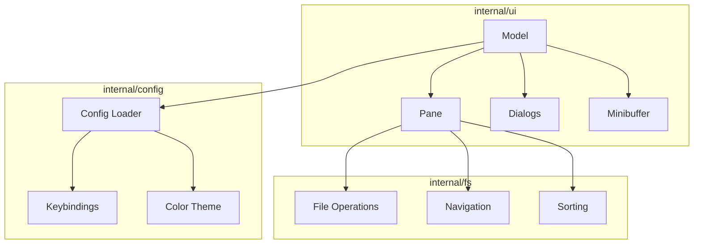

# duofm Specification

## Overview

duofm is a TUI (Text User Interface) dual-pane file manager written in Go. It provides efficient file management through a terminal interface with two side-by-side panes for easy navigation and file operations between directories.

## Architecture



## Features

### Core Navigation

#### Dual-Pane Interface
- Two side-by-side directory panes
- Independent navigation in each pane
- Active pane indicated by visual highlighting
- Left pane: Current working directory on startup
- Right pane: Home directory on startup

#### Keyboard Navigation
- Vim-style navigation (h/j/k/l)
- Arrow key support
- Enter to open directories
- Parent directory navigation with `..`

#### Path Display
- Absolute path shown at top of each pane
- Home directory abbreviated as `~`
- Symbolic link targets displayed

### File Operations

#### Basic Operations
- **Copy (C)**: Copy selected file(s) to opposite pane
- **Move (M)**: Move selected file(s) to opposite pane
- **Delete (D)**: Delete with confirmation dialog
- **Rename (R)**: Rename selected file

#### File Creation
- **New File (N)**: Create new file
- **New Directory (Shift+N)**: Create new directory

#### Multi-file Operations
- Mark files with Space key
- Batch copy/move/delete on marked files
- Header shows marked count and total size

### Display Modes

Three display modes toggled with `I` key:

#### Minimal Mode (automatic on narrow terminals)
- File/directory name only
- Symlink targets shown

#### Basic Mode (default)
- Name + Size + Timestamp
- Directories show `-` for size

#### Detail Mode
- Name + Permissions + Owner + Group
- Unix-style permission display (rwxrwxrwx)

### Search and Filter

#### Incremental Search (/)
- Real-time filtering as you type
- Smart case sensitivity
- Minibuffer input at pane bottom

#### Regex Search (Ctrl+F)
- Full Go regex syntax
- Filter applied on Enter
- Smart case sensitivity

### External Integration

#### File Viewer (V)
- Opens file with $PAGER (default: less)
- Screen suspends during viewing

#### File Editor (E)
- Opens file with $EDITOR (default: vim)
- Working directory set to file's directory
- Both panes reload after exit

#### Shell Command (!)
- Execute arbitrary shell commands
- Working directory: active pane's directory
- "Press Enter to continue" after execution

### Configuration

#### Configuration File
- Location: `~/.config/duofm/config.toml`
- Respects `XDG_CONFIG_HOME` environment variable
- Auto-generated with defaults on first run

#### Keybindings
- All keys customizable via `[keybindings]` section
- Multiple keys per action supported
- Actions can be disabled with empty array

#### Color Theme
- ANSI 256-color codes (0-255)
- All UI elements customizable via `[colors]` section
- Cursor, marks, file types, dialogs, status bar

### Navigation Features

#### Hidden Files Toggle (Ctrl+H)
- Per-pane visibility setting
- `[H]` indicator when hidden files shown

#### Home Directory (~)
- Jump to home directory

#### Previous Directory (-)
- Toggle between current and previous directory
- cd - style behavior

#### Pane Synchronization (=)
- Sync opposite pane to current directory

#### Refresh (F5 / Ctrl+R)
- Reload current directory

### Sort Options

Toggle with `S` key:

| Field | Description |
|-------|-------------|
| Name | Alphabetical by filename |
| Size | By file size in bytes |
| Date | By modification time |

- Ascending/Descending order
- Directories always listed before files
- Parent directory (..) always at top

### Context Menu

Press `@` to show context menu with:
- Copy to other pane
- Move to other pane
- Delete
- Symlink-specific options (logical/physical path)

### Help System

Press `?` for help dialog with:
- Complete keybinding reference
- Grouped by category
- Scrollable with j/k, Space/Shift+Space
- Color palette reference (256 colors)

## Keyboard Shortcuts

### Navigation
| Key | Action |
|-----|--------|
| J / Down | Move cursor down |
| K / Up | Move cursor up |
| H / Left | Left pane / Parent directory |
| L / Right | Right pane / Parent directory |
| Enter | Enter directory / Open file |
| ~ | Go to home directory |
| - | Go to previous directory |
| F5 / Ctrl+R | Refresh |
| = | Sync panes |

### File Operations
| Key | Action |
|-----|--------|
| C | Copy to opposite pane |
| M | Move to opposite pane |
| D | Delete |
| R | Rename |
| N | New file |
| Shift+N | New directory |
| Space | Mark/unmark file |

### Display
| Key | Action |
|-----|--------|
| I | Toggle info display mode |
| Ctrl+H | Toggle hidden files |
| S | Open sort dialog |

### Search
| Key | Action |
|-----|--------|
| / | Incremental search |
| Ctrl+F | Regex search |

### External
| Key | Action |
|-----|--------|
| V | View with pager |
| E | Edit with editor |
| ! | Execute shell command |
| @ | Context menu |

### Application
| Key | Action |
|-----|--------|
| ? | Show help |
| Q | Quit |
| Esc | Cancel / Close dialog |

## Configuration Format

### Keybindings Section

```toml
[keybindings]
move_down = ["J", "Down"]
move_up = ["K", "Up"]
copy = ["C"]
delete = ["D"]
help = ["?"]
quit = ["Q"]
```

### Colors Section

```toml
[colors]
# Cursor
cursor_fg = 15
cursor_bg = 39
cursor_bg_inactive = 240

# Marks
mark_fg = 0
mark_bg = 136

# File types
directory_fg = 39
symlink_fg = 14
executable_fg = 9

# Dialog
dialog_title_fg = 39
dialog_border_fg = 39
```

## Technical Requirements

- Go 1.21 or later
- Terminal with 256-color support
- Minimum terminal size: 80x24 (60x24 degraded mode)
- Unicode support for filenames

## Dependencies

- github.com/charmbracelet/bubbletea - TUI framework
- github.com/charmbracelet/lipgloss - Styling
- github.com/BurntSushi/toml - Configuration parsing
