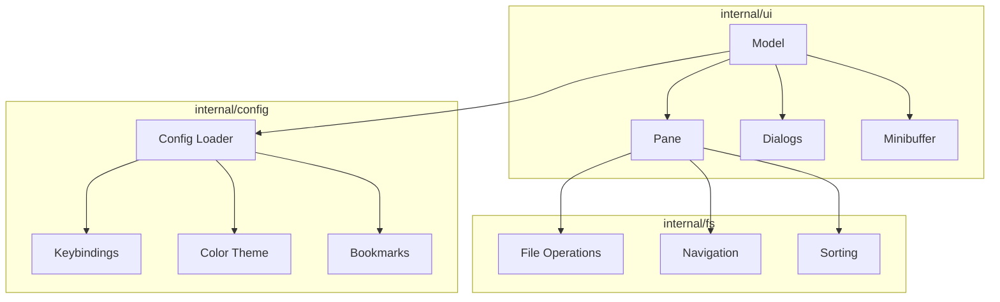

# duofm Specification

## Overview

duofm is a TUI (Text User Interface) dual-pane file manager written in Go. It provides efficient file management through a terminal interface with two side-by-side panes for easy navigation and file operations between directories.

## Architecture



## Features

### Core Navigation

#### Dual-Pane Interface
- Two side-by-side directory panes
- Independent navigation in each pane
- Active pane indicated by visual highlighting
- Left pane: Current working directory on startup
- Right pane: Home directory on startup

#### Keyboard Navigation
- Vim-style navigation (h/j/k/l)
- Arrow key support (↑↓←→)
- Enter to open directories or view files
- Parent directory navigation with `..`
- Cursor position remembered when navigating to parent directory
- Browser-like directory history with forward/back navigation (Alt+←/Alt+→ or [/])

#### Directory History
- Independent history stack for each pane (up to 100 entries)
- Navigate backward with `Alt+←` or `[`
- Navigate forward with `Alt+→` or `]`
- Session-only history (cleared on exit)
- History records all directory transitions except history navigation itself

#### Path Display
- Absolute path shown at top of each pane
- Home directory abbreviated as `~`
- Symbolic link targets displayed
- Broken symlinks indicated
- Async directory loading with pane identification

### File Operations

#### Basic Operations
- **Copy (C)**: Copy selected file(s) to opposite pane
- **Move (M)**: Move selected file(s) to opposite pane
- **Delete (D)**: Delete with confirmation dialog (requires `y` key to confirm)
- **Rename (R)**: Rename selected file

#### Overwrite Handling
- Conflict detection when copying/moving files
- Three options: Skip, Overwrite, Rename
- File metadata displayed (size, date) for informed decisions
- Per-file confirmation for batch operations
- Directory-to-directory conflicts show error (no merge)

#### File Creation
- **New File (N)**: Create new file
- **New Directory (Shift+N)**: Create new directory
- Cursor moves to newly created file after creation
- Hidden files handled correctly (cursor behavior varies)

#### Multi-file Operations
- Mark files with Space key
- Batch copy/move/delete on marked files
- Header shows marked count and total size
- Visual highlighting for marked files (different colors for active/inactive panes)
- Marks cleared on directory change

### Display Modes

Three display modes toggled with `I` key:

#### Minimal Mode (automatic on narrow terminals)
- File/directory name only
- Symlink targets shown

#### Basic Mode (default)
- Name + Size + Timestamp
- Directories show `-` for size

#### Detail Mode
- Name + Permissions + Owner + Group
- Unix-style permission display (rwxrwxrwx)

### Unicode Support

- Proper display width calculation for multibyte characters (Japanese, Chinese, Korean, emoji)
- Correct file name truncation using rune-based slicing
- East Asian Width configuration for ambiguous characters
- Configurable ambiguous character width (1 or 2 cells)

### Search and Filter

#### Incremental Search (/)
- Real-time filtering as you type
- Smart case sensitivity
- Minibuffer input at pane bottom

#### Regex Search (Ctrl+F)
- Full Go regex syntax
- Filter applied on Enter
- Smart case sensitivity
- Advanced pattern matching capabilities

### Sorting

- Toggle with `S` key
- Sort by: Name, Size, Date
- Order: Ascending/Descending
- Live preview while selecting sort options
- Cursor position preserved after sort change
- Independent sort settings per pane
- Directories always listed before files
- Parent directory (..) always at top

### External Integration

#### File Viewer (V)
- Opens file with $PAGER (default: less)
- Working directory set to file's directory
- Cursor position preserved after exit
- `Enter` on file also opens viewer

#### File Editor (E)
- Opens file with $EDITOR (default: vim)
- Working directory set to file's directory
- Both panes reload after exit
- Cursor position preserved after exit

#### Shell Command (!)
- Execute arbitrary shell commands
- Working directory: active pane's directory
- "Press Enter to continue" after execution
- Both panes reload after exit

### Context Menu

Press `@` to show context menu with:
- Copy to other pane
- Move to other pane
- Delete
- Symlink-specific options (logical/physical path)
- Supports marked files for batch operations
- Number keys 1-9 for direct selection

### Configuration

#### Configuration File
- Location: `~/.config/duofm/config.toml`
- Respects `XDG_CONFIG_HOME` environment variable
- Auto-generated with defaults on first run
- Changes require application restart

#### Keybindings
- All keys customizable via `[keybindings]` section
- Multiple keys per action supported
- Actions can be disabled with empty array
- Modifier key support (Ctrl, Shift, Alt)
- Key format: Uppercase letters, symbols as-is, PascalCase for special keys

#### Color Theme
- ANSI 256-color codes (0-255)
- All UI elements customizable via `[colors]` section
- Cursor, marks, file types, dialogs, status bar
- Help dialog includes color palette reference with hex values

#### Bookmarks
- Add current directory with `Shift+B`
- Open bookmark manager with `B`
- Jump to, edit, and delete bookmarks
- Warning indicator for non-existent paths
- Bookmarks persisted in configuration file

### Navigation Features

#### Hidden Files Toggle (Ctrl+H)
- Per-pane visibility setting
- `[H]` indicator when hidden files shown

#### Home Directory (~)
- Jump to home directory

#### Previous Directory (-)
- Toggle between current and previous directory
- cd - style behavior

#### Pane Synchronization (=)
- Sync opposite pane to current directory
- Preserves display settings (hidden files, sort order)

#### Refresh (F5 / Ctrl+R)
- Reload current directory
- Preserves cursor position and marks

### Help System

Press `?` for help dialog with:
- Complete keybinding reference
- Grouped by category
- Scrollable with j/k, Space/Shift+Space
- Color palette reference (256 colors with hex values)
- Page indicator for scroll position

### Symlink Support

- Display symlink targets with arrow (→)
- Detect and indicate broken links
- Navigate to target with logical path (Enter)
- Open target's parent directory (physical path via context menu)
- Symlink-specific context menu options

### Error Handling

- Permission denied directories display error message
- Graceful handling of inaccessible directories
- Error dialogs for operation failures
- Status bar messages for warnings
- Directory permission errors shown with navigation preserved

### Dialog System

All dialogs follow consistent UI patterns:

#### Confirm Dialog
- Yes/No confirmation for destructive operations
- Delete requires explicit `y` key (Enter ignored for safety)

#### Error Dialog
- Red border and error message
- Press any key to dismiss

#### Input Dialog
- Single-line text input
- Basic editing (backspace, delete, cursor movement)
- Used for file creation, renaming, shell commands

#### Overwrite Dialog
- Three options: Overwrite, Cancel, Rename
- File metadata comparison (size, date)
- Validation for rename conflicts

#### Help Dialog
- Scrollable keybinding reference
- Color palette with hex values
- Page indicators

#### Sort Dialog
- Two-row selection interface
- Field (Name/Size/Date) and Order (Asc/Desc)
- Live preview of sort changes

#### Context Menu Dialog
- List of available actions
- Number keys for direct selection
- Symlink-specific options

#### Bookmark Manager Dialog
- Two-line format (name + path)
- Add, edit, delete bookmarks
- Warning indicators for non-existent paths

### Version Display

- Dynamic version from build-time ldflags
- Displayed in toolbar and `--version` CLI option

## Keyboard Shortcuts

### Navigation
| Key | Action |
|-----|--------|
| J / Down | Move cursor down |
| K / Up | Move cursor up |
| H / Left | Left pane / Parent directory |
| L / Right | Right pane / Parent directory |
| Enter | Enter directory / View file |
| ~ | Go to home directory |
| - | Go to previous directory |
| Alt+← / [ | Navigate backward in history |
| Alt+→ / ] | Navigate forward in history |
| F5 / Ctrl+R | Refresh |
| = | Sync panes |

### File Operations
| Key | Action |
|-----|--------|
| C | Copy to opposite pane |
| M | Move to opposite pane |
| D | Delete |
| R | Rename |
| N | New file |
| Shift+N | New directory |
| Space | Mark/unmark file |

### Bookmarks
| Key | Action |
|-----|--------|
| B | Open bookmark manager |
| Shift+B | Add current directory to bookmarks |

### Display
| Key | Action |
|-----|--------|
| I | Toggle info display mode |
| Ctrl+H | Toggle hidden files |
| S | Open sort dialog |

### Search
| Key | Action |
|-----|--------|
| / | Incremental search |
| Ctrl+F | Regex search |

### External
| Key | Action |
|-----|--------|
| V | View with pager |
| E | Edit with editor |
| ! | Execute shell command |
| @ | Context menu |

### Application
| Key | Action |
|-----|--------|
| ? | Show help |
| Q | Quit |
| Esc | Cancel / Close dialog |
| Ctrl+C | Quit / Cancel operation |

## Configuration Format

### Keybindings Section

```toml
[keybindings]
move_down = ["J", "Down"]
move_up = ["K", "Up"]
copy = ["C"]
delete = ["D"]
help = ["?"]
quit = ["Q"]
bookmark = ["B"]
add_bookmark = ["Shift+B"]
history_back = ["Alt+Left", "["]
history_forward = ["Alt+Right", "]"]
```

### Colors Section

```toml
[colors]
# Cursor
cursor_fg = 15
cursor_bg = 39
cursor_bg_inactive = 240

# Marks
mark_fg = 0
mark_bg = 136
mark_bg_inactive = 94

# Cursor + Mark
cursor_mark_fg = 15
cursor_mark_bg = 30
cursor_mark_bg_inactive = 23

# File types
directory_fg = 39
symlink_fg = 14
executable_fg = 9

# Dialog
dialog_title_fg = 39
dialog_border_fg = 39
dialog_selected_fg = 0
dialog_selected_bg = 39
```

### Bookmarks Section

```toml
[[bookmarks]]
name = "Projects"
path = "/path/to/projects"

[[bookmarks]]
name = "Downloads"
path = "/path/to/Downloads"
```

### East Asian Width Section

```toml
[display]
# Ambiguous character width: 1 or 2
# Controls display width for ambiguous East Asian characters
east_asian_ambiguous_width = 1
```

## Technical Requirements

- Go 1.21 or later
- Terminal with 256-color support
- Minimum terminal size: 80x24 (60x24 degraded mode)
- Unicode support for filenames

## Dependencies

- github.com/charmbracelet/bubbletea - TUI framework
- github.com/charmbracelet/lipgloss - Styling
- github.com/BurntSushi/toml - Configuration parsing
- github.com/mattn/go-runewidth - Unicode display width

## Performance Characteristics

- Async directory loading for responsive UI
- Independent pane operations
- Marks preserved during filter/refresh
- Efficient sorting with directory-first ordering
- History limited to 100 entries per pane
- No performance degradation with 1000+ files

## Security Considerations

- File paths constructed with filepath.Join to prevent traversal
- Read permission checked before external app execution
- Shell commands executed via /bin/sh -c
- No input sanitization for shell commands (user explicitly enters)
- Configuration file permissions follow XDG spec

## Testing Strategy

- Unit tests for core logic (sorting, filtering, file operations)
- Integration tests for component interaction
- E2E tests for user workflows
- Table-driven tests for common patterns
- Test coverage target: 80%+

## Future Extensibility

The architecture supports future additions:

- Plugin system for custom menu items
- Additional sort fields
- Custom themes
- Search history
- Persistent directory history
- Tabs/multiple panes
- Archive support
