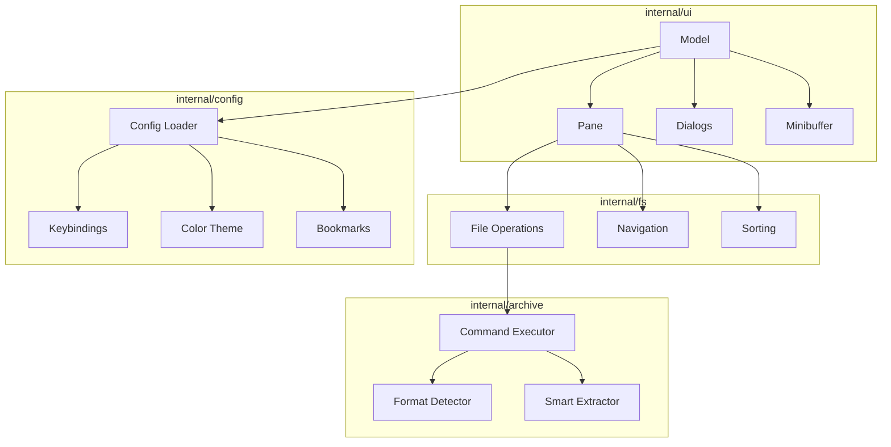

# duofm Specification

## Overview

duofm is a TUI (Text User Interface) dual-pane file manager written in Go. It provides efficient file management through a terminal interface with two side-by-side panes for easy navigation and file operations between directories.

## Architecture


```mermaid
graph TB
    subgraph UI["internal/ui"]
        Model[Model]
        Pane[Pane]
        Dialog[Dialogs]
        Minibuffer[Minibuffer]
    end

    subgraph FS["internal/fs"]
        Operations[File Operations]
        Navigation[Navigation]
        Sort[Sorting]
    end

    subgraph Config["internal/config"]
        ConfigLoader[Config Loader]
        Keybindings[Keybindings]
        Colors[Color Theme]
        Bookmarks[Bookmarks]
    end

    subgraph Archive["internal/archive"]
        Executor[Command Executor]
        Detector[Format Detector]
        Extractor[Smart Extractor]
    end

    Model --> Pane
    Model --> Dialog
    Model --> Minibuffer
    Pane --> Operations
    Pane --> Navigation
    Pane --> Sort
    Model --> ConfigLoader
    ConfigLoader --> Keybindings
    ConfigLoader --> Colors
    ConfigLoader --> Bookmarks
    Operations --> Executor
    Executor --> Detector
    Executor --> Extractor
```

## Features

### Core Navigation

#### Dual-Pane Interface
- Two side-by-side directory panes
- Independent navigation in each pane
- Active pane indicated by visual highlighting
- Left pane: Current working directory on startup
- Right pane: Home directory on startup
- Async directory loading with proper pane identification

#### Keyboard Navigation
- Vim-style navigation (h/j/k/l)
- Arrow key support (↑↓←→)
- Enter to open directories or view files
- Parent directory navigation with `..`
- Cursor position remembered when navigating to parent directory
- Browser-like directory history with forward/back navigation (Alt+←/Alt+→ or [/])
- Page scrolling with Ctrl+D/U and PageUp/PageDown keys

#### Directory History
- Independent history stack for each pane (up to 100 entries)
- Navigate backward with `Alt+←` or `[`
- Navigate forward with `Alt+→` or `]`
- Session-only history (cleared on exit)
- History records all directory transitions except history navigation itself

#### Path Display
- Absolute path shown at top of each pane
- Home directory abbreviated as `~`
- Symbolic link targets displayed with arrow (→)
- Broken symlinks indicated
- Async directory loading with proper pane identification
- Parent directory (..) shows actual metadata (modification time, permissions, owner)

### File Operations

#### Basic Operations
- **Copy (C)**: Copy selected file(s) to opposite pane
- **Move (M)**: Move selected file(s) to opposite pane
- **Delete (D)**: Delete with confirmation dialog (requires `y` key to confirm)
- **Rename (R)**: Extension-preserving rename for files with extensions
  - Files with extensions: Edits base name only, extension is fixed and displayed
  - Extensionless files and directories: Full filename editing
  - Hidden files: Leading dot preserved; extension detection applied to remainder
  - Examples: `document.txt` → edit `document`, `.bashrc` → edit full name, `.config.json` → edit `.config`
- **Rename Full (Shift+R)**: Full filename rename for all file types
  - Always allows editing complete filename including extension
  - Use when changing file extensions or handling special cases
- **New File (N)**: Create new file
- **New Directory (Shift+N)**: Create new directory

#### Overwrite Handling
- Conflict detection when copying/moving files
- Three options: Skip, Overwrite, Rename
- File metadata displayed (size, date) for informed decisions
- Per-file confirmation for batch operations
- Directory-to-directory conflicts show error (no merge)

#### File Creation
- New file creation with empty input
- New directory creation
- Cursor moves to newly created file after creation
- Hidden files handled correctly (cursor behavior varies)

#### Multi-file Operations
- Mark files with Space key
- Batch copy/move/delete on marked files
- Header shows marked count and total size
- Visual highlighting for marked files (different colors for active/inactive panes)
- Marks cleared on directory change

#### Permission Management
- Change file/directory permissions (chmod) with Shift+P
- Numeric mode (octal notation): 000-777
- Real-time symbolic notation display (-rwxr-xr-x)
- Quick presets for common permissions (644, 755, etc.)
- Recursive permission changes with separate settings for directories and files
- Batch permission changes for multiple marked files
- Progress display for large operations
- Comprehensive error reporting
- Symlinks skipped to prevent following malicious links

#### Trash (Recycle Bin)
- Move files to trash with `Delete` key (confirmation dialog displayed)
- Compliant with freedesktop.org Trash Specification (`~/.local/share/Trash/`)
- Trash dialog (`T` key) displays contents with Name, Size, Deleted, Original Path columns
- Restore files to original location with `R` key in trash dialog
- Conflict resolution for restore: Overwrite, Rename, or Skip (single item); auto-skip conflicts (batch)
- Empty trash with `E` key in trash dialog (with confirmation)
- Name collision handling when trashing (appends counter: file.2.txt, file.3.txt)
- Mark/unmark files in trash dialog with Space key for batch operations
- Same-filesystem moves use `os.Rename`; cross-filesystem moves use copy+delete
- `.trashinfo` files with original path and ISO 8601 deletion timestamp

#### Archive Operations
- **Create archives**: tar, tar.gz, tar.bz2, tar.xz, zip, 7z
- **Extract archives**: tar, tar.gz, tar.bz2, tar.xz, zip, 7z
- Smart extraction logic (adapts to archive structure)
- Compression level selection (0-9 for supported formats)
- Context menu integration for compress/extract
- Progress display for long-running operations
- Security checks (zip bomb detection, disk space validation)
- Linux-only feature (uses external CLI tools: tar, gzip, bzip2, xz, zip, unzip, 7z)

#### Clipboard Operations
- Copy file name to clipboard (context menu)
- Copy full path to clipboard (context menu)
- OSC 52 escape sequence support
- External command fallback (wl-copy, xclip, xsel)
- Status bar feedback on success/failure

### Display Modes

Three display modes toggled with `I` key:

#### Minimal Mode (automatic on narrow terminals)
- File/directory name only
- Symlink targets shown

#### Basic Mode (default)
- Name + Size + Timestamp
- Directories show `-` for size

#### Detail Mode
- Name + Permissions + Owner + Group
- Unix-style permission display (rwxrwxrwx)

### Unicode Support

- Proper display width calculation for multibyte characters (Japanese, Chinese, Korean, emoji)
- Correct file name truncation using rune-based slicing
- East Asian Width configuration for ambiguous characters
- Configurable ambiguous character width (1 or 2 cells) via `[display]` section
- Improved support for complex Unicode symbols (☆, ü, ①, →, etc.)

### Search and Filter

#### Incremental Search (/)
- Real-time filtering as you type
- Smart case sensitivity
- Minibuffer input at pane bottom (live filtering)

#### Regex Search (Ctrl+F)
- Full Go regex syntax via dedicated dialog
- Smart case sensitivity
- Syntax hints displayed (e.g., `^prefix`, `suffix$`, `\.txt$`)
- History navigation with Up/Down keys
- Enter applies filter, Esc cancels
- Empty input clears filter
- Validation errors shown inline

#### SQL-like Query Filter (Ctrl+G)
- SQL WHERE clause syntax for powerful filtering via dedicated dialog
- Columns: name, size, mtime, type, ext, perm, owner, group, isdir, isfile, issymlink
- Operators: =, !=, <, >, <=, >=, LIKE, ILIKE, IN, IS NULL
- Size literals: KiB, MiB, GiB (binary) and KB, MB, GB (decimal)
- Date functions: now(), year(), month(), day()
- Duration support: now() - 7d, now() - 1h
- String functions: lower(), upper()
- Logical operators: AND, OR, NOT with parentheses grouping
- Syntax hints displayed (e.g., `size > 1MB`, `ext = ".go"`)
- History navigation with Up/Down keys
- Enter applies filter, Esc cancels
- Empty input clears filter
- Validation errors shown inline
- Examples: `size > 1GiB`, `mtime > now() - 7d`, `ext IN ('go', 'rs')`

### Sorting

- Toggle with `S` key
- Sort by: Name, Size, Date
- Order: Ascending/Descending
- Dropdown menus for field and order selection
- j/k and Tab/Shift+Tab navigation between major items (Sort by, Order, OK button)
- OK button for explicit confirmation
- Live preview while selecting sort options
- Cursor position preserved after sort change
- Independent sort settings per pane
- Directories always listed before files
- Parent directory (..) always at top
- Per-directory sort settings persistence
  - Sort preferences saved per directory in `~/.config/duofm/dir_sort.toml`
  - Automatic application of saved settings when entering a directory
  - Current sort state displayed in header (e.g., "Name ↑", "Size ↓")
  - LRU eviction for storage management (max 1000 directories)
  - Settings persist across application sessions

### External Integration

#### File Viewer (V)
- Opens file with $PAGER (default: less)
- Working directory set to file's directory
- Cursor position preserved after exit
- `Enter` on file also opens viewer (or configured behavior)

#### File Editor (E)
- Opens file with $EDITOR (default: vim)
- Working directory set to file's directory
- Both panes reload after exit
- Cursor position preserved after exit

#### Configurable Enter Key Behavior
- Configurable action when pressing Enter on files
- Four modes available:
  - `less` (default): Open with pager in foreground
  - `xdg-open`: Open with system default application in background
  - `path:/path/to/app`: Open with custom application in foreground
  - `mime:`: Open based on file MIME type using `[enter_behavior_mime]` section
- MIME type mode features:
  - Extension-based MIME type detection via `mime.TypeByExtension()`
  - Exact MIME type matching (e.g., `application/pdf`) and wildcard matching (e.g., `text/*`)
  - Exact matches prioritized over wildcard matches
  - Command fallback: commands specified as arrays, tried in order
  - Falls back to default pager when no MIME type matches or all commands fail
- Setting: `enter_behavior` in config.toml
- Invalid values fall back to default with warning
- V key always uses pager (unchanged)

#### Shell Command (!)
- Execute arbitrary shell commands
- Working directory: active pane's directory
- Auto-return after 2 seconds (no "Press Enter to continue")
- Both panes reload after exit
- Command history with Ctrl+R incremental search
- Bash-style up/down arrow key navigation through history
- Search pattern displayed during Ctrl+R: `(reverse-i-search)'pattern': command`
- History persisted across sessions (default: 20,000 commands)
- TAB completion for command names (from PATH) and file paths
- Command output captured in session log at `/tmp/duofm-shell-<PID>.log`
- View command history log with Ctrl+L (opens in pager)

### Context Menu

Press `@` to show context menu with:
- Copy to other pane
- Move to other pane
- Delete
- Rename
- New file
- New directory
- Copy file name (to clipboard)
- Copy full path (to clipboard)
- Compress (with format selection)
- Extract archive (for archive files)
- Open file (with external application via xdg-open)
- Open with (custom command)
- Symlink-specific options (logical/physical path)
- Supports marked files for batch operations
- Number keys 1-9 for direct selection
- Desktop environment detection: Open/Open with items disabled (grayed out) when no desktop environment is detected (SSH sessions, headless servers)

### Configuration

#### Configuration File
- Location: `~/.config/duofm/config.toml`
- Respects `XDG_CONFIG_HOME` environment variable
- Auto-generated with defaults on first run
- Auto-merge: Missing configuration items automatically added to existing config files
- Hot-reload: Configuration changes detected and applied automatically via fsnotify

#### Enter Key Behavior Configuration
- Configurable action when pressing Enter on files
- Four modes available:
  - `less` (default): Open with pager in foreground
  - `xdg-open`: Open with system default application in background
  - `path:/path/to/app`: Open with custom application in foreground
  - `mime:`: Open based on MIME type using `[enter_behavior_mime]` section
- Setting: `enter_behavior` in config.toml
- Invalid values fall back to default with warning

#### Keybindings
- All keys customizable via `[keybindings]` section
- Multiple keys per action supported
- Actions can be disabled with empty array
- Modifier key support (Ctrl, Shift, Alt)
- Key format: Uppercase letters, symbols as-is, PascalCase for special keys

#### Color Theme
- ANSI 256-color codes (0-255)
- All UI elements customizable via `[colors]` section
- Cursor, marks, file types, dialogs, status bar
- Help dialog includes color palette reference with hex values
- Supports customization of:
  - Cursor colors (active/inactive panes)
  - Mark colors (active/inactive panes)
  - File type colors (directory, symlink, executable)
  - Dialog colors (title, border, selection, footer)
  - Input field colors
  - Minibuffer colors
  - Error and warning colors
  - Status bar colors

#### Bookmarks
- Add current directory with `Shift+B`
- Open bookmark manager with `B`
- Jump to, edit, and delete bookmarks
- Warning indicator for non-existent paths
- Bookmarks persisted in configuration file
- New bookmarks added to top of list
- Duplicate paths not allowed

### Navigation Features

#### Hidden Files Toggle (Ctrl+H)
- Per-pane visibility setting
- `[H]` indicator when hidden files shown

#### Home Directory (~)
- Jump to home directory

#### Previous Directory (-)
- Toggle between current and previous directory
- cd - style behavior

#### Pane Synchronization (=)
- Sync opposite pane to current directory
- Preserves display settings (hidden files, sort order)

#### Path Jump Dialog (Ctrl+J)
- Direct navigation to any directory by typing full path
- Bash-style inline Tab completion with filesystem suggestions
- Real-time directory suggestions as you type
- Only suggests directories (not files)
- Error handling for invalid paths with clear messages
- Dialog remains open on errors to allow correction

#### Refresh (F5 / Ctrl+R)
- Reload current directory
- Preserves cursor position and file marks
- Auto-refresh configurable via `refresh_rate` setting
  - Default: 3 seconds
  - Range: 0-60 seconds (0 disables auto-refresh)
  - Reloads directory listings and disk space automatically
  - File marks preserved during auto-refresh
  - Suppressed during dialog display
  - Manual refresh always available

#### Filter State Preservation
- Active filter is preserved during file delete operations
- Deleted files are removed from filtered view
- Filter re-applied after directory reload

### Help System

Press `?` for help dialog with:
- Complete keybinding reference
- Grouped by category
- Scrollable with j/k, Space/Shift+Space, Ctrl+D/U, PageUp/PageDown
- Color palette reference (256 colors with hex values)
  - Standard colors 0-15: Terminal-dependent
  - Colors 16-231: 6x6x6 color cube with #rrggbb values
  - Colors 232-255: Grayscale with #rrggbb values
- Page indicator for scroll position
- Fixed layout to prevent line overflow

### Symlink Support

- Display symlink targets with arrow (→)
- Detect and indicate broken links
- Navigate to target with logical path (Enter)
- Open target's parent directory (physical path via context menu)
- Symlink-specific context menu options

### Error Handling

- Permission denied directories display error message
- Graceful handling of inaccessible directories
- Error dialogs for operation failures
- Status bar messages for warnings
- Directory permission errors shown with navigation preserved
- Proper error handling for directory access errors (path not updated on failure)

### Dialog System

All dialogs follow consistent UI patterns:

#### Confirm Dialog
- Yes/No confirmation for destructive operations
- Delete requires explicit `y` key (Enter ignored for safety)
- Ctrl+C cancels operation

#### Error Dialog
- Red border and error message
- Press any key to dismiss

#### Input Dialog
- Single-line text input
- Basic editing (backspace, delete, cursor movement)
- Used for file creation, renaming, shell commands
- Ctrl+C cancels input

#### Overwrite Dialog
- Three options: Overwrite, Cancel, Rename
- File metadata comparison (size, date)
- Validation for rename conflicts

#### Help Dialog
- Scrollable keybinding reference
- Color palette with hex values
- Page indicators
- Scrollable with page up/down keys
- Fixed layout to prevent visual issues

#### Sort Dialog
- Dropdown menus for Sort by (Name/Size/Date) and Order (Asc/Desc)
- OK button for explicit confirmation
- j/k and Tab/Shift+Tab navigation between major items
- Enter/Space expands dropdowns; Enter on OK confirms
- q cancels dialog at any time
- Live preview of sort changes

#### Context Menu Dialog
- List of available actions
- Number keys for direct selection
- Symlink-specific options

#### Bookmark Manager Dialog
- Two-line format (name + path)
- Add, edit, delete bookmarks
- Warning indicators for non-existent paths
- j/k navigation, Enter to jump, d to delete, e to edit

#### Permission Dialog
- Numeric permission input (000-777)
- Real-time symbolic notation display
- Quick presets for common permissions
- Recursive option for directories
- Batch operation support
- Dialog properly closes on confirmation (no freeze)

#### Archive Progress Dialog
- Operation type (Compressing/Extracting)
- Progress bar with percentage
- Current file being processed
- File count and elapsed time
- Cancelable with Esc

#### Trash Dialog
- Full-screen dialog showing trash contents
- Columns: Name, Size, Deleted (date/time), Original Path
- Item count in title bar
- j/k navigation, Space to mark, R to restore, E to empty
- Esc to close

#### Trash Confirmation Dialog
- Displayed before moving files to trash (Delete key)
- Shows file name (single) or item count (multiple)
- Disk space warning note
- Y to confirm, N/Esc to cancel

#### Dialog Overlay Styling
- File list visible behind dialogs with dimmed appearance
- Full-screen dialogs dim both panes
- Pane-local dialogs dim only active pane
- Gray background with dimmed text instead of block characters

### Version Display

- Dynamic version from build-time ldflags
- Displayed in toolbar and `--version` CLI option
- Build-time version injection via -ldflags
- Git tag-based versioning

### Git Branch Display

- Shows active Git branch in status bar when in a Git repository
- Updates when navigating between directories
- Indicator appears in right side of status bar

### MIME Type Display

- Shows MIME type and entry kind in status bar next to cursor position (N/M)
- Format: `[{type}]` in square brackets
- Display rules:
  - Directories: `[Directory]` in directory color (DirectoryFg)
  - Symbolic links: `[SymbolicLink]` in symlink color (SymlinkFg)
  - Regular files: `[text/html]`, `[image/png]`, etc. in status bar color (StatusFg)
- MIME type detection via file extension (mime.TypeByExtension)
- Displayed value matches `[enter_behavior_mime]` config keys
- Hidden when status message is displayed

### Special Features

#### Unified Cancel Keys
- All dialogs support both Esc and Ctrl+C for cancellation
- Consistent cancel behavior across all dialog types

#### Ctrl+C Handling
- Ctrl+C cancels all modal states (dialogs, minibuffer)
- Double Ctrl+C quits application in normal mode
- 2-second timeout for double-press detection

#### Dialog Bug Fixes
- Fixed permission dialog freeze on Esc key (proper cancellation message)
- Fixed permission dialog freeze on Enter key confirmation (proper dialog cleanup)
- All dialogs properly close without hanging the application

## Keyboard Shortcuts

### Navigation
| Key | Action |
|-----|--------|
| J / Down | Move cursor down |
| K / Up | Move cursor up |
| H / Left | Left pane / Parent directory |
| L / Right | Right pane / Parent directory |
| Ctrl+D / PageDown | Scroll down one page |
| Ctrl+U / PageUp | Scroll up one page |
| Enter | Enter directory / View file |
| ~ | Go to home directory |
| - | Go to previous directory |
| Alt+← / [ | Navigate backward in history |
| Alt+→ / ] | Navigate forward in history |
| Ctrl+J | Open path jump dialog |
| F5 / Ctrl+R | Refresh |
| = | Sync panes |

### File Operations
| Key | Action |
|-----|--------|
| C | Copy to opposite pane |
| M | Move to opposite pane |
| D | Delete |
| Delete | Move to trash |
| R | Rename (extension-preserving) |
| Shift+R | Rename (full filename) |
| N | New file |
| Shift+N | New directory |
| Space | Mark/unmark file |
| Shift+P | Change permissions (chmod) |
| Shift+T | Open trash dialog |

### Bookmarks
| Key | Action |
|-----|--------|
| B | Open bookmark manager |
| Shift+B | Add current directory to bookmarks |

### Display
| Key | Action |
|-----|--------|
| I | Toggle info display mode |
| Ctrl+H | Toggle hidden files |
| S | Open sort dialog |

### Search
| Key | Action |
|-----|--------|
| / | Incremental search |
| Ctrl+F | Regex search |
| Ctrl+G | SQL-like query filter |

### External
| Key | Action |
|-----|--------|
| V | View with pager |
| E | Edit with editor |
| ! | Execute shell command |
| Ctrl+L | View shell command log |
| @ | Context menu |

### Application
| Key | Action |
|-----|--------|
| ? | Show help |
| Q | Quit |
| Esc | Cancel / Close dialog |
| Ctrl+C | Quit / Cancel operation |

## Configuration Format

### Keybindings Section

```toml
[keybindings]
move_down = ["J", "Down"]
move_up = ["K", "Up"]
page_down = ["Ctrl+D", "PageDown"]
page_up = ["Ctrl+U", "PageUp"]
copy = ["C"]
delete = ["D"]
help = ["?"]
quit = ["Q"]
bookmark = ["B"]
add_bookmark = ["Shift+B"]
history_back = ["Alt+Left", "["]
history_forward = ["Alt+Right", "]"]
path_jump = ["Ctrl+J"]
context_menu = ["@"]
permission = ["Shift+P"]
```

### Colors Section

```toml
[colors]
# Cursor
cursor_fg = 15
cursor_bg = 39
cursor_bg_inactive = 240

# Marks
mark_fg = 0
mark_bg = 136
mark_bg_inactive = 94

# Cursor + Mark
cursor_mark_fg = 15
cursor_mark_bg = 30
cursor_mark_bg_inactive = 23

# File types
directory_fg = 39
symlink_fg = 14
executable_fg = 9

# Dialog
dialog_title_fg = 39
dialog_border_fg = 39
dialog_selected_fg = 0
dialog_selected_bg = 39
```

### Bookmarks Section

```toml
[[bookmarks]]
name = "Projects"
path = "/path/to/projects"

[[bookmarks]]
name = "Downloads"
path = "/path/to/Downloads"
```

### East Asian Width Section

```toml
[display]
# Ambiguous character width: 1 or 2
# Controls display width for ambiguous East Asian characters
east_asian_ambiguous_width = 1
```

### Enter Key Behavior Section

```toml
# Enter key behavior when opening files
# Options:
#   "less"     - Open with pager (foreground, default)
#   "xdg-open" - Open with system default app (background)
#   "path:/path/to/app" - Open with custom app (foreground)
#   "mime:"    - Open based on MIME type (uses [enter_behavior_mime])
enter_behavior = "less"
```

### MIME Type Behavior Section

```toml
# MIME type handlers (only used when enter_behavior = "mime:")
# Commands are tried in order; if one fails, the next is attempted.
# Wildcard patterns like "text/*" for broad matching.
# Fallback: When no MIME type matches, opens with $PAGER or less.
[enter_behavior_mime]
"text/*" = ["less"]
"image/*" = ["feh", "xdg-open"]
"video/*" = ["mpv", "vlc"]
"audio/*" = ["mpv"]
"application/pdf" = ["zathura", "evince", "xdg-open"]
```

### Shell Command History Section

```toml
# Maximum number of shell command history entries to retain
# Default: 20000
history_limit = 20000

# Directory for shell command output log file
# Default: "/tmp"
# Log file path: <shell_log_dir>/duofm-shell-<PID>.log
shell_log_dir = "/tmp"
```

### Auto-Refresh Configuration

```toml
# Automatic refresh interval for directory listings and disk space (in seconds)
# Default: 3
# Range: 0-60 (0 disables auto-refresh)
refresh_rate = 3
```

### SQL-like Filter Examples

```sql
-- Find large files
size > 1GiB

-- Find files modified this week
mtime > now() - 7d

-- Find Go source files
ext = 'go'

-- Complex query with multiple conditions
size > 1MiB AND year(mtime) = 2024 AND type = 'file'

-- Find files by pattern
name LIKE '%.txt' OR name ILIKE '%test%'

-- Find files by extension list
ext IN ('go', 'rs', 'py')
```

## Technical Requirements

- Go 1.21 or later
- Terminal with 256-color support
- Minimum terminal size: 80x24 (60x24 degraded mode)
- Unicode support for filenames

## Dependencies

- github.com/charmbracelet/bubbletea - TUI framework
- github.com/charmbracelet/lipgloss - Styling
- github.com/BurntSushi/toml - Configuration parsing
- github.com/mattn/go-runewidth - Unicode display width

## Archive Dependencies (Linux only)

| Format | Required Tools |
|--------|----------------|
| tar | `tar` |
| tar.gz | `tar`, `gzip` |
| tar.bz2 | `tar`, `bzip2` |
| tar.xz | `tar`, `xz` |
| zip | `zip`, `unzip` |
| 7z | `7z` (p7zip-full) |

On Debian/Ubuntu:
```bash
sudo apt install tar gzip bzip2 xz-utils zip unzip p7zip-full
```

On macOS:
```bash
brew install gnu-tar gzip bzip2 xz zip p7zip
```

## Performance Characteristics

- Async directory loading for responsive UI
- Independent pane operations
- File marks preserved during filter/refresh/auto-refresh
- Efficient sorting with directory-first ordering
- History limited to 100 entries per pane (configurable: 20,000 for shell commands)
- No performance degradation with 1000+ files
- Page scroll response time < 50ms
- Single file permission change < 50ms
- Recursive permission processing > 500 files/second
- Archive operations with progress display
- Same-filesystem trash operation < 100ms
- Trash dialog opening with 1000 files < 100ms
- MIME type detection < 1ms (extension-based lookup)
- Configuration hot-reload < 100ms

## Security Considerations

- File paths constructed with filepath.Join to prevent traversal
- Read permission checked before external app execution
- Shell commands executed via /bin/sh -c
- No input sanitization for shell commands (user explicitly enters)
- Configuration file permissions follow XDG spec
- Archive extraction security:
  - Path traversal prevention
  - Zip bomb detection (warns at ratio > 1:1000)
  - Disk space validation
  - Setuid/setgid bit stripping
- Permission changes:
  - All input validated (000-777 range)
  - No privilege escalation
  - Symlinks skipped to prevent following malicious links
- Trash operations:
  - Path validation to prevent directory traversal
  - URL encoding/decoding for special characters in .trashinfo files
  - Symlink itself moved (not the target)
  - No silent fallback to direct deletion on trash failure

## Testing Strategy

- Unit tests for core logic (sorting, filtering, file operations)
- Integration tests for component interaction
- E2E tests for user workflows
- Table-driven tests for common patterns
- Test coverage target: 80%+
- Recent coverage improvements:
  - Overall coverage: 77.4%+ and growing
  - Archive operations: 80.8%
  - File system operations: 87.9%
  - UI components: 76.0%+
  - Configuration management: 73.6%+
  - Comprehensive tests for permission handling (security focus)
  - Manager components fully tested (archive, batch, bookmark)
- Refactored E2E test scripts for better maintainability

## Future Extensibility

The architecture supports future additions:

- Plugin system for custom menu items
- Additional sort fields
- Custom themes
- Search history
- Persistent directory history
- Tabs/multiple panes
- Additional archive formats (rar, etc.)
