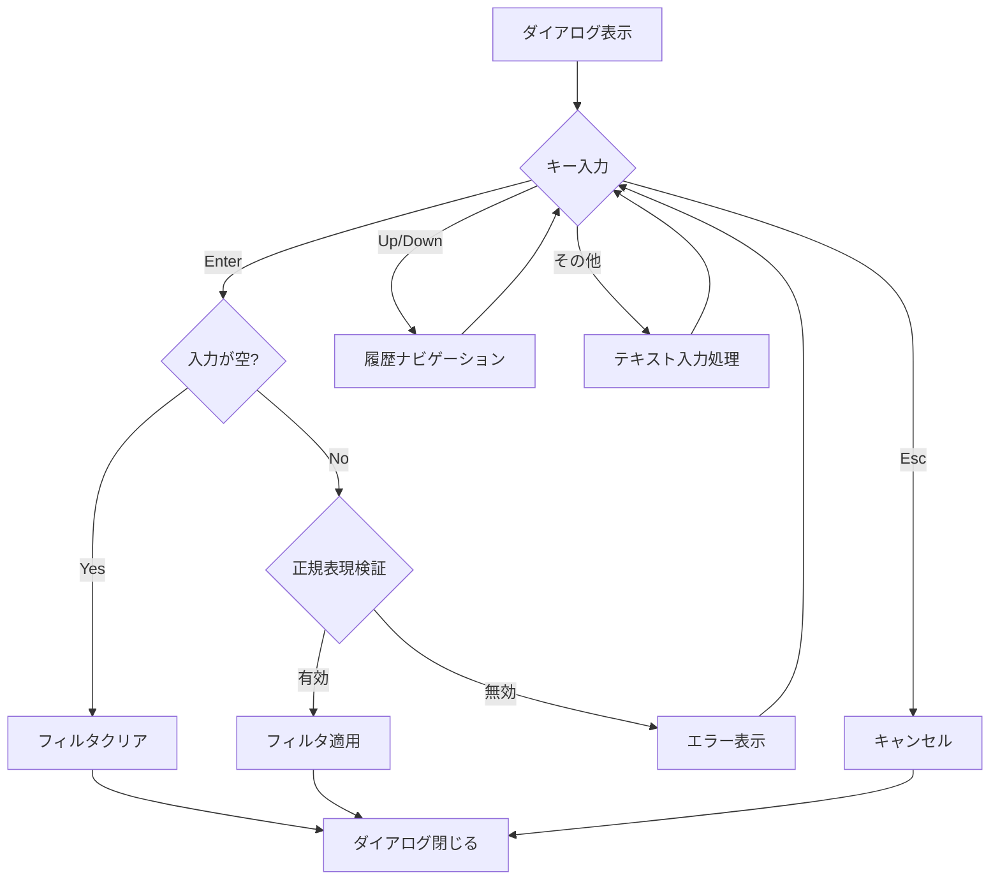
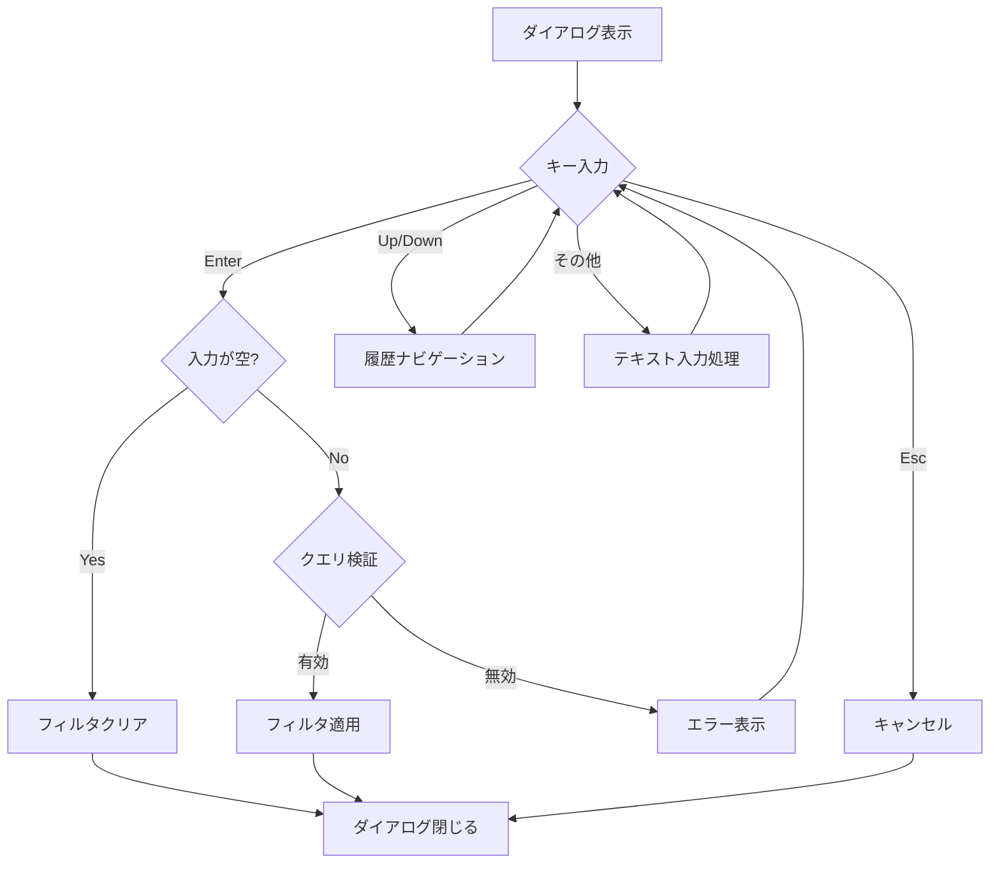

# 検索機能UIの調整 - 要件定義書

## 1. 概要

### 1.1 背景
現在のduofmでは、3種類の検索機能（インクリメンタルサーチ、正規表現検索、クエリ検索）がすべてミニバッファを使用して実装されている。しかし、正規表現検索とクエリ検索は確定時のみフィルタが適用される設計であり、リアルタイムフィードバックが不要なためダイアログUIの方が適している。また、構文ヒントの表示や履歴機能など、より高度な機能をサポートするためにもダイアログへの移行が望ましい。

### 1.2 目的
- 検索機能のUI/UXを改善し、各検索モードに最適なインターフェースを提供する
- 正規表現検索とクエリ検索にダイアログUIを導入し、構文ヒントと履歴機能を追加する
- ミニバッファは引き続きインクリメンタルサーチで使用し、不要になったコードを削除する

### 1.3 スコープ
**対象:**
- 正規表現検索（Ctrl+F）のダイアログ化
- クエリ検索（Ctrl+G）のダイアログ化
- 両ダイアログへの構文ヒント表示の追加
- 両ダイアログへの履歴機能の追加
- 不要になったミニバッファ関連コードの削除

**対象外:**
- インクリメンタルサーチ（/）の変更
- その他の検索以外の機能

## 2. ビジネス要件

### 2.1 ビジネス目標
- ユーザーが検索機能をより直感的に使用できるようにする
- 構文ヒントにより正規表現やクエリの学習曲線を下げる
- 履歴機能により検索パターンの再利用を容易にする

### 2.2 対象ユーザー
| ユーザータイプ | 説明 |
|----------------|------|
| 一般ユーザー | ファイル名の検索・フィルタリングを行うユーザー |
| パワーユーザー | 正規表現やクエリを活用して高度な検索を行うユーザー |

### 2.3 期待される効果
- 検索機能の使いやすさ向上
- 構文エラーの発生頻度低減（ヒント表示による）
- 検索パターン入力の効率化（履歴機能による）

## 3. ユースケース

### 3.1 ユースケース一覧
| ID | ユースケース名 | アクター | 優先度 |
|----|----------------|----------|--------|
| UC01 | 正規表現検索の実行 | ユーザー | 高 |
| UC02 | クエリ検索の実行 | ユーザー | 高 |
| UC03 | 検索履歴の利用 | ユーザー | 中 |
| UC04 | 検索フィルタのクリア | ユーザー | 高 |

### 3.2 ユースケース詳細

#### UC01: 正規表現検索の実行

**アクター**: ユーザー

**事前条件**:
- アプリケーションが起動している
- アクティブペインにファイルが表示されている

**基本フロー**:
1. ユーザーがCtrl+Fを押下する
2. システムが正規表現検索ダイアログを表示する
3. ダイアログには構文ヒント（例: `^prefix`, `\\.txt$`）が表示される
4. ユーザーが正規表現パターンを入力する
5. ユーザーがEnterを押下する
6. システムがパターンを検証し、有効であればフィルタを適用する
7. ダイアログが閉じ、フィルタ結果が表示される

**代替フロー**:
- 4a: ユーザーがEscを押下 → ダイアログが閉じ、フィルタは変更されない
- 5a: 正規表現が無効 → エラーメッセージをダイアログ内に表示、ダイアログは開いたまま
- 5b: 入力が空 → フィルタをクリアしてダイアログを閉じる

**事後条件**:
- フィルタが適用/クリアされている
- ダイアログが閉じている

#### UC02: クエリ検索の実行

**アクター**: ユーザー

**事前条件**:
- アプリケーションが起動している
- アクティブペインにファイルが表示されている

**基本フロー**:
1. ユーザーがCtrl+Gを押下する
2. システムがクエリ検索ダイアログを表示する
3. ダイアログには構文ヒント（例: `size > 1MB`, `ext = ".go"`）が表示される
4. ユーザーがクエリを入力する
5. ユーザーがEnterを押下する
6. システムがクエリを検証し、有効であればフィルタを適用する
7. ダイアログが閉じ、フィルタ結果が表示される

**代替フロー**:
- 4a: ユーザーがEscを押下 → ダイアログが閉じ、フィルタは変更されない
- 5a: クエリが無効 → エラーメッセージをダイアログ内に表示、ダイアログは開いたまま
- 5b: 入力が空 → フィルタをクリアしてダイアログを閉じる

**事後条件**:
- フィルタが適用/クリアされている
- ダイアログが閉じている

#### UC03: 検索履歴の利用

**アクター**: ユーザー

**事前条件**:
- 検索ダイアログが開いている
- 過去に検索を実行したことがある

**基本フロー**:
1. ユーザーがUp/Down矢印キーを押下する
2. システムが過去の検索パターンを入力欄に表示する
3. ユーザーが必要に応じてパターンを編集する
4. ユーザーがEnterを押下して検索を実行する

**代替フロー**:
- 1a: 履歴が空の場合 → 何も起こらない
- 2a: 最古/最新の履歴に到達 → それ以上は移動しない

**事後条件**:
- 選択した履歴パターンで検索が実行される

#### UC04: 検索フィルタのクリア

**アクター**: ユーザー

**事前条件**:
- 検索ダイアログが開いている

**基本フロー**:
1. ユーザーが入力欄を空にする
2. ユーザーがEnterを押下する
3. システムがフィルタをクリアする
4. ダイアログが閉じ、全ファイルが表示される

**事後条件**:
- フィルタがクリアされている
- 全ファイルが表示されている

## 4. 機能要件

### 4.1 機能一覧
| ID | 機能名 | 説明 | 優先度 |
|----|--------|------|--------|
| F01 | RegexSearchDialog | 正規表現検索用ダイアログ | 高 |
| F02 | QuerySearchDialog | クエリ検索用ダイアログ | 高 |
| F03 | 構文ヒント表示 | 各ダイアログに構文例を表示 | 中 |
| F04 | 検索履歴機能 | Up/Downで過去の検索を呼び出し | 中 |
| F05 | ミニバッファコード削除 | 正規表現/クエリ検索関連のミニバッファコードを削除 | 高 |

### 4.2 機能詳細

#### F01: RegexSearchDialog

**説明**: 正規表現検索用のダイアログコンポーネント

**入力**:
- pattern: string - 正規表現パターン

**出力**:
- regexSearchResultMsg: メッセージ - 検索結果（パターン、キャンセル有無、エラー）

**UI仕様**:
```
╭─────────────────────────────────────────╮
│  Regex Search                           │
│                                         │
│  ┌─────────────────────────────────┐    │
│  │ pattern input with cursor       │    │
│  └─────────────────────────────────┘    │
│                                         │
│  Examples: ^prefix  suffix$  \.txt$     │
│                                         │
│  Enter: Search  Esc: Cancel  ↑↓: History│
╰─────────────────────────────────────────╯
```

**処理フロー**:


**ビジネスルール**:
- タイトルは英語で "Regex Search"
- ダイアログサイズ・位置はInputDialogと同様（ペイン内中央）
- スマートケース適用（大文字が含まれる場合のみ大文字小文字を区別）

**エラーケース**:
| エラー | 条件 | 対応 |
|--------|------|------|
| 無効な正規表現 | パターンがコンパイルできない | ダイアログ内にエラーメッセージを表示 |

#### F02: QuerySearchDialog

**説明**: SQL-likeクエリ検索用のダイアログコンポーネント

**入力**:
- query: string - SQL-likeクエリ

**出力**:
- querySearchResultMsg: メッセージ - 検索結果（クエリ、キャンセル有無、エラー）

**UI仕様**:
```
╭─────────────────────────────────────────╮
│  Query Filter                           │
│                                         │
│  ┌─────────────────────────────────┐    │
│  │ query input with cursor         │    │
│  └─────────────────────────────────┘    │
│                                         │
│  Examples: size > 1MB  ext = ".go"      │
│            name LIKE "test%"            │
│                                         │
│  Enter: Filter  Esc: Cancel  ↑↓: History│
╰─────────────────────────────────────────╯
```

**処理フロー**:


**ビジネスルール**:
- タイトルは英語で "Query Filter"
- ダイアログサイズ・位置はInputDialogと同様（ペイン内中央）
- クエリ構文はinternal/filter/filter.goで定義された構文に従う

**エラーケース**:
| エラー | 条件 | 対応 |
|--------|------|------|
| 無効なクエリ | クエリがパースできない | ダイアログ内にエラーメッセージを表示 |

#### F03: 構文ヒント表示

**説明**: 各ダイアログに検索構文の例を表示

**RegexSearchDialogのヒント**:
```
Examples: ^prefix  suffix$  \.txt$
```

**QuerySearchDialogのヒント**:
```
Examples: size > 1MB  ext = ".go"
          name LIKE "test%"
```

**ビジネスルール**:
- ヒントはフッター領域の上に薄いグレーで表示
- 短く実用的な例を3-4個表示

#### F04: 検索履歴機能

**説明**: 過去の検索パターンをUp/Downキーで呼び出す機能

**入力**:
- Up/Down矢印キー

**出力**:
- 過去の検索パターンを入力欄に表示

**ビジネスルール**:
- RegexSearchDialogとQuerySearchDialogで別々の履歴を保持
- 履歴はメモリ内のみで保持（ファイル永続化は不要）
- 履歴の最大数: 50件（暫定）
- 同一パターンの重複は最新位置に移動

**処理フロー**:
1. Up押下: 古い履歴へ移動、入力欄に表示
2. Down押下: 新しい履歴へ移動、入力欄に表示
3. 履歴の端に到達: それ以上移動しない

#### F05: ミニバッファコード削除

**説明**: 正規表現検索とクエリ検索がダイアログに移行するため、関連するミニバッファコードを削除

**削除対象**:
- `internal/ui/model.go`: `startSearch()`関数のSearchModeRegexとSearchModeSQLLikeの処理
- `internal/ui/model_update_keyboard.go`: `handleSearchInput()`関数のSearchModeRegex/SearchModeSQLLike関連処理
- `internal/ui/search.go`: 不要になった定数・関数の削除（インクリメンタルサーチ用は残す）

**変更対象**:
- Ctrl+F, Ctrl+Gのキーバインド処理を新ダイアログを表示するように変更

## 5. 非機能要件

### 5.1 パフォーマンス要件
- ダイアログの表示: 即座（体感遅延なし）
- 履歴ナビゲーション: 即座（体感遅延なし）

### 5.2 セキュリティ要件
- 該当なし（ファイル操作は行わない）

### 5.3 可用性要件
- 該当なし

### 5.4 保守性要件
- 新しいダイアログは既存のBaseDialog, DialogStylesを再利用
- TextInputコンポーネントを活用
- 履歴機能は独立したSearchHistoryコンポーネントとして実装

### 5.5 互換性要件
- 既存のキーバインド（Ctrl+F, Ctrl+G）は変更なし
- インクリメンタルサーチ（/）の動作は変更なし

## 6. UI/UX要件

### 6.1 画面設計要件
- ダイアログはInputDialogと同様のスタイリングを使用
- 表示位置はアクティブペイン内の中央
- DialogDisplayType: DialogDisplayPane（アクティブペインのみdimmed）

### 6.2 ダイアログレイアウト

**共通レイアウト**:
1. タイトル行（太字、シアン色）
2. 空行
3. 入力フィールド（ボーダー付き、カーソル表示）
4. 空行
5. 構文ヒント（薄いグレー）
6. 空行
7. フッター（操作説明）

### 6.3 キーバインド
| キー | 動作 |
|------|------|
| Enter | 検索実行 |
| Esc | キャンセル |
| Up | 履歴を古い方へ |
| Down | 履歴を新しい方へ |
| 通常の編集キー | TextInputの標準動作 |

## 7. データ要件

### 7.1 データモデル概要
- 検索履歴はセッション内のみでメモリ保持
- 永続化は不要

### 7.2 データ項目
| データ | 型 | 説明 |
|--------|-----|------|
| regexHistory | []string | 正規表現検索の履歴 |
| queryHistory | []string | クエリ検索の履歴 |

### 7.3 データ保持期間
| データ種別 | 保持期間 |
|------------|----------|
| 検索履歴 | セッション終了まで |

## 8. 外部連携

### 8.1 連携システム
- なし（内部機能のみ）

## 9. 制約条件

### 9.1 技術的制約
- 既存のDialog interfaceに準拠する必要がある
- Bubble Tea (bubbletea)のイベントループモデルに従う

### 9.2 ビジネス上の制約
- なし

### 9.3 スケジュール制約
- なし

## 10. 想定される課題とリスク

### 10.1 技術的課題
| 課題 | 影響度 | 対応策 |
|------|--------|--------|
| 履歴機能とTextInputの連携 | 中 | Up/Down押下時にTextInput.SetValue()を呼び出す |

### 10.2 ビジネスリスク
| リスク | 発生確率 | 影響度 | 対応策 |
|--------|----------|--------|--------|
| UIの混乱 | 低 | 低 | ヘルプダイアログに説明を追加 |

## 11. 成功基準

### 11.1 受け入れ基準
- [ ] Ctrl+FでRegexSearchDialogが表示される
- [ ] Ctrl+GでQuerySearchDialogが表示される
- [ ] 各ダイアログに構文ヒントが表示される
- [ ] Up/Downで過去の検索パターンを呼び出せる
- [ ] Enterで検索が実行される
- [ ] 空入力でEnter押下時にフィルタがクリアされる
- [ ] Escでダイアログがキャンセルされる
- [ ] エラー時にダイアログ内にエラーメッセージが表示される
- [ ] インクリメンタルサーチ（/）は従来通り動作する
- [ ] 不要なミニバッファコードが削除されている

### 11.2 KPI
| 指標 | 目標値 | 測定方法 |
|------|--------|----------|
| テストカバレッジ | 80%以上 | go test -cover |

## 12. テストシナリオ

### 12.1 テスト観点
- [ ] 正常系: ダイアログ表示、検索実行、フィルタ適用
- [ ] 正常系: 空入力でフィルタクリア
- [ ] 正常系: 履歴ナビゲーション
- [ ] 異常系: 無効な正規表現入力
- [ ] 異常系: 無効なクエリ入力
- [ ] 境界値: 履歴の端でのUp/Down
- [ ] 回帰: インクリメンタルサーチの動作確認

## 13. 用語定義

| 用語 | 定義 |
|------|------|
| インクリメンタルサーチ | 入力と同時にリアルタイムでフィルタリングする検索方式 |
| 正規表現検索 | Go言語のregexpパッケージを使用したパターンマッチング検索 |
| クエリ検索 | SQL-like構文（size, ext, nameなど）を使用したフィルタリング |
| ミニバッファ | 画面下部に表示される単一行の入力エリア |

## 14. 確認事項

### 14.1 確認済み事項

- [x] ダイアログの共通化: 別々に作成（RegexSearchDialog、QuerySearchDialog を個別に作成）
- [x] サイズと位置: InputDialogと同様（ペイン内中央表示）
- [x] エラー表示: ダイアログ内に表示
- [x] 構文ヒント: 表示する
- [x] タイトル: 英語（"Regex Search"、"Query Filter"）
- [x] 空入力時: フィルタをクリア
- [x] 履歴機能: 必要（Up/Downで過去の検索を呼び出す）
- [x] ミニバッファコード: 削除する（ダイアログに完全移行）

### 14.2 未確認・保留事項
- なし

## 15. 参考資料

- `internal/ui/input_dialog.go`: InputDialogの実装（参考用）
- `internal/ui/dialog_base.go`: BaseDialogの実装
- `internal/ui/text_input.go`: TextInputコンポーネント
- `internal/ui/minibuffer.go`: 現在のミニバッファ実装
- `internal/ui/search.go`: 現在の検索機能実装
- `internal/filter/filter.go`: クエリフィルタの実装
