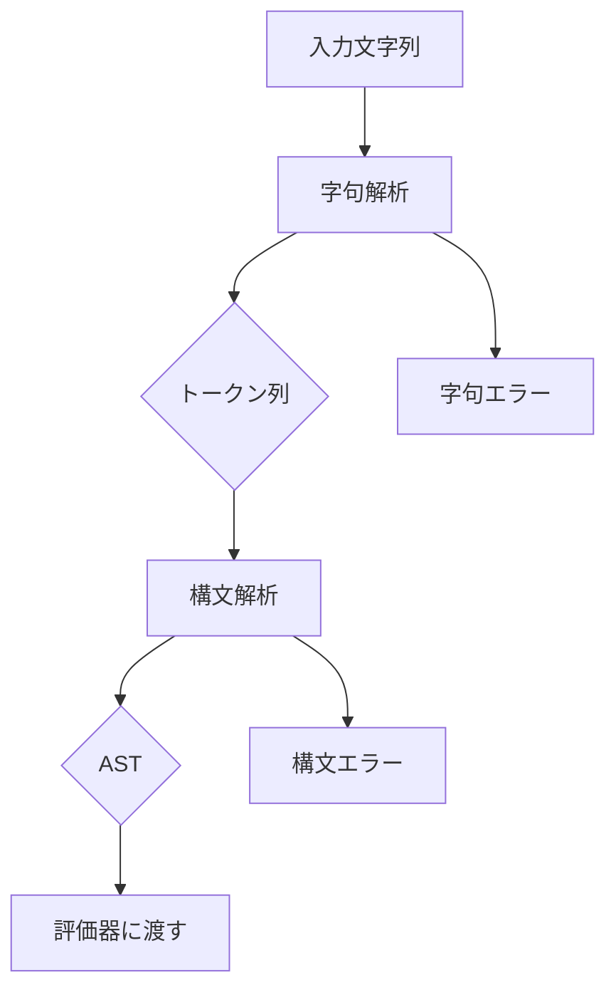
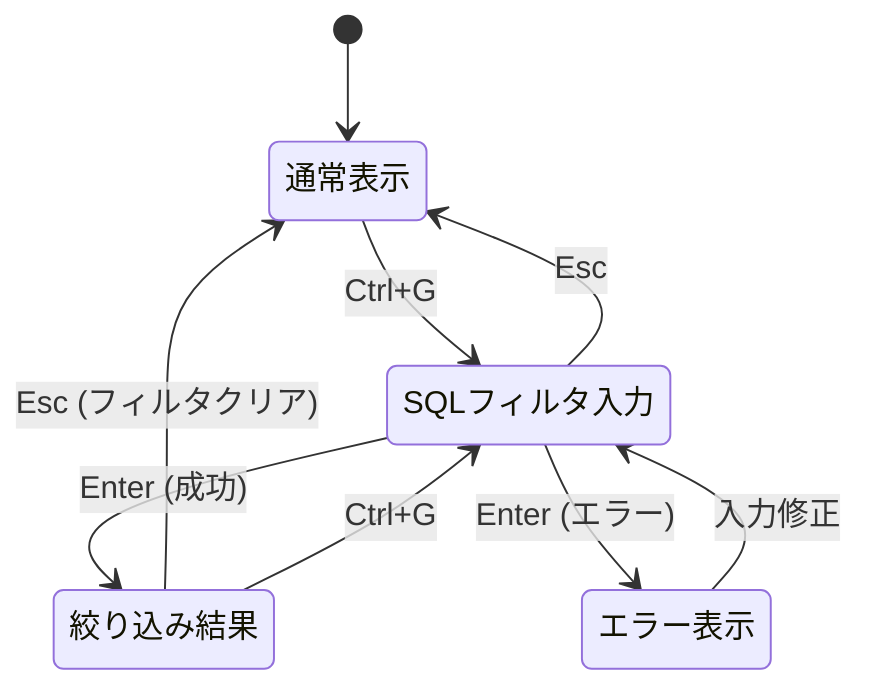

# 高度なファイル絞り込み機能 - 要件定義書

## 1. 概要

### 1.1 背景
duofmは現在、インクリメンタル検索（`/`キー）と正規表現検索（`Ctrl+F`）によるファイル絞り込み機能を提供している。これらはファイル名のみを対象としており、サイズ、更新日時、ファイルタイプなどの属性に基づく絞り込みはできない。

大規模なディレクトリを管理するユーザーからは、より柔軟で強力な絞り込み機能への要望がある。特に以下のようなユースケースに対応できていない：
- 特定サイズ以上のファイルを探す
- 最近更新されたファイルを絞り込む
- 特定の拡張子を除外する
- 複数の条件を組み合わせる

### 1.2 目的
SQLライクな構文を用いた高度なファイル絞り込み機能を実装し、ユーザーがファイルの様々な属性（名前、サイズ、更新日時、タイプ、パーミッションなど）に基づいて柔軟にファイルを絞り込めるようにする。

### 1.3 スコープ
- SQLライクなWHERE句構文のパーサー実装
- 各種演算子（比較、パターンマッチ、論理）のサポート
- サイズリテラル（KB、MiB等）のサポート
- 日時リテラルと関数のサポート
- ミニバッファを使用したUI実装
- 既存の検索機能との共存

**スコープ外：**
- SELECT句やFROM句などSQL全体の実装
- データベースへの保存
- 検索条件の保存・履歴機能

## 2. ビジネス要件

### 2.1 ビジネス目標
- パワーユーザーの作業効率向上
- 大規模ディレクトリでのファイル管理の改善
- SQLに馴染みのあるユーザーへの親和性向上

### 2.2 対象ユーザー
| ユーザータイプ | 説明 |
|----------------|------|
| システム管理者 | ログファイルやバックアップの管理、サイズや日時での絞り込みを頻繁に行う |
| 開発者 | プロジェクトファイルの管理、特定の拡張子やサイズでの絞り込み |
| パワーユーザー | SQLライクな構文に馴染みがあり、複雑な条件での絞り込みを好む |

### 2.3 期待される効果
- ファイル検索時間の短縮（特に大規模ディレクトリ）
- より精緻なファイル絞り込みが可能に
- 複数条件の組み合わせによる柔軟な検索

## 3. ユースケース

### 3.1 ユースケース一覧
| ID | ユースケース名 | アクター | 優先度 |
|----|----------------|----------|--------|
| UC01 | サイズによる絞り込み | ユーザー | 高 |
| UC02 | 更新日時による絞り込み | ユーザー | 高 |
| UC03 | 複合条件での絞り込み | ユーザー | 高 |
| UC04 | パターンマッチによる絞り込み | ユーザー | 中 |
| UC05 | タイプによる絞り込み | ユーザー | 中 |

### 3.2 ユースケース詳細

#### UC01: サイズによる絞り込み

**アクター**: ユーザー

**事前条件**:
- duofmが起動している
- ディレクトリにファイルが存在する

**基本フロー**:
1. ユーザーが`Ctrl+G`を押す
2. ミニバッファに「WHERE 」プロンプトが表示される
3. ユーザーが「size > 1GiB」と入力する
4. ユーザーがEnterを押す
5. 1GiB以上のファイルのみが表示される

**代替フロー**:
- 構文エラーの場合、エラーメッセージが表示され、入力を修正できる
- Escを押すと絞り込みがキャンセルされる

**事後条件**:
- ファイルリストが条件に一致するファイルのみに絞り込まれる

#### UC02: 更新日時による絞り込み

**アクター**: ユーザー

**事前条件**:
- duofmが起動している

**基本フロー**:
1. ユーザーが`Ctrl+G`を押す
2. 「mtime > now() - 7d」と入力する
3. Enterを押す
4. 過去7日以内に更新されたファイルのみが表示される

**代替フロー**:
- ISO 8601形式（'2024-01-15'）での日時指定も可能

**事後条件**:
- 条件に一致するファイルのみが表示される

#### UC03: 複合条件での絞り込み

**アクター**: ユーザー

**事前条件**:
- duofmが起動している

**基本フロー**:
1. ユーザーが`Ctrl+G`を押す
2. 「size > 1GiB AND year(mtime) = 2024」と入力する
3. Enterを押す
4. 1GiB以上かつ2024年に更新されたファイルが表示される

**代替フロー**:
- OR条件、NOT条件、括弧によるグルーピングも可能

**事後条件**:
- すべての条件を満たすファイルのみが表示される

#### UC04: パターンマッチによる絞り込み

**アクター**: ユーザー

**事前条件**:
- duofmが起動している

**基本フロー**:
1. ユーザーが`Ctrl+G`を押す
2. 「name LIKE '%.mp4'」と入力する
3. Enterを押す
4. .mp4拡張子のファイルのみが表示される

**代替フロー**:
- ILIKEで大文字小文字を無視したマッチング
- NOT LIKEで除外パターンの指定

**事後条件**:
- パターンに一致するファイルのみが表示される

#### UC05: タイプによる絞り込み

**アクター**: ユーザー

**事前条件**:
- duofmが起動している

**基本フロー**:
1. ユーザーが`Ctrl+G`を押す
2. 「type = 'dir'」または「isdir」と入力する
3. Enterを押す
4. ディレクトリのみが表示される

**代替フロー**:
- 'file', 'symlink'によるタイプ指定も可能
- isfile, issymlinkのboolean値も使用可能

**事後条件**:
- 指定タイプのエントリのみが表示される

## 4. 機能要件

### 4.1 機能一覧
| ID | 機能名 | 説明 | 優先度 |
|----|--------|------|--------|
| F01 | SQLライク構文パーサー | WHERE句以降の構文を解析する | 高 |
| F02 | 比較演算子 | =, !=, <>, <, >, <=, >= | 高 |
| F03 | パターンマッチ演算子 | LIKE, ILIKE, NOT LIKE | 高 |
| F04 | 論理演算子 | AND, OR, NOT, 括弧 | 高 |
| F05 | サイズリテラル | KB, MB, GB, KiB, MiB, GiB等 | 高 |
| F06 | 日時リテラル・関数 | ISO 8601、now()、相対日時 | 中 |
| F07 | 文字列関数 | lower(), upper() | 中 |
| F08 | IN演算子 | IN, NOT IN | 中 |
| F09 | NULL処理 | IS NULL, IS NOT NULL | 低 |
| F10 | UI実装 | ミニバッファでの入力、エラー表示 | 高 |
| F11 | ヘルプ画面への追記 | 既存のヘルプ画面にSQL-likeフィルタの説明を追記 | 中 |

### 4.2 機能詳細

#### F01: SQLライク構文パーサー

**説明**: WHERE句以降のSQL構文を解析し、抽象構文木（AST）を生成する。

**入力**:
- query: string - ユーザーが入力したクエリ文字列

**出力**:
- AST: Expression - 解析された式の抽象構文木
- error: Error - 構文エラーの場合のエラー情報

**処理フロー**:


**ビジネスルール**:
- 先頭の「WHERE」（大文字小文字不問）はオプショナル（コピペ対応）
- キーワードとカラム名は大文字小文字を区別しない
- 文字列リテラルは単一引用符で囲む

**バリデーション**:
| 項目 | ルール | エラーメッセージ |
|------|--------|------------------|
| 空クエリ | 許可（フィルタクリア） | なし |
| 不明カラム | 拒否 | Unknown column: {name} |
| 構文エラー | 拒否 | Syntax error at position {pos}: {hint} |

**エラーケース**:
| エラー | 条件 | 対応 |
|--------|------|------|
| 未閉じ括弧 | 括弧の数が一致しない | エラー位置とヒントを表示 |
| 未閉じ引用符 | 文字列リテラルが閉じていない | エラー位置を表示 |
| 不正な演算子 | サポートしない演算子 | サポートする演算子リストを表示 |

#### F02: 比較演算子

**説明**: 値の比較を行う演算子群。

**サポートする演算子**:
| 演算子 | 意味 | 例 |
|--------|------|-----|
| = | 等しい | size = 1024 |
| != | 等しくない | type != 'dir' |
| <> | 等しくない（別表記） | ext <> 'txt' |
| < | より小さい | size < 1MiB |
| > | より大きい | mtime > '2024-01-01' |
| <= | 以下 | size <= 100MB |
| >= | 以上 | year(mtime) >= 2024 |

**型による動作**:
- 数値: 数値として比較
- 文字列: 辞書順比較
- 日時: 時系列比較
- NULL: 比較結果は常にfalse

#### F03: パターンマッチ演算子

**説明**: SQL標準のLIKEパターンマッチング。

**サポートする演算子**:
| 演算子 | 意味 |
|--------|------|
| LIKE | パターンマッチ（大文字小文字区別） |
| ILIKE | パターンマッチ（大文字小文字無視） |
| NOT LIKE | パターンに一致しない |

**ワイルドカード**:
| 記号 | 意味 |
|------|------|
| % | 0文字以上の任意の文字列 |
| _ | 任意の1文字 |

**重要**: シェルのワイルドカード（`*`、`?`）はサポートしない。SQL標準の `%` と `_` のみ。

**例**:
```sql
name LIKE '%.txt'           -- .txtで終わるファイル
name LIKE 'report_%'        -- report_で始まるファイル
name ILIKE '%test%'         -- testを含む（大文字小文字無視）
name NOT LIKE '%~'          -- ~で終わらないファイル
```

#### F04: 論理演算子

**説明**: 複数条件の組み合わせ。

**サポートする演算子**:
| 演算子 | 意味 | 優先順位 |
|--------|------|----------|
| NOT | 否定 | 1（最高） |
| AND | 論理積 | 2 |
| OR | 論理和 | 3（最低） |
| () | グルーピング | - |

**演算子優先順位**: NOT > AND > OR（SQL標準）

**例**:
```sql
-- ANDはORより優先される
size > 1GiB OR name LIKE '%.mp4'    -- 別々に評価

-- 括弧でグルーピング
(size > 1GiB OR name LIKE '%.mp4') AND NOT type = 'dir'
```

#### F05: サイズリテラル

**説明**: 人間が読みやすいサイズ表記のサポート。

**バイナリ単位（IEC標準、1024ベース）**:
| 単位 | 値 |
|------|-----|
| KiB | 1024 |
| MiB | 1024^2 |
| GiB | 1024^3 |
| TiB | 1024^4 |

**デシマル単位（SI標準、1000ベース）**:
| 単位 | 値 |
|------|-----|
| KB | 1000 |
| MB | 1000^2 |
| GB | 1000^3 |
| TB | 1000^4 |

**例**:
```sql
size > 1GiB        -- 1073741824 bytes
size > 1GB         -- 1000000000 bytes
size BETWEEN 100MiB AND 1GiB
```

#### F06: 日時リテラル・関数

**説明**: 日時の指定と操作。

**日時リテラル**:
- ISO 8601形式: `'2024-01-15'`, `'2024-01-15 10:30:00'`
- 単一引用符で囲む

**日時関数**:
| 関数 | 説明 | 例 |
|------|------|-----|
| now() | 現在日時 | mtime > now() - 7d |
| year(column) | 年を抽出 | year(mtime) = 2024 |
| month(column) | 月を抽出 | month(mtime) = 12 |
| day(column) | 日を抽出 | day(mtime) = 25 |

**相対日時**:
- `now() - Nd`: N日前
- `now() - Nm`: N分前
- `now() - Nh`: N時間前

**例**:
```sql
mtime > now() - 7d              -- 過去7日以内
mtime > '2024-01-01'            -- 2024年以降
year(mtime) = 2024 AND month(mtime) = 12  -- 2024年12月
```

#### F07: 文字列関数

**説明**: 文字列操作関数。

| 関数 | 説明 | 例 |
|------|------|-----|
| lower(column) | 小文字に変換 | lower(name) = 'readme.md' |
| upper(column) | 大文字に変換 | upper(ext) = 'TXT' |

**注意**: 拡張子のフィルタリングには `ext` カラムを直接使用してください（例: `ext = 'txt'`）。`ext()` 関数は提供されません。

#### F08: IN演算子

**説明**: 値のリストとの照合。

**構文**:
```sql
column IN (value1, value2, ...)
column NOT IN (value1, value2, ...)
```

**例**:
```sql
ext IN ('jpg', 'png', 'gif')        -- 画像ファイル（ドットなし）
type NOT IN ('dir', 'symlink')
```

#### F09: NULL処理

**説明**: NULL値の判定。**ext カラム専用**。

**構文**:
```sql
ext IS NULL        -- 拡張子がないファイル（先頭ドットファイルを含む）
ext IS NOT NULL    -- 拡張子があるファイル
```

**NULL動作ルール**:
- **ext カラムのみ NULL になる可能性がある**
- 他のカラム（name, size, mtime, type, perm, owner, group, isdir, isfile, issymlink）は常に値を持つ
- owner/group は常に値を持つ（ユーザー名、UID文字列、"unknown"、"N/A" のいずれか）
- NULL値との比較（=, <, >等）は常にfalseを返す
- NULL判定にはIS NULL/IS NOT NULLを使用する

**例**:
```sql
ext IS NULL                     -- 拡張子がないファイル（Makefile、.gitignoreなど）
ext IS NOT NULL                 -- 拡張子があるファイル
ext = 'txt'                     -- .txtファイル（ドットなし）
ext IN ('jpg', 'png', 'gif')    -- 画像ファイル（ドットなし）
```

#### F10: UI実装

**説明**: ミニバッファを使用した入力UI。

**UIデザイン**:
```
WHERE [_                    ]
```

**コンポーネント**:
- 静的ラベル「WHERE 」
- 入力欄（カーソル付き）
- エラーメッセージ表示エリア

**エラー表示**:
```
WHERE [size > 1GiBB          ]
Error at position 14: Invalid size unit 'GiBB'. Valid units: KiB, MiB, GiB, TiB, KB, MB, GB, TB
```

**キーバインド**:
| キー | 動作 |
|------|------|
| Ctrl+G | SQLライクフィルタを起動 |
| Enter | クエリを実行 |
| Esc | キャンセル（フィルタクリア） |
| 標準編集キー | 文字入力、削除、カーソル移動 |

#### F11: ヘルプ画面への追記

**説明**: 既存のヘルプ画面（?キー）にSQL-likeフィルタの説明を追記する。

**キーバインドセクション（Display & Search）に追加:**
```
  Ctrl+G         : SQL-like filter (advanced)
```

**新規セクション「SQL-like Filter」を追加:**
```
SQL-like Filter (Ctrl+G)

Columns:
  name, size, mtime, type, ext, perm, owner, group
  isdir, isfile, issymlink

Operators:
  =, !=, <, >, <=, >=, LIKE, ILIKE, IN, NOT, AND, OR

Examples:
  size > 1GiB
  name LIKE '%.go' AND size > 100MiB
  ext IN ('jpg', 'png', 'gif')
  ext IS NULL                    (no extension)
  year(mtime) = 2024

Size units:
  KiB, MiB, GiB, TiB (1024-based)
  KB, MB, GB, TB (1000-based)

Date format:
  'YYYY-MM-DD' or now() - 7d

Note: Use % (not *) for wildcards in LIKE
```

**実装箇所**: `internal/ui/help_dialog.go` の `buildContent()` 関数

## 5. 非機能要件

### 5.1 パフォーマンス要件
- クエリ解析: < 10ms
- 10,000ファイルの絞り込み: < 100ms
- UI応答: < 50ms

### 5.2 セキュリティ要件
- 入力検証: すべてのユーザー入力を検証
- パストラバーサル防止: ファイルパスの検証
- バッファオーバーフロー防止: 入力長の制限

### 5.3 可用性要件
- 構文エラーでアプリケーションがクラッシュしない
- 無効なクエリは適切なエラーメッセージを表示

### 5.4 保守性要件
- パーサーのユニットテストカバレッジ: 90%以上
- 各演算子の独立したテストケース
- エラーメッセージの国際化対応準備

### 5.5 互換性要件
- 既存の検索機能（`/`、`Ctrl+F`）との共存
- FileEntry構造体との互換性維持

## 6. UI/UX要件

### 6.1 画面設計要件
- ミニバッファはペイン下部に表示
- 静的ラベル「WHERE 」+ 入力欄のレイアウト
- エラーメッセージは入力欄の下に表示
- 使用例のヒント表示（オプション）

### 6.2 画面遷移


### 6.3 レスポンシブ対応
- 狭い画面でも入力欄は最低40文字分確保
- エラーメッセージは折り返して表示

## 7. データ要件

### 7.1 サポートするカラム

| カラム名 | 型 | 説明 | FileEntryマッピング | NULL可否 |
|----------|-----|------|---------------------|----------|
| name | string | ファイル名 | Name | 不可 |
| size | int64 | サイズ（バイト） | Size | 不可 |
| mtime | timestamp | 更新日時 | ModTime | 不可 |
| type | string | 'file', 'dir', 'symlink' | IsDir, IsSymlink から導出 | 不可 |
| ext | string | 拡張子（**ドットを含まない**: 'txt', 'go', 'rs'）<br>先頭ドットのみのファイル（`.gitignore`）は NULL<br>最後の拡張子のみ（`archive.tar.gz` → 'gz'） | Name から導出 | **可** |
| perm | string | パーミッション（例: "-rwxr-xr-x"） | Permissions | 不可 |
| owner | string | 所有者名（常に値あり: ユーザー名/UID/"unknown"/"N/A"） | Owner | 不可 |
| group | string | グループ名（常に値あり: グループ名/GID/"unknown"/"N/A"） | Group | 不可 |
| isdir | bool | ディレクトリか | IsDir | 不可 |
| isfile | bool | ファイルか | !IsDir && !IsSymlink | 不可 |
| issymlink | bool | シンボリックリンクか | IsSymlink | 不可 |

### 7.2 FileEntry構造体（参照）

```go
type FileEntry struct {
    Name        string
    IsDir       bool
    Size        int64
    ModTime     time.Time
    Permissions fs.FileMode
    Owner       string
    Group       string
    IsSymlink   bool
    LinkTarget  string
    LinkBroken  bool
}
```

## 8. 外部連携

### 8.1 連携システム
| システム名 | 連携方法 | データ |
|------------|----------|--------|
| 既存フィルタシステム | Go関数呼び出し | FileEntry配列 |
| ミニバッファコンポーネント | 埋め込み | 入力文字列 |

### 8.2 既存システムとの統合

新しい`SearchMode`を追加:
```go
const (
    SearchModeNone SearchMode = iota
    SearchModeIncremental  // 既存: /
    SearchModeRegex        // 既存: Ctrl+F
    SearchModeSQLLike      // 新規: Ctrl+G
)
```

## 9. 制約条件

### 9.1 技術的制約
- Go標準ライブラリのみ使用（外部パーサーライブラリは不使用）
- 既存のBubble Teaアーキテクチャに準拠
- FileEntry構造体の変更は最小限に

### 9.2 ビジネス上の制約
- SQL全体の実装ではなく、WHERE句のみ
- 既存の検索機能との互換性維持
- 学習コストを最小限に（SQL知識があれば直感的に使える）

### 9.3 スケジュール制約
- 段階的実装を可能にする設計

## 10. 想定される課題とリスク

### 10.1 技術的課題
| 課題 | 影響度 | 対応策 |
|------|--------|--------|
| パーサーの複雑性 | 中 | 再帰下降パーサーで段階的実装 |
| 日時処理の複雑性 | 中 | time.Parseの活用、タイムゾーン考慮 |
| パフォーマンス | 低 | 遅延評価、最適化の余地を残す |

### 10.2 ビジネスリスク
| リスク | 発生確率 | 影響度 | 対応策 |
|--------|----------|--------|--------|
| 学習コストが高い | 中 | 中 | ヘルプ、使用例、エラーヒントの充実 |
| 既存機能との混乱 | 低 | 低 | 明確なキーバインド分離 |

## 11. 成功基準

### 11.1 受け入れ基準
- [ ] すべての比較演算子が正しく動作する
- [ ] LIKE/ILIKEパターンマッチが正しく動作する
- [ ] AND/OR/NOT演算子と括弧が正しく動作する
- [ ] サイズリテラル（KiB, MiB, GiB, TiB, KB, MB, GB, TB）が正しく解析される
- [ ] 日時リテラルと関数が正しく動作する
- [ ] 構文エラー時に位置とヒントを含むメッセージが表示される
- [ ] 既存の検索機能（/, Ctrl+F）が影響を受けない
- [ ] 10,000ファイルの絞り込みが100ms以内で完了する

### 11.2 KPI
| 指標 | 目標値 | 測定方法 |
|------|--------|----------|
| クエリ解析時間 | < 10ms | ベンチマークテスト |
| フィルタ実行時間 | < 100ms（10,000ファイル） | ベンチマークテスト |
| パーサーテストカバレッジ | > 90% | go test -cover |

## 12. テストシナリオ

### 12.1 テスト観点
- [ ] 正常系: 各演算子の基本動作
- [ ] 正常系: 複合条件（AND, OR, NOT, 括弧）
- [ ] 正常系: サイズリテラル各種
- [ ] 正常系: 日時リテラルと関数
- [ ] 異常系: 構文エラー検出
- [ ] 異常系: 不明カラム
- [ ] 異常系: 型の不一致
- [ ] 境界値: 空クエリ
- [ ] 境界値: 非常に長いクエリ
- [ ] セキュリティ: 不正な入力
- [ ] パフォーマンス: 大量ファイルでの絞り込み

## 13. 用語定義

| 用語 | 定義 |
|------|------|
| AST | Abstract Syntax Tree（抽象構文木）。構文解析の結果を木構造で表現 |
| IEC単位 | International Electrotechnical Commission定義のバイナリ単位（KiB, MiB等） |
| SI単位 | 国際単位系（Systeme International）のデシマル単位（KB, MB等） |
| LIKE | SQLのパターンマッチ演算子。%（任意文字列）と_（任意1文字）を使用 |
| ILIKE | LIKEの大文字小文字無視版（PostgreSQL由来） |

## 14. 確認事項

### 14.1 確認済み事項

- [x] SQLライク構文を採用（key:value DSLではなく）
- [x] WHERE以降のみを入力する形式
- [x] UIは静的ラベル「WHERE」+ 入力欄
- [x] パーサーは先頭のWHEREをトリムする（コピペ対応）
- [x] サイズリテラル: バイナリ（KiB, MiB, GiB, TiB）、デシマル（KB, MB, GB, TB）をサポート
- [x] LIKEのワイルドカードはSQL標準（% と _）のみ。シェルの * と ? は不可
- [x] 大文字小文字: キーワードとカラム名は大文字小文字を区別しない
- [x] 演算子優先順位: NOT > AND > OR（SQL標準）
- [x] NULL処理: NULL値は比較でfalseを返す
- [x] エラーメッセージ: 位置とヒントを含む親切なメッセージ
- [x] キーバインド: 新しいキーバインド（Ctrl+G）でSQLライクフィルタを起動
- [x] 既存の / (インクリメンタル検索) と Ctrl+F (正規表現) は維持

### 14.2 未確認・保留事項
- [ ] クエリ履歴機能の必要性
- [ ] プリセットクエリ機能の必要性
- [ ] クエリの保存機能の必要性

## 15. 参考資料

- duofm FileEntry定義: `/home/sakura/cache/worktrees/duofm/feature-advanced-filtering/internal/fs/types.go`
- 既存検索実装: `/home/sakura/cache/worktrees/duofm/feature-advanced-filtering/internal/ui/search.go`
- ミニバッファ実装: `/home/sakura/cache/worktrees/duofm/feature-advanced-filtering/internal/ui/minibuffer.go`
- SQL LIKE演算子: https://www.postgresql.org/docs/current/functions-matching.html
- IEC 80000-13（バイナリ単位）: https://en.wikipedia.org/wiki/Binary_prefix
