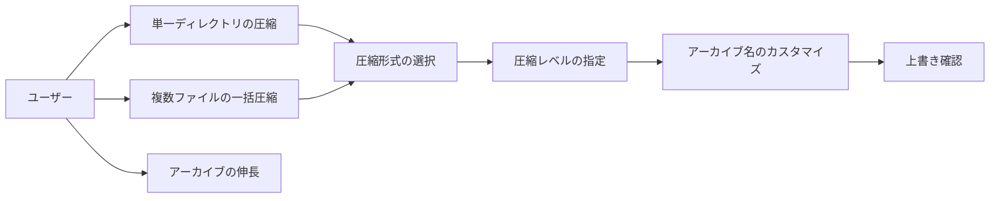
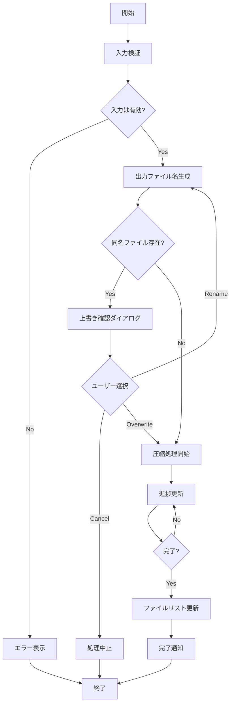
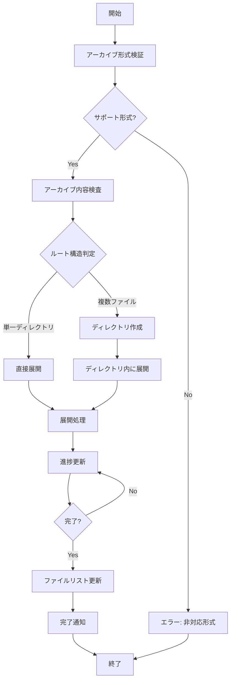
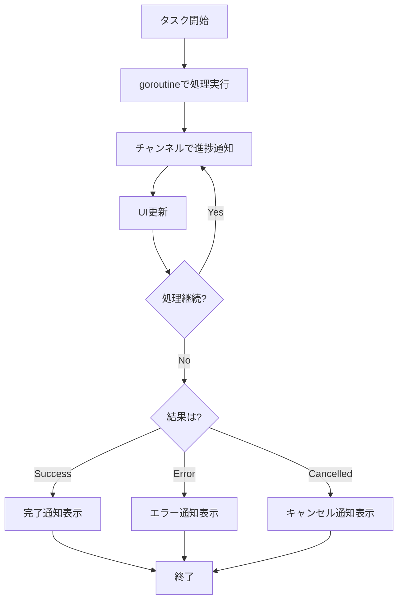
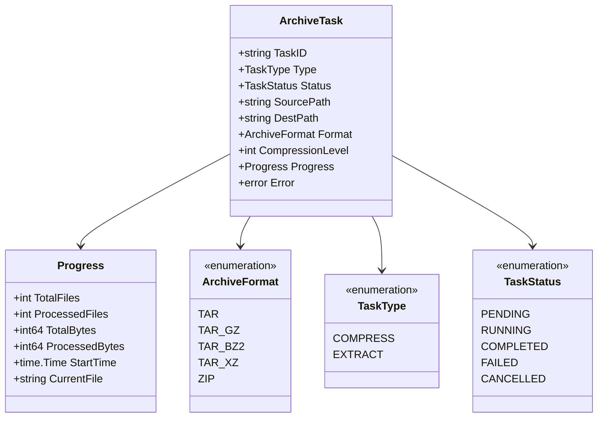

# アーカイブ機能 - 要件定義書

## 1. 概要

### 1.1 背景
duofmはデュアルペインファイルマネージャーとして基本的なファイル操作(コピー、移動、削除)を提供しているが、ファイルの圧縮・伸長機能が欠けている。多くのファイルマネージャーユーザーは、ファイルのアーカイブ化と展開を頻繁に行うため、この機能はファイル管理の効率性を大幅に向上させる。

### 1.2 目的
ユーザーがduofmのTUI環境内で、直接ファイルやディレクトリの圧縮・伸長を実行できるようにする。UNIX哲学に基づき、外部CLIツール（tar, gzip, bzip2, xz, zip, 7z）を活用することで、シンプルかつ堅牢な実装を実現する。デュアルペイン構造を活かし、アーカイブの作成と展開を直感的に行えるようにする。

### 1.3 対象プラットフォーム
- **Linux**のみをサポート
- 必要な外部コマンドがシステムにインストールされていることを前提とする

### 1.4 スコープ
- **対象範囲**:
  - 圧縮機能: tar, tar.gz, tar.bz2, tar.xz, zip, 7z形式での圧縮
  - 伸長機能: tar, tar.gz, tar.bz2, tar.xz, zip, 7z形式の伸長
  - 単一ファイル/ディレクトリの圧縮
  - 複数ファイル/ディレクトリのマーク選択による一括圧縮
  - 反対側ペインへのアーカイブ生成・展開
  - 既存コンテキストメニューへの統合

- **対象外**:
  - アーカイブ内容のブラウジング機能
  - rar等の他形式のサポート
  - パスワード保護付きアーカイブ
  - 分割アーカイブ
  - 差分/増分アーカイブ

## 2. ビジネス要件

### 2.1 ビジネス目標
- ファイル管理作業の効率化(外部ツール起動の手間削減)
- TUIファイルマネージャーとしての競争力向上
- ユーザーのワークフローをシームレスに統合

### 2.2 対象ユーザー
| ユーザータイプ | 説明 |
|----------------|------|
| 開発者 | ソースコードやビルド成果物のアーカイブ化 |
| システム管理者 | ログファイルやバックアップのアーカイブ管理 |
| 一般ユーザー | ドキュメントやメディアファイルの整理 |

### 2.3 期待される効果
- ファイル管理操作の時間短縮(コマンドライン入力不要)
- ユーザー体験の向上(統一されたインターフェース)
- ストレージ容量の節約(圧縮によるディスク使用量削減)

## 3. ユースケース

### 3.1 ユースケース一覧
| ID | ユースケース名 | アクター | 優先度 |
|----|----------------|----------|--------|
| UC01 | 単一ディレクトリの圧縮 | ユーザー | 高 |
| UC02 | 複数ファイルの一括圧縮 | ユーザー | 高 |
| UC03 | アーカイブの伸長 | ユーザー | 高 |
| UC04 | 圧縮形式の選択 | ユーザー | 高 |
| UC05 | 圧縮レベルの指定 | ユーザー | 中 |
| UC06 | アーカイブ名のカスタマイズ | ユーザー | 中 |
| UC07 | 既存アーカイブの上書き確認 | ユーザー | 高 |

### 3.2 ユースケース詳細

#### UC01: 単一ディレクトリの圧縮

**アクター**: ユーザー

**事前条件**:
- duofmが起動している
- 圧縮したいディレクトリが存在する
- 反対側ペインのディレクトリが書き込み可能

**基本フロー**:
1. ユーザーがアクティブペインで圧縮対象のディレクトリにカーソルを合わせる
2. `@`キーでコンテキストメニューを開く
3. "Compress"項目を選択
4. サブメニューから圧縮形式(tar/tar.xz/zip/7z)を選択
5. (tar.xz/zip/7zの場合)圧縮レベル選択ダイアログが表示される
6. アーカイブ名入力ダイアログが表示され、デフォルト名が提示される
7. ユーザーが名前を確認・編集してEnterで確定
8. システムがバックグラウンドで圧縮処理を開始
9. プログレスバーが表示され、進捗をパーセンテージで表示
10. 圧縮完了後、反対側ペインに圧縮ファイルが生成される
11. 完了通知が表示される

**代替フロー**:
- 3a. 同名のアーカイブが既に存在する場合
  - 3a1. 上書き確認ダイアログが表示される
  - 3a2. ユーザーが上書き/リネーム/キャンセルを選択
  - 3a3. リネーム選択時は新しい名前を入力
- 8a. 圧縮中にエラーが発生
  - 8a1. エラーメッセージを表示
  - 8a2. 部分的に作成されたファイルを削除
- 8b. ユーザーがキャンセル操作(Escキー)を実行
  - 8b1. 処理を中断
  - 8b2. 部分的に作成されたファイルを削除

**事後条件**:
- 反対側ペインに圧縮ファイルが作成されている
- 元のファイル/ディレクトリは変更されていない
- ファイルリストが更新されている

#### UC02: 複数ファイルの一括圧縮

**アクター**: ユーザー

**事前条件**:
- duofmが起動している
- 複数のファイル/ディレクトリがマーク(Spaceキー)されている

**基本フロー**:
1. ユーザーがSpaceキーで複数のファイル/ディレクトリをマーク
2. `@`キーでコンテキストメニューを開く
3. "Compress N files"項目が表示される(Nはマーク数)
4. 圧縮形式を選択
5. (tar.xz/zipの場合)圧縮レベルを選択
6. アーカイブ名入力ダイアログが表示される
   - デフォルト名: 親ディレクトリ名または`archive_YYYY-MM-DD`
7. 圧縮処理が開始され、進捗が表示される
   - 「処理中: X/N files (Y%)」形式で表示
8. 完了後、反対側ペインにアーカイブが作成される

**代替フロー**:
- UC01の代替フローと同様

**事後条件**:
- 反対側ペインにアーカイブが作成されている
- マークが解除されている
- 元のファイルは変更されていない

#### UC03: アーカイブの伸長

**アクター**: ユーザー

**事前条件**:
- 対応形式のアーカイブファイルが存在する
- 反対側ペインのディレクトリが書き込み可能

**基本フロー**:
1. ユーザーがアーカイブファイルにカーソルを合わせる
2. `@`キーでコンテキストメニューを開く
3. "Extract archive"項目を選択
4. システムがアーカイブの内容を検査
5. スマート展開ロジックを適用:
   - ルートが単一ディレクトリ → 反対側ペインに直接展開
   - 複数ファイル → アーカイブ名と同名のディレクトリを作成して展開
6. 展開処理が開始され、プログレスバーが表示される
7. 完了後、反対側ペインに展開されたファイルが表示される

**代替フロー**:
- 4a. アーカイブが破損している
  - 4a1. エラーメッセージを表示: "Failed to extract: corrupted archive"
- 6a. 同名のファイル/ディレクトリが既に存在
  - 6a1. 上書き確認ダイアログを表示
- 6b. ディスク容量不足
  - 6b1. エラーメッセージを表示
  - 6b2. 部分的に展開されたファイルを削除

**事後条件**:
- 反対側ペインにファイルが展開されている
- 元のアーカイブファイルは変更されていない

#### UC04: 圧縮形式の選択

**アクター**: ユーザー

**事前条件**:
- コンテキストメニューで"Compress"を選択済み

**基本フロー**:
1. サブメニューが表示される:
   - "as tar (no compression)"
   - "as tar.gz (gzip compression)"
   - "as tar.bz2 (bzip2 compression)"
   - "as tar.xz (LZMA compression)"
   - "as zip (deflate compression)"
   - "as 7z (LZMA2 compression)"
2. ユーザーがj/kキーまたは数字キーで選択
3. Enterで確定

**事後条件**:
- 選択された形式で圧縮処理が続行される

#### UC05: 圧縮レベルの指定

**アクター**: ユーザー

**事前条件**:
- tar.gz、tar.bz2、tar.xz、zip、または7z形式を選択済み

**基本フロー**:
1. 圧縮レベル選択ダイアログが表示される
2. スライダーまたは数値入力で0-9を選択
   - 0: 無圧縮
   - 6: デフォルト(推奨)
   - 9: 最大圧縮
3. 各レベルの説明が表示される
4. Enterで確定

**代替フロー**:
- 2a. Escキーでスキップ
  - デフォルトレベル(6)を使用

**事後条件**:
- 指定された圧縮レベルで処理が続行される

#### UC06: アーカイブ名のカスタマイズ

**アクター**: ユーザー

**事前条件**:
- 圧縮形式と圧縮レベルの選択が完了

**基本フロー**:
1. 名前入力ダイアログが表示される
2. デフォルト名が入力フィールドに表示される:
   - 単一対象: 元の名前 + 拡張子
   - 複数対象: 親ディレクトリ名 + 拡張子
3. ユーザーが編集可能(カーソル移動、削除、入力)
4. Enterで確定

**代替フロー**:
- 3a. 空の名前
  - エラーメッセージ: "Archive name cannot be empty"
- 3b. 不正な文字を含む
  - エラーメッセージ: "Invalid characters in filename"
- 3c. Escキーでキャンセル
  - 圧縮処理全体をキャンセル

**事後条件**:
- 指定された名前でアーカイブが作成される

#### UC07: 既存アーカイブの上書き確認

**アクター**: ユーザー

**事前条件**:
- 反対側ペインに同名のファイルが既に存在

**基本フロー**:
1. 確認ダイアログが表示される:
   - "File 'archive.tar.xz' already exists. What do you want to do?"
   - オプション: [Overwrite] [Rename] [Cancel]
2. ユーザーが選択:
   - Overwrite: 既存ファイルを上書き
   - Rename: 新しい名前を入力
   - Cancel: 処理を中止
3. Rename選択時:
   - 名前入力ダイアログが再表示される
   - デフォルト名に連番が付加される(例: archive_1.tar.xz)

**事後条件**:
- ユーザーの選択に応じた処理が実行される

**ユースケース図**:


## 4. 機能要件

### 4.1 機能一覧
| ID | 機能名 | 説明 | 優先度 |
|----|--------|------|--------|
| F01 | アーカイブ作成 | ファイル/ディレクトリを圧縮 | 高 |
| F02 | アーカイブ伸長 | 圧縮ファイルを展開 | 高 |
| F03 | 複数形式サポート | 複数の圧縮形式に対応 | 高 |
| F04 | 進捗表示 | 処理進捗の可視化 | 高 |
| F05 | バックグラウンド処理 | 非同期での圧縮・伸長 | 高 |
| F06 | 圧縮レベル選択 | 圧縮率のカスタマイズ | 中 |
| F07 | スマート展開 | アーカイブ構造に応じた展開 | 中 |
| F08 | エラーハンドリング | 適切なエラー処理と通知 | 高 |

### 4.2 機能詳細

#### F01: アーカイブ作成

**説明**: ユーザーが選択したファイルまたはディレクトリを指定形式で圧縮し、反対側ペインに保存する。

**入力**:
- ソースファイル/ディレクトリパス: string | []string
- 圧縮形式: "tar" | "tar.gz" | "tar.bz2" | "tar.xz" | "zip" | "7z"
- 圧縮レベル: int (0-9、tarの場合はN/A)
- 出力ファイル名: string
- 出力ディレクトリパス: string

**出力**:
- 圧縮ファイルパス: string
- 圧縮結果: success | error
- エラーメッセージ: string (エラー時)

**処理フロー**:


**ビジネスルール**:
- tarはストリーム処理のため圧縮レベルは適用されない
- シンボリックリンクはリンク自体を保存する(実体をたどらない)
- 隠しファイル(.)も含めてアーカイブ化する
- ファイル権限とタイムスタンプを保持する
- 複数ファイル選択時は、すべてアーカイブのルートに配置する

**バリデーション**:
| 項目 | ルール | エラーメッセージ |
|------|--------|------------------|
| ソースパス | 存在する有効なパス | "Source file/directory not found" |
| 出力ディレクトリ | 書き込み可能 | "Destination directory is not writable" |
| アーカイブ名 | 空でない、有効な文字のみ | "Invalid archive name" |
| 圧縮レベル | 0-9の整数 | "Compression level must be 0-9" |
| ディスク容量 | 十分な空き容量 | "Insufficient disk space" |

**エラーケース**:
| エラー | 条件 | 対応 |
|--------|------|------|
| 権限エラー | 読み取り不可ファイル含む | エラー表示、処理中断 |
| ディスク容量不足 | 書き込み中に容量不足 | エラー表示、部分ファイル削除 |
| 処理中断 | ユーザーがキャンセル | 部分ファイル削除、元の状態に戻す |
| I/Oエラー | ディスク障害等 | エラー表示、リトライ提案 |

#### F02: アーカイブ伸長

**説明**: 圧縮ファイルを解析し、反対側ペインに展開する。

**入力**:
- アーカイブファイルパス: string
- 出力ディレクトリパス: string

**出力**:
- 展開されたファイル数: int
- 展開結果: success | error
- エラーメッセージ: string (エラー時)

**処理フロー**:


**ビジネスルール**:
- ルートに単一ディレクトリのみ → 直接展開
- ルートに複数ファイル → アーカイブ名のディレクトリを作成して展開
- シンボリックリンクは保持する
- ファイル権限とタイムスタンプを復元する
- 既存ファイルとの衝突は上書き確認する

**バリデーション**:
| 項目 | ルール | エラーメッセージ |
|------|--------|------------------|
| アーカイブファイル | 存在し、読み取り可能 | "Archive file not found or not readable" |
| ファイル形式 | サポート形式である | "Unsupported archive format" |
| アーカイブ整合性 | 破損していない | "Corrupted archive file" |
| 出力ディレクトリ | 書き込み可能 | "Destination directory is not writable" |
| ディスク容量 | 展開に十分な容量 | "Insufficient disk space for extraction" |

**エラーケース**:
| エラー | 条件 | 対応 |
|--------|------|------|
| 破損アーカイブ | CRCエラー等 | エラー表示、処理中断 |
| 権限エラー | 書き込み権限なし | エラー表示、スキップまたは中断 |
| ディスク容量不足 | 展開中に容量不足 | エラー表示、部分展開の削除オプション |
| パス長超過 | ファイルパスが長すぎる | エラー表示、該当ファイルスキップ |

#### F03: 複数形式サポート

**説明**: 各種アーカイブ形式の圧縮・伸長に対応する。外部CLIツールを使用してアーカイブ操作を実行する。

**サポート形式**:

| 形式 | 圧縮 | 伸長 | 圧縮コマンド | 伸長コマンド |
|------|------|------|-------------|-------------|
| tar | ✓ | ✓ | tar -cvf | tar -xvf |
| tar.gz | ✓ | ✓ | tar -czvf | tar -xzvf |
| tar.bz2 | ✓ | ✓ | tar -cjvf | tar -xjvf |
| tar.xz | ✓ | ✓ | tar -cJvf | tar -xJvf |
| zip | ✓ | ✓ | zip -r | unzip |
| 7z | ✓ | ✓ | 7z a | 7z x |

**必要な外部パッケージ（Debian/Ubuntu）**:
```bash
# 基本パッケージ（通常はプリインストール済み）
sudo apt install tar gzip bzip2 xz-utils

# zip/unzipサポート
sudo apt install zip unzip

# 7zサポート
sudo apt install p7zip-full
```

**ビジネスルール**:
- 拡張子から形式を自動判定
- 判定できない場合はマジックナンバーで判定
- 非対応形式は明確なエラーメッセージを表示
- 必要な外部コマンドが存在しない場合は該当形式をメニューから非表示にする

**バリデーション**:
| 項目 | ルール | エラーメッセージ |
|------|--------|------------------|
| ファイル拡張子 | サポート形式の拡張子 | "Unsupported file extension: .{ext}" |
| マジックナンバー | 対応形式のシグネチャ | "Unrecognized archive format" |
| 外部コマンド | 必要なコマンドが存在する | "Required command not found: {cmd}" |

#### F04: 進捗表示

**説明**: 長時間かかる処理の進捗をリアルタイムで表示する。

**表示内容**:
- 処理中のファイル名(パスが長い場合は省略)
- 全体の進捗パーセンテージ
- 処理済みファイル数 / 総ファイル数
- 経過時間
- (可能であれば)推定残り時間

**表示形式**:
```
Compressing to archive.tar.xz...

[████████████░░░░░░░░] 65% (13/20 files)

Current: src/internal/ui/very/long/path/to/file.go
Elapsed: 00:15  Estimated: 00:08

[Esc] Cancel
```

**ビジネスルール**:
- 進捗バーは画面中央に表示
- 更新頻度は最大100ms間隔
- 小さいファイル(< 1MB)は進捗更新をスキップして高速化
- キャンセル可能(Escキー)

#### F05: バックグラウンド処理

**説明**: 圧縮・伸長処理をバックグラウンドで実行し、UIをブロックしない。

**入力**:
- 処理タスク情報(タスクID, 種別, パラメータ)

**出力**:
- タスクステータス: running | completed | failed | cancelled
- 進捗情報: 定期的に更新

**処理フロー**:


**ビジネスルール**:
- 同時に実行できるアーカイブタスクは1つまで
- 新しいタスクは既存タスク完了まで待機
- 完了通知は5秒間表示後、自動で消える
- タスク履歴は保持しない(メモリ節約)

**エラーケース**:
| エラー | 条件 | 対応 |
|--------|------|------|
| タスク実行中に起動 | 既存タスクあり | 待機キューに追加または拒否 |
| goroutineパニック | 予期しないエラー | リカバリーしてエラー通知 |

#### F06: 圧縮レベル選択

**説明**: tar.gz、tar.bz2、tar.xz、zip、7zの圧縮レベルをユーザーが選択できる。

**入力**:
- 圧縮レベル: int (0-9)

**出力**:
- 適用される圧縮レベル: int

**レベル定義**:
| レベル | 名称 | 説明 | 圧縮率 | 速度 | 推奨用途 |
|--------|------|------|--------|------|----------|
| 0 | None | 無圧縮 | 0% | 最速 | アーカイブ化のみ |
| 1-3 | Fast | 高速圧縮 | 低 | 速い | 一時ファイル |
| 4-6 | Normal | 標準圧縮 | 中 | 普通 | 通常用途(デフォルト) |
| 7-9 | Best | 最大圧縮 | 高 | 遅い | 長期保存、配布用 |

**UI仕様**:
```
Select Compression Level

0 ░░░░░░░░░░ None (fastest, no compression)
1 ██░░░░░░░░ Fast
2 ███░░░░░░░ Fast
3 ████░░░░░░ Fast
4 █████░░░░░ Normal
5 ██████░░░░ Normal
6 ███████░░░ Normal (recommended) ← [default]
7 ████████░░ Best
8 █████████░ Best
9 ██████████ Best (slowest, maximum compression)

[j/k] Select  [Enter] Confirm  [Esc] Use default (6)
```

**ビジネスルール**:
- デフォルトはレベル6
- tarは圧縮レベル非対応のため、このダイアログをスキップ
- 各形式の圧縮レベル指定:
  - tar.gz: gzip -N オプション (tar -czvf --options=gzip:compression-level=N)
  - tar.bz2: bzip2 -N オプション
  - tar.xz: xz -N オプション
  - zip: zip -N オプション
  - 7z: 7z -mx=N オプション
- レベル選択はオプション(Escでスキップ可)

#### F07: スマート展開

**説明**: アーカイブの内部構造を検査し、適切な展開方法を自動選択する。

**判定ロジック**:
```
IF アーカイブのルートに要素が1つだけ AND それがディレクトリ THEN
    直接展開モード
ELSE
    ディレクトリ作成モード
END IF
```

**動作例**:

ケース1: ルートに単一ディレクトリ
```
archive.tar.xz の内容:
  myproject/
    src/
    docs/

展開結果(反対ペイン=/dest):
  /dest/myproject/
    src/
    docs/
```

ケース2: ルートに複数ファイル
```
archive.tar.xz の内容:
  file1.txt
  file2.txt
  dir1/

展開結果(反対ペイン=/dest):
  /dest/archive/
    file1.txt
    file2.txt
    dir1/
```

**ビジネスルール**:
- 展開前にアーカイブ全体をスキャン(遅延を最小化)
- ディレクトリ名は拡張子を除いたアーカイブ名を使用
- 同名ディレクトリが存在する場合は上書き確認

#### F08: エラーハンドリング

**説明**: すべてのエラー状況を適切に処理し、ユーザーにわかりやすく通知する。

**エラーカテゴリ**:

1. **入力検証エラー**
   - 対象ファイル未選択
   - 無効なファイル名
   - サポート外の形式

2. **ファイルシステムエラー**
   - 読み取り権限なし
   - 書き込み権限なし
   - ディスク容量不足
   - ファイルが見つからない

3. **アーカイブ処理エラー**
   - 破損したアーカイブ
   - 圧縮/伸長失敗
   - タイムアウト

4. **システムエラー**
   - メモリ不足
   - I/Oエラー
   - 予期しない内部エラー

**エラー表示形式**:
```
┌─ Error ──────────────────────────┐
│                                  │
│  Failed to create archive        │
│                                  │
│  Reason: Insufficient disk space │
│  Required: 1.2 GB                │
│  Available: 450 MB               │
│                                  │
│         [OK]                     │
│                                  │
└──────────────────────────────────┘
```

**ビジネスルール**:
- エラーメッセージは具体的かつ実行可能
- 技術的詳細は必要な場合のみ表示
- リトライ可能なエラーには[Retry]ボタンを表示
- クリーンアップ(部分ファイル削除)を自動実行

## 5. 非機能要件

### 5.1 パフォーマンス要件
- 小さいファイル(< 10MB)の圧縮: 3秒以内
- 大きいファイル(> 100MB)の圧縮: プログレスバー表示必須
- UI応答性: バックグラウンド処理中も100ms以内にキー入力に応答
- 進捗更新頻度: 最大10回/秒
- メモリ使用量: 圧縮・伸長時のバッファは最大64MB

### 5.2 セキュリティ要件
- パストラバーサル攻撃対策: 展開時に".."を含むパスを拒否
- シンボリックリンク攻撃対策: 絶対パスシンボリックリンクを警告
- 圧縮爆弾検出: 展開前に圧縮率をチェックし、1:1000を超える場合は警告ダイアログを表示して継続確認
- ディスク容量チェック: 展開後サイズが反対側ペインのディスク空き容量を超える場合は警告ダイアログを表示して継続確認
- 権限保持: アーカイブ内のsetuidビットは展開時に無視
- 入力検証: ファイル名に不正な文字(NUL, 制御文字)を含まない

### 5.3 可用性要件
- エラーリカバリ: 処理中断時は部分ファイルを自動削除
- 再試行: ネットワークドライブ等の一時的エラーは自動リトライ(最大3回)

### 5.4 保守性要件
- モジュール分離: 各圧縮形式の処理を独立したモジュールに実装
- テスタビリティ: 各機能にユニットテストを実装
- ドキュメント: 各関数にgodocコメントを記載

### 5.5 互換性要件
- tar形式: POSIX.1-2001 (ustar)準拠
- zip形式: PKZIP 2.0以降と互換
- ファイル名エンコーディング: UTF-8
- OS互換性: Linuxのみ

## 6. UI/UX要件

### 6.1 コンテキストメニュー統合

既存のコンテキストメニュー構造:
```
Context Menu
1. Copy to other pane
2. Move to other pane
3. Delete
4. Compress ▶              ← 新規追加
5. Extract archive         ← 新規追加(アーカイブファイル選択時のみ)
```

サブメニュー(Compress選択時):
```
Select Archive Format
1. as tar (no compression)
2. as tar.gz (gzip compression)
3. as tar.bz2 (bzip2 compression)
4. as tar.xz (LZMA compression)
5. as zip (deflate compression)
6. as 7z (LZMA2 compression)

[j/k] Navigate  [Enter] Select  [Esc] Cancel
```

### 6.2 ダイアログデザイン

**ファイル名入力ダイアログ**:
```
┌─ Archive Name ────────────────────┐
│                                   │
│  myproject.tar.xz                │
│  ▔▔▔▔▔▔▔▔▔▔▔▔▔▔▔▔▔▔▔▔▔▔▔▔▔▔▔▔▔  │
│                                   │
│  [Enter] Confirm  [Esc] Cancel   │
│                                   │
└───────────────────────────────────┘
```

**圧縮レベル選択ダイアログ**:
```
┌─ Compression Level ───────────────┐
│                                   │
│  6 ███████░░░ Normal (recommended)│
│                                   │
│  0: None (fastest)                │
│  3: Fast                          │
│  6: Normal (balanced) ← default   │
│  9: Best (slowest)                │
│                                   │
│  [j/k] or [0-9]  [Enter] Confirm │
│                                   │
└───────────────────────────────────┘
```

**上書き確認ダイアログ**:
```
┌─ File Exists ─────────────────────┐
│                                   │
│  'archive.tar.xz' already exists  │
│                                   │
│  Size: 2.4 MB                     │
│  Modified: 2026-01-01 10:30       │
│                                   │
│  1. Overwrite                     │
│  2. Rename                        │
│  3. Cancel                        │
│                                   │
│  [1-3] Select  [Esc] Cancel       │
│                                   │
└───────────────────────────────────┘
```

**進捗表示ダイアログ**:
```
┌─ Compressing ─────────────────────┐
│                                   │
│  Creating: myproject.tar.xz       │
│                                   │
│  [████████████░░░░░░░░] 65%      │
│                                   │
│  Files: 13/20                     │
│  Current: src/ui/dialog.go        │
│                                   │
│  Elapsed: 00:15  Est: 00:08       │
│                                   │
│  [Esc] Cancel                     │
│                                   │
└───────────────────────────────────┘
```

### 6.3 キーボードショートカット

| キー | コンテキスト | 動作 |
|------|--------------|------|
| @ | ファイル/ディレクトリ選択時 | コンテキストメニューを開く |
| j/k | メニュー/ダイアログ | カーソル移動 |
| 1-9 | メニュー | 該当項目を直接選択 |
| Enter | メニュー/ダイアログ | 決定 |
| Esc | メニュー/ダイアログ | キャンセル/戻る |
| 0-9 | 圧縮レベル選択 | レベル直接指定 |

### 6.4 フィードバック

**完了通知**:
```
[✓] Archive created: myproject.tar.xz (2.4 MB)
```

**エラー通知**:
```
[✗] Failed to compress: Insufficient disk space
```

**通知の表示位置**: 画面下部(ステータスバー上)
**表示時間**: 5秒間(または次の操作まで)

## 7. データ要件

### 7.1 データモデル概要



### 7.2 データ項目

| エンティティ | 項目名 | 型 | 必須 | 説明 |
|--------------|--------|-----|------|------|
| ArchiveTask | TaskID | string | ○ | タスク一意識別子(UUID) |
| ArchiveTask | Type | TaskType | ○ | COMPRESS or EXTRACT |
| ArchiveTask | Status | TaskStatus | ○ | 処理ステータス |
| ArchiveTask | SourcePath | string/[]string | ○ | 圧縮元パス |
| ArchiveTask | DestPath | string | ○ | 出力先パス |
| ArchiveTask | Format | ArchiveFormat | ○ | アーカイブ形式 |
| ArchiveTask | CompressionLevel | int | × | 圧縮レベル(0-9) |
| ArchiveTask | Progress | Progress | ○ | 進捗情報 |
| ArchiveTask | Error | error | × | エラー情報 |
| Progress | TotalFiles | int | ○ | 総ファイル数 |
| Progress | ProcessedFiles | int | ○ | 処理済みファイル数 |
| Progress | TotalBytes | int64 | ○ | 総バイト数 |
| Progress | ProcessedBytes | int64 | ○ | 処理済みバイト数 |
| Progress | StartTime | time.Time | ○ | 開始時刻 |
| Progress | CurrentFile | string | × | 処理中ファイル名 |

### 7.3 データ保持期間
| データ種別 | 保持期間 |
|------------|----------|
| タスク情報 | 処理完了まで(メモリのみ) |
| 進捗情報 | 処理完了まで(メモリのみ) |

## 8. 外部連携

### 8.1 外部CLIツール依存

UNIX哲学に基づき、すべてのアーカイブ操作は外部CLIツールに依存する。Goライブラリは使用しない。

| コマンド | 用途 | パッケージ | 必須 |
|----------|------|------------|------|
| tar | tar, tar.gz, tar.bz2, tar.xz の圧縮・伸長 | coreutils / tar | 必須 |
| gzip | tar.gz 圧縮時の内部処理 | gzip | 必須 |
| bzip2 | tar.bz2 圧縮時の内部処理 | bzip2 | 必須 |
| xz | tar.xz 圧縮時の内部処理 | xz-utils | 必須 |
| zip | zip 圧縮 | zip | オプション |
| unzip | zip 伸長 | unzip | オプション |
| 7z | 7z 圧縮・伸長 | p7zip-full | オプション |

**インストール手順（Debian/Ubuntu）**:
```bash
# 基本パッケージ（通常はプリインストール済み）
sudo apt install tar gzip bzip2 xz-utils

# zip/unzipサポート
sudo apt install zip unzip

# 7zサポート
sudo apt install p7zip-full
```

**インストール手順（Fedora/RHEL）**:
```bash
# 基本パッケージ
sudo dnf install tar gzip bzip2 xz

# zip/unzipサポート
sudo dnf install zip unzip

# 7zサポート
sudo dnf install p7zip p7zip-plugins
```

**インストール手順（Arch Linux）**:
```bash
# 基本パッケージ（通常はプリインストール済み）
sudo pacman -S tar gzip bzip2 xz

# zip/unzipサポート
sudo pacman -S zip unzip

# 7zサポート
sudo pacman -S p7zip
```

### 8.2 コマンド存在確認

起動時または初回使用時に外部コマンドの存在を確認し、利用可能な形式のみをメニューに表示する:

```go
// 例: コマンド存在確認
func checkCommand(cmd string) bool {
    _, err := exec.LookPath(cmd)
    return err == nil
}
```

### 8.3 ファイルシステム連携
- OS標準ファイルシステムAPI使用
- ファイル権限・タイムスタンプの保持（tarコマンドが自動で処理）
- シンボリックリンクの適切な処理（tarコマンドの-hオプションで制御）

## 9. 制約条件

### 9.1 技術的制約
- Go 1.21以降が必要
- **Linuxのみをサポート**（Windows/macOSは対象外）
- 外部CLIツール（tar, gzip, bzip2, xz）が必須
- zip/7z形式は対応するコマンドがインストールされている場合のみ使用可能
- 圧縮・伸長処理はCPU負荷が高い
- メモリ使用量は圧縮レベルに依存
- 必要なコマンドが存在しない場合は該当形式をメニューから非表示にする

### 9.2 ビジネス上の制約
- TUIのため、マウス操作は非対応
- 同時に1つのアーカイブタスクのみ実行可能
- 非常に大きなファイル(数十GB)は現実的な時間で処理できない可能性

### 9.3 プラットフォーム制約
- **Linuxのみをサポート**
- パス長制限: Linuxの制限(PATH_MAX=4096)に依存

## 10. 想定される課題とリスク

### 10.1 技術的課題
| 課題 | 影響度 | 対応策 |
|------|--------|--------|
| 外部コマンドの存在確認 | 中 | 起動時または初回使用時にexec.LookPathで確認 |
| 外部コマンドの出力解析 | 中 | 標準出力・エラー出力のパース処理を実装 |
| 進捗計算の精度 | 低 | 事前スキャンと推定アルゴリズム |
| 外部コマンドのバージョン差異 | 低 | 汎用的なオプションのみ使用 |

### 10.2 ビジネスリスク
| リスク | 発生確率 | 影響度 | 対応策 |
|--------|----------|--------|--------|
| ユーザーがキャンセルして部分ファイル残存 | 中 | 中 | 自動クリーンアップ機能 |
| 破損アーカイブによるデータ損失不安 | 低 | 高 | 展開前の検証、元ファイル保持 |
| 圧縮爆弾による攻撃 | 低 | 高 | 圧縮率チェック（1:1000）による警告ダイアログ表示 |
| ディスク容量不足 | 中 | 中 | 展開前のディスク容量チェックと警告ダイアログ表示 |
| パフォーマンス低下によるUX悪化 | 中 | 中 | バックグラウンド処理、進捗表示 |

## 11. 成功基準

### 11.1 受け入れ基準
- [ ] tar/tar.gz/tar.bz2/tar.xz/zip/7z形式で圧縮できる
- [ ] tar/tar.gz/tar.bz2/tar.xz/zip/7z形式を伸長できる
- [ ] 必要なコマンドが利用できない環境では、該当形式がメニューから非表示になる
- [ ] 複数ファイルをマーク選択して一括圧縮できる
- [ ] コンテキストメニューからアーカイブ操作を実行できる
- [ ] 圧縮形式をサブメニューで選択できる
- [ ] 圧縮レベル(0-9)を選択できる
- [ ] アーカイブ名を編集できる
- [ ] スマート展開が正しく動作する(単一ディレクトリ/複数ファイル判定)
- [ ] 進捗バーが表示され、パーセンテージが更新される
- [ ] 処理中も他の操作が可能(バックグラウンド処理)
- [ ] 上書き確認ダイアログが表示される
- [ ] エラー時に適切なメッセージが表示される
- [ ] 処理キャンセル時に部分ファイルが削除される
- [ ] シンボリックリンクが正しく保存・復元される

### 11.2 KPI
| 指標 | 目標値 | 測定方法 |
|------|--------|----------|
| 圧縮成功率 | > 99% | テストケース実行結果 |
| 伸長成功率 | > 99% | テストケース実行結果 |
| UI応答性 | < 100ms | 処理中のキー入力応答時間測定 |
| エラーハンドリング率 | 100% | 全エラーケースで適切なメッセージ表示 |
| テストカバレッジ | > 80% | go test -cover結果 |

## 12. テストシナリオ

### 12.1 テスト観点
- [ ] 正常系: 単一ファイル圧縮
- [ ] 正常系: 単一ディレクトリ圧縮
- [ ] 正常系: 複数ファイル一括圧縮
- [ ] 正常系: tar形式圧縮
- [ ] 正常系: tar.xz形式圧縮
- [ ] 正常系: zip形式圧縮
- [ ] 正常系: tar.gz形式圧縮
- [ ] 正常系: tar.bz2形式圧縮
- [ ] 正常系: 7z形式圧縮
- [ ] 正常系: 各形式の伸長(tar, tar.gz, tar.bz2, tar.xz, zip, 7z)
- [ ] 正常系: 外部コマンド未インストール時の該当形式メニュー非表示
- [ ] 正常系: スマート展開(単一ディレクトリ)
- [ ] 正常系: スマート展開(複数ファイル)
- [ ] 正常系: 圧縮レベル0-9すべて
- [ ] 正常系: ファイル名編集
- [ ] 正常系: 上書き確認→上書き
- [ ] 正常系: 上書き確認→リネーム
- [ ] 正常系: 上書き確認→キャンセル
- [ ] 正常系: シンボリックリンクの保存・復元
- [ ] 異常系: 読み取り権限なしファイル
- [ ] 異常系: 書き込み権限なしディレクトリ
- [ ] 異常系: ディスク容量不足
- [ ] 異常系: 破損アーカイブの伸長
- [ ] 異常系: 非対応形式のファイル
- [ ] 異常系: 空のアーカイブ名
- [ ] 異常系: 不正な文字を含むファイル名
- [ ] 境界値: 0バイトファイル
- [ ] 境界値: 非常に大きなファイル(> 1GB)
- [ ] 境界値: 深い階層のディレクトリ(> 100レベル)
- [ ] 境界値: 多数のファイル(> 10,000ファイル)
- [ ] 境界値: 長いファイル名(> 255文字)
- [ ] セキュリティ: パストラバーサル攻撃(..)
- [ ] セキュリティ: 絶対パスシンボリックリンク
- [ ] セキュリティ: 圧縮爆弾
- [ ] パフォーマンス: 進捗更新頻度
- [ ] パフォーマンス: バックグラウンド処理中のUI応答
- [ ] パフォーマンス: メモリ使用量
- [ ] UI: キャンセル操作(Esc)
- [ ] UI: 各ダイアログの表示・操作
- [ ] UI: 完了通知の表示

## 13. 用語定義

| 用語 | 定義 |
|------|------|
| アーカイブ | 複数のファイルやディレクトリを1つのファイルにまとめたもの |
| 圧縮 | データサイズを削減する処理 |
| 伸長/展開 | 圧縮されたデータを元に戻す処理 |
| tar | Tape ARchive、Unix系OSの標準アーカイブ形式 |
| xz | LZMA2アルゴリズムを使用する高圧縮率の圧縮形式 |
| zip | PKZIP由来の広く使われる圧縮形式 |
| マーク選択 | Spaceキーで複数ファイルを選択状態にすること |
| スマート展開 | アーカイブの内部構造に応じて展開方法を自動判定する機能 |
| 圧縮爆弾 | 小さな圧縮ファイルが巨大なデータに展開される攻撃手法 |
| パストラバーサル | ".."を使って意図しないディレクトリにアクセスする攻撃 |

## 14. 確認事項

### 14.1 確認済み事項
ユーザーとの対話で以下の内容を確認しました:

- [x] **コンテキストメニュー統合**: 既存の`@`キーメニューに追加する形で実装
- [x] **圧縮形式選択**: サブメニュー形式で選択(Compress → tar/tar.xz/zip)
- [x] **ファイル名決定**: デフォルト名を提示し、ユーザーが編集可能
  - 単一対象: 元の名前 + 拡張子
  - 複数対象: 親ディレクトリ名 + 拡張子
- [x] **展開方式**: スマート展開を実装
  - ルートに単一ディレクトリ → 直接展開
  - 複数ファイル → アーカイブ名のディレクトリを作成
- [x] **上書き処理**: 確認ダイアログで上書き/リネーム/キャンセルを選択
- [x] **シンボリックリンク**: リンク自体を保存(実体をたどらない)
- [x] **進捗表示**: プログレスバーとパーセンテージ、ファイル数を表示
- [x] **非同期処理**: バックグラウンドで処理し、操作を継続可能、完了時に通知
- [x] **圧縮レベル**: メニューで0-9を選択可能、デフォルトは6
- [x] **圧縮形式のサポート範囲**:
  - 圧縮・伸長両対応: tar, tar.gz, tar.bz2, tar.xz, zip, 7z
- [x] **プレビュー機能**: 不要(実装しない)
- [x] **実装方式**: 外部CLIツール依存（UNIX哲学に基づく）
- [x] **対象プラットフォーム**: Linuxのみ

### 14.2 未確認・保留事項
- [x] 圧縮爆弾のサイズ比率しきい値: 1:1000（警告のみ、ブロックなし）
- [ ] 同時実行タスク数の将来的な拡張可能性
- [ ] 進捗通知の詳細な表示デザイン(Bubble Teaコンポーネント選定)

## 15. 参考資料

- [Bubble Tea Documentation](https://github.com/charmbracelet/bubbletea)
- [GNU tar Manual](https://www.gnu.org/software/tar/manual/)
- [gzip Manual](https://www.gnu.org/software/gzip/manual/)
- [bzip2 Manual](https://sourceware.org/bzip2/)
- [XZ Utils](https://tukaani.org/xz/)
- [Info-ZIP](https://infozip.sourceforge.net/)
- [p7zip Project](https://github.com/p7zip-project/p7zip)
- [POSIX tar format](https://pubs.opengroup.org/onlinepubs/9699919799/utilities/pax.html)

## 変更履歴

| 日付 | 変更者 | 変更内容 |
|------|--------|----------|
| 2026-01-01 | Claude | 初版作成 |
| 2026-01-01 | Claude | 7zip形式のサポート追加(圧縮・伸長両方) |
| 2026-01-01 | Claude | 外部CLIツール依存に変更、tar.gz/tar.bz2圧縮対応、Linux専用に変更 |
