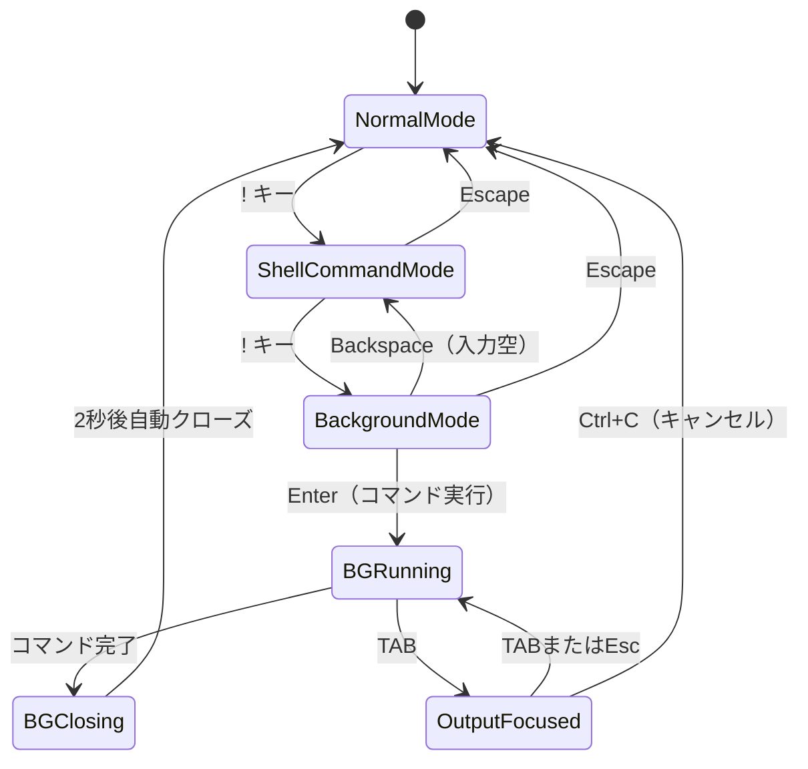

# バックグラウンドシェルコマンド実行 - 要件定義書

## 1. 概要

### 1.1 背景
現在のduofmでは `!` キーでシェルコマンドを実行できるが、フォアグラウンド実行のみ対応しており、コマンド実行中はduofmのTUIが一時停止する。長時間かかるコマンド（ビルド、ファイル転送など）の実行中もファイル操作を続けたい場面がある。

### 1.2 目的
シェルコマンドをバックグラウンドで実行し、コマンド出力をペイン内にリアルタイム表示しながら、duofmの通常操作を維持する機能を提供する。

### 1.3 スコープ
- バックグラウンドシェルコマンドの実行と出力表示
- 出力表示領域のフォーカスとキャンセル機構
- 既存シェルログとの統合

## 2. ビジネス要件

### 2.1 ビジネス目標
ファイル操作の効率向上。長時間コマンドの実行中もファイル管理作業を中断しない。

### 2.2 対象ユーザー
| ユーザータイプ | 説明 |
|----------------|------|
| duofmユーザー | シェルコマンドとファイル操作を並行して行いたいユーザー |

### 2.3 期待される効果
- コマンド実行待ち時間の有効活用
- ワークフローの中断回避

## 3. ユースケース

### 3.1 ユースケース一覧
| ID | ユースケース名 | アクター | 優先度 |
|----|----------------|----------|--------|
| UC01 | バックグラウンドコマンド実行 | ユーザー | 高 |
| UC02 | バックグラウンドコマンドキャンセル | ユーザー | 高 |
| UC03 | 実行中のファイル操作継続 | ユーザー | 高 |

### 3.2 ユースケース詳細

#### UC01: バックグラウンドコマンド実行

**アクター**: ユーザー

**事前条件**:
- duofmが通常モードで動作中
- バックグラウンドコマンドが実行中でない

**基本フロー**:
1. ユーザーが `!` を押してシェルコマンドモードに入る
2. 再度 `!` を押してバックグラウンドモードに切り替える（プロンプトがピンク色に変化）
3. コマンドを入力して Enter で実行
4. アクティブペインの下1/3に出力がリアルタイム表示される
5. コマンド完了後、2秒待ってから出力領域が自動で閉じる

**代替フロー**:
- バックグラウンドモードでBackspace（入力が空の時）: 通常シェルコマンドモードに戻る
- Escape: シェルコマンドモード自体をキャンセル

**事後条件**:
- 両ペインがリロードされる
- シェルログに出力が記録される

#### UC02: バックグラウンドコマンドキャンセル

**アクター**: ユーザー

**事前条件**:
- バックグラウンドコマンドが実行中

**基本フロー**:
1. ユーザーがTABキーで出力領域にフォーカスする
2. Ctrl+C でバックグラウンドコマンドを中断する
3. 出力領域が閉じる

**事後条件**:
- バックグラウンドプロセスが終了
- 両ペインがリロードされる

#### UC03: 実行中のファイル操作継続

**アクター**: ユーザー

**事前条件**:
- バックグラウンドコマンドが実行中

**基本フロー**:
1. ユーザーがペイン切り替え、ファイル操作等を通常通り行う
2. バックグラウンド出力はアクティブペインの下1/3に継続表示される

## 4. 機能要件

### 4.1 機能一覧
| ID | 機能名 | 説明 | 優先度 |
|----|--------|------|--------|
| F01 | バックグラウンドモード切替 | `!` → `!` でバックグラウンドモードに入る | 高 |
| F02 | バックグラウンドコマンド実行 | コマンドをバックグラウンドで実行 | 高 |
| F03 | 出力表示領域 | ペインの下1/3にリアルタイム出力表示 | 高 |
| F04 | 自動クローズ | 完了2秒後に出力領域を閉じる | 高 |
| F05 | 出力領域フォーカス | TABで出力領域にフォーカス切替 | 高 |
| F06 | コマンドキャンセル | フォーカス中Ctrl+Cでコマンド中断 | 高 |
| F07 | シェルログ統合 | バックグラウンド出力もシェルログに記録 | 中 |
| F08 | 重複実行防止 | 実行中に新規コマンド入力時は警告表示 | 中 |

### 4.2 機能詳細

#### F01: バックグラウンドモード切替

**説明**: シェルコマンドモード中に `!` を押すとバックグラウンドモードに切り替わる。プロンプトの `!` がピンク色に変化する。Backspace（入力が空の時）で通常モードに戻る。

#### F02: バックグラウンドコマンド実行

**説明**: バックグラウンドモードでEnterを押すとコマンドがバックグラウンドで実行される。TUIは一時停止せず、通常操作を継続できる。

#### F03: 出力表示領域

**説明**: コマンド実行中、アクティブペインの下1/3にリアルタイムで出力が流れる。自動スクロール（tail -f的動作）。

#### F04: 自動クローズ

**説明**: コマンド完了後、2秒間出力を表示した後、自動的に出力領域が閉じてペインが元に戻る。

## 5. 非機能要件

### 5.1 パフォーマンス要件
- 出力表示の遅延: 100ms以内
- TUI操作への影響: なし（バックグラウンド実行中も通常通りの応答速度）

### 5.2 互換性要件
- 既存の全キーバインドが影響を受けない
- 既存のフォアグラウンドシェルコマンド機能はそのまま維持
- シェルコマンド履歴（Up/Down、Ctrl+R）はバックグラウンドモードでも動作

## 6. UI/UX要件

### 6.1 画面設計要件

バックグラウンド実行中のペイン表示:
```
┌──────────────────────┐
│  ファイルリスト       │  ← 上2/3（通常操作可能）
│  file1.txt           │
│  file2.go            │
│  dir/                │
├──────────────────────┤
│  $ make build        │  ← 下1/3（BG出力領域）
│  Building...         │
│  go build ./...      │
│  Done.               │
└──────────────────────┘
```

### 6.2 状態遷移


## 7. 制約条件

### 7.1 技術的制約
- 同時に実行できるバックグラウンドコマンドは1つのみ
- `tea.ExecProcess` はTUIを一時停止するため使用不可、代わりにgoroutine + io.Pipe等で実装が必要
- script(1)のPTY割り当ては使えない（TUIが動作中のため）

### 7.2 ビジネス上の制約
- なし

## 8. 想定される課題とリスク

### 8.1 技術的課題
| 課題 | 影響度 | 対応策 |
|------|--------|--------|
| Bubble Tea のシングルスレッドモデルとの統合 | 高 | tea.Cmd + チャネルでメッセージパッシング |
| 出力のリアルタイム表示のバッファリング | 中 | 行単位でバッファリングし、定期的にViewを更新 |
| プロセスのクリーンアップ | 中 | context.WithCancel で確実にプロセスグループを終了 |

## 9. 成功基準

### 9.1 受け入れ基準
- [ ] `!` → `!` でバックグラウンドモードに入れる
- [ ] バックグラウンドモードのプロンプトがピンク色で表示される
- [ ] Backspaceで通常モードに戻れる
- [ ] バックグラウンドでコマンドが実行される
- [ ] 出力がペインの下1/3にリアルタイム表示される
- [ ] コマンド完了後2秒で出力領域が自動クローズする
- [ ] TABで出力領域にフォーカスできる
- [ ] フォーカス中Ctrl+Cでコマンドをキャンセルできる
- [ ] 実行中にペイン切り替え・ファイル操作が全て可能
- [ ] シェルログに出力が記録される
- [ ] 既存機能に影響なし

## 10. 確認事項

### 10.1 確認済み事項
- [x] バックグラウンドモードの発動方法: `!` → `!` でピンク色プロンプト
- [x] 通常モードへの復帰: Backspace（入力空時）
- [x] 出力表示領域: アクティブペインの下1/3
- [x] 自動クローズ: 完了後2秒
- [x] スクロール: 自動スクロール（tail -f的）
- [x] キャンセル: TABでフォーカス → Ctrl+C
- [x] フォーカス中の操作: Ctrl+Cのみ（スクロール操作不要）
- [x] 重複実行: ステータスバーに警告表示で拒否
- [x] 実行ディレクトリ: 入力時のアクティブペインのディレクトリ
- [x] シェルログ統合: バックグラウンド出力もCtrl+Lで参照可能
- [x] 同時実行制限: 1コマンドのみ

### 10.2 未確認・保留事項
- なし

## 11. 参考資料

- 既存シェルコマンド仕様: `doc/tasks/shell-command-execution/SPEC.md`
- シェルコマンド拡張仕様: `doc/tasks/shell-command-enhancement/SPEC.md`
- 現在の実装: `internal/ui/exec.go`, `internal/ui/model_update_keyboard.go`
