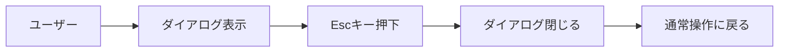
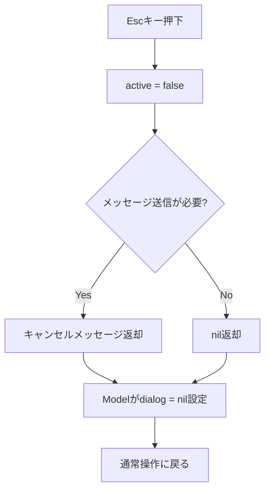
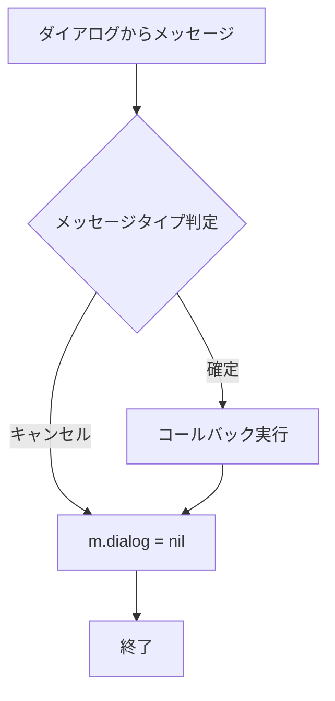

# パーミッション変更ダイアログのフリーズバグ修正 - 要件定義書

## 1. 概要

### 1.1 背景
パーミッション変更ダイアログを表示した後、Escキーでダイアログを閉じると、アプリケーション全体が操作不能な状態になる重大なバグが報告されました。ユーザーはCtrl+Cでも終了できず、`pkill duofm`での強制終了を余儀なくされています。

### 1.2 目的
- パーミッション変更ダイアログのEscキー処理を修正し、正常にダイアログを閉じられるようにする
- 同様の問題を持つ他のダイアログも調査・修正する
- ダイアログ終了後の動作を確実にテストするためのE2Eテストを追加する
- 再発防止のため、ダイアログ実装のベストプラクティスを確立する

### 1.3 スコープ
- パーミッション変更ダイアログ（PermissionDialog）の修正
- 再帰的パーミッション変更ダイアログ（RecursivePermDialog）の修正
- 入力ダイアログ（InputDialog）の修正
- その他、同様の問題を持つ可能性のあるダイアログの調査と修正
- ダイアログ終了後の動作確認を含むE2Eテストの追加

## 2. ビジネス要件

### 2.1 ビジネス目標
- アプリケーションの信頼性と安定性を向上させる
- ユーザーがパーミッション変更操作を安心して使用できるようにする
- 強制終了によるデータ損失やワークフロー中断のリスクを排除する

### 2.2 対象ユーザー
| ユーザータイプ | 説明 |
|----------------|------|
| 全ユーザー | duofmを使用する全てのユーザー |
| パワーユーザー | パーミッション変更を頻繁に行うユーザー |

### 2.3 期待される効果
- ユーザーエクスペリエンスの大幅な改善
- バグによるユーザーの不満とサポートコストの削減
- アプリケーションの品質と信頼性の向上

## 3. ユースケース

### 3.1 ユースケース一覧
| ID | ユースケース名 | アクター | 優先度 |
|----|----------------|----------|--------|
| UC01 | パーミッション変更のキャンセル | ユーザー | 高 |
| UC02 | 再帰的パーミッション変更のキャンセル | ユーザー | 高 |
| UC03 | 入力ダイアログのキャンセル | ユーザー | 高 |

### 3.2 ユースケース詳細

#### UC01: パーミッション変更のキャンセル

**アクター**: ユーザー

**事前条件**:
- duofmが起動している
- ファイルまたはディレクトリが選択されている

**基本フロー**:
1. ユーザーがパーミッション変更キーを押す
2. パーミッション変更ダイアログが表示される
3. ユーザーがEscキーを押す
4. ダイアログが閉じられる
5. 通常のファイルマネージャー操作に戻る

**代替フロー**:
- 3a. ユーザーが何も入力せずにEnterを押す → バリデーションエラーが表示され、ダイアログは閉じない

**事後条件**:
- ダイアログが完全に閉じられている
- 全てのキーボード入力が正常に動作する
- Ctrl+Cでアプリケーションを終了できる（ダブルプレス）
- ファイルのパーミッションは変更されていない

**ユースケース図**:


#### UC02: 再帰的パーミッション変更のキャンセル

**アクター**: ユーザー

**事前条件**:
- duofmが起動している
- ディレクトリが選択されている
- パーミッション変更ダイアログで再帰オプションが選択されている

**基本フロー**:
1. ユーザーが再帰的パーミッション変更を選択する
2. 2段階ダイアログ（ディレクトリ用・ファイル用）が表示される
3. ユーザーが第1段階または第2段階でEscキーを押す
4. ダイアログが閉じられる
5. 通常のファイルマネージャー操作に戻る

**事後条件**:
- ダイアログが完全に閉じられている
- 全てのキーボード入力が正常に動作する
- パーミッション変更は実行されていない

#### UC03: 入力ダイアログのキャンセル

**アクター**: ユーザー

**事前条件**:
- duofmが起動している
- 入力ダイアログが表示されている（ファイル作成、リネームなど）

**基本フロー**:
1. ユーザーが何らかの操作で入力ダイアログを表示する
2. ユーザーがEscキーを押す
3. ダイアログが閉じられる
4. 通常のファイルマネージャー操作に戻る

**事後条件**:
- ダイアログが完全に閉じられている
- 全てのキーボード入力が正常に動作する

## 4. 機能要件

### 4.1 機能一覧
| ID | 機能名 | 説明 | 優先度 |
|----|--------|------|--------|
| F01 | ダイアログEsc処理の修正 | Escキーでダイアログを正しく閉じる | 高 |
| F02 | ダイアログクリア処理 | ダイアログ終了時にModel.dialogをnilに設定 | 高 |
| F03 | 全ダイアログの調査 | 同様の問題を持つダイアログの特定 | 高 |
| F04 | E2Eテストの追加 | ダイアログ終了後の動作確認テスト | 中 |

### 4.2 機能詳細

#### F01: ダイアログEsc処理の修正

**説明**: Escキーが押されたときに、ダイアログが正しく終了処理を行う

**入力**:
- tea.KeyMsg: Escキーイベント

**出力**:
- Dialog: 更新されたダイアログ
- tea.Cmd: ダイアログ終了を通知するコマンド

**処理フロー**:


**ビジネスルール**:
- Escキーはダイアログをキャンセルする標準的な操作である
- キャンセル時は変更を適用せず、元の状態に戻る
- ダイアログ終了後、全ての操作が正常に動作する必要がある

**バリデーション**:
該当なし（Escキーは常に受け入れられる）

**エラーケース**:
| エラー | 条件 | 対応 |
|--------|------|------|
| ダイアログが既に非アクティブ | IsActive() == false | 何もしない（早期リターン） |

#### F02: ダイアログクリア処理

**説明**: ダイアログが終了したことをModelに通知し、Model.dialogをnilに設定する

**入力**:
- キャンセルメッセージ（各ダイアログタイプに応じた専用メッセージ）

**出力**:
- Model.dialog = nil

**処理フロー**:


**ビジネスルール**:
- ダイアログが非アクティブになった時点でModel.dialogをnilにする
- nilに設定することで、次のキー入力がダイアログに委譲されなくなる

#### F03: 全ダイアログの調査

**説明**: 同様の問題を持つ可能性のある全ダイアログを調査し、修正する

**調査対象ダイアログ**:
1. PermissionDialog - **問題あり（確認済み）**
2. RecursivePermDialog - **問題あり（確認済み）**
3. InputDialog - **問題あり（確認済み）**
4. RenameInputDialog - **要調査**
5. BookmarkDialog - **要調査**
6. ArchiveNameDialog - **要調査**
7. CompressionLevelDialog - **要調査**
8. ArchiveProgressDialog - **要調査**
9. ConfirmDialog - **問題なし（正しく実装されている）**
10. ErrorDialog - **要調査**
11. HelpDialog - **要調査**
12. SortDialog - **要調査**
13. CompressFormatDialog - **要調査**
14. OverwriteDialog - **要調査**
15. ContextMenuDialog - **要調査**

**調査基準**:
- Escキー処理でactive = falseにしているか
- キャンセルメッセージを返しているか
- Modelがメッセージを受け取ってdialog = nilに設定しているか

#### F04: E2Eテストの追加

**説明**: ダイアログを閉じた後の動作を確実にテストする

**テストシナリオ**:
1. ダイアログ表示
2. Escキーでキャンセル
3. ダイアログが閉じられることを確認
4. 通常のキー操作が動作することを確認
5. Ctrl+Cでアプリケーションが終了できることを確認

## 5. 非機能要件

### 5.1 パフォーマンス要件
- ダイアログの開閉はユーザーが遅延を感じない速度（< 100ms）で動作すること

### 5.2 セキュリティ要件
- 該当なし

### 5.3 可用性要件
- バグ修正後、ダイアログのキャンセル操作は100%成功すること
- Ctrl+Cによる終了は常に動作すること

### 5.4 保守性要件
- ダイアログ実装のベストプラクティスをドキュメント化する
- 新しいダイアログを追加する際のガイドラインを作成する
- コードレビューチェックリストにダイアログの正しい終了処理を含める

### 5.5 互換性要件
- 既存のダイアログ動作と互換性を保つこと（ConfirmDialogなど正しく動作しているダイアログ）

## 6. UI/UX要件

### 6.1 画面設計要件
- Escキーでのキャンセルは直感的な操作であり、ユーザーの期待通りに動作すること
- ダイアログが閉じられた後、視覚的なフィードバックがあること（ダイアログが消える）
- ダイアログ終了後、カーソル位置やペインの状態が保持されること

### 6.2 レスポンシブ対応
- 該当なし（TUIアプリケーション）

## 7. データ要件

### 7.1 データモデル概要
該当なし（データ永続化は不要）

## 8. 外部連携

該当なし

## 9. 制約条件

### 9.1 技術的制約
- Bubble Teaフレームワークのメッセージングモデルに従う必要がある
- 既存のダイアログインターフェースとの互換性を保つ必要がある

### 9.2 ビジネス上の制約
- 既存の動作しているダイアログの動作を変更しない

### 9.3 スケジュール制約
- 重大なバグのため、早急な修正が必要

## 10. 想定される課題とリスク

### 10.1 技術的課題
| 課題 | 影響度 | 対応策 |
|------|--------|--------|
| 各ダイアログで異なるメッセージタイプが使用されている | 中 | 各ダイアログに適したメッセージタイプを使用する。共通化は将来の改善として検討 |
| E2Eテストの実装方法 | 低 | Bubble Teaのテストパターンに従い、メッセージシーケンスをテストする |

### 10.2 ビジネスリスク
| リスク | 発生確率 | 影響度 | 対応策 |
|--------|----------|--------|--------|
| 修正により他のダイアログに影響が出る | 低 | 高 | 十分なテストを実施し、全ダイアログの動作を確認する |
| ユーザーが期待する動作と異なる | 低 | 中 | ConfirmDialogの動作を参考に、標準的な実装パターンを踏襲する |

## 11. 成功基準

### 11.1 受け入れ基準
- [x] パーミッション変更ダイアログでEscキーを押すと、ダイアログが閉じられる
- [x] ダイアログ終了後、全てのキーボード入力が正常に動作する
- [x] ダイアログ終了後、Ctrl+C（ダブルプレス）でアプリケーションを終了できる
- [x] 再帰的パーミッション変更ダイアログでも同様に動作する
- [x] 入力ダイアログでも同様に動作する
- [x] 既存の正しく動作しているダイアログ（ConfirmDialogなど）が影響を受けない
- [x] ダイアログ終了後の動作確認を含むテストが追加されている

### 11.2 KPI
| 指標 | 目標値 | 測定方法 |
|------|--------|----------|
| ダイアログ終了成功率 | 100% | ユニットテストおよびE2Eテストの成功率 |
| ユーザー報告のフリーズバグ | 0件 | ユーザーフィードバック |
| テストカバレッジ | 95%以上 | go test -cover |

## 12. テストシナリオ

### 12.1 テスト観点
- [x] 正常系: Escキーでダイアログをキャンセル
- [x] 正常系: Enterキーでダイアログを確定
- [x] 正常系: ダイアログ終了後の通常操作
- [x] 正常系: ダイアログ終了後のCtrl+C動作
- [x] 異常系: ダイアログが既に非アクティブの場合
- [x] 境界値: 複数のダイアログを連続して開閉
- [x] 回帰テスト: 既存の正しく動作しているダイアログ

### 12.2 ユニットテストシナリオ

#### PermissionDialog
1. **正常系: Escキーでキャンセル**
   - 入力: tea.KeyMsg{Type: tea.KeyEsc}
   - 期待: IsActive() == false、メッセージが返される

2. **正常系: Enterキーで確定（有効な入力）**
   - 入力: "755"を入力後、tea.KeyMsg{Type: tea.KeyEnter}
   - 期待: IsActive() == false、onConfirmコールバックが実行される

3. **異常系: Enterキーで確定（無効な入力）**
   - 入力: "999"を入力後、tea.KeyMsg{Type: tea.KeyEnter}
   - 期待: IsActive() == true、エラーメッセージが表示される

#### RecursivePermDialog
1. **正常系: 第1段階でEscキーキャンセル**
   - 入力: tea.KeyMsg{Type: tea.KeyEsc}
   - 期待: IsActive() == false

2. **正常系: 第2段階でEscキーキャンセル**
   - 入力: 第1段階でEnter後、tea.KeyMsg{Type: tea.KeyEsc}
   - 期待: IsActive() == false

#### InputDialog
1. **正常系: Escキーでキャンセル**
   - 入力: tea.KeyMsg{Type: tea.KeyEsc}
   - 期待: IsActive() == false

2. **異常系: 空入力でEnter**
   - 入力: tea.KeyMsg{Type: tea.KeyEnter}（空の状態）
   - 期待: IsActive() == true、エラーメッセージが表示される

### 12.3 統合テストシナリオ

1. **シナリオ: パーミッション変更のキャンセル**
   ```
   1. パーミッション変更キーを押す
   2. ダイアログが表示される（m.dialog != nil）
   3. Escキーを押す
   4. ダイアログが閉じる（m.dialog == nil）
   5. 'j'キーを押す
   6. カーソルが下に移動する（正常動作確認）
   7. Ctrl+Cを2回押す
   8. アプリケーションが終了する
   ```

2. **シナリオ: 複数ダイアログの連続開閉**
   ```
   1. パーミッション変更ダイアログを開く
   2. Escでキャンセル
   3. 削除確認ダイアログを開く
   4. 'n'でキャンセル
   5. ヘルプダイアログを開く
   6. Escで閉じる
   7. 通常操作が可能なことを確認
   ```

### 12.4 E2Eテストシナリオ

```go
// E2Eテストの例（コンセプト）
func TestPermissionDialogCancelE2E(t *testing.T) {
    // 1. モデル作成
    m := NewModel()

    // 2. ダイアログ表示
    m, _ = m.handlePermission()
    assert.NotNil(t, m.dialog)

    // 3. Escキー送信
    m, _ = m.Update(tea.KeyMsg{Type: tea.KeyEsc})

    // 4. ダイアログが閉じられることを確認
    assert.Nil(t, m.dialog)

    // 5. 通常操作が可能なことを確認
    m, _ = m.Update(tea.KeyMsg{Type: tea.KeyRunes, Runes: []rune{'j'}})
    // カーソルが移動したことを確認

    // 6. Ctrl+Cが動作することを確認
    m, cmd := m.Update(tea.KeyMsg{String: "ctrl+c"})
    assert.True(t, m.ctrlCPending)

    m, cmd = m.Update(tea.KeyMsg{String: "ctrl+c"})
    // cmd == tea.Quit であることを確認
}
```

## 13. 用語定義

| 用語 | 定義 |
|------|------|
| ダイアログフリーズ | ダイアログを閉じた後、全てのキー入力が効かなくなる現象 |
| Bubble Tea | Go言語のTUIフレームワーク。The Elm Architectureに基づく |
| Model | アプリケーションの状態を保持する構造体 |
| Dialog | モーダルダイアログのインターフェース |
| active | ダイアログがアクティブ（キー入力を受け付ける）状態を示すフラグ |
| tea.Cmd | Bubble Teaのコマンド。非同期処理やメッセージ送信に使用 |
| tea.Msg | Bubble Teaのメッセージ。イベントやデータを伝達 |

## 14. 確認事項

### 14.1 確認済み事項

- [x] **問題の再現手順**: パーミッション変更ダイアログを表示→Escで閉じる→操作不能
- [x] **操作不能の詳細**: キーボード入力が全く効かない、画面表示は正常、Ctrl+Cも効かない
- [x] **強制終了方法**: pkill duofmで強制終了が必要
- [x] **期待される動作**: Escキーでダイアログがキャンセルされ、変更を加えずに元の画面に戻る
- [x] **追加要望**: ダイアログのE2Eテストでは、ダイアログを閉じた後の挙動も確認するテストを追加

### 14.2 未確認・保留事項
- [ ] 他のダイアログでも同様の問題があるか（実装中に調査）
- [ ] Enterキーでのパーミッション変更確定は正常に動作するか（実装中に確認）

## 15. 参考資料

- Bubble Tea公式ドキュメント: https://github.com/charmbracelet/bubbletea
- ConfirmDialogの正しい実装例: `internal/ui/confirm_dialog.go`
- 問題のあるPermissionDialogの実装: `internal/ui/permission_dialog.go`
