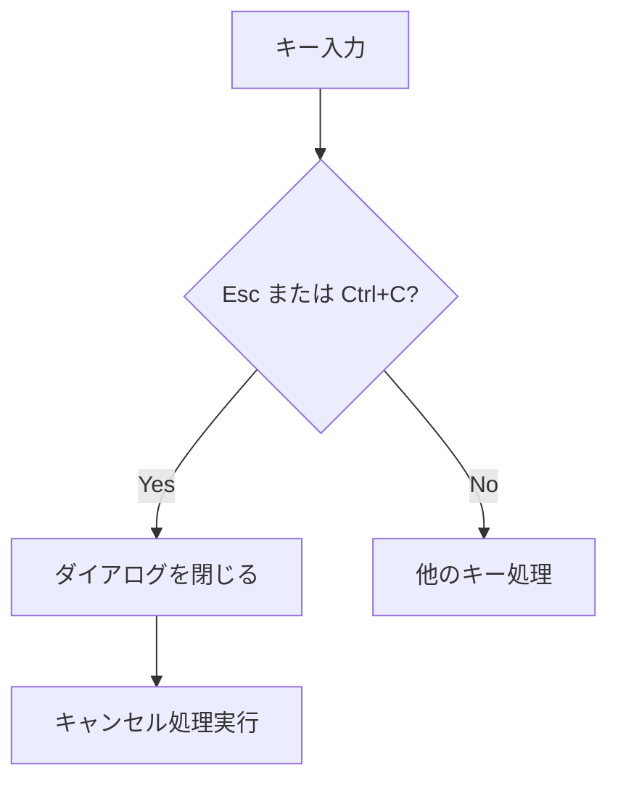

# キャンセル操作キーの統一 - 要件定義書

## 1. 概要

### 1.1 背景
duofmの各種ダイアログおよびインライン機能において、キャンセル操作に使用できるキーが統一されていない。一部のダイアログはEscのみ、一部はEsc/Ctrl+C両方、一部はEsc/qに対応しており、ユーザーが混乱する原因となっている。

### 1.2 目的
全てのダイアログおよびインライン機能で、Esc/Ctrl+C両方でキャンセル操作を可能にし、一貫したUXを提供する。

### 1.3 スコープ
- 全てのダイアログコンポーネントのキーハンドリング統一
- インライン機能（インクリメンタルサーチ、シェルコマンドモード）は既に対応済みのため対象外

## 2. ビジネス要件

### 2.1 ビジネス目標
ユーザーがキャンセル操作を行う際に、どのキーを使用すべきか迷わない一貫したインターフェースを提供する。

### 2.2 対象ユーザー
| ユーザータイプ | 説明 |
|----------------|------|
| ファイルマネージャー利用者 | TUIファイルマネージャーを日常的に使用するユーザー |
| Vimユーザー | Escキーでのキャンセルに慣れているユーザー |
| ターミナルユーザー | Ctrl+Cでの操作中断に慣れているユーザー |

### 2.3 期待される効果
- ユーザーの操作学習コストの削減
- 一貫したUXによるユーザー満足度の向上
- キーバインドに関する問い合わせの減少

## 3. ユースケース

### 3.1 ユースケース一覧
| ID | ユースケース名 | アクター | 優先度 |
|----|----------------|----------|--------|
| UC01 | ダイアログをEscでキャンセル | ユーザー | 高 |
| UC02 | ダイアログをCtrl+Cでキャンセル | ユーザー | 高 |

### 3.2 ユースケース詳細

#### UC01: ダイアログをEscでキャンセル

**アクター**: ユーザー

**事前条件**:
- ダイアログが表示されている

**基本フロー**:
1. ユーザーがEscキーを押す
2. ダイアログが閉じる
3. 元の画面に戻る

**事後条件**:
- ダイアログが閉じている
- ダイアログでの操作はキャンセルされている

#### UC02: ダイアログをCtrl+Cでキャンセル

**アクター**: ユーザー

**事前条件**:
- ダイアログが表示されている

**基本フロー**:
1. ユーザーがCtrl+Cを押す
2. ダイアログが閉じる
3. 元の画面に戻る

**事後条件**:
- ダイアログが閉じている
- ダイアログでの操作はキャンセルされている

## 4. 機能要件

### 4.1 機能一覧
| ID | 機能名 | 説明 | 優先度 |
|----|--------|------|--------|
| F01 | Escキーでのキャンセル | 全ダイアログでEscキーによるキャンセルを可能にする | 高 |
| F02 | Ctrl+Cでのキャンセル | 全ダイアログでCtrl+Cによるキャンセルを可能にする | 高 |

### 4.2 機能詳細

#### F01/F02: キャンセルキーの統一

**説明**: 全てのダイアログコンポーネントで、EscキーおよびCtrl+Cの両方でキャンセル操作を受け付ける。

**対象ダイアログ（Ctrl+C追加が必要）**:
| ダイアログ | ファイル | 現状 | 変更内容 |
|------------|----------|------|----------|
| InputDialog | input_dialog.go | Escのみ | Ctrl+C追加 |
| PathJumpDialog | path_jump_dialog.go | Escのみ | Ctrl+C追加 |
| ArchiveNameDialog | archive_name_dialog.go | Escのみ | Ctrl+C追加 |
| RecursivePermDialog | recursive_perm_dialog.go | Escのみ | Ctrl+C追加 |
| BookmarkDialog | bookmark_dialog.go | Escのみ | Ctrl+C追加 |
| RegexSearchDialog | regex_search_dialog.go | Escのみ | Ctrl+C追加 |
| RenameInputDialog | rename_input_dialog.go | Escのみ | Ctrl+C追加 |
| ArchiveProgressDialog | archive_progress_dialog.go | Escのみ | Ctrl+C追加 |
| CompressionLevelDialog | compression_level_dialog.go | Escのみ | Ctrl+C追加 |
| PermissionErrorReportDialog | permission_error_report_dialog.go | Escのみ | Ctrl+C追加 |
| PermissionDialog | permission_dialog.go | Escのみ | Ctrl+C追加 |
| QuerySearchDialog | query_search_dialog.go | Escのみ | Ctrl+C追加 |
| ExtensionRenameDialog | extension_rename_dialog.go | Escのみ | Ctrl+C追加 |
| TrashDialog | trash_dialog.go | Esc/q | Ctrl+C追加、q削除 |
| SortDialog | sort_dialog.go | Esc/q | Ctrl+C追加、q削除 |
| ArchiveWarningDialog | archive_warning_dialog.go | Esc/n/y | Ctrl+C追加、n/y削除 |

**対象外（既に対応済み）**:
| ダイアログ | ファイル | 現状 |
|------------|----------|------|
| ConfirmDialog | confirm_dialog.go | Esc/Ctrl+C対応済み |
| ErrorDialog | error_dialog.go | Esc/Ctrl+C対応済み |
| HelpDialog | help_dialog.go | Esc/Ctrl+C対応済み |
| ContextMenuDialog | context_menu_dialog.go | Esc/Ctrl+C対応済み |
| PermissionProgressDialog | permission_progress_dialog.go | Esc/Ctrl+C対応済み |

**既存キーバインドの扱い**:
- TrashDialogとSortDialogのqキーは削除（Esc/Ctrl+Cに統一）
- ArchiveWarningDialogのn/yキーは削除（Tab/Arrowでボタン選択、Enterで確定、Esc/Ctrl+Cでキャンセルに統一）

**入力**:
- キーイベント: Esc または Ctrl+C

**出力**:
- ダイアログが閉じる
- キャンセルを示すメッセージまたはコマンドが発行される

**処理フロー**:

## 5. 非機能要件

### 5.1 パフォーマンス要件
- キー入力からダイアログ閉じるまでの遅延: 体感できないレベル（<50ms）

### 5.2 互換性要件
- 既存のEscキーによるキャンセル動作を維持
- レガシーキー（q, y, n）は削除しUXを統一

### 5.3 保守性要件
- 各ダイアログでのキャンセル処理は同一パターンで実装

## 6. テストシナリオ

### 6.1 テスト観点
- [ ] 正常系: 各ダイアログでEscキーによりキャンセルできる
- [ ] 正常系: 各ダイアログでCtrl+Cによりキャンセルできる
- [ ] 正常系: ArchiveWarningDialogでTab/Arrowでボタン選択、Enterで確定できる
- [ ] 正常系: キャンセル後、ダイアログの変更内容は適用されない

## 7. 確認事項

### 7.1 確認済み事項

- [x] キャンセルキーの統一方針: Esc/Ctrl+C両方で全ダイアログをキャンセル可能にする
- [x] 既存キーの扱い: TrashDialog/SortDialogのqキー、ArchiveWarningDialogのn/yキーは削除（UX統一のため）

### 7.2 未確認・保留事項
- なし
