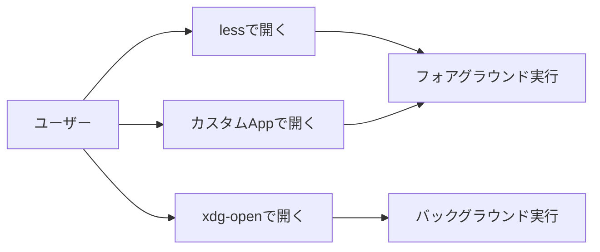
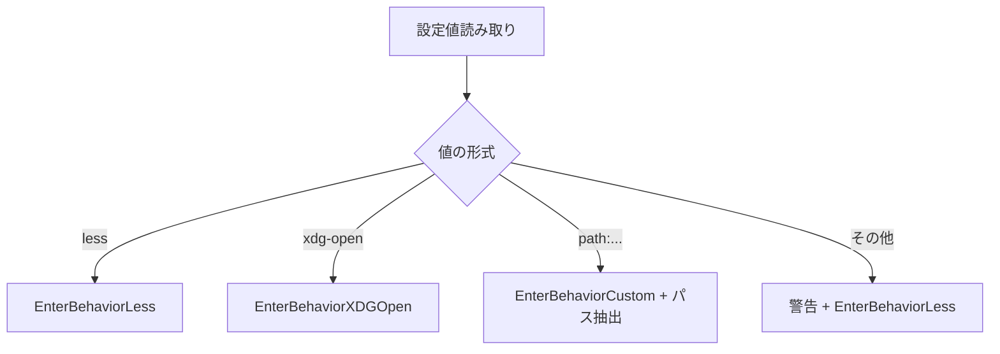
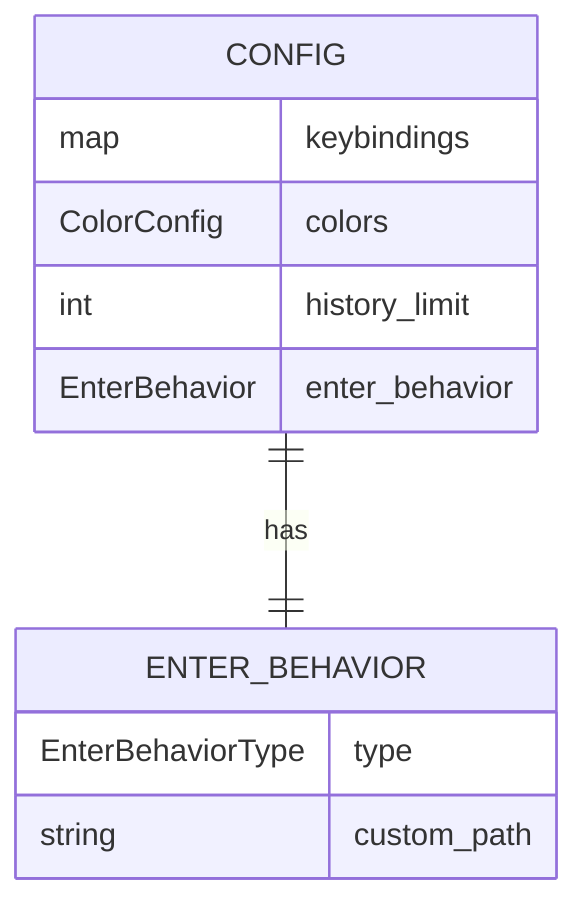

# Enterキー挙動の設定ファイル制御 - 要件定義書

## 1. 概要

### 1.1 背景
現在のduofmでは、ファイルにカーソルを合わせてEnterキーを押すとlessで開く挙動（openWithViewer）が実装されている。この挙動はVキーと同一であり、独立した設定ができない。ユーザーによっては、Enterキーでxdg-openを使用してファイルを開きたい、または独自のアプリケーションで開きたいといったニーズがある。

### 1.2 目的
- Enterキーの挙動をVキー（view）から独立させる
- Enterキーでファイルを開く際のアプリケーションを設定ファイルで指定可能にする
- デフォルトの挙動は現行（less）を維持し、後方互換性を確保する

### 1.3 スコープ
- 設定ファイル（~/.config/duofm/config.toml）への新規設定項目の追加
- Enterキーでファイルを開く際の挙動変更
- 設定値に応じた実行モード（フォアグラウンド/バックグラウンド）の自動判定

## 2. ビジネス要件

### 2.1 ビジネス目標
- ユーザーが好みのアプリケーションでファイルを開けるようにする
- ファイルマネージャーとしての柔軟性を向上させる

### 2.2 対象ユーザー
| ユーザータイプ | 説明 |
|----------------|------|
| 一般ユーザー | デフォルト（less）で問題なく使用 |
| パワーユーザー | xdg-openやカスタムアプリケーションで開きたい |
| 開発者 | エディタや特定のビューアで直接開きたい |

### 2.3 期待される効果
- ユーザーエクスペリエンスの向上
- 作業効率の改善（目的のアプリケーションで直接開ける）
- 設定のカスタマイズ性向上

## 3. ユースケース

### 3.1 ユースケース一覧
| ID | ユースケース名 | アクター | 優先度 |
|----|----------------|----------|--------|
| UC01 | lessでファイルを開く（デフォルト） | ユーザー | 高 |
| UC02 | xdg-openでファイルを開く | ユーザー | 高 |
| UC03 | カスタムアプリケーションでファイルを開く | ユーザー | 中 |

### 3.2 ユースケース詳細

#### UC01: lessでファイルを開く（デフォルト）

**アクター**: ユーザー

**事前条件**:
- 設定ファイルに`enter_behavior`が未設定、または`less`に設定されている
- ファイルにカーソルが合っている

**基本フロー**:
1. ユーザーがファイル上でEnterキーを押す
2. duofmがTUIを一時停止する
3. lessでファイルを開く（フォアグラウンド実行）
4. lessを終了すると、duofmが復帰する

**代替フロー**:
- ファイルの読み取り権限がない場合、エラーメッセージを表示

**事後条件**:
- duofmのTUIが正常に復帰している
- カーソル位置が維持されている

#### UC02: xdg-openでファイルを開く

**アクター**: ユーザー

**事前条件**:
- 設定ファイルに`enter_behavior = "xdg-open"`が設定されている
- ファイルにカーソルが合っている

**基本フロー**:
1. ユーザーがファイル上でEnterキーを押す
2. xdg-openでファイルを開く（バックグラウンド実行）
3. duofmは即座に操作可能な状態に戻る
4. 関連付けられたアプリケーションが別ウィンドウで起動

**代替フロー**:
- xdg-openが見つからない場合、エラーメッセージを表示
- ファイルに関連付けられたアプリケーションがない場合、xdg-openのエラーがステータスに表示される

**事後条件**:
- duofmは操作可能な状態
- 外部アプリケーションが起動している（または起動エラー）

#### UC03: カスタムアプリケーションでファイルを開く

**アクター**: ユーザー

**事前条件**:
- 設定ファイルに`enter_behavior = "path:/path/to/app"`が設定されている
- ファイルにカーソルが合っている

**基本フロー**:
1. ユーザーがファイル上でEnterキーを押す
2. duofmがTUIを一時停止する
3. 指定されたアプリケーションでファイルを開く（フォアグラウンド実行）
4. アプリケーションを終了すると、duofmが復帰する

**代替フロー**:
- 指定されたパスが存在しない場合、エラーメッセージを表示
- アプリケーションに実行権限がない場合、エラーメッセージを表示

**事後条件**:
- duofmのTUIが正常に復帰している
- カーソル位置が維持されている

**ユースケース図**:


## 4. 機能要件

### 4.1 機能一覧
| ID | 機能名 | 説明 | 優先度 |
|----|--------|------|--------|
| F01 | 設定項目の追加 | config.tomlに`enter_behavior`設定を追加 | 高 |
| F02 | 設定値の解析 | `less`, `xdg-open`, `path:...`形式の解析 | 高 |
| F03 | 実行モード判定 | 設定値に応じた実行モードの自動選択 | 高 |
| F04 | Enterキーハンドラ変更 | 新しい設定に基づく挙動実装 | 高 |
| F05 | デフォルト値設定 | 未設定時は`less`として動作 | 高 |

### 4.2 機能詳細

#### F01: 設定項目の追加

**説明**: config.tomlに新しい設定項目`enter_behavior`を追加する

**入力**:
- 設定ファイル: ~/.config/duofm/config.toml

**出力**:
- 解析された設定値（EnterBehavior構造体）

**設定形式**:
```toml
# Enter key behavior when opening files
# Options: "less", "xdg-open", "path:/path/to/application"
enter_behavior = "less"
```

**ビジネスルール**:
- 未設定の場合はデフォルト値`less`を使用
- 不正な値の場合は警告を出力し、デフォルト値を使用

**バリデーション**:
| 項目 | ルール | エラーメッセージ |
|------|--------|------------------|
| enter_behavior | `less`, `xdg-open`, または`path:`で始まる文字列 | Warning: invalid enter_behavior value, using default |

**エラーケース**:
| エラー | 条件 | 対応 |
|--------|------|------|
| 不正な値 | 認識できない形式 | 警告を出力し、デフォルトを使用 |
| path:後が空 | `path:`のみで終わっている | 警告を出力し、デフォルトを使用 |

#### F02: 設定値の解析

**説明**: 設定値を解析し、内部表現に変換する

**処理フロー**:


#### F03: 実行モード判定

**説明**: 設定値に応じてフォアグラウンド/バックグラウンド実行を自動判定

**実行モード対応表**:
| 設定値 | 実行モード | 説明 |
|--------|-----------|------|
| `less` | フォアグラウンド | duofmを一時停止、less終了後に復帰 |
| `xdg-open` | バックグラウンド | duofmは即座に操作可能に戻る |
| `path:...` | フォアグラウンド | duofmを一時停止、アプリ終了後に復帰 |

#### F04: Enterキーハンドラ変更

**説明**: handleEnter()関数を修正し、設定に基づく挙動を実装

**現在の実装**:
```go
func (m Model) handleEnter() (tea.Model, tea.Cmd) {
    // ...ファイルの場合
    return m, openWithViewer(fullPath, m.getActivePane().Path())
}
```

**変更後の実装概要**:
```go
func (m Model) handleEnter() (tea.Model, tea.Cmd) {
    // ...ファイルの場合
    switch m.config.EnterBehavior.Type {
    case EnterBehaviorLess:
        return m, openWithViewer(fullPath, workDir)
    case EnterBehaviorXDGOpen:
        return m, openWithXDG(fullPath, workDir)
    case EnterBehaviorCustom:
        return m, openWithCustomForeground(m.config.EnterBehavior.Path, fullPath, workDir)
    }
}
```

## 5. 非機能要件

### 5.1 パフォーマンス要件
- 設定値の解析は起動時に1回のみ実行
- Enterキー押下時の応答は即座（設定値参照のみ）

### 5.2 セキュリティ要件
- 認証: 不要（ローカルアプリケーション）
- 認可: ファイルシステムの権限に従う
- データ保護: 不要
- 入力検証: `path:`形式の値は空でないことを検証

### 5.3 可用性要件
- 不正な設定値でもアプリケーションは正常に起動する
- デフォルト値へのフォールバックにより、設定ミスでも使用可能

### 5.4 保守性要件
- ログ出力: 設定値解析時の警告をwarningsリストに追加
- 監視: 不要
- ドキュメント: config.tomlテンプレートにコメントで説明を追加

### 5.5 互換性要件
- 既存の設定ファイルとの後方互換性を維持
- 設定項目が存在しない場合はデフォルト動作（less）

## 6. UI/UX要件

### 6.1 画面設計要件
- UIの変更は不要
- エラーメッセージはステータスバーに表示

### 6.2 キー操作（変更なし）
| キー | 動作 |
|------|------|
| Enter | 設定に基づいてファイルを開く（ディレクトリは移動） |
| V | 常にlessで開く（変更なし） |
| E | 常にエディタで開く（変更なし） |

## 7. データ要件

### 7.1 データモデル概要



### 7.2 データ項目
| エンティティ | 項目名 | 型 | 必須 | 説明 |
|--------------|--------|-----|------|------|
| Config | enter_behavior | *EnterBehavior | x | Enterキーの挙動設定 |
| EnterBehavior | Type | EnterBehaviorType | o | 挙動タイプ（列挙型） |
| EnterBehavior | CustomPath | string | x | カスタムアプリパス（path:の場合のみ） |

### 7.3 EnterBehaviorType列挙型
| 値 | 説明 |
|----|------|
| EnterBehaviorLess | lessで開く |
| EnterBehaviorXDGOpen | xdg-openで開く |
| EnterBehaviorCustom | カスタムアプリで開く |

## 8. 外部連携

### 8.1 連携システム
| システム名 | 連携方法 | データ |
|------------|----------|--------|
| less (pager) | プロセス実行 | ファイルパス |
| xdg-open | プロセス実行（バックグラウンド） | ファイルパス |
| カスタムアプリ | プロセス実行 | ファイルパス |

## 9. 制約条件

### 9.1 技術的制約
- フォアグラウンド実行にはBubble Teaの`tea.ExecProcess`を使用
- バックグラウンド実行には`exec.Command().Start()`を使用（既存のopenWithXDG実装を参照）

### 9.2 ビジネス上の制約
- デフォルト動作を変更しない（後方互換性）

### 9.3 スケジュール制約
- なし

## 10. 想定される課題とリスク

### 10.1 技術的課題
| 課題 | 影響度 | 対応策 |
|------|--------|--------|
| 設定マージ対応 | 中 | merger.goに新規設定項目を追加 |

### 10.2 ビジネスリスク
| リスク | 発生確率 | 影響度 | 対応策 |
|--------|----------|--------|--------|
| ユーザー混乱（EnterとVの違い） | 低 | 低 | ヘルプ画面での説明追加 |

## 11. 成功基準

### 11.1 受け入れ基準
- [ ] `enter_behavior = "less"`でlessが起動する
- [ ] `enter_behavior = "xdg-open"`でxdg-openがバックグラウンド実行される
- [ ] `enter_behavior = "path:/usr/bin/vim"`で指定アプリがフォアグラウンド実行される
- [ ] 設定未記載時はlessで動作する
- [ ] 不正な設定値で警告が出力され、lessで動作する
- [ ] Vキーの動作は従来通り維持される

### 11.2 KPI
| 指標 | 目標値 | 測定方法 |
|------|--------|----------|
| 既存テストの成功 | 100% | go test ./... |
| 新規テストの追加 | 5件以上 | 新規テストケース数 |

## 12. テストシナリオ

### 12.1 テスト観点
- [ ] 正常系: `less`設定でlessが起動
- [ ] 正常系: `xdg-open`設定でxdg-openがバックグラウンド起動
- [ ] 正常系: `path:/usr/bin/cat`でcatがフォアグラウンド起動
- [ ] 異常系: 不正な設定値で警告+デフォルト動作
- [ ] 異常系: `path:`で終わる値で警告+デフォルト動作
- [ ] 異常系: 存在しないパスの指定でエラー表示
- [ ] 境界値: 空文字列の設定で警告+デフォルト動作
- [ ] 互換性: 設定未記載時にlessで動作
- [ ] 回帰: Vキーが従来通り動作

## 13. 用語定義

| 用語 | 定義 |
|------|------|
| フォアグラウンド実行 | duofmのTUIを一時停止し、外部プロセスが終了するまで待機する実行方式 |
| バックグラウンド実行 | 外部プロセスを起動後、duofmは即座に操作可能な状態に戻る実行方式 |
| pager | ファイルの内容を画面単位で表示するプログラム（less, moreなど） |
| xdg-open | Linux/Unixでファイルタイプに関連付けられたアプリケーションで開くコマンド |

## 14. 確認事項

### 14.1 確認済み事項

- [x] 現状のEnterキー挙動: lessで開く（openWithViewer関数）
- [x] 現状のVキー挙動: lessで開く（openWithViewer関数）
- [x] 設定値の形式: `less`, `xdg-open`, `path:/path/to/app`
- [x] デフォルト値: `less`
- [x] 実行モード: less=FG, xdg-open=BG, path=FG
- [x] 設定ファイルの場所: ~/.config/duofm/config.toml
- [x] 設定マージ機能の存在: merger.goで自動追記される

### 14.2 未確認・保留事項
- なし

## 15. 参考資料

- 既存実装: internal/ui/exec.go - openWithViewer, openWithXDG, openWithCustom
- 設定読み込み: internal/config/config.go - LoadConfig
- 設定マージ: internal/config/merger.go - MergeConfig
- キーハンドリング: internal/ui/model_update_keyboard.go - handleEnter
