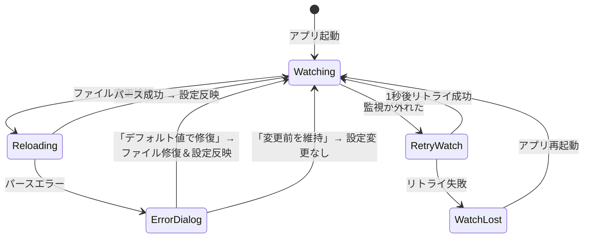

# Feature: Configuration Hot-Reload

## Overview

設定ファイル (`config.toml`) の変更をリアルタイムで検知し、アプリケーション再起動なしに全設定項目を即座に反映する。設定ファイルのパースエラー時は、エラー箇所を通知し、ユーザーに復旧方法を選択させるダイアログを表示する。

## Domain Rules

- 設定ファイルの変更検知はinotify (fsnotify) を使用する
- 監視が外れた場合は1秒後にリトライする。リトライに失敗した場合はアプリケーション再起動で復旧する
- 全ての設定項目 (keybindings, colors, history_limit, enter_behavior, enter_behavior_mime) がホットリロード対象
- エラーダイアログはアプリ起動時とホットリロード時の両方で表示する
- ホットリロード時のエラーダイアログには「変更前の設定を維持する」選択肢を含める
- 壊れた項目のみデフォルト値に置き換え、正常な項目は保持する
- 設定ファイルの修復時は、パース不能な要因を削除し、ファイルとして正しい状態にする

## Objectives

- WezTermやAlacrittyと同等の、設定画面を持たないアプリとしてのリアルタイム設定反映体験を提供する
- 設定ファイル破損時にデータ損失を最小限に抑える復旧フローを提供する
- ユーザーが設定変更の結果を即座に確認できるようにする

## User Stories

- As a user, I want to edit config.toml and see changes reflected immediately without restarting duofm
- As a user, I want to be notified when my config file has syntax errors, with the specific line number
- As a user, I want to choose between fixing broken config items with defaults or keeping my previous working config
- As a user, I want only the broken parts of my config to be replaced, preserving my other customizations

## Functional Requirements

### FR-1: ファイル監視

設定ファイルの変更をinotifyで監視する。

- FR-1.1: アプリ起動時に設定ファイルのinotify監視を開始する
- FR-1.2: ファイルの書き込み完了 (Write/Create イベント) を検知する
- FR-1.3: エディタによるrename+create操作に対応する（ファイルが再作成された場合、新しいファイルを監視対象にする）
- FR-1.4: 監視が外れた場合、1秒後に監視の再登録をリトライする
- FR-1.5: リトライ失敗時はステータスバーにエラーを表示する（アプリ再起動で復旧可能）
- FR-1.6: 設定ファイルが存在しない状態からの新規作成も検知する（親ディレクトリを監視する）

### FR-2: 設定の再読み込み

変更検知後に設定を再読み込みする。

- FR-2.1: 変更検知後、設定ファイルを再パースする
- FR-2.2: パース成功時、全設定項目を即座にアプリケーションに反映する
- FR-2.3: 反映対象: keybindings, colors, history_limit, enter_behavior, enter_behavior_mime
- FR-2.4: 設定反映後、ステータスバーに「Config reloaded」を一時表示する
- FR-2.5: 短時間に複数回の変更が発生した場合、デバウンス処理を行い最後の変更のみ反映する

### FR-3: 構文エラー時の挙動

TOMLとして構文的に不正な場合の処理。

- FR-3.1: 構文エラーの旨とエラーが検知された行番号をダイアログで通知する
- FR-3.2: エラー検知行を含む、それ以降の内容を「壊れた項目」として扱う
- FR-3.3: エラー検知行より前の内容は可能な限りパースし、正常な設定として使用する
- FR-3.4: 壊れた項目に対応する設定はデフォルト値を適用する

### FR-4: 値エラー時の挙動

TOMLとしては正しいが、duofmの期待する値と異なる場合の処理。

- FR-4.1: 不正な値を持つ項目を特定し、エラーメッセージに含める
- FR-4.2: 不正な値の項目のみデフォルト値に置き換える
- FR-4.3: 正常な値の項目はそのまま使用する

### FR-5: 起動時のエラーダイアログ

アプリ起動時に設定ファイルにエラーがある場合のダイアログ。

- FR-5.1: エラー内容（構文エラーの行番号、または不正な値の項目名）を表示する
- FR-5.2: 選択肢A「デフォルト値で修復する」: 壊れた項目をデフォルト値に置き換え、設定ファイルを書き換えてアプリを起動する
- FR-5.3: 選択肢B「アプリを終了する」: ユーザーが手動で設定ファイルを修正できるようにアプリを終了する

### FR-6: ホットリロード時のエラーダイアログ

ホットリロード時に設定ファイルにエラーがある場合のダイアログ。

- FR-6.1: エラー内容（構文エラーの行番号、または不正な値の項目名）を表示する
- FR-6.2: 選択肢A「デフォルト値で修復する」: 壊れた項目をデフォルト値に置き換え、設定ファイルを書き換えて新しい設定を適用する
- FR-6.3: 選択肢B「変更前の設定を維持する」: エラーのある変更を無視し、直前の動作中の設定を維持する
- FR-6.4: 選択肢Bを選んだ場合、設定ファイルは変更しない

### FR-7: 設定ファイルの修復

「デフォルト値で修復する」選択時のファイル書き換え処理。

- FR-7.1: 構文エラーの場合、エラー検知行以降を削除し、不足する設定項目をデフォルト値で追記する
- FR-7.2: 値エラーの場合、不正な値のみデフォルト値に書き換える
- FR-7.3: 修復後のファイルは有効なTOMLとして正しい状態にする
- FR-7.4: ユーザーのカスタマイズした正常な設定項目は保持する

## Non-Functional Requirements

- NFR-1.1: ファイル変更検知から設定反映までの遅延は体感上即座（数百ミリ秒以内）
- NFR-1.2: ファイル監視はCPU使用率に影響を与えない（ポーリングではなくinotifyを使用）
- NFR-1.3: デバウンス間隔は設定変更を即座に反映しつつ、連続保存による過剰なリロードを防ぐ適切な値とする
- NFR-2.1: ホットリロード中もアプリの操作性を維持する（UIブロックしない）
- NFR-2.2: エラーダイアログ表示中はファイル操作をブロックする（既存のダイアログ挙動に準拠）

## Interface Contract

### ファイル監視イベント

| イベント | 動作 |
|----------|------|
| ファイル書き込み (Write) | 設定再読み込みをトリガー |
| ファイル作成 (Create) | 設定再読み込みをトリガー（rename+create対応） |
| ファイル削除 (Remove) | 監視の再登録を試行 |
| ファイルリネーム (Rename) | 監視の再登録を試行 |

### 起動時エラーダイアログ

```
Configuration Error

Syntax error at line 23: unexpected character

The following settings will use default values:
  - colors (line 23 onwards)
  - enter_behavior (line 23 onwards)

[Fix with defaults]  [Quit]
```

### ホットリロード時エラーダイアログ

```
Configuration Error

Invalid value for history_limit: expected integer, got "abc"

The following settings have errors:
  - history_limit: using default (20000)

[Fix with defaults]  [Keep previous]
```

### 構文エラー時のダイアログ（ホットリロード）

```
Configuration Error

Syntax error at line 15: unexpected character

Settings from line 15 onwards could not be parsed.
These will use default values if fixed.

[Fix with defaults]  [Keep previous]
```

### エラー条件

| 条件 | 動作 |
|------|------|
| 構文エラー (起動時) | エラーダイアログ表示: 修復 or 終了 |
| 構文エラー (ホットリロード時) | エラーダイアログ表示: 修復 or 変更前維持 |
| 値エラー (起動時) | エラーダイアログ表示: 修復 or 終了 |
| 値エラー (ホットリロード時) | エラーダイアログ表示: 修復 or 変更前維持 |
| 監視が外れた | 1秒後リトライ、失敗時ステータスバーにエラー |
| 設定ファイルが削除された | 監視を継続し再作成を待つ |

### 状態遷移（ホットリロード）



## Dependencies

- fsnotify ライブラリ（inotifyベースのファイル監視）
- 既存の設定パース基盤 (`internal/config/config.go`)
- 既存のダイアログ基盤 (`internal/ui/` のダイアログパターン)
- Bubble Tea のメッセージングシステム（カスタムメッセージによる設定更新通知）

## Test Scenarios

### ファイル監視

- [ ] ファイル書き込みイベントで設定再読み込みがトリガーされる
- [ ] rename+createパターン（vim等のエディタ）で再読み込みがトリガーされる
- [ ] 監視が外れた場合、1秒後にリトライされる
- [ ] 短時間の連続変更がデバウンスされ、最終結果のみ反映される

### 設定反映

- [ ] keybindingsの変更が即座に反映される
- [ ] colorsの変更が即座に反映される
- [ ] history_limitの変更が反映される
- [ ] enter_behaviorの変更が反映される
- [ ] enter_behavior_mimeの変更が反映される
- [ ] 設定反映後「Config reloaded」がステータスバーに表示される

### 構文エラー処理

- [ ] 構文エラー時にエラー行番号がダイアログに表示される
- [ ] エラー行より前の設定は正常にパースされる
- [ ] 「デフォルト値で修復」でエラー行以降が削除され、デフォルト値で補完される
- [ ] 修復後のファイルが有効なTOMLである

### 値エラー処理

- [ ] 不正な値の項目名がダイアログに表示される
- [ ] 不正な値の項目のみデフォルト値に置き換えられる
- [ ] 正常な値の項目は維持される
- [ ] 「デフォルト値で修復」で不正な値がファイル内で書き換えられる

### 起動時エラーダイアログ

- [ ] 構文エラーのある設定ファイルで起動時にダイアログが表示される
- [ ] 「デフォルト値で修復」でファイルが修復されアプリが起動する
- [ ] 「アプリを終了する」でアプリが正常終了する

### ホットリロード時エラーダイアログ

- [ ] ホットリロード時のエラーでダイアログが表示される
- [ ] 「デフォルト値で修復」でファイルが修復され新設定が適用される
- [ ] 「変更前の設定を維持する」で設定が変更されない
- [ ] 「変更前の設定を維持する」で設定ファイルが変更されない

### エッジケース

- [ ] 設定ファイルが削除された場合、監視を継続し再作成を検知する
- [ ] 空の設定ファイルが書き込まれた場合、デフォルト設定が適用される
- [ ] 権限エラーで設定ファイルが読めない場合、適切なエラーメッセージが表示される
- [ ] ダイアログ表示中に再度ファイルが変更された場合、ダイアログ閉じた後に最新状態を反映する

## Success Criteria

- [ ] 設定ファイルの変更がアプリ再起動なしで即座に反映される
- [ ] 全設定項目 (keybindings, colors, history_limit, enter_behavior, enter_behavior_mime) がホットリロード対象である
- [ ] 構文エラー時にエラー行番号を含むダイアログが表示される
- [ ] 値エラー時に不正な項目名を含むダイアログが表示される
- [ ] 起動時エラーで「修復 or 終了」の選択肢がある
- [ ] ホットリロード時エラーで「修復 or 変更前維持」の選択肢がある
- [ ] 「修復」選択時、壊れた項目のみデフォルト値に置き換えられ、正常項目は保持される
- [ ] 修復後の設定ファイルが有効なTOMLである
- [ ] 監視が外れた場合、1秒後にリトライされる
- [ ] UIがホットリロード中にブロックされない

## Constraints

- ファイル監視はinotify (fsnotify) ベースのみ。ポーリングは使用しない
- 監視リトライは1回のみ。失敗時はアプリ再起動による復旧を前提とする
- 構文エラー時の部分パースは、エラー検知行より前の内容に限定される
