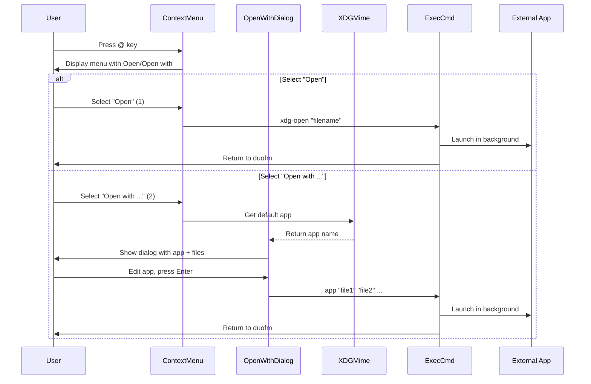
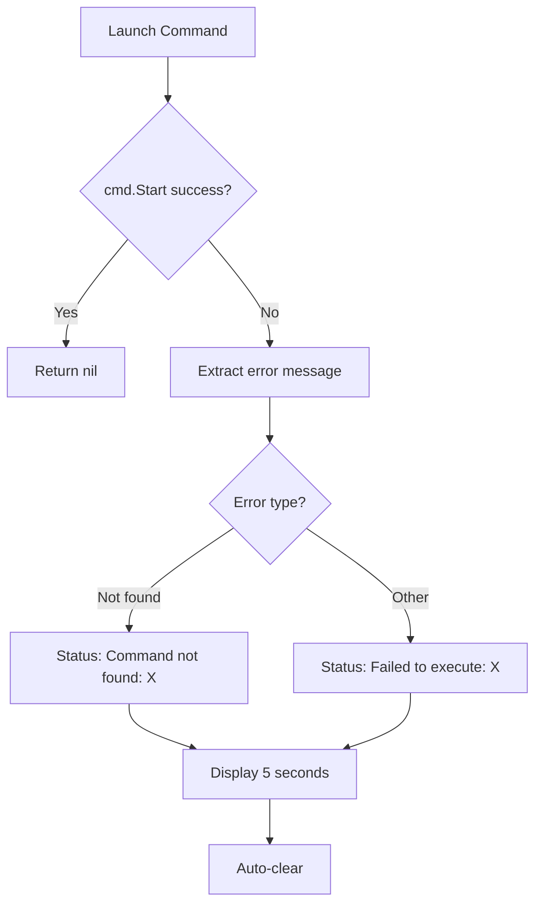

# Feature: Context Menu Open File

## Overview

Add "Open" and "Open with ..." menu items to the context menu, allowing users to open files and directories with system default applications (via xdg-open) or with user-specified applications. This feature is designed for desktop users who need to open various file types (videos, images, PDFs, etc.) with appropriate GUI applications while using duofm as their primary file manager.

## Objectives

- Provide seamless integration between duofm (TUI) and desktop GUI applications
- Enable users to open files with system default applications via xdg-open
- Allow users to specify custom applications and options for opening files
- Support batch operations for multiple marked files
- Maintain duofm's responsiveness by running applications in the background

## User Stories

### US1: Open File with System Default Application
As a desktop user, I want to press @ and select "Open" to open a file with the system's default application, so that I can quickly view videos, images, or PDFs without leaving duofm.

**Acceptance Criteria:**
- [ ] "Open" menu item appears at the top of the context menu
- [ ] Selecting "Open" launches xdg-open with the selected file
- [ ] The application opens in the background
- [ ] duofm remains operational after launching the application
- [ ] Error message is displayed if xdg-open is not available

### US2: Open File with Custom Application
As a power user, I want to press @ and select "Open with ..." to specify an application and options, so that I can open files with my preferred tools and configurations.

**Acceptance Criteria:**
- [ ] "Open with ..." menu item appears in the context menu
- [ ] A dialog appears showing the default application and file list
- [ ] I can edit the application name and add options
- [ ] The application launches with the specified files as arguments
- [ ] duofm remains operational after launching the application

### US3: Open Multiple Files with Custom Application
As a user, I want to mark multiple files and use "Open with ..." to open them all at once, so that I can efficiently work with multiple files.

**Acceptance Criteria:**
- [ ] "Open" is disabled when multiple files are marked
- [ ] "Open with ..." is enabled for multiple marked files
- [ ] All marked files are passed as separate arguments to the specified application
- [ ] File names with special characters are handled correctly by exec.Command

### US4: Open Directory in File Manager
As a desktop user, I want to open a directory with "Open" to view it in my GUI file manager (e.g., Nautilus), so that I can switch between TUI and GUI workflows seamlessly.

**Acceptance Criteria:**
- [ ] "Open" works on directories
- [ ] xdg-open launches the default file manager
- [ ] The directory is opened in the file manager
- [ ] Works for both regular directories and parent directory (..)

## Technical Requirements

### Functional Requirements

**FR1: Context Menu Integration**
- Add "Open" menu item at the top of the context menu (position 1)
- Add "Open with ..." menu item below "Open" (position 2)
- Both items are always visible in the menu
- "Open" is disabled (grayed out) when multiple files are marked
- "Open with ..." is always enabled

**FR2: Open with xdg-open**
- Execute `xdg-open` with filename as separate argument when "Open" is selected
- Use relative path to the file (from current pane directory)
- Pass filename as separate argument (exec.Command handles escaping automatically)
- Set working directory to current pane directory
- Launch process in background using Go's `exec.Command` with `cmd.Start()`
- Display error if xdg-open is not available: "Cannot open file: xdg-open not found"

**FR3: Open with Custom Application**
- Display "Open with Application" dialog when "Open with ..." is selected
- Dialog shows:
  - Application input field (editable, with horizontal scrolling)
  - Files field (read-only, showing filenames quoted for display purposes)
- Populate application field with default application from xdg-mime
- Execute application with files as separate arguments when user confirms
- Pass files as separate arguments (exec.Command handles escaping automatically)
- Launch process in background using Go's `exec.Command` with `cmd.Start()`

**FR4: Default Application Detection**
- Query MIME type: `xdg-mime query filetype <file>`
- Query default app: `xdg-mime query default <mimetype>`
- Extract application name from `.desktop` filename (remove .desktop extension)
- Use empty string if detection fails (no error)
- Only attempt for single file (not for multiple marked files or directories)

**FR5: Multiple File Support**
- "Open with ..." passes all marked files as separate arguments
- Files passed as separate arguments to exec.Command (no manual quoting needed)
- Working directory is current pane directory
- File list in dialog shows all files quoted for display, truncated with `...` if too long

### Non-Functional Requirements

**NFR1 - Performance:**
- Default application detection: < 500ms
- Command launch: < 100ms (start only, not wait)
- Dialog display: < 50ms

**NFR2 - Security:**
- File paths sanitized with `filepath.Join` and `filepath.Clean`
- Filenames passed as separate arguments to exec.Command (automatic escaping)
- Quotes used only for UI display purposes (not for execution)
- Commands executed directly via `exec.Command` (not through shell)
- Working directory set to active pane directory for proper relative path resolution
- No explicit permission checks (delegated to application)

**NFR3 - Usability:**
- Dialog provides clear instructions
- Error messages are user-friendly and specific
- Keyboard shortcuts are consistent with existing dialogs
- Application field supports Emacs-style editing keybindings

**NFR4 - Compatibility:**
- Requires xdg-utils package on Linux
- Works with X11 and Wayland desktop environments
- Graceful degradation when xdg-open is unavailable

## Implementation Approach

### Architecture

**File Structure:**
```
internal/ui/
├── context_menu_dialog.go      # MODIFY: Add Open and Open with items
├── open_with_dialog.go         # NEW: Open with dialog implementation
├── open_with_dialog_test.go    # NEW: Tests for open with dialog
├── exec.go                     # MODIFY: Add background process execution
├── model_update.go             # MODIFY: Handle open with dialog messages
└── messages.go                 # MODIFY: Add open with dialog message types
```

### Data Flow



### API Design

#### Context Menu Items

**Menu Item Structure:**
```go
// In buildMenuItems() of ContextMenuDialog
items := []MenuItem{
    {
        ID:      "open",
        Label:   "Open",
        Action:  openAction,
        Enabled: markCount == 0, // Disabled if multiple files marked
    },
    {
        ID:      "open_with",
        Label:   "Open with ...",
        Action:  openWithAction,
        Enabled: true, // Always enabled
    },
    // ... existing items (copy, move, delete, etc.)
}
```

#### Open with Dialog

**Dialog Structure:**
```go
type OpenWithDialog struct {
    BaseDialog
    title           string      // "Open with Application"
    applicationInput *TextInput  // Editable application field
    fileList        []string    // List of files to open (relative paths)
    filesDisplay    string      // Formatted file list for display
    defaultApp      string      // Default app from xdg-mime
    workDir         string      // Working directory (pane path)
    errorMsg        string      // Error message if any
    styles          DialogStyles
}
```

**Dialog Messages:**
```go
type openWithDialogResultMsg struct {
    application string   // Application name with options
    files       []string // Files to open
    workDir     string   // Working directory
    cancelled   bool     // True if cancelled
}
```

#### Background Process Execution

**Function Signature:**
```go
// openWithCommand launches an application in the background
// Returns tea.Cmd that sends openWithFinishedMsg on completion/error
func openWithCommand(application string, files []string, workDir string) tea.Cmd

// openWithXDG launches xdg-open in the background
func openWithXDG(file string, workDir string) tea.Cmd
```

**Message Type:**
```go
type openWithFinishedMsg struct {
    err error // Error if launch failed, nil if successful
}
```

**Implementation:**
```go
func openWithCommand(application string, files []string, workDir string) tea.Cmd {
    return func() tea.Msg {
        // Parse application command (may include options)
        parts := strings.Fields(application)
        if len(parts) == 0 {
            return openWithFinishedMsg{err: fmt.Errorf("empty command")}
        }

        // Build command with files as separate arguments
        args := parts[1:] // Options
        args = append(args, files...) // Files passed as-is (exec.Command handles escaping)

        cmd := exec.Command(parts[0], args...)
        cmd.Dir = workDir

        // Discard output (background process)
        cmd.Stdout = nil
        cmd.Stderr = nil

        // Start without waiting
        if err := cmd.Start(); err != nil {
            return openWithFinishedMsg{err: err}
        }

        return openWithFinishedMsg{err: nil}
    }
}
```

### Database Schema

Not applicable (no persistent data).

### Dependencies

**Internal Dependencies:**
- `internal/ui/context_menu_dialog.go`: Menu item integration
- `internal/ui/dialog.go`: Dialog interface
- `internal/ui/text_input.go`: Input field with scrolling
- `internal/ui/messages.go`: Message types

**External Dependencies:**
- Go standard library: `os/exec`, `strings`, `path/filepath`
- xdg-utils: `xdg-open`, `xdg-mime` (external commands)
- Bubble Tea: `tea.Cmd`, `tea.Msg`

### File Structure

```
internal/ui/
├── context_menu_dialog.go      # Add Open and Open with menu items
├── open_with_dialog.go         # New dialog for Open with
├── open_with_dialog_test.go    # Unit tests
├── exec.go                     # Background process execution
├── model_update.go             # Message handler for open with
├── messages.go                 # Message type definitions
```

## Test Scenarios

### Unit Tests

**Context Menu:**
- [ ] Test "Open" menu item appears at position 1
- [ ] Test "Open with ..." appears at position 2
- [ ] Test "Open" is enabled when no files are marked
- [ ] Test "Open" is disabled when multiple files are marked
- [ ] Test "Open with ..." is always enabled
- [ ] Test menu item callbacks trigger correct actions

**Open With Dialog:**
- [ ] Test dialog initializes with default application
- [ ] Test dialog initializes with empty app if detection fails
- [ ] Test dialog displays single file correctly
- [ ] Test dialog displays multiple files with quotes (for display only)
- [ ] Test dialog truncates long file list with `...`
- [ ] Test application input field accepts editing
- [ ] Test horizontal scrolling in application field
- [ ] Test Enter with non-empty application triggers command
- [ ] Test Enter with empty application does nothing
- [ ] Test Esc key cancels dialog

**Default Application Detection:**
- [ ] Test `getDefaultApplication()` returns app name
- [ ] Test removes `.desktop` extension
- [ ] Test returns empty string if xdg-mime fails
- [ ] Test returns empty string if MIME type is unknown
- [ ] Test handles directories gracefully

**Background Process Execution:**
- [ ] Test `openWithCommand()` starts process successfully
- [ ] Test command with single file
- [ ] Test command with multiple files
- [ ] Test command with options (e.g., "mpv --loop")
- [ ] Test working directory is set correctly
- [ ] Test returns error if command not found
- [ ] Test process runs in background (doesn't block)

### Integration Tests

- [ ] Test complete flow: Context menu → Open → xdg-open launches
- [ ] Test complete flow: Context menu → Open with → Dialog → Command launches
- [ ] Test multiple files marked → Open disabled → Open with enabled
- [ ] Test error handling: xdg-open not found
- [ ] Test error handling: custom command not found
- [ ] Test duofm remains responsive after launching app

### E2E Tests

```bash
# Test: Open file with xdg-open
test_context_menu_open() {
    start_duofm "$CURRENT_SESSION"

    # Navigate to test file
    send_keys "$CURRENT_SESSION" "j" "j"
    sleep 0.2

    # Open context menu
    send_keys "$CURRENT_SESSION" "@"
    sleep 0.3
    assert_contains "$CURRENT_SESSION" "Open" "Menu shows Open"

    # Select Open
    send_keys "$CURRENT_SESSION" "1"
    sleep 0.5

    # Verify duofm still running
    assert_contains "$CURRENT_SESSION" "Left Pane" "duofm operational"

    stop_duofm "$CURRENT_SESSION"
}

# Test: Open with custom application
test_context_menu_open_with() {
    start_duofm "$CURRENT_SESSION"

    # Navigate to file
    send_keys "$CURRENT_SESSION" "j"
    sleep 0.2

    # Open context menu
    send_keys "$CURRENT_SESSION" "@"
    sleep 0.3

    # Select Open with
    send_keys "$CURRENT_SESSION" "2"
    sleep 0.3
    assert_contains "$CURRENT_SESSION" "Open with Application" "Dialog opened"

    # Type command
    send_keys "$CURRENT_SESSION" "cat"
    send_keys "$CURRENT_SESSION" "Enter"
    sleep 0.5

    # Verify duofm operational
    assert_contains "$CURRENT_SESSION" "Left Pane" "duofm operational"

    stop_duofm "$CURRENT_SESSION"
}

# Test: Multiple files - Open disabled
test_context_menu_open_multimark_disabled() {
    start_duofm "$CURRENT_SESSION"

    # Mark multiple files
    send_keys "$CURRENT_SESSION" "Space" "j" "Space"
    sleep 0.2

    # Open context menu
    send_keys "$CURRENT_SESSION" "@"
    sleep 0.3

    # Try to select Open (should be disabled)
    send_keys "$CURRENT_SESSION" "1"
    sleep 0.3
    assert_contains "$CURRENT_SESSION" "Context Menu" "Menu still open"

    # Cancel
    send_keys "$CURRENT_SESSION" "Escape"

    stop_duofm "$CURRENT_SESSION"
}

# Test: Multiple files - Open with enabled
test_context_menu_open_with_multimark() {
    start_duofm "$CURRENT_SESSION"

    # Mark multiple files
    send_keys "$CURRENT_SESSION" "Space" "j" "Space"
    sleep 0.2

    # Open context menu
    send_keys "$CURRENT_SESSION" "@"
    sleep 0.3

    # Select Open with
    send_keys "$CURRENT_SESSION" "2"
    sleep 0.3
    assert_contains "$CURRENT_SESSION" "Files:" "Multiple files shown"

    # Cancel
    send_keys "$CURRENT_SESSION" "Escape"

    stop_duofm "$CURRENT_SESSION"
}
```

### Edge Cases

- [ ] Test with very long application name (scrolling)
- [ ] Test with very long file list (truncation)
- [ ] Test with special characters in filename: `test file.txt`, `file's name.txt`
- [ ] Test with shell special characters: `file;rm.txt`, `file&test.txt`
- [ ] Test opening parent directory (..)
- [ ] Test opening symlink (should follow symlink)
- [ ] Test opening broken symlink (xdg-open error)
- [ ] Test with empty file list (should not happen, but defensive)
- [ ] Test dialog when default app detection times out
- [ ] Test rapid consecutive opens (multiple background processes)

### Performance Tests

- [ ] Measure default app detection time (should be < 500ms)
- [ ] Measure command launch time (should be < 100ms)
- [ ] Measure dialog display time (should be < 50ms)
- [ ] Test with 100 marked files (file list truncation)

## Success Criteria

- [ ] "Open" menu item launches xdg-open successfully
- [ ] "Open with ..." dialog displays and accepts input
- [ ] Default application is detected and pre-filled
- [ ] Custom applications launch with correct arguments
- [ ] Multiple files are passed correctly as separate arguments
- [ ] Filenames with special characters are handled correctly
- [ ] Applications run in background (duofm remains responsive)
- [ ] "Open" is disabled when multiple files are marked
- [ ] Error messages are clear and helpful
- [ ] All edge cases handle gracefully
- [ ] Unit tests achieve > 90% coverage
- [ ] E2E tests pass in Docker environment
- [ ] No regression in existing context menu functionality

## Security Considerations

**Path Sanitization:**
- Use `filepath.Join(workDir, filename)` to construct paths
- Use `filepath.Clean()` to normalize paths
- Prevent path traversal attacks

**Shell Injection Prevention:**
- Never use `sh -c` or shell execution
- Use `exec.Command(cmd, args...)` directly with separate arguments
- Pass filenames as separate arguments (exec.Command handles escaping automatically)
- Quote filenames only for UI display purposes
- Do NOT concatenate user input into shell commands

**Input Validation:**
- Application field: Accept any string (validation happens at execution)
- File list: Only use files from pane (not user input)
- Working directory: Only use pane directory (not user input)

**Process Isolation:**
- Child processes run with same permissions as duofm
- No privilege escalation
- Stdout/stderr discarded (no information leak)

**Example Safe Execution:**
```go
// SAFE: Direct execution with separate arguments
cmd := exec.Command("mpv", "--loop", "video1.mp4", "video2.mp4")

// UNSAFE: Shell injection vulnerability (DON'T DO THIS)
cmd := exec.Command("sh", "-c", "mpv --loop video1.mp4 video2.mp4")
```

## Error Handling

### Error Categories

**xdg-open Errors:**
| Error | Condition | User Message | Status Code |
|-------|-----------|--------------|-------------|
| Command not found | xdg-open not installed | "Cannot open file: xdg-open not found" | 127 |
| Execution failed | xdg-open returns non-zero | "Failed to open file: [error]" | varies |

**Custom Command Errors:**
| Error | Condition | User Message | Status Code |
|-------|-----------|--------------|-------------|
| Command not found | Application not in PATH | "Command not found: [command]" | 127 |
| Launch failed | exec.Start() fails | "Failed to execute: [error]" | N/A |
| Empty command | User clears application field | (no action taken) | N/A |

**Default App Detection Errors:**
| Error | Condition | Behavior |
|-------|-----------|----------|
| xdg-mime not found | Command unavailable | Show empty application field |
| MIME type unknown | File type unrecognized | Show empty application field |
| No default app | No association set | Show empty application field |

### Error Flow



## Performance Optimization

### Performance Goals
- Dialog display: < 50ms
- Default app detection: < 500ms (acceptable, runs once)
- Command launch: < 100ms (start only)

### Optimization Strategies

**Dialog Rendering:**
- Pre-calculate file list string at dialog creation
- Cache truncated file list
- Use efficient string building with `strings.Builder`

**Default App Detection:**
- Run xdg-mime commands serially (not parallel)
- Cache result during dialog lifetime
- Skip for multiple files (not applicable)
- Use timeout mechanism (500ms max)

**Command Execution:**
- Use `cmd.Start()` instead of `cmd.Run()`
- Do not wait for process to complete
- Discard stdout/stderr (no pipe overhead)

**File List Truncation:**
```go
func truncateFileList(files []string, maxWidth int) string {
    var b strings.Builder
    currentWidth := 0

    for _, file := range files {
        quoted := fmt.Sprintf(`"%s"`, file)
        if currentWidth + len(quoted) + 1 > maxWidth {
            b.WriteString("...")
            break
        }
        if currentWidth > 0 {
            b.WriteString(" ")
            currentWidth++
        }
        b.WriteString(quoted)
        currentWidth += len(quoted)
    }

    return b.String()
}
```

### Caching Strategy
Not applicable (no caching needed; operations are lightweight).

## Open Questions

None - all requirements have been clarified through user dialogue.

## Implementation Phases

### Phase 1: Core Functionality
**Goals:** Basic "Open" and "Open with ..." working

**Deliverables:**
- Context menu items added
- Open with xdg-open implemented
- Open with dialog created
- Basic background execution working

**Acceptance:**
- Can open single file with xdg-open
- Can open single file with custom app
- Dialog displays and accepts input

### Phase 2: Multiple File Support
**Goals:** Handle multiple marked files

**Deliverables:**
- Disable "Open" for multiple files
- Pass all marked files to custom app
- File list display in dialog

**Acceptance:**
- Multiple files work with "Open with ..."
- "Open" is properly disabled

### Phase 3: Default App Detection
**Goals:** Improve UX with default app pre-fill

**Deliverables:**
- xdg-mime integration
- Default app detection
- Dialog pre-population

**Acceptance:**
- Default app appears in dialog
- Works gracefully if detection fails

### Phase 4: Polish and Edge Cases
**Goals:** Handle edge cases and error conditions

**Deliverables:**
- Error handling for all cases
- Special character handling
- Long filename truncation
- Comprehensive tests

**Acceptance:**
- All edge cases handled
- Error messages are clear
- Unit tests > 90% coverage
- E2E tests pass

## References

- xdg-utils documentation: https://www.freedesktop.org/wiki/Software/xdg-utils/
- Existing open-file feature: `doc/tasks/open-file/SPEC.md`
- Context menu implementation: `internal/ui/context_menu_dialog.go`
- Input dialog pattern: `internal/ui/input_dialog.go`
- Text input with scrolling: `internal/ui/text_input.go`
