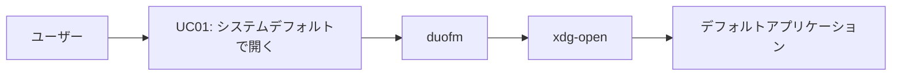
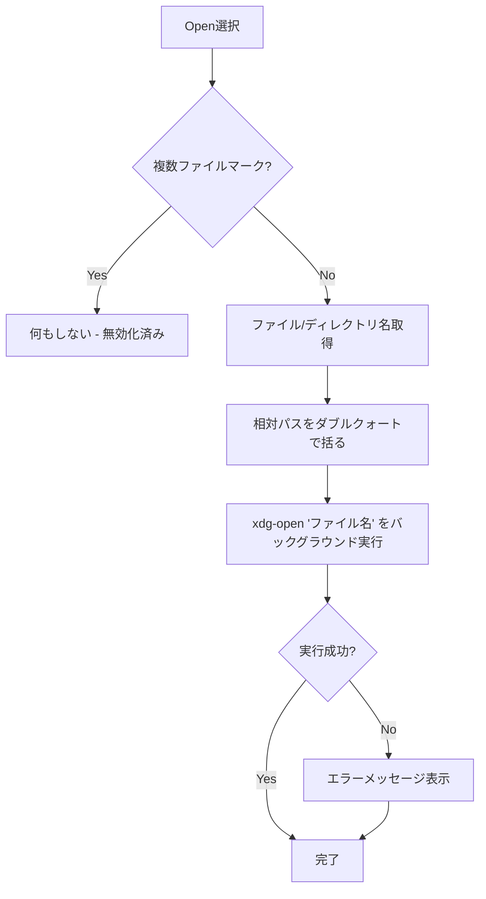
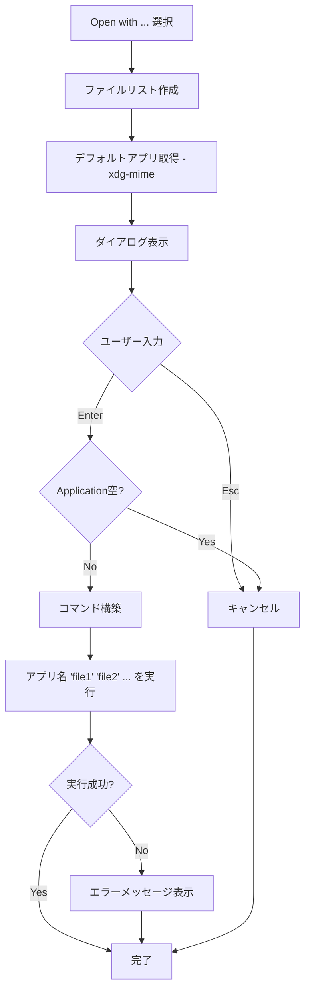
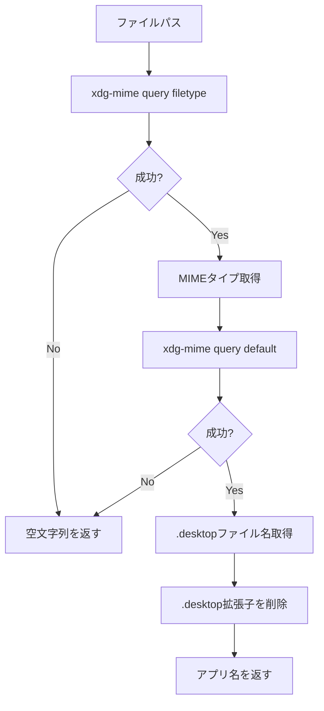
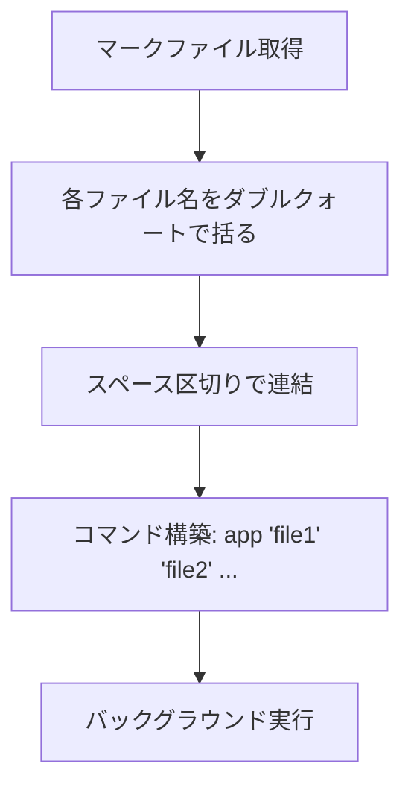
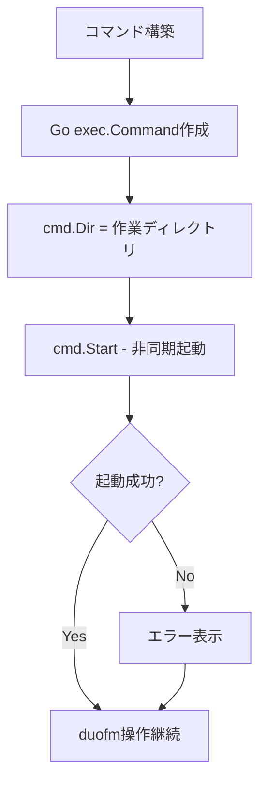

# コンテキストメニューからのファイルオープン機能 - 要件定義書

## 1. 概要

### 1.1 背景
duofmは現在、`v`キー（viewer）と`e`キー（editor）でファイルを開く機能を提供していますが、これらはテキストファイル向けのビューアー/エディタに限定されています。デスクトップ環境で使用する際、動画ファイルを動画プレイヤーで開く、画像ファイルを画像ビューアーで開くなど、ファイルタイプに応じた適切なアプリケーションで開く機能が必要です。

### 1.2 目的
- デスクトップユーザー向けに、ファイルタイプに応じた適切なアプリケーションでファイルを開く機能を提供する
- システムのデフォルトアプリケーション（xdg-open）で簡単にファイルを開けるようにする
- 任意のアプリケーションを指定してファイルを開けるようにする
- コンテキストメニューから直感的に操作できるUIを提供する

### 1.3 スコープ
本タスクでは、コンテキストメニュー（@キー）に以下の2つの機能を追加します：

- **Open**: xdg-openでファイルを開く（システムデフォルトアプリケーション）
- **Open with ...**: ユーザーが指定したアプリケーションでファイルを開く

## 2. ビジネス要件

### 2.1 ビジネス目標
- デスクトップ環境でのファイル管理の利便性を向上させる
- 既存のGUIファイルマネージャー（Nautilus等）と同等の「ファイルを開く」体験を提供する
- TUIとGUIのシームレスな統合を実現する

### 2.2 対象ユーザー
| ユーザータイプ | 説明 |
|----------------|------|
| デスクトップユーザー | X11/Waylandのデスクトップ環境でduofmを使用するユーザー |
| マルチメディアユーザー | 動画、画像、PDF等の様々なファイルを扱うユーザー |
| 上級ユーザー | 特定のアプリケーションやオプションを指定してファイルを開きたいユーザー |

### 2.3 期待される効果
- ファイル操作のワークフローが改善され、ターミナルとGUIアプリケーション間の移動が減少する
- 動画、画像、PDF等の非テキストファイルの扱いが容易になる
- ユーザーがduofmをメインのファイルマネージャーとして使用できるようになる

## 3. ユースケース

### 3.1 ユースケース一覧
| ID | ユースケース名 | アクター | 優先度 |
|----|----------------|----------|--------|
| UC01 | システムデフォルトアプリケーションでファイルを開く | ユーザー | 高 |
| UC02 | 指定したアプリケーションでファイルを開く | ユーザー | 高 |
| UC03 | 複数ファイルを指定アプリケーションで開く | ユーザー | 中 |
| UC04 | ディレクトリをファイルマネージャーで開く | ユーザー | 中 |

### 3.2 ユースケース詳細

#### UC01: システムデフォルトアプリケーションでファイルを開く

**アクター**: ユーザー

**事前条件**:
- duofmが起動している
- ファイルまたはディレクトリにカーソルがある
- xdg-openコマンドが利用可能

**基本フロー**:
1. ユーザーが@キーを押してコンテキストメニューを開く
2. システムは「Open」メニュー項目を表示する
3. ユーザーが「Open」を選択する
4. システムはxdg-openコマンドでファイル/ディレクトリを開く
5. アプリケーションがバックグラウンドで起動する
6. duofmは引き続き操作可能な状態を維持する

**代替フロー**:
- 3a. 複数ファイルがマークされている場合、「Open」は無効化（グレーアウト）される
- 4a. xdg-openが失敗した場合、エラーメッセージをステータスバーに表示する

**事後条件**:
- ファイル/ディレクトリが適切なアプリケーションで開かれている
- duofmは通常操作が可能な状態

**ユースケース図**:


#### UC02: 指定したアプリケーションでファイルを開く

**アクター**: ユーザー

**事前条件**:
- duofmが起動している
- ファイルまたはディレクトリにカーソルがある

**基本フロー**:
1. ユーザーが@キーを押してコンテキストメニューを開く
2. システムは「Open with ...」メニュー項目を表示する
3. ユーザーが「Open with ...」を選択する
4. システムは「Open with Application」ダイアログを表示する
   - Applicationフィールドには、xdg-mimeで取得したデフォルトアプリケーション名が初期値として表示される
   - ファイルリストには、開くファイル名がダブルクォートで括られて表示される
5. ユーザーがアプリケーション名（オプション可）を入力/編集する
6. ユーザーがEnterキーを押す
7. システムは指定されたコマンドでファイルを開く（バックグラウンド実行）
8. duofmは引き続き操作可能な状態を維持する

**代替フロー**:
- 4a. デフォルトアプリケーションが取得できない場合、Applicationフィールドは空
- 5a. ユーザーがApplicationフィールドを空にした場合、Enterを押しても何も起こらない（実質キャンセル）
- 5b. ユーザーがEscキーを押した場合、ダイアログが閉じる（キャンセル）
- 7a. コマンドが存在しない場合、「cmd not found」などのエラーをステータスバーに表示する

**事後条件**:
- ファイルが指定されたアプリケーションで開かれている
- duofmは通常操作が可能な状態

#### UC03: 複数ファイルを指定アプリケーションで開く

**アクター**: ユーザー

**事前条件**:
- duofmが起動している
- 複数のファイルがマークされている

**基本フロー**:
1. ユーザーが@キーを押してコンテキストメニューを開く
2. システムは「Open with ...」メニュー項目を表示する（「Open」は無効化）
3. ユーザーが「Open with ...」を選択する
4. システムは「Open with Application」ダイアログを表示する
   - Filesエリアには、マークされた全ファイル名が表示される（長い場合は`...`で省略）
5. ユーザーがアプリケーション名を入力する
6. ユーザーがEnterキーを押す
7. システムは指定されたコマンドに全ファイルパスを引数として渡して実行する
   - 例: `gedit "file1.txt" "file2.txt" "file3.txt"`
8. duofmは引き続き操作可能な状態を維持する

**代替フロー**:
- UC02と同様

**事後条件**:
- 全てのマークされたファイルが指定されたアプリケーションで開かれている

#### UC04: ディレクトリをファイルマネージャーで開く

**アクター**: ユーザー

**事前条件**:
- duofmが起動している
- ディレクトリにカーソルがある（親ディレクトリ`..`も含む）

**基本フロー**:
1. ユーザーが@キーを押してコンテキストメニューを開く
2. システムは「Open」メニュー項目を表示する
3. ユーザーが「Open」を選択する
4. システムはxdg-openコマンドでディレクトリを開く
5. GUIファイルマネージャー（Nautilusなど）がそのディレクトリで起動する
6. duofmは引き続き操作可能な状態を維持する

**代替フロー**:
- UC01と同様

**事後条件**:
- ディレクトリがGUIファイルマネージャーで開かれている

## 4. 機能要件

### 4.1 機能一覧
| ID | 機能名 | 説明 | 優先度 |
|----|--------|------|--------|
| F01 | Open（xdg-openで開く） | システムデフォルトアプリケーションでファイル/ディレクトリを開く | 高 |
| F02 | Open with ...（アプリケーション指定で開く） | ユーザー指定のアプリケーションでファイルを開く | 高 |
| F03 | デフォルトアプリケーション取得 | xdg-mimeでデフォルトアプリケーションを取得し表示 | 中 |
| F04 | 複数ファイル対応 | マークされた複数ファイルを一度に開く | 中 |
| F05 | バックグラウンド実行 | アプリケーションをバックグラウンドで起動し、duofmは操作可能状態を維持 | 高 |

### 4.2 機能詳細

#### F01: Open（xdg-openで開く）

**説明**: コンテキストメニューに「Open」項目を追加し、xdg-openコマンドでファイル/ディレクトリを開く

**入力**:
- 選択中のファイル/ディレクトリ
- 現在のペインのディレクトリパス（作業ディレクトリとして使用）

**出力**:
- xdg-openコマンドの実行
- エラー時はステータスバーへのエラーメッセージ表示

**処理フロー**:


**ビジネスルール**:
- 単一ファイル/ディレクトリのみ対象（複数マーク時は無効化）
- 親ディレクトリ（`..`）も対象
- 相対パスを使用し、ダブルクォートで括る
- 作業ディレクトリは現在のペインのディレクトリ

**バリデーション**:
| 項目 | ルール | エラーメッセージ |
|------|--------|------------------|
| xdg-open存在 | xdg-openコマンドが利用可能 | "Cannot open file: xdg-open not found" |

**エラーケース**:
| エラー | 条件 | 対応 |
|--------|------|------|
| xdg-open未インストール | xdg-openコマンドが存在しない | ステータスバーに"Cannot open file: xdg-open not found"を表示 |
| コマンド実行失敗 | xdg-openが0以外のステータスで終了 | ステータスバーに"Failed to open file: [error]"を表示 |
| パーミッションエラー | ファイルに読み取り権限がない | アプリケーションに任せる（xdg-openがエラー処理） |

#### F02: Open with ...（アプリケーション指定で開く）

**説明**: コンテキストメニューに「Open with ...」項目を追加し、ユーザーが入力したアプリケーションでファイルを開く

**入力**:
- 選択中のファイル/ディレクトリ（またはマークされたファイルリスト）
- ユーザーが入力したアプリケーション名とオプション
- 現在のペインのディレクトリパス（作業ディレクトリ）

**出力**:
- 指定されたアプリケーションの実行
- エラー時はステータスバーへのエラーメッセージ表示

**処理フロー**:


**ビジネスルール**:
- 単一ファイルでも複数マークファイルでも動作する
- ファイル名は相対パスをダブルクォートで括る
- アプリケーション名にはオプションも指定可能（例: `gedit --new-window`）
- 作業ディレクトリは現在のペインのディレクトリ
- バックグラウンドで実行（Goの`cmd.Start()`を使用）

**バリデーション**:
| 項目 | ルール | エラーメッセージ |
|------|--------|------------------|
| Application入力 | 空でない文字列 | なし（空の場合は何もしない） |

**エラーケース**:
| エラー | 条件 | 対応 |
|--------|------|------|
| コマンド未存在 | 指定されたコマンドが見つからない | ステータスバーに"Command not found: [command]"を表示 |
| 実行失敗 | コマンド起動に失敗 | ステータスバーに"Failed to execute: [error]"を表示 |
| パーミッションエラー | ファイルに読み取り権限がない | アプリケーションに任せる |

#### F03: デフォルトアプリケーション取得

**説明**: xdg-mimeコマンドを使用してファイルのデフォルトアプリケーションを取得し、「Open with ...」ダイアログの初期値として表示する

**入力**:
- ファイルパス

**出力**:
- デフォルトアプリケーション名（`.desktop`ファイル名から抽出）
- 取得失敗時は空文字列

**処理フロー**:


**ビジネスルール**:
- 単一ファイルのみ対象（複数ファイルマーク時は取得しない）
- ディレクトリの場合も取得を試みる
- 取得できない場合は空文字列（エラーにしない）
- `.desktop`拡張子は削除して表示（`gvim.desktop` → `gvim`）

**バリデーション**:
なし（取得失敗は許容される）

**エラーケース**:
| エラー | 条件 | 対応 |
|--------|------|------|
| xdg-mime未インストール | コマンドが存在しない | 空文字列を返す |
| MIMEタイプ不明 | ファイルタイプが判定できない | 空文字列を返す |
| デフォルトアプリ未設定 | MIMEタイプに対応するアプリが未設定 | 空文字列を返す |

#### F04: 複数ファイル対応

**説明**: マークされた複数ファイルを「Open with ...」で一度に開けるようにする

**入力**:
- マークされたファイルのリスト
- ユーザーが指定したアプリケーション

**出力**:
- 全ファイルを引数に渡したコマンドの実行

**処理フロー**:


**ビジネスルール**:
- 「Open」は無効化（単一ファイル/ディレクトリのみ）
- 「Open with ...」は有効（全ファイルを引数として渡す）
- ファイル名は相対パス、ダブルクォートで括る
- 作業ディレクトリは現在のペインのディレクトリ

**バリデーション**:
なし

**エラーケース**:
F02と同様

#### F05: バックグラウンド実行

**説明**: アプリケーションをバックグラウンドプロセスとして起動し、duofmはブロックせず引き続き操作可能な状態を維持する

**入力**:
- コマンド文字列
- ファイルパスのリスト
- 作業ディレクトリ

**出力**:
- バックグラウンドプロセスの起動
- 起動失敗時のエラーメッセージ

**処理フロー**:


**ビジネスルール**:
- `os/exec`パッケージの`cmd.Start()`を使用
- `cmd.Wait()`は呼び出さない（プロセスの終了を待たない）
- 標準出力/標準エラー出力は無視（または/dev/nullにリダイレクト）
- duofmはプロセス起動後、即座に制御を戻す

**バリデーション**:
なし

**エラーケース**:
| エラー | 条件 | 対応 |
|--------|------|------|
| プロセス起動失敗 | cmd.Start()がエラーを返す | ステータスバーにエラー表示 |

## 5. 非機能要件

### 5.1 パフォーマンス要件
- デフォルトアプリケーション取得は500ms以内に完了すること
- コマンド起動は100ms以内に開始すること（起動後はバックグラウンド）
- ダイアログ表示は即座に行われること（レスポンスタイム < 50ms）

### 5.2 セキュリティ要件
- ファイルパスは`filepath.Join`と`filepath.Clean`で正規化すること
- ファイル名にシェルの特殊文字が含まれていても安全に処理すること（ダブルクォートで括る）
- ユーザー入力（アプリケーション名）はシェルインジェクションを防ぐため、`exec.Command`に直接渡すこと（シェル経由しない）
- パーミッションチェックは行わず、アプリケーション側のエラー処理に任せること

### 5.3 可用性要件
- xdg-openが利用できない環境では、「Open」メニュー項目を無効化すること
- xdg-mimeが利用できない場合でも、「Open with ...」は動作すること（デフォルトアプリなしで起動）

### 5.4 保守性要件
- エラーメッセージはユーザーフレンドリーで具体的であること
- ログ出力は不要（TUIアプリケーションのため）
- コードは既存のダイアログパターンに従うこと

### 5.5 互換性要件
- Linux環境でxdg-utilsがインストールされていること（推奨）
- X11またはWaylandデスクトップ環境で動作すること
- Go 1.21以降

## 6. UI/UX要件

### 6.1 コンテキストメニュー設計

#### メニュー項目の配置
コンテキストメニューの**最上部**に以下の項目を追加：

```
┌─────────────────────────────────────┐
│ Context Menu                        │
│                                     │
│ 1. Open                             │  ← 新規追加（最上部）
│ 2. Open with ...                    │  ← 新規追加
│ 3. Copy to other pane               │  ← 既存
│ 4. Move to other pane               │  ← 既存
│ 5. Delete                           │  ← 既存
│ ...                                 │
└─────────────────────────────────────┘
```

#### メニュー項目の状態

**「Open」の表示条件:**
- **有効**: 単一ファイル/ディレクトリが選択されている（マークなし）
- **無効（グレーアウト）**: 複数ファイルがマークされている

**「Open with ...」の表示条件:**
- **常に有効**: 単一でも複数でも表示

### 6.2 「Open with Application」ダイアログ設計

#### レイアウト

```
┌─────────────────────────────────────────────────┐
│ Open with Application                           │
│                                                 │
│ Application:                                    │
│ > mpv --loop_                                   │
│   (カーソル付き入力フィールド、横スクロール可)   │
│                                                 │
│ Files:                                          │
│ "video1.mp4" "video2.mp4" "video3.mp4"          │
│ (読み取り専用、長い場合は ... で省略)           │
│                                                 │
│ Enter: Execute  Esc: Cancel                     │
└─────────────────────────────────────────────────┘
```

#### フィールド仕様

**Applicationフィールド:**
- 編集可能なテキスト入力
- 初期値: xdg-mimeで取得したデフォルトアプリケーション名（取得できない場合は空）
- 横スクロール対応（既存の`TextInput.RenderWithCursor`を使用）
- Emacs風キーバインド対応
  - Ctrl+A: 行頭へ移動
  - Ctrl+E: 行末へ移動
  - Ctrl+U: カーソル位置から行頭まで削除
  - Ctrl+K: カーソル位置から行末まで削除
  - Left/Right: カーソル移動
  - Home/End: 行頭/行末へ移動

**Filesフィールド:**
- 読み取り専用のテキスト表示
- 各ファイル名はダブルクォートで括る
- スペース区切りで表示
- 長い場合は切り詰めて `...` で省略（例: `"file1.txt" "file2.txt" ...`）
- 最大表示幅はダイアログ幅 - 8（パディング分）

#### ダイアログの動作

**キーバインド:**
| キー | 動作 |
|------|------|
| Enter | Application入力がある場合: コマンド実行<br>Application入力が空: 何もしない（実質キャンセル） |
| Esc | キャンセルしてダイアログを閉じる |
| 文字キー | Applicationフィールドに入力 |
| Left/Right/Home/End | カーソル移動 |
| Ctrl+A/E/U/K | Emacs風編集コマンド |
| Backspace/Delete | 文字削除 |

### 6.3 エラー表示

エラーはステータスバーに赤色で表示：

```
┌─────────────────────────────────────────────────┐
│ Left Pane                │ Right Pane           │
│ ...                      │ ...                  │
└─────────────────────────────────────────────────┘
 ERROR: Command not found: nonexistentapp
```

エラーメッセージは5秒後に自動消去される。

### 6.4 レスポンシブ対応
- ダイアログ幅はターミナル幅の80%（最小40文字、最大80文字）
- Filesフィールドはダイアログ幅に応じて切り詰め

## 7. データ要件

### 7.1 データモデル概要

本機能では永続化データは不要。実行時の一時データのみ扱う。

### 7.2 データ項目

**OpenWithDialogState（ダイアログ状態）:**
| 項目名 | 型 | 必須 | 説明 |
|--------|-----|------|------|
| applicationInput | string | ○ | ユーザーが入力したアプリケーション名 |
| fileList | []string | ○ | 開くファイルのリスト（相対パス） |
| defaultApp | string | × | xdg-mimeで取得したデフォルトアプリ |
| cursorPos | int | ○ | 入力フィールドのカーソル位置 |

**CommandExecution（コマンド実行情報）:**
| 項目名 | 型 | 必須 | 説明 |
|--------|-----|------|------|
| command | string | ○ | 実行するコマンド名 |
| args | []string | ○ | コマンド引数（ファイルパスのリスト） |
| workDir | string | ○ | 作業ディレクトリ（ペインのディレクトリ） |

### 7.3 データ保持期間
実行時のみ（揮発性）

## 8. 外部連携

### 8.1 連携システム
| システム名 | 連携方法 | データ |
|------------|----------|--------|
| xdg-open | コマンド実行 | ファイル/ディレクトリパス |
| xdg-mime | コマンド実行 | ファイルパス、MIMEタイプ |
| 外部アプリケーション | プロセス起動（exec） | ファイルパスのリスト |

### 8.2 xdg-open API

**コマンド:**
```bash
xdg-open <file>
```

**説明:**
- システムのデフォルトアプリケーションでファイル/URLを開く
- 終了ステータス: 0=成功、1以上=エラー

### 8.3 xdg-mime API

**MIMEタイプ取得:**
```bash
xdg-mime query filetype <file>
```

**出力例:**
```
text/plain
video/mp4
inode/directory
```

**デフォルトアプリ取得:**
```bash
xdg-mime query default <mimetype>
```

**出力例:**
```
gvim.desktop
mpv.desktop
org.gnome.Nautilus.desktop
```

## 9. 制約条件

### 9.1 技術的制約
- xdg-utilsパッケージに依存（Linux環境）
- デスクトップ環境（X11/Wayland）が必要
- バックグラウンドプロセスの管理はOSに任せる（duofmは追跡しない）
- ファイル名の長さ制限はファイルシステムに依存

### 9.2 ビジネス上の制約
- GUIアプリケーションのインストールはユーザー責任
- xdg-openの動作はデスクトップ環境の設定に依存

### 9.3 スケジュール制約
なし

## 10. 想定される課題とリスク

### 10.1 技術的課題
| 課題 | 影響度 | 対応策 |
|------|--------|--------|
| xdg-openが利用できない環境 | 中 | メニュー項目を無効化し、エラーメッセージで案内 |
| バックグラウンドプロセスのゾンビ化 | 低 | OSのinitプロセスに回収を任せる（明示的なWaitなし） |
| 非常に長いファイルリスト | 低 | ダイアログ内で切り詰めて表示、実行は全ファイル対象 |
| 特殊文字を含むファイル名 | 中 | ダブルクォートで括り、exec.Commandで直接実行（シェル経由しない） |

### 10.2 ビジネスリスク
| リスク | 発生確率 | 影響度 | 対応策 |
|--------|----------|--------|--------|
| ユーザーがxdg-utilsをインストールしていない | 低 | 中 | ドキュメントで推奨パッケージとして案内 |
| デフォルトアプリが未設定 | 中 | 低 | 「Open with ...」で手動指定可能 |
| アプリケーションが起動失敗 | 中 | 低 | エラーメッセージで通知、duofmは継続動作 |

## 11. 成功基準

### 11.1 受け入れ基準
- [ ] 「Open」でxdg-openが実行され、ファイルが適切なアプリケーションで開かれる
- [ ] 「Open with ...」でユーザー指定のアプリケーションが起動する
- [ ] 複数ファイルマーク時、「Open」が無効化される
- [ ] 複数ファイルマーク時、「Open with ...」で全ファイルが引数として渡される
- [ ] デフォルトアプリケーションが「Open with ...」ダイアログに初期表示される
- [ ] アプリケーション起動後、duofmが引き続き操作可能
- [ ] エラー発生時、適切なエラーメッセージが表示される
- [ ] 既存のコンテキストメニュー機能に影響がない

### 11.2 KPI
| 指標 | 目標値 | 測定方法 |
|------|--------|----------|
| デフォルトアプリ取得成功率 | 90%以上 | テスト環境での成功ケース数 / 総ケース数 |
| ダイアログ表示レスポンスタイム | 50ms以下 | ベンチマークテスト |
| コマンド起動時間 | 100ms以下 | ベンチマークテスト |

## 12. テストシナリオ

### 12.1 テスト観点
- [ ] 正常系: 単一ファイルを「Open」で開く
- [ ] 正常系: 単一ファイルを「Open with ...」で開く
- [ ] 正常系: 複数ファイルを「Open with ...」で開く
- [ ] 正常系: ディレクトリを「Open」で開く（Nautilus等で開かれる）
- [ ] 正常系: 親ディレクトリ（..）を「Open」で開く
- [ ] 正常系: デフォルトアプリが取得され、ダイアログに表示される
- [ ] 異常系: xdg-openが存在しない環境で「Open」が無効化される
- [ ] 異常系: 存在しないコマンドを指定してエラーメッセージが表示される
- [ ] 異常系: Applicationフィールドが空の場合、Enterしても何も起こらない
- [ ] 境界値: 非常に長いファイル名リストが切り詰められて表示される
- [ ] 境界値: 特殊文字を含むファイル名が正しく処理される
- [ ] セキュリティ: シェル特殊文字が含まれていても安全に実行される
- [ ] パフォーマンス: デフォルトアプリ取得が500ms以内に完了する
- [ ] パフォーマンス: バックグラウンド起動後、duofmが即座に操作可能

### 12.2 E2Eテストシナリオ

```bash
# Test: Open file with xdg-open
test_context_menu_open() {
    start_duofm "$CURRENT_SESSION"

    # Move to a test file
    send_keys "$CURRENT_SESSION" "j" "j"
    sleep 0.2

    # Open context menu
    send_keys "$CURRENT_SESSION" "@"
    sleep 0.3
    assert_contains "$CURRENT_SESSION" "Open" "Context menu shows Open"

    # Select Open (first item)
    send_keys "$CURRENT_SESSION" "1"
    sleep 0.5

    # Verify duofm is still running
    assert_contains "$CURRENT_SESSION" "duofm" "duofm still operational"

    stop_duofm "$CURRENT_SESSION"
}

# Test: Open with specified application
test_context_menu_open_with() {
    start_duofm "$CURRENT_SESSION"

    # Move to a test file
    send_keys "$CURRENT_SESSION" "j"
    sleep 0.2

    # Open context menu
    send_keys "$CURRENT_SESSION" "@"
    sleep 0.3

    # Select Open with ... (second item)
    send_keys "$CURRENT_SESSION" "2"
    sleep 0.3
    assert_contains "$CURRENT_SESSION" "Open with Application" "Dialog opened"
    assert_contains "$CURRENT_SESSION" "Application:" "Application field shown"

    # Enter application name
    send_keys "$CURRENT_SESSION" "cat"
    send_keys "$CURRENT_SESSION" "Enter"
    sleep 0.5

    # Verify duofm is still running
    assert_contains "$CURRENT_SESSION" "duofm" "duofm still operational"

    stop_duofm "$CURRENT_SESSION"
}

# Test: Multiple files marked - Open disabled
test_context_menu_open_disabled_multimark() {
    start_duofm "$CURRENT_SESSION"

    # Mark multiple files
    send_keys "$CURRENT_SESSION" "Space" "j" "Space"
    sleep 0.2

    # Open context menu
    send_keys "$CURRENT_SESSION" "@"
    sleep 0.3

    # Verify "Open" is shown but cannot be selected (grayed out)
    assert_contains "$CURRENT_SESSION" "Context Menu" "Context menu opened"

    # Try to select Open (should not work)
    send_keys "$CURRENT_SESSION" "1"
    sleep 0.3
    assert_contains "$CURRENT_SESSION" "Context Menu" "Menu still open (Open disabled)"

    # Close menu
    send_keys "$CURRENT_SESSION" "Escape"

    stop_duofm "$CURRENT_SESSION"
}
```

## 13. 用語定義

| 用語 | 定義 |
|------|------|
| xdg-open | Free Desktop標準のファイルオープンコマンド。MIMEタイプに基づいて適切なアプリケーションを起動する |
| xdg-mime | MIMEタイプ関連の情報を取得するコマンド |
| デフォルトアプリケーション | 特定のMIMEタイプに対してシステムが関連付けているアプリケーション |
| .desktop ファイル | Linuxデスクトップ環境におけるアプリケーション定義ファイル |
| バックグラウンド実行 | プロセスを非同期で起動し、親プロセス（duofm）はブロックせず継続動作すること |
| 相対パス | 現在のペインのディレクトリからの相対的なファイルパス |
| マーク | ファイルリストで複数ファイルを選択する機能（Spaceキー） |

## 14. 確認事項

### 14.1 確認済み事項

- [x] **機能の目的**: デスクトップユーザー向けに、動画ファイルを動画プレイヤーで開くなど、ファイルタイプに応じた適切なアプリケーションで開く機能が必要
- [x] **メニュー名**: 「Open」と「Open with ...」
- [x] **対象エントリ**: ファイル、ディレクトリ、親ディレクトリ（..）全て対象
- [x] **複数ファイル時の動作**:
  - 「Open」は無効化（グレーアウト）
  - 「Open with ...」は全ファイルを引数として渡す
- [x] **Open with ... のUI**:
  - Applicationフィールド: xdg-mimeで取得したデフォルトアプリを初期値として表示
  - Filesフィールド: ファイル名をダブルクォートで括って表示、長い場合は`...`で省略
- [x] **実行方法**: Go の`cmd.Start()`でバックグラウンド実行、duofmは引き続き操作可能
- [x] **パスの形式**: 相対パスを使用、ダブルクォートで括る
- [x] **作業ディレクトリ**: 現在のペインのディレクトリ
- [x] **エラーハンドリング**:
  - xdg-open未存在: 「ファイルを開けません」エラー
  - コマンド未存在: 「cmd not found」エラー
  - パーミッションエラー: アプリケーションに任せる
- [x] **メニュー配置**: コンテキストメニューの最上部（Nautilusと同様）
- [x] **デフォルトアプリ取得方法**: xdg-mime query filetype → xdg-mime query default で取得可能
- [x] **横スクロール**: TextInput.RenderWithCursorで既に実装済み、入力フィールドで利用可能
- [x] **ファイルリスト表示**: 案A（切り詰め+省略表示）を採用

### 14.2 未確認・保留事項
なし

## 15. 参考資料

- xdg-utils公式ドキュメント: https://www.freedesktop.org/wiki/Software/xdg-utils/
- xdg-mime マニュアル: `man xdg-mime`
- xdg-open マニュアル: `man xdg-open`
- 既存のopen-file機能: `doc/tasks/open-file/SPEC.md`
- 既存のコンテキストメニュー実装: `internal/ui/context_menu_dialog.go`
- 既存のInputDialog実装: `internal/ui/input_dialog.go`
