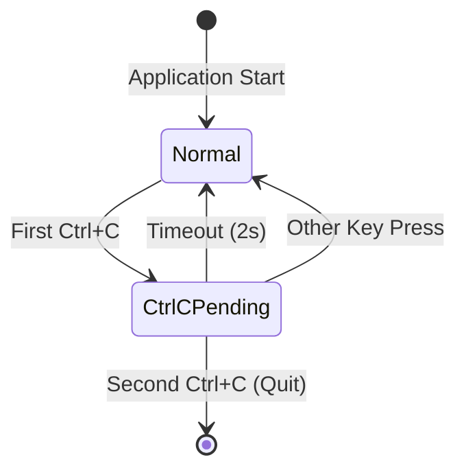

# SPEC: Ctrl+C Cancel Operation Support

## Overview

Add Ctrl+C as an alternative cancel key alongside Esc for all modal states (minibuffer, dialogs, context menu). Additionally, implement a double-press Ctrl+C to quit functionality for the normal file list view.

## Objectives

1. Allow users to cancel modal operations using Ctrl+C in addition to Esc
2. Implement a safe quit mechanism using double Ctrl+C in normal mode
3. Maintain consistency with common CLI/TUI application behavior

## User Stories

### US-1: Cancel Modal with Ctrl+C
**As a** user accustomed to CLI applications
**I want to** press Ctrl+C to cancel current operations
**So that** I can use familiar keyboard shortcuts

### US-2: Safe Quit with Double Ctrl+C
**As a** user
**I want to** press Ctrl+C twice to quit the application
**So that** I don't accidentally exit while trying to cancel something

## Technical Requirements

### TR-1: Ctrl+C Cancel in Modal States

Add `tea.KeyCtrlC` handling alongside `tea.KeyEsc` in all modal components:

| Component | File | Current Esc Handler |
|-----------|------|---------------------|
| Search/Minibuffer | `model.go:266-269` | `tea.KeyEsc` case |
| Confirm Dialog | `confirm_dialog.go:43-49` | `"esc"` string case |
| Error Dialog | `error_dialog.go:33-39` | `"esc"` string case |
| Help Dialog | `help_dialog.go:31-37` | `"esc"` string case |
| Context Menu | `context_menu_dialog.go:235-240` | `"esc"` string case |

### TR-2: Double Ctrl+C Quit Mechanism

**State Management:**
```go
// In Model struct
ctrlCPending bool  // true when first Ctrl+C was pressed, awaiting second
```

**Flow:**


**Implementation:**
1. First Ctrl+C: Set `ctrlCPending = true`, show status message, start 2s timer
2. Second Ctrl+C within 2s: Return `tea.Quit`
3. Timeout or other key: Reset `ctrlCPending = false`, clear status message

### TR-3: Status Bar Message

**Message Text:** `Press Ctrl+C again to quit`

**Styling:**
- Background: Color 240 (gray)
- Foreground: Color 15 (white)
- Not an error message (`isStatusError = false`)

## Implementation Approach

### Architecture

The implementation follows the existing pattern in the codebase:

1. **Key Constants** (`keys.go`): Add `KeyCtrlC` constant if needed
2. **Dialog Updates**: Extend case statements to include `ctrl+c`
3. **Model Updates**: Add state tracking and quit logic

### Code Changes

#### 1. Model Struct Addition (`model.go`)

```go
type Model struct {
    // ... existing fields ...
    ctrlCPending bool  // Tracks if first Ctrl+C was pressed
}
```

#### 2. Search/Minibuffer Handler (`model.go`)

```go
// In searchState.IsActive block
case tea.KeyEsc, tea.KeyCtrlC:
    m.cancelSearch()
    return m, nil
```

#### 3. Dialog Handlers

For each dialog, extend the case statement:

```go
// Example for confirm_dialog.go
case "n", "esc", "ctrl+c":
    d.active = false
    return d, func() tea.Msg {
        return dialogResultMsg{
            result: DialogResult{Cancelled: true},
        }
    }
```

#### 4. Normal Mode Ctrl+C Handler (`model.go`)

```go
// In normal key handling (after dialog/search checks)
case tea.KeyCtrlC:
    if m.ctrlCPending {
        // Second Ctrl+C - quit
        return m, tea.Quit
    }
    // First Ctrl+C - show message and start timer
    m.ctrlCPending = true
    m.statusMessage = "Press Ctrl+C again to quit"
    m.isStatusError = false
    return m, ctrlCTimeoutCmd(2 * time.Second)
```

#### 5. Timeout Command (`messages.go`)

```go
type ctrlCTimeoutMsg struct{}

func ctrlCTimeoutCmd(duration time.Duration) tea.Cmd {
    return tea.Tick(duration, func(t time.Time) tea.Msg {
        return ctrlCTimeoutMsg{}
    })
}
```

#### 6. Timeout Handler (`model.go`)

```go
case ctrlCTimeoutMsg:
    if m.ctrlCPending {
        m.ctrlCPending = false
        m.statusMessage = ""
    }
    return m, nil
```

#### 7. Reset on Other Key Press (`model.go`)

```go
// In key handling, after processing other keys
if m.ctrlCPending {
    m.ctrlCPending = false
    m.statusMessage = ""
}
```

## Dependencies

- No new external dependencies required
- Uses existing Bubble Tea framework capabilities (`tea.KeyCtrlC`, `tea.Tick`, `tea.Quit`)

## Test Scenarios

### Unit Tests

#### Test: Ctrl+C Cancels Search
```go
func TestSearchCtrlCCancelsSearch(t *testing.T) {
    // Setup: Start search mode
    // Action: Send Ctrl+C key
    // Assert: Search cancelled, minibuffer hidden
}
```

#### Test: Ctrl+C Cancels Confirm Dialog
```go
func TestConfirmDialogCtrlCCancels(t *testing.T) {
    // Setup: Show confirm dialog
    // Action: Send Ctrl+C key
    // Assert: Dialog closed with Cancelled=true
}
```

#### Test: Double Ctrl+C Quits Application
```go
func TestDoubleCtrlCQuits(t *testing.T) {
    // Setup: Normal mode
    // Action: Send Ctrl+C twice
    // Assert: Returns tea.Quit command
}
```

#### Test: Single Ctrl+C Shows Message
```go
func TestSingleCtrlCShowsMessage(t *testing.T) {
    // Setup: Normal mode
    // Action: Send single Ctrl+C
    // Assert: Status message shown, ctrlCPending=true
}
```

#### Test: Ctrl+C Timeout Resets State
```go
func TestCtrlCTimeoutResetsState(t *testing.T) {
    // Setup: Send first Ctrl+C
    // Action: Send ctrlCTimeoutMsg
    // Assert: ctrlCPending=false, status message cleared
}
```

#### Test: Other Key After Ctrl+C Resets State
```go
func TestOtherKeyAfterCtrlCResetsState(t *testing.T) {
    // Setup: Send first Ctrl+C
    // Action: Send 'j' key
    // Assert: ctrlCPending=false, status message cleared, cursor moved
}
```

### Integration Tests

- Test Ctrl+C cancels error dialog
- Test Ctrl+C cancels help dialog
- Test Ctrl+C cancels context menu
- Test Ctrl+C during regex search

## Security Considerations

- No security implications for this feature
- Ctrl+C handling is a standard UI pattern

## Error Handling

- No new error conditions introduced
- All Ctrl+C operations are synchronous and cannot fail

## Performance Optimization

- Minimal overhead: single boolean state check
- Timer uses existing Bubble Tea tick mechanism
- No impact on normal operation performance

## Success Criteria

1. **Functional:** All modal states can be cancelled with Ctrl+C
2. **Functional:** Double Ctrl+C in normal mode quits the application
3. **Functional:** Single Ctrl+C shows status message for 2 seconds
4. **Functional:** Message clears after timeout or other key press
5. **Compatibility:** Existing Esc key behavior unchanged
6. **Compatibility:** Existing 'q' quit behavior unchanged
7. **Testing:** All new and existing tests pass

## Open Questions

None - all requirements have been clarified with the user.

## Appendix: Key Handling Priority

```
┌─────────────────────────────────────────────────────────────┐
│                    Key Event Received                        │
└─────────────────────────────────────────────────────────────┘
                              │
                              ▼
                    ┌─────────────────┐
                    │ Dialog Active?  │
                    └─────────────────┘
                      │           │
                    Yes          No
                      │           │
                      ▼           ▼
            ┌─────────────┐  ┌─────────────────┐
            │Handle Dialog│  │ Search Active?  │
            │(incl Ctrl+C)│  └─────────────────┘
            └─────────────┘    │           │
                             Yes          No
                               │           │
                               ▼           ▼
                    ┌─────────────┐  ┌─────────────────┐
                    │Handle Search│  │ Normal Mode     │
                    │(incl Ctrl+C)│  │ Key Handling    │
                    └─────────────┘  │ (incl Ctrl+C    │
                                     │  double-press)  │
                                     └─────────────────┘
```

## File Change Summary

| File | Changes |
|------|---------|
| `internal/ui/model.go` | Add `ctrlCPending` field, Ctrl+C handlers, timeout handler |
| `internal/ui/messages.go` | Add `ctrlCTimeoutMsg` type and command |
| `internal/ui/confirm_dialog.go` | Add `"ctrl+c"` to cancel case |
| `internal/ui/error_dialog.go` | Add `"ctrl+c"` to close case |
| `internal/ui/help_dialog.go` | Add `"ctrl+c"` to close case |
| `internal/ui/context_menu_dialog.go` | Add `"ctrl+c"` to cancel case |
| `internal/ui/model_test.go` | Add new test cases |
