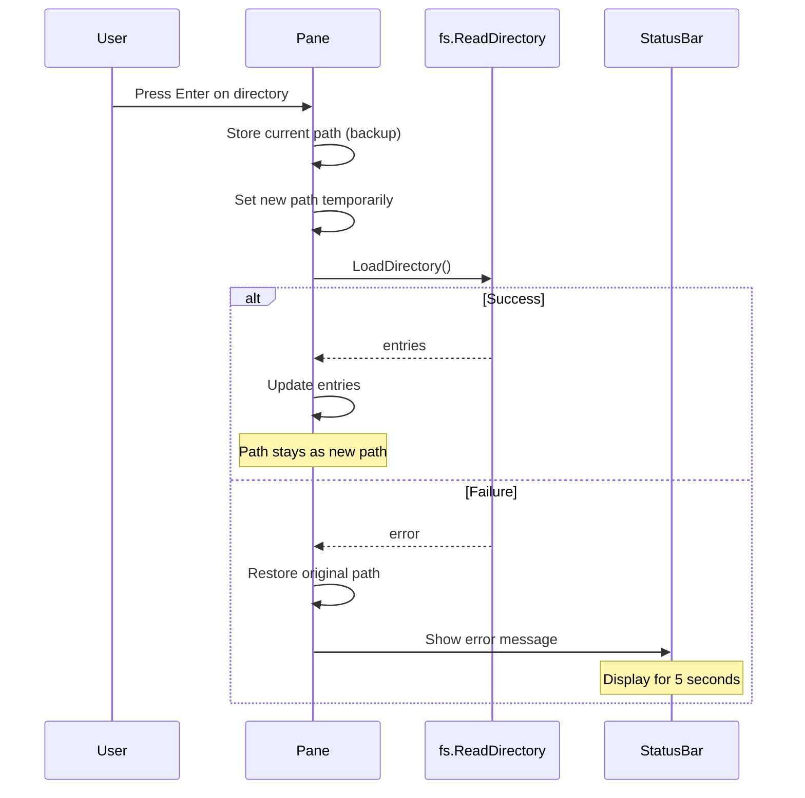

# SPEC: Directory Access Error Handling

## Overview

Fix the behavior when attempting to enter a directory that cannot be read (due to permission denial or other errors). Currently, the path is updated even when directory loading fails, causing inconsistency between the displayed path and the actual directory contents.

## Objectives

1. Ensure atomic directory navigation: path updates only on successful directory load
2. Provide clear error feedback via status bar messages
3. Handle all directory access errors consistently
4. Maintain normal operation after error recovery

## User Stories

### US-1: Permission Denied Handling
**As a** user
**I want** the file manager to stay in the current directory when I try to enter a directory I cannot read
**So that** the UI remains consistent and I understand why the navigation failed

### US-2: Error Feedback
**As a** user
**I want** to see a clear message when directory access fails
**So that** I understand what went wrong

### US-3: Continued Operation
**As a** user
**I want** to continue using the file manager normally after an error
**So that** errors don't disrupt my workflow

## Technical Requirements

### TR-1: Atomic Directory Navigation

**Current behavior (problematic):**
```
EnterDirectory() {
    p.path = newPath          // Path updated BEFORE load
    return p.LoadDirectory()  // Load may fail
}
```

**Required behavior:**
```
EnterDirectory() {
    // 1. Attempt to load the new directory first
    // 2. Only update path if load succeeds
    // 3. If load fails, keep current path and show error
}
```

### TR-2: Error Message Display

- Display errors in status bar (not dialog)
- Message format: `{Error type}: {Directory path}`
  - Example: `Permission denied: /root/secret`
  - Example: `No such directory: /tmp/deleted`
- Message duration: 5 seconds
- Message clears on next user action

### TR-3: Error Types to Handle

| Error Type | Display Message |
|------------|-----------------|
| EACCES (Permission denied) | `Permission denied: {path}` |
| ENOENT (Not found) | `No such directory: {path}` |
| EIO (I/O error) | `I/O error: {path}` |
| Other errors | `Cannot access: {path}` |

## Implementation Approach

### Architecture Changes



### Files to Modify

1. **internal/ui/pane.go**
   - Modify `EnterDirectory()` to handle errors atomically
   - Modify `LoadDirectory()` return value handling

2. **internal/ui/model.go**
   - Add status bar error message support
   - Add timer for message auto-clear
   - Handle `directoryLoadCompleteMsg` to restore path on failure

3. **internal/ui/status.go** (may need creation or modification)
   - Status bar message management
   - Timed message clearing

### API Design

#### New Message Type
```go
// Status bar message with auto-clear
type statusMessage struct {
    text     string
    isError  bool
    duration time.Duration
}

// Message to clear status after timeout
type clearStatusMsg struct{}
```

#### Modified LoadDirectory Flow
```go
func (p *Pane) EnterDirectory() tea.Cmd {
    entry := p.SelectedEntry()
    if entry == nil || !entry.IsDir {
        return nil
    }

    // Calculate new path but don't apply yet
    var newPath string
    if entry.IsParentDir() {
        newPath = filepath.Dir(p.path)
    } else {
        newPath = filepath.Join(p.path, entry.Name)
    }

    // Record previous path for recovery
    p.pendingPath = newPath
    p.recordPreviousPath()
    p.path = newPath

    return p.LoadDirectoryAsync()
}
```

#### Error Recovery in Model
```go
func (m Model) handleDirectoryLoadComplete(msg directoryLoadCompleteMsg) (Model, tea.Cmd) {
    pane := m.getTargetPane(msg.paneID)

    if msg.err != nil {
        // Restore previous path
        pane.restorePreviousPath()

        // Show error in status bar
        errMsg := formatDirectoryError(msg.err, msg.attemptedPath)
        return m.showStatusError(errMsg, 5*time.Second)
    }

    // Success: update entries
    pane.setEntries(msg.entries)
    return m, nil
}
```

## Dependencies

- Bubble Tea framework for message handling
- Standard library `os` package for error types

## Test Scenarios

### Unit Tests

#### Test: EnterDirectory with Permission Denied
```go
func TestEnterDirectory_PermissionDenied(t *testing.T) {
    // Setup: pane at /home/user, mock /root as unreadable
    // Action: attempt to enter /root
    // Assert: pane.Path() == "/home/user"
    // Assert: error message contains "Permission denied"
}
```

#### Test: Path Not Extended on Repeated Errors
```go
func TestEnterDirectory_NoPathExtension(t *testing.T) {
    // Setup: pane at /home/user, mock forbidden/ as unreadable
    // Action: attempt to enter forbidden/ multiple times
    // Assert: pane.Path() == "/home/user" (not /home/user/forbidden/forbidden/...)
}
```

#### Test: Normal Navigation After Error
```go
func TestEnterDirectory_RecoveryAfterError(t *testing.T) {
    // Setup: pane at /home/user
    // Action 1: attempt to enter unreadable directory (fails)
    // Action 2: enter a readable directory
    // Assert: pane.Path() == new readable directory
}
```

### Integration Tests

- Test status bar message display and clearing
- Test interaction with symlink navigation
- Test with various error types

## Security Considerations

- Do not expose internal error details that could leak system information
- Display user-friendly error messages without stack traces

## Error Handling

| Scenario | Behavior |
|----------|----------|
| Permission denied | Restore path, show "Permission denied: {path}" |
| Directory not found | Restore path, show "No such directory: {path}" |
| I/O error | Restore path, show "I/O error: {path}" |
| Symlink to invalid target | Already handled (shows as broken link) |

## Performance Optimization

- No additional filesystem calls needed
- Error detection happens during existing `ReadDirectory()` call
- Timer for message clearing uses Bubble Tea's built-in tick mechanism

## Success Criteria

1. [ ] Attempting to enter an unreadable directory does not change the path display
2. [ ] Error message appears in status bar for 5 seconds
3. [ ] Repeated attempts do not extend the path display
4. [ ] Normal navigation works after error
5. [ ] All existing tests pass
6. [ ] New test cases added for error scenarios

## Open Questions

None - all requirements have been clarified with the user.

## Related Files

- `internal/ui/pane.go:170-216` - EnterDirectory()
- `internal/ui/pane.go:69-87` - LoadDirectory()
- `internal/ui/model.go:201-229` - directoryLoadCompleteMsg handling
- `internal/fs/reader.go:10-78` - ReadDirectory()
