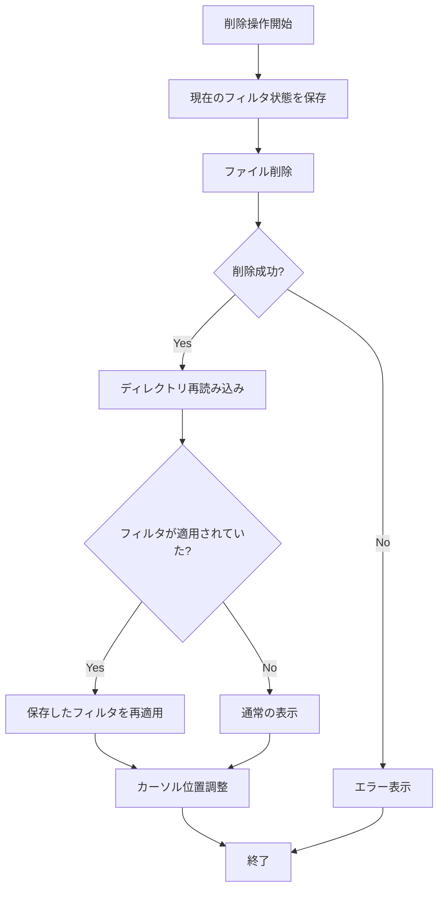

# ファイル削除時のフィルタ維持 - 要件定義書

## 1. 概要

### 1.1 背景
ファイルの絞り込み（フィルタ）機能を使用中にファイルを削除すると、フィルタが解除されてしまう問題が発生している。

### 1.2 目的
ファイル削除操作後もフィルタ状態を維持し、ユーザーの作業コンテキストを保持する。

### 1.3 スコープ
- ファイル削除操作 (`executeDeleteOperation`) におけるフィルタ維持
- 単一ファイル削除と複数ファイル削除の両方に対応

## 2. ビジネス要件

### 2.1 ビジネス目標
ユーザー体験の向上（作業フローの中断を防止）

### 2.2 対象ユーザー
| ユーザータイプ | 説明 |
|----------------|------|
| ファイル管理者 | 絞り込み機能を使用して効率的にファイルを管理するユーザー |

### 2.3 期待される効果
- 絞り込み状態での連続作業が可能になる
- 再度フィルタを適用する手間が省ける

## 3. ユースケース

### 3.1 ユースケース一覧
| ID | ユースケース名 | アクター | 優先度 |
|----|----------------|----------|--------|
| UC01 | フィルタ状態で単一ファイル削除 | ユーザー | 高 |
| UC02 | フィルタ状態で複数ファイル削除 | ユーザー | 高 |

### 3.2 ユースケース詳細

#### UC01: フィルタ状態で単一ファイル削除

**アクター**: ユーザー

**事前条件**:
- フィルタが適用されている（インクリメンタル検索、正規表現、SQLライクのいずれか）
- ファイルリストにファイルが表示されている

**基本フロー**:
1. ユーザーがカーソルでファイルを選択
2. ユーザーが削除コマンドを実行
3. システムがファイルを削除
4. システムがディレクトリを再読み込み
5. システムがフィルタを再適用
6. フィルタ条件に一致するファイルのみ表示される

**事後条件**:
- フィルタパターンが維持されている
- フィルタモードが維持されている
- 削除されたファイルはリストから消えている

#### UC02: フィルタ状態で複数ファイル削除

**アクター**: ユーザー

**事前条件**:
- フィルタが適用されている
- 複数のファイルがマークされている

**基本フロー**:
1. ユーザーが削除コマンドを実行
2. システムがマークされたファイルを削除
3. システムがディレクトリを再読み込み
4. システムがフィルタを再適用
5. フィルタ条件に一致するファイルのみ表示される

**事後条件**:
- フィルタパターンが維持されている
- フィルタモードが維持されている
- 削除されたファイルはリストから消えている
- マークはクリアされている

## 4. 機能要件

### 4.1 機能一覧
| ID | 機能名 | 説明 | 優先度 |
|----|--------|------|--------|
| F01 | フィルタ維持付きディレクトリ再読み込み | 削除後のディレクトリ再読み込み時にフィルタを維持 | 高 |

### 4.2 機能詳細

#### F01: フィルタ維持付きディレクトリ再読み込み

**説明**: ファイル削除後のディレクトリ再読み込み時に、既存のフィルタ状態を維持する。

**処理フロー**:

**ビジネスルール**:
- フィルタ再適用時、削除されたファイルがフィルタ条件に一致していた場合、表示件数が減少する（確認済み、問題なし）
- 削除エラー時はフィルタ状態を変更しない

## 5. 非機能要件

### 5.1 パフォーマンス要件
- フィルタ再適用は即座に完了すること（体感できる遅延なし）

### 5.2 保守性要件
- 既存の `ApplyFilter()` メソッドを再利用する

## 6. データ要件

### 6.1 保存が必要なデータ
| データ | 説明 |
|--------|------|
| filterPattern | フィルタパターン文字列 |
| filterMode | フィルタモード（SearchModeIncremental, SearchModeRegex, SearchModeSQLLike） |

## 7. 制約条件

### 7.1 技術的制約
- 現在の `LoadDirectory()` はフィルタをリセットする設計
- `LoadDirectory()` の仕様変更は影響範囲が大きいため避ける

## 8. 想定される課題とリスク

### 8.1 技術的課題
| 課題 | 影響度 | 対応策 |
|------|--------|--------|
| LoadDirectory変更の影響範囲 | 高 | 新しいメソッドを追加して対応 |

## 9. 成功基準

### 9.1 受け入れ基準
- [ ] フィルタ適用中に単一ファイルを削除後、フィルタが維持される
- [ ] フィルタ適用中に複数ファイルを削除後、フィルタが維持される
- [ ] 削除エラー時、フィルタ状態が変更されない
- [ ] フィルタなしでの削除は従来通り動作する

## 10. テストシナリオ

### 10.1 テスト観点
- [ ] 正常系: インクリメンタル検索フィルタ中の削除
- [ ] 正常系: 正規表現フィルタ中の削除
- [ ] 正常系: SQLライクフィルタ中の削除
- [ ] 正常系: マーク済み複数ファイルのフィルタ中削除
- [ ] 境界値: フィルタ結果が1件の時に削除
- [ ] 異常系: 削除失敗時のフィルタ維持

## 11. 確認事項

### 11.1 確認済み事項

- [x] フィルタ条件に一致していたファイルが削除された場合、表示件数が減少する動作: 問題なし

### 11.2 未確認・保留事項
- なし
