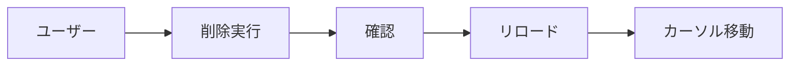
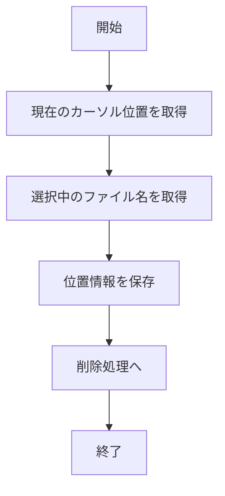
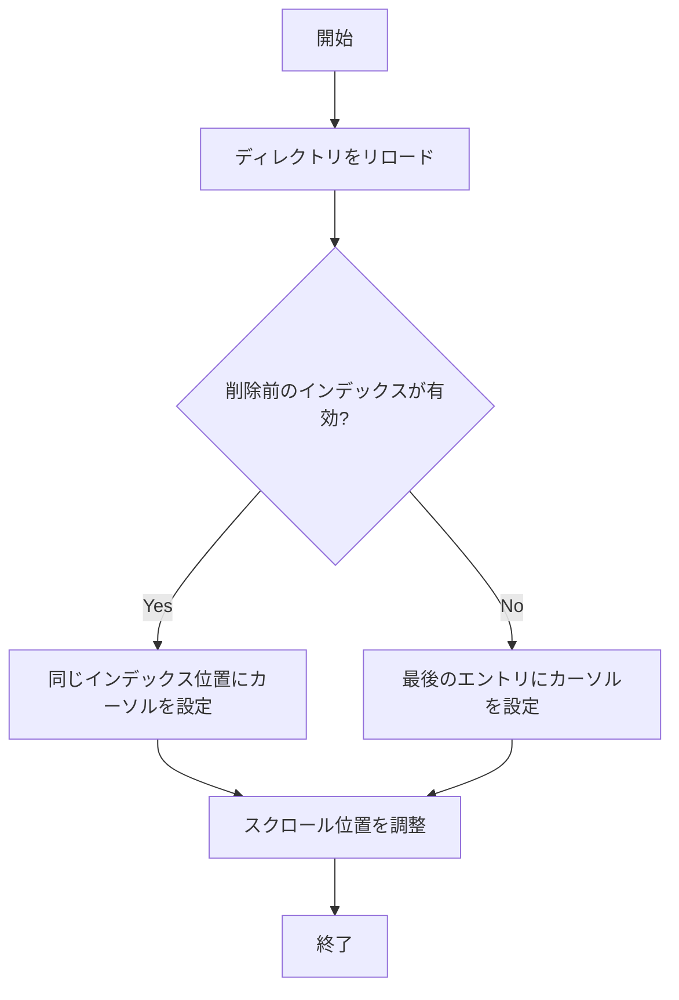
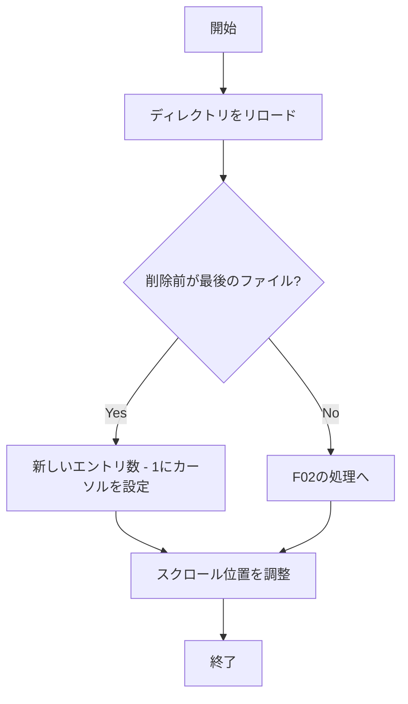
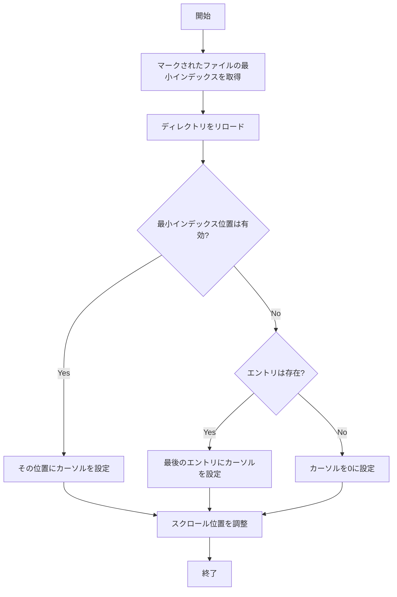
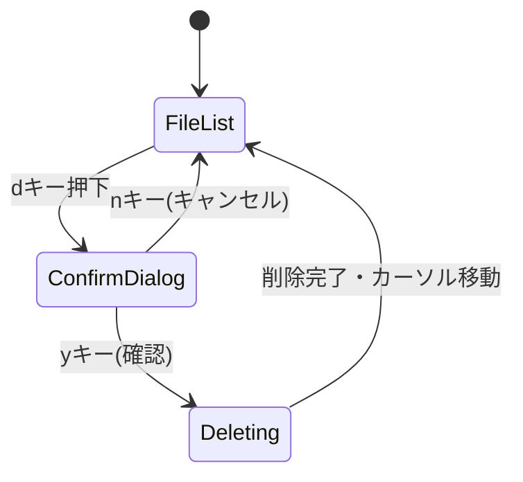

# ファイル削除後のカーソル位置修正 - 要件定義書

## 1. 概要

### 1.1 背景
現在、duofmでファイルを削除すると、削除後にカーソルが必ずリストの先頭(最初のファイル)に戻ってしまう。この挙動は、大量のファイルがあるディレクトリで真ん中あたりのファイルを削除した際に、ユーザーが作業していた位置を見失い、再度スクロールして目的の位置まで移動する必要があるため、操作性が著しく低下している。

### 1.2 目的
ファイル削除後のカーソル位置を適切に制御することで、ユーザーの作業効率を向上させ、ファイルマネージャーとしての操作感を改善する。

### 1.3 スコープ
- 単一ファイル削除時のカーソル位置制御
- 複数ファイル(マーク済み)削除時のカーソル位置制御
- ディレクトリ削除時のカーソル位置制御
- 最後のファイル削除時の特別な処理

## 2. ビジネス要件

### 2.1 ビジネス目標
duofmの使いやすさを向上させ、既存のファイルマネージャー(Midnight Commander、rangerなど)と同等以上の操作性を提供する。

### 2.2 対象ユーザー
| ユーザータイプ | 説明 |
|----------------|------|
| 一般ユーザー | TUIファイルマネージャーを日常的に使用するユーザー |
| パワーユーザー | 大量のファイル操作を行うユーザー |
| 開発者 | プロジェクト内のファイル整理を行うユーザー |

### 2.3 期待される効果
- ファイル削除後の再スクロールが不要になり、作業効率が向上
- 連続したファイル削除操作がスムーズになる
- ユーザーのストレスが軽減される

## 3. ユースケース

### 3.1 ユースケース一覧
| ID | ユースケース名 | アクター | 優先度 |
|----|----------------|----------|--------|
| UC01 | 単一ファイルの削除 | ユーザー | 高 |
| UC02 | 複数ファイルの削除 | ユーザー | 高 |
| UC03 | 最後のファイルの削除 | ユーザー | 高 |
| UC04 | ディレクトリの削除 | ユーザー | 高 |

### 3.2 ユースケース詳細

#### UC01: 単一ファイルの削除

**アクター**: ユーザー

**事前条件**:
- ディレクトリ内に複数のファイルが存在する
- カーソルがファイル上にある

**基本フロー**:
1. ユーザーが削除キー(dキー)を押す
2. システムが削除確認ダイアログを表示
3. ユーザーがYesを選択(yキー)
4. システムがファイルを削除
5. システムがディレクトリをリロード
6. システムが削除されたファイルの次のファイルにカーソルを移動

**代替フロー**:
- 削除されたファイルが最後のファイルだった場合: 削除後の最後のファイル(元の位置の一つ前)にカーソルを移動

**事後条件**:
- ファイルが削除されている
- カーソルが適切な位置にある

**ユースケース図**:

#### UC02: 複数ファイルの削除

**アクター**: ユーザー

**事前条件**:
- 複数のファイルがマークされている

**基本フロー**:
1. ユーザーが削除キー(dキー)を押す
2. システムが「X個のファイルを削除しますか?」という確認ダイアログを表示
3. ユーザーがYesを選択
4. システムがマークされたファイルをすべて削除
5. システムがディレクトリをリロード
6. システムがマークされたファイルの先頭(最小インデックス)の位置を基準にカーソルを移動
   - 先頭マークファイルの位置が有効な場合: その位置にカーソルを配置
   - 位置が範囲外の場合: 最後のファイルにカーソルを配置

**事後条件**:
- マークされたファイルがすべて削除されている
- マークがクリアされている
- カーソルがマークされたファイルの先頭位置またはその後の最初のファイル上にある

#### UC03: 最後のファイルの削除

**アクター**: ユーザー

**事前条件**:
- カーソルがディレクトリ内の最後のファイル上にある

**基本フロー**:
1. ユーザーが削除キーを押す
2. システムが削除確認ダイアログを表示
3. ユーザーがYesを選択
4. システムがファイルを削除
5. システムがディレクトリをリロード
6. システムが削除後の最後のファイル(元の位置の一つ前)にカーソルを移動

**事後条件**:
- 最後のファイルが削除されている
- カーソルが新しい最後のファイル上にある

#### UC04: ディレクトリの削除

**アクター**: ユーザー

**事前条件**:
- カーソルがディレクトリエントリ上にある

**基本フロー**:
1. ユーザーが削除キーを押す
2. システムが削除確認ダイアログを表示
3. ユーザーがYesを選択
4. システムがディレクトリを削除
5. システムがディレクトリをリロード
6. システムがファイル削除と同じルールでカーソルを移動

**事後条件**:
- ディレクトリが削除されている
- カーソルが適切な位置にある

## 4. 機能要件

### 4.1 機能一覧
| ID | 機能名 | 説明 | 優先度 |
|----|--------|------|--------|
| F01 | カーソル位置記憶 | 削除前のカーソル位置を記憶する | 高 |
| F02 | 次エントリへの移動 | 削除後、次のエントリにカーソルを移動 | 高 |
| F03 | 前エントリへの移動 | 最後のエントリ削除時、前のエントリにカーソルを移動 | 高 |
| F04 | 複数削除時の位置計算 | 複数ファイル削除時の最適なカーソル位置を計算 | 高 |

### 4.2 機能詳細

#### F01: カーソル位置記憶

**説明**: ファイル削除実行前に、現在のカーソル位置(インデックス)とファイル名を記憶する。

**入力**:
- 現在のカーソルインデックス: int
- 削除対象のファイル名: string

**出力**:
- 削除前カーソル位置情報: struct { index: int, fileName: string }

**処理フロー**:

**ビジネスルール**:
- カーソル位置は0始まりのインデックスとして管理
- ファイル名は再読み込み後の位置特定に使用

**バリデーション**:
| 項目 | ルール | エラーメッセージ |
|------|--------|------------------|
| カーソルインデックス | 0以上、エントリ数未満 | - |

**エラーケース**:
| エラー | 条件 | 対応 |
|--------|------|------|
| 無効なカーソル位置 | カーソルがエントリ範囲外 | デフォルト位置(0)にフォールバック |

#### F02: 次エントリへの移動

**説明**: ファイル削除後、ディレクトリ再読み込みを行い、削除されたファイルの次のファイルにカーソルを移動する。

**入力**:
- 削除前のカーソルインデックス: int
- 削除後のエントリリスト: []FileEntry

**出力**:
- 新しいカーソル位置: int

**処理フロー**:

**ビジネスルール**:
- 削除されたファイルが中間位置の場合、同じインデックス位置(次のファイル)にカーソルを配置
- リスト内での相対的な位置を維持することで、ユーザーの作業文脈を保持
- スクロール位置も自動調整され、新しいカーソル位置が画面内に表示される

**バリデーション**:
| 項目 | ルール | エラーメッセージ |
|------|--------|------------------|
| エントリリスト | 空でない | - |

**エラーケース**:
| エラー | 条件 | 対応 |
|--------|------|------|
| 空のディレクトリ | すべてのファイルが削除された | カーソルを0に設定 |

#### F03: 前エントリへの移動

**説明**: 最後のファイルを削除した場合、削除後の新しい最後のファイル(元の位置の一つ前)にカーソルを移動する。

**入力**:
- 削除前のカーソルインデックス: int
- 削除後のエントリリスト: []FileEntry

**出力**:
- 新しいカーソル位置: int

**処理フロー**:

**ビジネスルール**:
- 最後のファイルを削除した場合のみ適用
- 削除後の最後のエントリ(len(entries) - 1)にカーソルを配置
- 親ディレクトリ(..)は常にインデックス0なので、最後のファイルはlen(entries) - 1

**バリデーション**:
| 項目 | ルール | エラーメッセージ |
|------|--------|------------------|
| エントリリスト | 最低1つ以上(親ディレクトリ) | - |

**エラーケース**:
| エラー | 条件 | 対応 |
|--------|------|------|
| ディレクトリに親のみ | すべてのファイル/ディレクトリが削除 | カーソルを0(親ディレクトリ)に設定 |

#### F04: 複数削除時の位置計算

**説明**: 複数のファイルが削除された場合、マークされたファイルの中で最小のインデックス(先頭マークファイル)を基準にカーソル位置を計算する。

**入力**:
- マークされたファイルの最小インデックス(先頭位置): int
- 削除されたファイル数: int
- 削除後のエントリリスト: []FileEntry

**出力**:
- 新しいカーソル位置: int

**処理フロー**:

**ビジネスルール**:
- マークされたファイルの先頭(最小インデックス)を基準にカーソル位置を決定
- 先頭マークファイルの位置が削除後も有効な範囲内であれば、その位置にカーソルを配置
- 範囲外の場合は最後のファイル、すべて削除された場合は親ディレクトリ(0)に配置
- これにより、複数削除時のカーソル位置が予測可能で一貫性のある挙動になる

**エラーケース**:
| エラー | 条件 | 対応 |
|--------|------|------|
| すべてのファイルが削除 | エントリが親ディレクトリのみ | カーソルを0に設定 |
| マークされたファイルが見つからない | 削除前にマークが解除された | デフォルトロジック(F02)を適用 |

## 5. 非機能要件

### 5.1 パフォーマンス要件
- カーソル位置計算: 1ms以内
- ディレクトリリロード後のカーソル移動: ユーザーが視覚的に遅延を感じない速度(100ms以内)

### 5.2 セキュリティ要件
- ファイル削除の確認ダイアログは既存の仕組みを維持
- 削除操作自体のセキュリティは既存実装に準拠

### 5.3 可用性要件
- カーソル位置計算が失敗した場合でも、アプリケーションがクラッシュせずデフォルト位置(0)にフォールバック

### 5.4 保守性要件
- カーソル位置制御ロジックは既存のPaneメソッドと一貫性を保つ
- ユニットテストでカバレッジ80%以上を維持

### 5.5 互換性要件
- 既存のファイル削除機能との完全な互換性を維持
- 既存のキーバインド(dキー)は変更しない

## 6. UI/UX要件

### 6.1 画面設計要件
- カーソル移動は視覚的に滑らかに行われる
- スクロール位置は新しいカーソル位置が画面内に収まるよう自動調整される

### 6.2 画面遷移

### 6.3 レスポンシブ対応
- 端末サイズに関わらず、カーソル位置制御は同じルールで動作

## 7. データ要件

### 7.1 データモデル概要
既存のPaneとFileEntry構造を使用。新たなデータモデルは不要。

### 7.2 データ項目
| エンティティ | 項目名 | 型 | 必須 | 説明 |
|--------------|--------|-----|------|------|
| Pane | cursor | int | ○ | 現在のカーソル位置(インデックス) |
| Pane | entries | []FileEntry | ○ | 表示中のファイル/ディレクトリリスト |
| FileEntry | Name | string | ○ | ファイル/ディレクトリ名 |

### 7.3 データ保持期間
一時的な状態のみで、永続化は不要。

## 8. 外部連携

### 8.1 連携システム
なし(単体で完結)

### 8.2 API仕様要件
なし

## 9. 制約条件

### 9.1 技術的制約
- Go言語のスライス操作の範囲外アクセスを避ける
- Bubble Teaフレームワークのアーキテクチャに準拠

### 9.2 ビジネス上の制約
- 既存のユーザーに混乱を与えないよう、一般的なファイルマネージャーの挙動に準拠

### 9.3 スケジュール制約
- バグ修正として早期リリースが望ましい

## 10. 想定される課題とリスク

### 10.1 技術的課題
| 課題 | 影響度 | 対応策 |
|------|--------|--------|
| ディレクトリリロード後のタイミング制御 | 中 | LoadDirectory()の戻り値でエラーハンドリング |
| 複数削除時の最適なカーソル位置の決定 | 低 | シンプルなルール(削除前インデックス優先)を採用 |

### 10.2 ビジネスリスク
| リスク | 発生確率 | 影響度 | 対応策 |
|--------|----------|--------|--------|
| ユーザーが新しい挙動に戸惑う | 低 | 低 | 一般的なファイルマネージャーと同じ挙動なので問題なし |

## 11. 成功基準

### 11.1 受け入れ基準
- [ ] 単一ファイル削除後、次のファイルにカーソルが移動する
- [ ] 最後のファイル削除後、一つ前のファイルにカーソルが移動する
- [ ] 複数ファイル削除後、適切な位置にカーソルが移動する
- [ ] ディレクトリ削除も同様に動作する
- [ ] スクロール位置が自動調整される
- [ ] すべてのファイルを削除した場合、カーソルが親ディレクトリ(..)に移動する

### 11.2 KPI
| 指標 | 目標値 | 測定方法 |
|------|--------|----------|
| ユニットテストカバレッジ | 80%以上 | go test -cover |
| E2Eテスト成功率 | 100% | make test-e2e |

## 12. テストシナリオ

### 12.1 テスト観点
- [ ] 正常系: 中間ファイル削除後、次のファイルにカーソル移動
- [ ] 正常系: 最後のファイル削除後、前のファイルにカーソル移動
- [ ] 正常系: 最初のファイル(親ディレクトリの次)削除後、次のファイルにカーソル移動
- [ ] 正常系: 複数ファイル削除後、適切な位置にカーソル移動
- [ ] 異常系: すべてのファイル削除後、親ディレクトリにカーソル移動
- [ ] 境界値: ファイルが2つだけの場合(親ディレクトリ+1ファイル)の削除
- [ ] セキュリティ: 削除確認ダイアログのキャンセル動作
- [ ] パフォーマンス: 大量ファイル(1000+)がある場合のカーソル移動速度

## 13. 用語定義

| 用語 | 定義 |
|------|------|
| カーソル | ファイルリスト上で現在選択されているエントリを示す視覚的なハイライト |
| エントリ | ファイルまたはディレクトリの1項目 |
| 親ディレクトリ | ".."で表示される、一つ上の階層へのナビゲーションエントリ |
| マーク | Spaceキーで選択された複数ファイル |
| インデックス | エントリリスト内での位置(0始まり) |

## 14. 確認事項

### 14.1 確認済み事項
ユーザーとの対話で確認した内容:

- [x] 削除後のカーソル位置: 次のファイルに移動
- [x] 最後のファイル削除時: 一つ前のファイル(削除後の最後のファイル)に移動
- [x] 対象機能: 単一ファイル削除、複数ファイル削除、ディレクトリ削除
- [x] 実装箇所: executeDeleteOperation()内のLoadDirectory()呼び出し後
- [x] 既存のカーソル位置管理: Pane.cursorとPane.adjustScroll()を使用
- [x] テスト要件: ユニットテストとE2Eテストの両方が必要

### 14.2 未確認・保留事項
なし

## 15. 参考資料

- duofm既存コード: `internal/ui/pane.go` - カーソル管理メソッド
- duofm既存コード: `internal/ui/model_update.go` - 削除処理実装
- duofm既存コード: `internal/ui/pane_navigation.go` - ナビゲーション処理
- テストガイドライン: `test/README.md` - テスト作成ガイド
