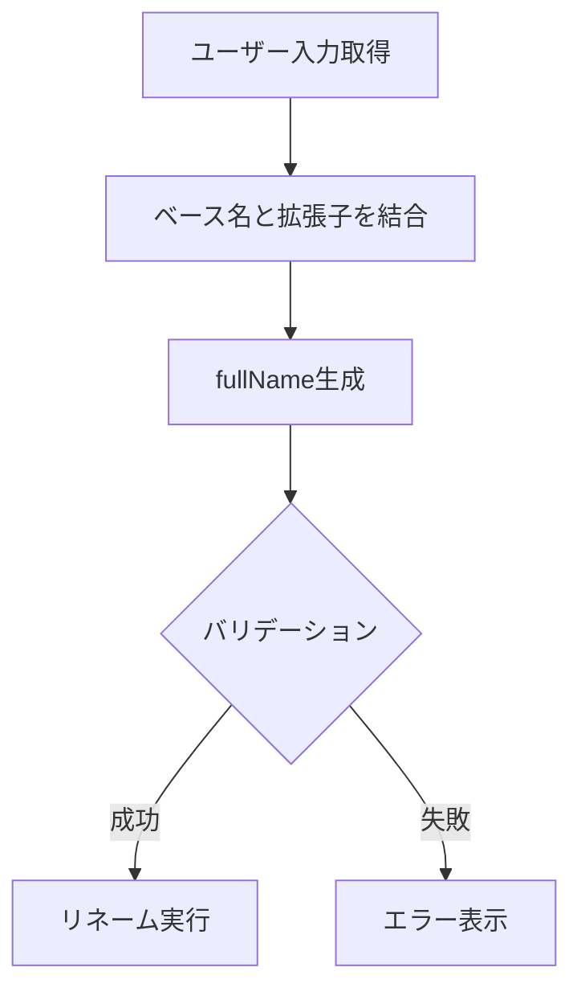

# 拡張子維持リネーム機能のスペース含みファイル名バグ修正 - 要件定義書

## 1. 概要

### 1.1 背景
Rキーによる拡張子維持リネーム機能において、スペースを含むファイル名をリネームするとエラーが発生するバグが報告された。調査の結果、`ExtensionRenameDialog`での拡張子結合時に、ベース名と拡張子を単純な文字列結合（`+`演算子）で処理していることが根本原因であると特定された。

### 1.2 目的
- スペースを含むファイル名でRキー（拡張子維持リネーム）が正常に動作するようにする
- 同様の問題が発生しないよう、テストカバレッジを強化する

### 1.3 スコープ
- `ExtensionRenameDialog`の拡張子結合処理の修正
- スペースを含むファイル名に対するテストケースの追加
- 既存機能（Shift+Rによるフルネームリネーム）への影響なし

## 2. ビジネス要件

### 2.1 ビジネス目標
ファイル名にスペースを含むファイル（例: "My Document.txt"）をRキーでリネームできるようにし、ユーザー体験を改善する。

### 2.2 対象ユーザー
| ユーザータイプ | 説明 |
|----------------|------|
| 一般ユーザー | スペースを含むファイル名を使用するユーザー |

### 2.3 期待される効果
- ユーザーがスペースを含むファイル名でもRキーリネームを問題なく使用できる
- バグによるユーザー体験の低下を防止

## 3. ユースケース

### 3.1 ユースケース一覧
| ID | ユースケース名 | アクター | 優先度 |
|----|----------------|----------|--------|
| UC01 | スペースを含むファイルをRキーでリネーム | ユーザー | 高 |

### 3.2 ユースケース詳細

#### UC01: スペースを含むファイルをRキーでリネーム

**アクター**: ユーザー

**事前条件**:
- スペースを含むファイル名のファイルが存在する（例: "My Document.txt"）
- そのファイルが選択されている

**基本フロー**:
1. ユーザーがRキーを押す
2. 拡張子維持リネームダイアログが表示される
3. ベース名（"My Document"）が入力フィールドに表示される
4. ユーザーが新しいベース名を入力する（例: "Your Document"）
5. ユーザーがEnterキーを押す
6. ファイルが "Your Document.txt" にリネームされる

**代替フロー**:
- 3a. ダイアログ表示時にバリデーションエラーが発生しない
- 5a. Enter押下時に正しく "Your Document.txt" が生成される

**事後条件**:
- ファイルが新しい名前にリネームされている
- エラーが発生していない

## 4. 機能要件

### 4.1 機能一覧
| ID | 機能名 | 説明 | 優先度 |
|----|--------|------|--------|
| F01 | 拡張子結合処理の修正 | スペースを含むベース名と拡張子を正しく結合する | 高 |
| F02 | テストケース追加 | スペースを含むファイル名のテストを追加する | 高 |

### 4.2 機能詳細

#### F01: 拡張子結合処理の修正

**説明**: `ExtensionRenameDialog`の`validateInput()`と`createResultCmd()`メソッドにおいて、ベース名と拡張子の結合処理を修正する。

**問題のコード（現在）**:
```go
// 82行目: バリデーション時
fullName := d.textInput.Value + d.extension

// 141行目: 結果生成時
fullName := d.textInput.Value + d.extension
```

**入力**:
- textInput.Value: ユーザーが入力したベース名（例: "My Document"）
- extension: 固定の拡張子（例: ".txt"）

**出力**:
- fullName: 完全なファイル名（例: "My Document.txt"）

**処理フロー**:


**バリデーション**:
| 項目 | ルール | エラーメッセージ |
|------|--------|------------------|
| fullName | 空でないこと | "File name cannot be empty" |
| fullName | パス区切り文字を含まないこと | "Invalid file name: path separator not allowed" |
| fullName | 同名ファイルが存在しないこと | "File already exists" |

#### F02: テストケース追加

**説明**: スペースを含むファイル名に対するテストケースを追加する。

**追加するテストケース**:
1. スペースを含むファイル名でのダイアログ生成テスト
2. スペースを含むベース名でのEnter押下テスト
3. スペースを含むファイル名でのバリデーションテスト
4. 複数スペースを含むファイル名のテスト
5. 先頭・末尾にスペースを含むファイル名のテスト

## 5. 非機能要件

### 5.1 パフォーマンス要件
- 修正による性能劣化なし（現状の50ms以内を維持）

### 5.2 セキュリティ要件
- 既存のバリデーション（パス区切り文字チェック等）を維持

### 5.3 保守性要件
- テストカバレッジの向上（スペースを含むファイル名のケースを網羅）

### 5.4 互換性要件
- 既存機能（Shift+Rによるフルネームリネーム）への影響なし
- スペースを含まないファイル名での動作に変化なし

## 6. データ要件

### 6.1 データモデル概要
変更なし（既存のデータモデルを使用）

### 6.2 データ項目
| エンティティ | 項目名 | 型 | 必須 | 説明 |
|--------------|--------|-----|------|------|
| extensionRenameResultMsg | newName | string | O | 新しいファイル名（フルネーム） |
| extensionRenameResultMsg | oldName | string | O | 元のファイル名 |
| extensionRenameResultMsg | dirPath | string | O | ディレクトリパス |
| extensionRenameResultMsg | cancelled | bool | O | キャンセルフラグ |

## 7. 制約条件

### 7.1 技術的制約
- Go言語の文字列操作による実装
- 既存の`TextInput`コンポーネントの仕様に従う

### 7.2 ビジネス上の制約
- 既存ユーザーの操作体験を変えない

## 8. 想定される課題とリスク

### 8.1 技術的課題
| 課題 | 影響度 | 対応策 |
|------|--------|--------|
| 文字列結合の方法 | 低 | 現在の単純な`+`演算子でも問題なく動作するはず。問題の本質は別にある可能性 |

### 8.2 ビジネスリスク
| リスク | 発生確率 | 影響度 | 対応策 |
|--------|----------|--------|--------|
| 他のエッジケースの見落とし | 中 | 低 | 包括的なテストケースを追加 |

## 9. 成功基準

### 9.1 受け入れ基準
- [ ] スペースを含むファイル名でRキーリネームが正常に動作する
- [ ] 既存のテストがすべてパスする
- [ ] 新規テストケースがすべてパスする
- [ ] Shift+Rによるリネームに影響がない

### 9.2 KPI
| 指標 | 目標値 | 測定方法 |
|------|--------|----------|
| テストカバレッジ | 80%以上 | go test -cover |
| バグ再発 | 0件 | 手動テスト・自動テスト |

## 10. テストシナリオ

### 10.1 テスト観点
- [ ] 正常系: スペースを含むファイル名でのリネーム成功
- [ ] 正常系: 複数スペースを含むファイル名でのリネーム成功
- [ ] 異常系: 空のベース名でのエラー表示
- [ ] 異常系: 重複ファイル名でのエラー表示
- [ ] 境界値: 先頭・末尾にスペースを含むファイル名
- [ ] 回帰テスト: スペースを含まないファイル名での動作確認

## 11. 用語定義

| 用語 | 定義 |
|------|------|
| ベース名 | ファイル名から拡張子を除いた部分（例: "document"） |
| 拡張子 | ファイル名の最後のドット以降の部分（例: ".txt"） |
| フルネーム | ベース名と拡張子を結合した完全なファイル名（例: "document.txt"） |
| 拡張子維持リネーム | Rキーによる、拡張子を固定したままベース名のみを編集するリネーム方式 |

## 12. 確認事項

### 12.1 確認済み事項

- [x] 問題箇所: `extension_rename_dialog.go`の82行目と141行目
- [x] 問題の処理: `fullName := d.textInput.Value + d.extension` という単純な文字列結合
- [x] 影響範囲: スペースを含むファイル名でRキーを使用した場合のリネーム操作
- [x] 対照動作: Shift+R（通常リネーム）では`InputDialog`を使用し、問題なく動作する
- [x] テストカバレッジの欠如: `extension_rename_dialog_test.go`にスペースを含むファイル名のテストケースが存在しない

### 12.2 未確認・保留事項
- [ ] 具体的なエラーメッセージの内容（調査レポートには記載なし）

## 13. 参考資料

- 元機能仕様書: `doc/tasks/rename-file-keep-extension/SPEC.md`
- 調査レポート: 本タスク依頼時に提供
- 対象ソースコード: `internal/ui/extension_rename_dialog.go`
- テストファイル: `internal/ui/extension_rename_dialog_test.go`
