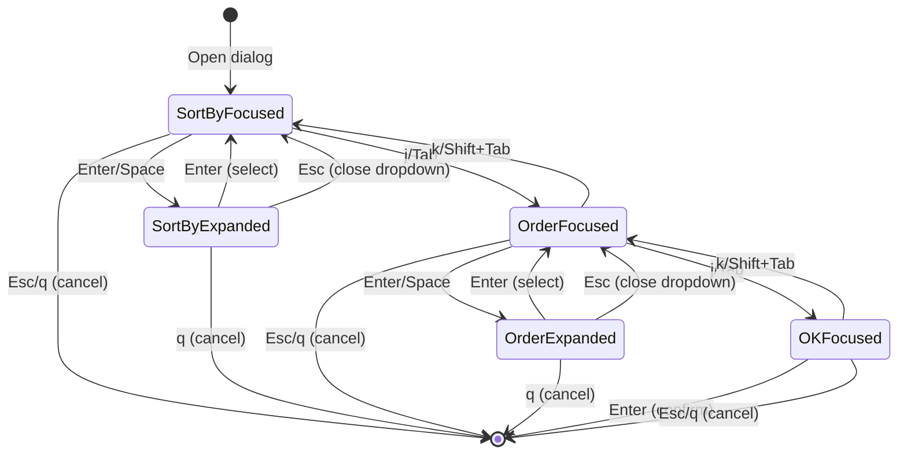

# Feature: Improve Sort Dialog with Dropdown Menus

## Overview

Enhance the sort dialog navigation and UX by adding j/k navigation between major items and an explicit OK button for confirmation. This improves consistency with other dialogs (bookmark, overwrite) and provides a more intuitive Vim-style navigation experience.

## Objectives

- Add j/k navigation between major items (Sort by, Order, OK button)
- Add OK button for explicit confirmation
- Maintain Tab/Shift+Tab navigation for compatibility
- Maintain all existing sort functionality including live preview

## Domain Rules

- Sort field options: Name, Size, Date (exactly 3 options)
- Sort order options: Ascending, Descending (exactly 2 options)
- Major items: Sort by dropdown, Order dropdown, OK button (3 items)
- Only one dropdown can be expanded at a time
- Selection changes are applied immediately for live preview
- Cancel reverts to original settings
- OK confirms current settings

## User Stories

### US1: Select Sort Field via Dropdown
As a user, I want to select the sort field from a dropdown menu, so that I can clearly see all available options.

**Acceptance Criteria:**
- [ ] Dropdown shows current value with a down arrow indicator `[Name ▼]`
- [ ] Pressing Enter/Space expands the dropdown
- [ ] Options appear in a bordered list below the field
- [ ] j/k or arrow keys navigate between options within dropdown
- [ ] Enter selects the highlighted option and closes dropdown
- [ ] Escape closes dropdown without changing

### US2: Navigate Between Major Items
As a user, I want to move between major items (Sort by, Order, OK) using j/k keys, so that I can navigate consistently with other dialogs.

**Acceptance Criteria:**
- [ ] j/down moves focus to the next major item
- [ ] k/up moves focus to the previous major item
- [ ] Tab moves focus to the next major item
- [ ] Shift+Tab moves focus to the previous major item
- [ ] Navigation does not cycle (stops at first/last item)
- [ ] Focus is visually indicated

### US3: Confirm Sort Settings via OK Button
As a user, I want to confirm my sort settings by pressing Enter on the OK button, so that I have explicit control over when changes are finalized.

**Acceptance Criteria:**
- [ ] OK button is displayed below the Order dropdown
- [ ] Enter on OK button confirms settings and closes dialog
- [ ] Space on OK button does nothing (to differentiate from dropdown)
- [ ] OK button has visual focus indication

### US4: Cancel Sort Settings
As a user, I want to cancel my sort settings, so that I can discard unwanted changes.

**Acceptance Criteria:**
- [ ] Escape cancels the dialog when no dropdown is expanded
- [ ] q cancels the dialog at any time (even when dropdown is expanded)
- [ ] Cancel reverts to original settings

## Functional Requirements

### FR1: Dropdown Component Behavior (existing, no change)
- FR1.1: Dropdown displays current value in format `[value ▼]`
- FR1.2: Enter or Space key expands the dropdown when focused
- FR1.3: Expanded dropdown shows bordered option list below the trigger
- FR1.4: Current selection is highlighted in the expanded list
- FR1.5: j/k or Down/Up arrow keys navigate options within dropdown
- FR1.6: Enter key selects option and closes dropdown
- FR1.7: Escape key closes dropdown without selecting
- FR1.8: Options do not cycle (stop at first/last)

### FR2: Major Item Navigation (**CHANGED**)
- FR2.1: Major items are: Sort by (0), Order (1), OK button (2)
- FR2.2: j/down key moves focus to the next major item
- FR2.3: k/up key moves focus to the previous major item
- FR2.4: Tab key moves focus to the next major item
- FR2.5: Shift+Tab moves focus to the previous major item
- FR2.6: Navigation only works when dropdowns are closed
- FR2.7: Navigation does not cycle (stops at first/last item)

### FR3: OK Button (**NEW**)
- FR3.1: OK button is displayed as the third major item
- FR3.2: Enter key on OK button confirms dialog and closes it
- FR3.3: Space key on OK button does nothing (to differentiate from dropdown)
- FR3.4: OK button has visual focus indication when focused

### FR4: Dialog Cancellation (existing, minor change)
- FR4.1: Escape key closes dropdown if expanded, otherwise cancels dialog
- FR4.2: q key cancels dialog at any time (even when dropdown is expanded)
- FR4.3: Cancel reverts to original sort configuration

### FR5: Live Preview (existing, no change)
- FR5.1: File list updates immediately when selection changes

## Non-Functional Requirements

- NFR1 - Performance: Dialog rendering must complete within 16ms (60fps)
- NFR2 - Accessibility: All operations must be keyboard-accessible
- NFR3 - Usability: Current selection state must be clearly visible
- NFR4 - Consistency: Navigation behavior consistent with other dialogs (bookmark, overwrite)

## Interface Contract

### Input Specification

**Key Bindings (Dropdown Closed):**
| Key | Action |
|-----|--------|
| j, Down | Move to next major item |
| k, Up | Move to previous major item |
| Tab | Move to next major item |
| Shift+Tab | Move to previous major item |
| Enter | Open dropdown (on dropdown) / Confirm (on OK button) |
| Space | Open dropdown (on dropdown) / No action (on OK button) |
| Escape | Cancel dialog |
| q | Cancel dialog |

**Key Bindings (Dropdown Expanded):**
| Key | Action |
|-----|--------|
| j, Down | Move to next option |
| k, Up | Move to previous option |
| Enter | Select option and close dropdown |
| Escape | Close dropdown without selecting |
| q | Cancel dialog (closes entire dialog) |

### Output Specification

**Sort Configuration (unchanged):**
```go
type SortConfig struct {
    Field SortField  // SortByName, SortBySize, SortByDate
    Order SortOrder  // SortAsc, SortDesc
}
```

### State Transitions



### Error Conditions

- No error conditions expected for UI-only changes
- Invalid key presses are silently ignored

## Visual Design

### Closed State Layout

```
╭──────────────────────────────────╮
│                                  │
│   Sort                           │
│                                  │
│  Sort by    [Name ▼]             │  ← Major item 0
│                                  │
│  Order      [↑Asc ▼]             │  ← Major item 1
│                                  │
│            [OK]                  │  ← Major item 2 (NEW)
│                                  │
│  j/k:move  Enter:select  q:quit  │
│                                  │
╰──────────────────────────────────╯
```

### Sort by Dropdown Expanded

```
╭──────────────────────────────────╮
│                                  │
│   Sort                           │
│                                  │
│  Sort by    [Name ▼]             │
│             ┌─────────┐          │
│             │ Name    │ ← highlighted
│             │ Size    │          │
│             │ Date    │          │
│             └─────────┘          │
│  Order      [↑Asc ▼]             │
│                                  │
│            [OK]                  │
│                                  │
│  j/k:move  Enter:select  q:quit  │
│                                  │
╰──────────────────────────────────╯
```

### Order Dropdown Expanded

```
╭──────────────────────────────────╮
│                                  │
│   Sort                           │
│                                  │
│  Sort by    [Name ▼]             │
│                                  │
│  Order      [↑Asc ▼]             │
│             ┌─────────┐          │
│             │ ↑Asc    │ ← highlighted
│             │ ↓Desc   │          │
│             └─────────┘          │
│                                  │
│            [OK]                  │
│                                  │
│  j/k:move  Enter:select  q:quit  │
│                                  │
╰──────────────────────────────────╯
```

### OK Button Focused

```
╭──────────────────────────────────╮
│                                  │
│   Sort                           │
│                                  │
│  Sort by    [Name ▼]             │
│                                  │
│  Order      [↑Asc ▼]             │
│                                  │
│           [ OK ]                 │  ← Highlighted/focused
│                                  │
│  j/k:move  Enter:select  q:quit  │
│                                  │
╰──────────────────────────────────╯
```

### Option Values

**Sort by Field:**
| Internal Value | Display |
|----------------|---------|
| SortByName | Name |
| SortBySize | Size |
| SortByDate | Date |

**Order Field:**
| Internal Value | Display |
|----------------|---------|
| SortAsc | ↑Asc |
| SortDesc | ↓Desc |

### Visual Indicators

- **Focused dropdown (closed):** Standard display `[Value ▼]`
- **Expanded dropdown:** Bordered list with highlighted current option
- **Highlighted option:** Background color change (theme-aware)
- **Non-highlighted options:** Normal text

## Dependencies

- Bubble Tea framework (existing)
- lipgloss styling library (existing)
- Existing `SortConfig`, `SortField`, `SortOrder` types

## Test Scenarios

### Unit Tests
- [ ] Dropdown renders correctly in closed state with down arrow
- [ ] Enter/Space expands dropdown (on dropdown focus)
- [ ] j/k navigate options within dropdown
- [ ] Enter selects option and closes dropdown
- [ ] Escape closes dropdown without selecting
- [ ] j/k moves focus between major items when dropdown closed
- [ ] Tab/Shift+Tab moves focus between major items when dropdown closed
- [ ] Options don't cycle past first/last
- [ ] Major items don't cycle past first/last
- [ ] OK button renders correctly
- [ ] Enter on OK button confirms dialog
- [ ] Space on OK button does nothing
- [ ] Cancel restores original configuration

### Integration Tests
- [ ] Full dialog workflow: open dropdown, select, navigate to OK, confirm
- [ ] Cancel workflow: open dropdown, change, cancel dialog
- [ ] Live preview updates when selection changes
- [ ] Dialog correctly sends result/cancel messages
- [ ] q cancels dialog even when dropdown is expanded

### E2E Tests
- [ ] Sort by Name via dropdown selection
- [ ] Sort by Size via dropdown selection
- [ ] Sort by Date via dropdown selection
- [ ] Change order to Descending
- [ ] Cancel dialog reverts changes
- [ ] j/k navigation between major items
- [ ] Tab/Shift+Tab navigation between major items
- [ ] OK button confirmation
- [ ] Sort settings persist after navigation

## Success Criteria

- [ ] All dropdowns expand and collapse correctly
- [ ] All option selections work via j/k and Enter
- [ ] j/k navigation works between major items when dropdowns closed
- [ ] Tab/Shift+Tab navigation works between major items when dropdowns closed
- [ ] OK button confirms dialog when focused and Enter pressed
- [ ] Escape cancels dialog or closes dropdown appropriately
- [ ] q cancels dialog at any time
- [ ] Live preview continues to work
- [ ] All unit tests pass
- [ ] All E2E tests pass (after updates for new key bindings)
- [ ] Visual inspection confirms correct layout with OK button

## Migration Notes

### Key Binding Changes

| Current Binding | New Binding | Action |
|-----------------|-------------|--------|
| Tab/Shift+Tab (only) | j/k + Tab/Shift+Tab | Move between major items |
| (none) | Enter on OK | Confirm dialog |
| Enter (on dropdown, closed) | Enter on OK | Confirm dialog |

### E2E Test Updates Required

Tests in `test/e2e/scripts/tests/sort_tests.sh` need updates:
- Add tests for j/k navigation between major items
- Add tests for OK button confirmation
- Update `test_sort_by_size_desc` to use OK button for confirmation
- Update `test_sort_dialog_tab_navigation` to verify 3 major items (Sort by, Order, OK)

## Constraints

- Must maintain backwards compatibility with existing `SortConfig` structure
- Must follow Bubble Tea message-based architecture
- Must follow dialog best practices (see `doc/development/DIALOG_BEST_PRACTICES.md`)

## Open Questions

- None (all requirements confirmed)

## Implementation Notes

### Changes to sort_dialog.go

1. **Add focusedItem field**: Change from `focusedDropdown int` (0-1) to `focusedItem int` (0-2)
   - 0: Sort by dropdown
   - 1: Order dropdown
   - 2: OK button

2. **Update handleDialogKey()**: Add j/k handling for major item navigation
   ```go
   case "j", "down":
       if d.focusedItem < 2 {
           d.focusedItem++
       }
   case "k", "up":
       if d.focusedItem > 0 {
           d.focusedItem--
       }
   ```

3. **Update Enter handling**: Check if on OK button
   ```go
   case "enter":
       if d.focusedItem == 2 {
           // OK button - confirm dialog
           d.Close()
           return true, false
       }
       // Expand dropdown
       d.getFocusedDropdown().Expand()
   ```

4. **Update Space handling**: Only expand dropdown, not on OK
   ```go
   case " ":
       if d.focusedItem < 2 {
           d.getFocusedDropdown().Expand()
       }
   ```

5. **Add OK button rendering in View()**

6. **Update footer text**: `j/k:move  Enter:select  q:quit`

## References

- Current implementation: `internal/ui/sort_dialog.go`
- Dropdown component: `internal/ui/dropdown.go`
- E2E tests: `test/e2e/scripts/tests/sort_tests.sh`
- Dialog best practices: `doc/development/DIALOG_BEST_PRACTICES.md`
- Contributing guidelines: `doc/CONTRIBUTING.md`
