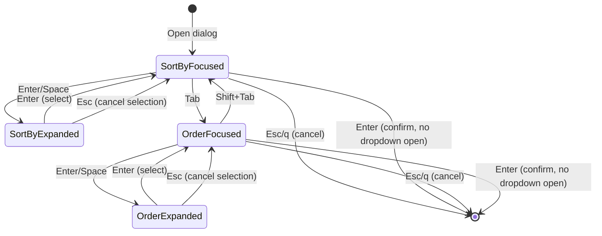

# Feature: Improve Sort Dialog with Dropdown Menus

## Overview

Replace the current horizontal option selection in the sort dialog with a dropdown menu interface. This provides a more intuitive and visually clear user experience while resolving layout issues with the current implementation.

## Objectives

- Replace horizontal option selection with dropdown menus
- Provide clearer visual feedback for current selections
- Align with standard UI conventions for option selection
- Maintain all existing sort functionality

## Domain Rules

- Sort field options: Name, Size, Date (exactly 3 options)
- Sort order options: Ascending, Descending (exactly 2 options)
- Only one dropdown can be expanded at a time
- Selection changes are applied immediately for live preview
- Cancel reverts to original settings

## User Stories

### US1: Select Sort Field via Dropdown
As a user, I want to select the sort field from a dropdown menu, so that I can clearly see all available options.

**Acceptance Criteria:**
- [ ] Dropdown shows current value with a down arrow indicator `[Name ▼]`
- [ ] Pressing Enter/Space expands the dropdown
- [ ] Options appear in a bordered list below the field
- [ ] j/k or arrow keys navigate between options
- [ ] Enter selects the highlighted option
- [ ] Escape closes without changing

### US2: Navigate Between Dropdowns
As a user, I want to move between sort field and order dropdowns, so that I can configure both settings efficiently.

**Acceptance Criteria:**
- [ ] Tab moves focus to the next dropdown
- [ ] Shift+Tab moves focus to the previous dropdown
- [ ] Focus is visually indicated

### US3: Confirm or Cancel Sort Settings
As a user, I want to confirm or cancel my sort settings, so that I have control over when changes are applied.

**Acceptance Criteria:**
- [ ] Enter confirms settings when no dropdown is expanded
- [ ] Escape cancels the dialog when no dropdown is expanded
- [ ] q also cancels the dialog when no dropdown is expanded

## Functional Requirements

### FR1: Dropdown Component Behavior
- FR1.1: Dropdown displays current value in format `[value ▼]`
- FR1.2: Enter or Space key expands the dropdown when focused
- FR1.3: Expanded dropdown shows bordered option list below the trigger
- FR1.4: Current selection is highlighted in the expanded list
- FR1.5: j/k or Down/Up arrow keys navigate options
- FR1.6: Enter key selects option and closes dropdown
- FR1.7: Escape key closes dropdown without selecting
- FR1.8: Options do not cycle (stop at first/last)

### FR2: Field Navigation
- FR2.1: Tab key moves focus from Sort by dropdown to Order dropdown
- FR2.2: Shift+Tab moves focus from Order dropdown to Sort by dropdown
- FR2.3: Tab/Shift+Tab only works when dropdowns are closed

### FR3: Dialog Confirmation
- FR3.1: Enter key confirms dialog when all dropdowns are closed
- FR3.2: Escape key cancels dialog when all dropdowns are closed
- FR3.3: q key cancels dialog when all dropdowns are closed
- FR3.4: Cancel reverts to original sort configuration

### FR4: Live Preview
- FR4.1: File list updates immediately when selection changes (existing behavior)

## Non-Functional Requirements

- NFR1 - Performance: Dialog rendering must complete within 16ms (60fps)
- NFR2 - Accessibility: All operations must be keyboard-accessible
- NFR3 - Usability: Current selection state must be clearly visible

## Interface Contract

### Input Specification

**Key Bindings (Dropdown Closed):**
| Key | Action |
|-----|--------|
| Enter | Open dropdown OR confirm dialog |
| Space | Open dropdown |
| Tab | Focus next dropdown |
| Shift+Tab | Focus previous dropdown |
| Escape | Cancel dialog |
| q | Cancel dialog |

**Key Bindings (Dropdown Expanded):**
| Key | Action |
|-----|--------|
| j, Down | Move to next option |
| k, Up | Move to previous option |
| Enter | Select option and close |
| Escape | Close without selecting |

### Output Specification

**Sort Configuration (unchanged):**
```go
type SortConfig struct {
    Field SortField  // SortByName, SortBySize, SortByDate
    Order SortOrder  // SortAsc, SortDesc
}
```

### State Transitions



### Error Conditions

- No error conditions expected for UI-only changes
- Invalid key presses are silently ignored

## Visual Design

### Closed State Layout

```
╭──────────────────────────────────╮
│                                  │
│   Sort                           │
│                                  │
│  Sort by    [Name ▼]             │
│                                  │
│  Order      [↑Asc ▼]             │
│                                  │
│  Enter:select  Esc:cancel        │
│                                  │
╰──────────────────────────────────╯
```

### Sort by Dropdown Expanded

```
╭──────────────────────────────────╮
│                                  │
│   Sort                           │
│                                  │
│  Sort by    [Name ▼]             │
│             ┌─────────┐          │
│             │ Name    │ ← highlighted
│             │ Size    │          │
│             │ Date    │          │
│             └─────────┘          │
│  Order      [↑Asc ▼]             │
│                                  │
│  Enter:select  Esc:cancel        │
│                                  │
╰──────────────────────────────────╯
```

### Order Dropdown Expanded

```
╭──────────────────────────────────╮
│                                  │
│   Sort                           │
│                                  │
│  Sort by    [Name ▼]             │
│                                  │
│  Order      [↑Asc ▼]             │
│             ┌─────────┐          │
│             │ ↑Asc    │ ← highlighted
│             │ ↓Desc   │          │
│             └─────────┘          │
│                                  │
│  Enter:select  Esc:cancel        │
│                                  │
╰──────────────────────────────────╯
```

### Option Values

**Sort by Field:**
| Internal Value | Display |
|----------------|---------|
| SortByName | Name |
| SortBySize | Size |
| SortByDate | Date |

**Order Field:**
| Internal Value | Display |
|----------------|---------|
| SortAsc | ↑Asc |
| SortDesc | ↓Desc |

### Visual Indicators

- **Focused dropdown (closed):** Standard display `[Value ▼]`
- **Expanded dropdown:** Bordered list with highlighted current option
- **Highlighted option:** Background color change (theme-aware)
- **Non-highlighted options:** Normal text

## Dependencies

- Bubble Tea framework (existing)
- lipgloss styling library (existing)
- Existing `SortConfig`, `SortField`, `SortOrder` types

## Test Scenarios

### Unit Tests
- [ ] Dropdown renders correctly in closed state with down arrow
- [ ] Enter/Space expands dropdown
- [ ] j/k navigate options within dropdown
- [ ] Enter selects option and closes dropdown
- [ ] Escape closes dropdown without selecting
- [ ] Tab moves focus between dropdowns
- [ ] Shift+Tab moves focus in reverse
- [ ] Options don't cycle past first/last
- [ ] Cancel restores original configuration

### Integration Tests
- [ ] Full dialog workflow: open dropdown, select, confirm
- [ ] Cancel workflow: open dropdown, change, cancel dialog
- [ ] Live preview updates when selection changes
- [ ] Dialog correctly sends result/cancel messages

### E2E Tests
- [ ] Sort by Name via dropdown selection
- [ ] Sort by Size via dropdown selection
- [ ] Sort by Date via dropdown selection
- [ ] Change order to Descending
- [ ] Cancel dialog reverts changes
- [ ] Tab navigation between fields
- [ ] Sort settings persist after navigation

## Success Criteria

- [ ] All dropdowns expand and collapse correctly
- [ ] All option selections work via j/k and Enter
- [ ] Tab/Shift+Tab navigation works between fields
- [ ] Enter confirms dialog when dropdowns closed
- [ ] Escape cancels dialog or closes dropdown appropriately
- [ ] Live preview continues to work
- [ ] All unit tests pass
- [ ] All E2E tests pass (after updates for new key bindings)
- [ ] Visual inspection confirms correct layout

## Migration Notes

### Key Binding Changes

| Old Binding | New Binding | Action |
|-------------|-------------|--------|
| h/l | Enter + j/k + Enter | Change option value |
| j/k | Tab/Shift+Tab | Move between fields |

### E2E Test Updates Required

Tests in `test/e2e/scripts/tests/sort_tests.sh` need updates:
- `test_sort_dialog_hl_navigation` - Replace h/l with dropdown workflow
- `test_sort_dialog_jk_navigation` - Replace j/k with Tab workflow
- `test_sort_by_size_desc` - Update key sequence for dropdown selection

## Constraints

- Must maintain backwards compatibility with existing `SortConfig` structure
- Must follow Bubble Tea message-based architecture
- Must follow dialog best practices (see `doc/development/DIALOG_BEST_PRACTICES.md`)

## Open Questions

- None (all requirements confirmed)

## References

- Current implementation: `internal/ui/sort_dialog.go`
- Dialog best practices: `doc/development/DIALOG_BEST_PRACTICES.md`
- Contributing guidelines: `doc/CONTRIBUTING.md`
