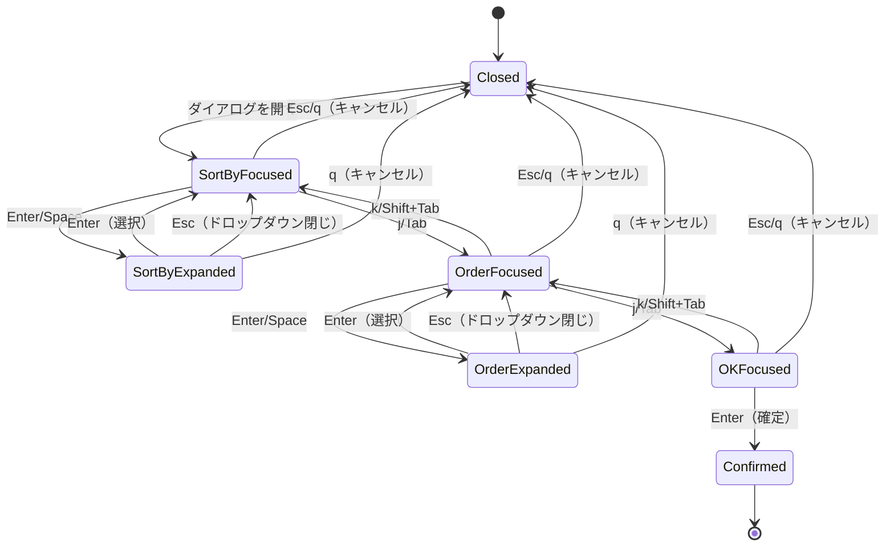

# ソートダイアログの改善（ドロップダウン方式） - 要件定義書

## 1. 概要

### 1.1 背景
現在のソートダイアログはドロップダウン方式で実装されているが、以下の問題がある：
- 大項目間の移動がTAB/Shift+TABのみで、j/kキーが使えない
- OKボタンがなく、明示的な確定操作ができない
- 他のダイアログ（bookmark, overwriteなど）とのキーバインディングの一貫性がない

### 1.2 目的
ソートダイアログのナビゲーションとUXを改善し、より直感的で一貫性のある操作体験を提供する。

### 1.3 スコープ
- 大項目間のナビゲーションをj/kでも可能にする
- OKボタンを追加して明示的な確定操作を提供
- 既存のソート機能は維持

## 2. ビジネス要件

### 2.1 ビジネス目標
- 他ダイアログとの一貫性のある操作感の提供
- 明示的な確定操作による誤操作の防止
- Vimユーザーに親和的なキーバインディング

### 2.2 対象ユーザー
| ユーザータイプ | 説明 |
|----------------|------|
| ファイル管理ユーザー | ファイルをソートして整理したいユーザー |
| Vimユーザー | j/kキーを好むキーボード中心のユーザー |

### 2.3 期待される効果
- 操作の直感性向上（j/kナビゲーション）
- 明示的な確定操作（OKボタン）
- 他ダイアログとのキーバインディング一貫性

## 3. ユースケース

### 3.1 ユースケース一覧
| ID | ユースケース名 | アクター | 優先度 |
|----|----------------|----------|--------|
| UC01 | ソートフィールドの変更 | ユーザー | 高 |
| UC02 | ソート順序の変更 | ユーザー | 高 |
| UC03 | ソート設定の確定 | ユーザー | 高 |
| UC04 | ソート設定のキャンセル | ユーザー | 高 |

### 3.2 ユースケース詳細

#### UC01: ソートフィールドの変更

**アクター**: ユーザー

**事前条件**:
- ソートダイアログが開いている

**基本フロー**:
1. ユーザーがj/k または TAB/Shift+TABで「Sort by」ドロップダウンにフォーカスする
2. Enter/Spaceでドロップダウンを展開
3. j/k または 矢印キーでオプションを選択
4. Enterで選択を確定（ドロップダウンが閉じる）

**代替フロー**:
- Escapeで変更せずにドロップダウンを閉じる

**事後条件**:
- 選択したソートフィールドがライブプレビューで適用される

#### UC02: ソート順序の変更

**アクター**: ユーザー

**事前条件**:
- ソートダイアログが開いている

**基本フロー**:
1. j/k または TAB/Shift+Tabで「Order」ドロップダウンに移動
2. Enter/Spaceでドロップダウンを展開
3. j/k または 矢印キーでAsc/Descを選択
4. Enterで選択を確定

**事後条件**:
- 選択したソート順序がライブプレビューで適用される

#### UC03: ソート設定の確定

**アクター**: ユーザー

**事前条件**:
- ソートダイアログが開いている
- 希望のソート設定が選択されている

**基本フロー**:
1. j/k または TABで[OK]ボタンに移動
2. Enterで設定を確定

**事後条件**:
- ダイアログが閉じる
- ソート設定が永続化される

## 4. 機能要件

### 4.1 機能一覧
| ID | 機能名 | 説明 | 優先度 |
|----|--------|------|--------|
| F01 | ドロップダウンUI | 枠付きドロップダウンメニューの表示（既存） | 高 |
| F02 | ドロップダウン展開 | Enter/Spaceでオプション一覧を表示（既存） | 高 |
| F03 | 小項目ナビゲーション | j/k/矢印でオプションをハイライト（既存） | 高 |
| F04 | 大項目ナビゲーション | j/k/Tab/Shift+Tabで大項目間を移動（**変更**） | 高 |
| F05 | OKボタン | 明示的な確定操作を提供（**新規追加**） | 高 |
| F06 | キャンセル | Esc/qでキャンセル（既存） | 高 |

### 4.2 機能詳細

#### F01: ドロップダウンUI（既存・変更なし）

**説明**: 現在の値を表示し、展開時にオプション一覧を枠付きで表示

**閉じた状態の表示**:
```
[Name ▼]
```

**展開時の表示**:
```
[Name ▼]
┌─────────┐
│ Name    │ ← ハイライト
│ Size    │
│ Date    │
└─────────┘
```

**スタイル要件**:
- 枠付き（bordered）スタイル
- 現在選択中のオプションはハイライト表示
- Unicode文字使用（┌─┐│└─┘）

#### F02: ドロップダウン展開（既存・変更なし）

**トリガー**: Enter または Space キー（ドロップダウンにフォーカス時）

**動作**:
- ドロップダウンがフォーカスされている状態で展開
- 現在選択中のオプションにカーソルを合わせる
- オプションリストは当該フィールドの下に表示

#### F03: 小項目ナビゲーション（既存・変更なし）

**説明**: ドロップダウン展開時のオプション間移動

**ナビゲーションキー**:
| キー | 動作 |
|------|------|
| j, ↓ | 次のオプションへ移動 |
| k, ↑ | 前のオプションへ移動 |
| Enter | オプションを選択してドロップダウンを閉じる |
| Escape | 選択せずにドロップダウンを閉じる |

**循環動作**: オプションリストは循環しない（先頭/末尾で止まる）

#### F04: 大項目ナビゲーション（**変更**）

**説明**: ドロップダウンが閉じている状態での大項目間移動

**大項目一覧**:
1. Sort by ドロップダウン
2. Order ドロップダウン
3. [OK] ボタン

**キーバインド**:
| キー | 動作 |
|------|------|
| j, down | 次の大項目へ移動 |
| k, up | 前の大項目へ移動 |
| Tab | 次の大項目へ移動 |
| Shift+Tab | 前の大項目へ移動 |

**フィールド順序**: Sort by → Order → [OK]

**循環動作**: 循環しない（先頭/末尾で止まる）

#### F05: OKボタン（**新規追加**）

**説明**: ダイアログを明示的に確定するためのボタン

**表示**: `[OK]` または `[ OK ]`（フォーカス時にハイライト）

**動作**:
- Enterキーで設定を確定しダイアログを閉じる
- Spaceキーは無効（ドロップダウン展開と区別）

**ビジネスルール**:
- OKで確定した設定は永続化される
- ライブプレビューで表示されていた設定がそのまま確定

#### F06: キャンセル（既存・変更なし）

**ダイアログ全体の操作**:
| キー | 動作 |
|------|------|
| Escape | ドロップダウンが開いている場合は閉じる、閉じている場合はダイアログをキャンセル |
| q | ダイアログをキャンセル（常時）

## 5. 非機能要件

### 5.1 パフォーマンス要件
- レンダリング: 16ms以下（60fps維持）

### 5.2 ユーザビリティ要件
- キーボードのみで全操作可能
- 現在の選択状態が常に明確
- 標準的なドロップダウン操作との一貫性

### 5.3 互換性要件
- 既存のソート機能との完全な互換性
- E2Eテストの更新（新しいキー操作に対応）

## 6. UI/UX要件

### 6.1 ダイアログレイアウト（閉じた状態）

```
╭──────────────────────────────────╮
│                                  │
│   Sort                           │
│                                  │
│  Sort by    [Name ▼]             │  ← 大項目1
│                                  │
│  Order      [↑Asc ▼]             │  ← 大項目2
│                                  │
│            [OK]                  │  ← 大項目3（新規追加）
│                                  │
│  j/k:move  Enter:select  q:quit  │
│                                  │
╰──────────────────────────────────╯
```

### 6.2 ダイアログレイアウト（Sort byドロップダウン展開時）

```
╭──────────────────────────────────╮
│                                  │
│   Sort                           │
│                                  │
│  Sort by    [Name ▼]             │
│             ┌─────────┐          │
│             │ Name    │ ← highlighted
│             │ Size    │          │
│             │ Date    │          │
│             └─────────┘          │
│  Order      [↑Asc ▼]             │
│                                  │
│            [OK]                  │
│                                  │
│  j/k:move  Enter:select  q:quit  │
│                                  │
╰──────────────────────────────────╯
```

### 6.3 オプション値

**Sort by フィールド**:
| 値 | 表示 |
|----|------|
| Name | Name |
| Size | Size |
| Date | Date |

**Order フィールド**:
| 値 | 表示 |
|----|------|
| Ascending | ↑Asc |
| Descending | ↓Desc |

### 6.4 キーボードショートカット

| コンテキスト | キー | 動作 |
|--------------|------|------|
| ドロップダウン閉じ | j, ↓ | 次の大項目へ |
| ドロップダウン閉じ | k, ↑ | 前の大項目へ |
| ドロップダウン閉じ | Tab | 次の大項目へ |
| ドロップダウン閉じ | Shift+Tab | 前の大項目へ |
| ドロップダウン閉じ | Enter | ドロップダウンを開く / [OK]で確定 |
| ドロップダウン閉じ | Space | ドロップダウンを開く（[OK]では無効） |
| ドロップダウン閉じ | Esc | ダイアログをキャンセル |
| ドロップダウン閉じ | q | ダイアログをキャンセル |
| ドロップダウン開き | j, ↓ | 次のオプション |
| ドロップダウン開き | k, ↑ | 前のオプション |
| ドロップダウン開き | Enter | オプションを選択して閉じる |
| ドロップダウン開き | Esc | 選択せずに閉じる |
| ドロップダウン開き | q | ダイアログをキャンセル |

## 7. データ要件

### 7.1 ソート設定データ

既存の `SortConfig` 構造を維持：

| フィールド | 型 | 説明 |
|------------|-----|------|
| Field | SortField | ソートフィールド（Name/Size/Date） |
| Order | SortOrder | ソート順序（Asc/Desc） |

## 8. 状態管理

### 8.1 ダイアログ状態



## 9. 制約条件

### 9.1 技術的制約
- Bubble Tea フレームワークの制約に従う
- TUI環境でのUnicode文字サポートが必要

### 9.2 デザイン制約
- ダイアログは既存の DialogStyles を使用
- 枠線は Unicode Box Drawing 文字を使用

## 10. テストシナリオ

### 10.1 テスト観点
- [ ] 正常系: j/kで大項目間を移動できる
- [ ] 正常系: TAB/Shift+TABで大項目間を移動できる
- [ ] 正常系: ドロップダウン展開・選択・閉じる
- [ ] 正常系: [OK]ボタンでEnterで確定できる
- [ ] 正常系: Esc でキャンセル
- [ ] 正常系: q でキャンセル（ドロップダウン展開中も含む）
- [ ] 異常系: 先頭大項目でk/Shift+Tabを押しても動かない
- [ ] 異常系: 末尾大項目でj/Tabを押しても動かない
- [ ] 境界値: 最初/最後のオプションでの k/j キー

### 10.2 E2Eテスト更新要件
既存のE2Eテストを新しいキーバインドに対応させる：
- Tab/Shift+Tabでのフィールド間移動 → j/k でも可能に
- [OK]ボタンでの確定テストを追加
- 大項目数の変更（2 → 3）に対応

## 11. 成功基準

### 11.1 受け入れ基準
- [ ] j/k で大項目間を移動できる
- [ ] Tab/Shift+Tab でも大項目間を移動できる
- [ ] ドロップダウンが正しく展開・閉じる
- [ ] オプション選択が正しく動作する
- [ ] [OK]ボタンで設定が確定する
- [ ] Escape でキャンセルできる
- [ ] q でキャンセルできる（ドロップダウン展開中も含む）
- [ ] 既存のソート機能が正常に動作する
- [ ] ダイアログのレイアウトが崩れない
- [ ] ライブプレビューが正常に動作する

## 12. 用語定義

| 用語 | 定義 |
|------|------|
| 大項目 | ダイアログ内の主要なUI要素（Sort by, Order, [OK]） |
| 小項目 | ドロップダウン展開時のオプション（Name, Size, Date等） |
| ドロップダウン | Enterで展開するオプション選択UI |
| フォーカス | 現在操作対象となっているUI要素 |
| ハイライト | 選択候補として強調表示されている状態 |
| ライブプレビュー | 設定変更が即座にファイル一覧に反映される機能 |

## 13. 確認事項

### 13.1 確認済み事項
- [x] UI方式: ドロップダウン（展開型）
- [x] 展開スタイル: 枠付き（bordered）
- [x] Sort by オプション: Name, Size, Date
- [x] Order オプション: ↑Asc, ↓Desc
- [x] 展開トリガー: Enter または Space（ドロップダウンにフォーカス時）
- [x] オプション選択: j/k または 矢印キー
- [x] 大項目間移動: j/k または Tab/Shift+Tab（**変更**）
- [x] 確定方法: [OK]ボタンでEnter（**変更**）
- [x] キャンセルキー: Escape または q
- [x] TAB/Shift+TABの実装要否: 他ダイアログで使われていなければ実装しなくてもよいが、既存実装で使用中のため維持

### 13.2 未確認・保留事項
- なし

## 14. 参考資料

- 既存実装: `internal/ui/sort_dialog.go`
- ドロップダウンコンポーネント: `internal/ui/dropdown.go`
- E2Eテスト: `test/e2e/scripts/tests/sort_tests.sh`
- ダイアログベストプラクティス: `doc/development/DIALOG_BEST_PRACTICES.md`
- 貢献ガイド: `doc/CONTRIBUTING.md`
