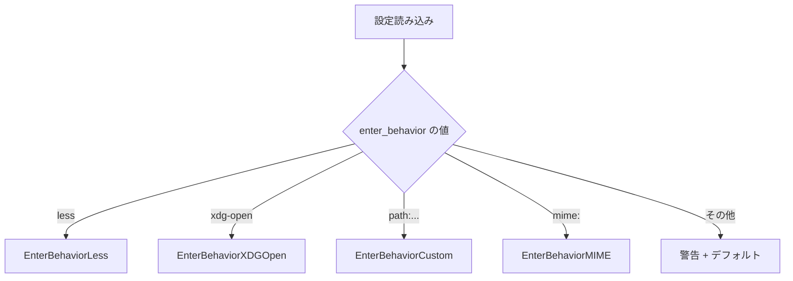
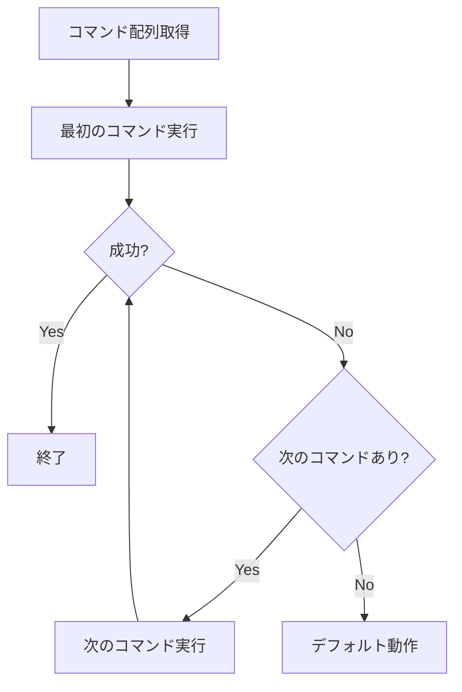

# MIMEタイプ別Enter動作設定 - 要件定義書

## 1. 概要

### 1.1 背景
現在のenter_behavior設定は全ファイルに対して同一の動作を適用する。ファイルの種類（テキスト、画像、動画など）に応じて異なるアプリケーションで開きたいというニーズがある。

### 1.2 目的
MIMEタイプに基づいてEnterキー押下時の動作を柔軟に設定できるようにする。

### 1.3 スコープ
- `enter_behavior = "mime:"` 形式の追加
- `[enter_behavior_mime]` セクションでのMIMEタイプ別コマンド設定
- フォールバック動作の実装

## 2. ビジネス要件

### 2.1 ビジネス目標
ユーザーがファイル種別に応じた最適なアプリケーションでファイルを開けるようにする。

### 2.2 対象ユーザー
| ユーザータイプ | 説明 |
|----------------|------|
| 一般ユーザー | ファイル種別ごとに異なるビューアを使い分けたい |
| 開発者 | コード、画像、ドキュメントを効率的に閲覧したい |

### 2.3 期待される効果
- ファイル種別に応じた適切なアプリケーションでの閲覧
- ワークフローの効率化

## 3. ユースケース

### 3.1 ユースケース一覧
| ID | ユースケース名 | アクター | 優先度 |
|----|----------------|----------|--------|
| UC01 | MIMEタイプ別にファイルを開く | ユーザー | 高 |
| UC02 | 一致しないMIMEタイプのフォールバック | ユーザー | 高 |

### 3.2 ユースケース詳細

#### UC01: MIMEタイプ別にファイルを開く

**アクター**: ユーザー

**事前条件**:
- `enter_behavior = "mime:"` が設定されている
- `[enter_behavior_mime]` セクションにMIMEタイプとコマンドが定義されている

**基本フロー**:
1. ユーザーがファイル上でEnterキーを押す
2. システムがファイルのMIMEタイプを判定する
3. システムが設定から該当するMIMEタイプのコマンドを検索する
4. 一致するコマンドが見つかった場合、配列の最初のコマンドで実行する
5. 最初のコマンドが失敗した場合、次のコマンドを試行する

**代替フロー**:
- MIMEタイプに一致する設定がない場合: UC02へ

**事後条件**:
- ファイルが指定されたアプリケーションで開かれる

#### UC02: 一致しないMIMEタイプのフォールバック

**アクター**: ユーザー

**事前条件**:
- `enter_behavior = "mime:"` が設定されている
- ファイルのMIMEタイプに一致する設定がない

**基本フロー**:
1. ユーザーがファイル上でEnterキーを押す
2. システムがファイルのMIMEタイプを判定する
3. 一致する設定が見つからない
4. デフォルト動作（$PAGERまたはless）でファイルを開く

**事後条件**:
- ファイルがページャーで開かれる

## 4. 機能要件

### 4.1 機能一覧
| ID | 機能名 | 説明 | 優先度 |
|----|--------|------|--------|
| F01 | MIME設定パース | `enter_behavior = "mime:"` の認識 | 高 |
| F02 | MIMEセクションパース | `[enter_behavior_mime]` セクションの読み込み | 高 |
| F03 | MIMEタイプ判定 | ファイルのMIMEタイプを取得 | 高 |
| F04 | コマンド実行 | MIMEタイプに対応するコマンドの実行 | 高 |
| F05 | フォールバック | 一致しない場合のデフォルト動作 | 高 |
| F06 | コマンドフォールバック | コマンド失敗時の次候補実行 | 中 |

### 4.2 機能詳細

#### F01: MIME設定パース

**説明**: `enter_behavior` に `"mime:"` が設定された場合、MIMEタイプベースの動作モードを有効にする。

**入力**:
- enter_behavior: string - 設定値

**出力**:
- EnterBehaviorType: enum - EnterBehaviorMIME

**処理フロー**:


#### F02: MIMEセクションパース

**説明**: `[enter_behavior_mime]` セクションからMIMEタイプとコマンドのマッピングを読み込む。

**入力**:
- TOMLセクション: `[enter_behavior_mime]`

**出力**:
- map[string][]string - MIMEタイプ → コマンド配列

**設定例**:
```toml
[enter_behavior_mime]
"text/*" = ["less", "cat"]
"image/*" = ["feh", "xdg-open"]
"video/*" = ["mpv", "vlc"]
"application/pdf" = ["zathura", "evince"]
```

**バリデーション**:
| 項目 | ルール | エラーメッセージ |
|------|--------|------------------|
| MIMEタイプ | 空文字列でない | "empty MIME type key" |
| コマンド配列 | 空配列でない | "empty command list for MIME type: {type}" |

#### F03: MIMEタイプ判定

**説明**: ファイルのMIMEタイプを判定する。

**処理フロー**:
1. `mime.TypeByExtension()` で拡張子からMIMEタイプを取得
2. 取得できない場合は `application/octet-stream` を返す

**注意**: ファイル内容からの判定（magic number）は行わない。

#### F04: コマンド実行

**説明**: MIMEタイプに対応するコマンドを実行する。

**マッチングルール**:
1. 完全一致: `application/pdf` → `application/pdf`
2. ワイルドカード一致: `image/png` → `image/*`
3. 完全一致を優先し、見つからない場合にワイルドカード

**実行モード**:
- フォアグラウンド実行（TUIを一時停止）

#### F05: フォールバック

**説明**: MIMEタイプに一致する設定がない場合のデフォルト動作。

**動作**: `enter_behavior` が設定されていない場合と同じ挙動（$PAGERまたはless）

#### F06: コマンドフォールバック

**説明**: 配列で指定されたコマンドが失敗した場合、次のコマンドを試行する。

**処理フロー**:


## 5. 非機能要件

### 5.1 パフォーマンス要件
- MIMEタイプ判定: < 1ms
- 設定パース: 起動時に1回のみ

### 5.2 セキュリティ要件
- コマンドはシェル経由で実行しない（直接exec）
- ファイルパスは引数として渡す

### 5.3 保守性要件
- 設定形式は既存のTOML形式を踏襲
- ワイルドカードは `*` のみサポート

## 6. データ要件

### 6.1 設定データ構造

```go
type MIMEBehaviorConfig struct {
    Rules map[string][]string // MIMEタイプ → コマンド配列
}
```

### 6.2 設定ファイル形式

```toml
# Enter key behavior
enter_behavior = "mime:"

# MIME type specific handlers
[enter_behavior_mime]
"text/*" = ["less"]
"image/*" = ["feh", "xdg-open"]
"video/*" = ["mpv"]
"application/pdf" = ["zathura"]
```

## 7. 制約条件

### 7.1 技術的制約
- MIMEタイプは拡張子ベースで判定（magic numberは使用しない）
- ワイルドカードは `type/*` 形式のみサポート

### 7.2 ビジネス上の制約
- 既存の `enter_behavior` 設定との後方互換性を維持

## 8. 成功基準

### 8.1 受け入れ基準
- [ ] `enter_behavior = "mime:"` が正しくパースされる
- [ ] `[enter_behavior_mime]` セクションが読み込まれる
- [ ] MIMEタイプに基づいて適切なコマンドが実行される
- [ ] 一致しないMIMEタイプでページャーが起動する
- [ ] コマンド失敗時に次のコマンドが試行される

### 8.2 KPI
| 指標 | 目標値 | 測定方法 |
|------|--------|----------|
| 設定パース成功率 | 100% | ユニットテスト |
| MIMEマッチング正確性 | 100% | ユニットテスト |

## 9. テストシナリオ

### 9.1 テスト観点
- [ ] 正常系: text/*にlessが適用される
- [ ] 正常系: image/*にfehが適用される
- [ ] 正常系: 完全一致が優先される
- [ ] 異常系: 一致なしでページャーが起動
- [ ] 異常系: 最初のコマンド失敗で次が試行される
- [ ] 境界値: 空のMIMEセクション

## 10. 用語定義

| 用語 | 定義 |
|------|------|
| MIMEタイプ | ファイルの種類を示す識別子（例: text/plain, image/png） |
| ワイルドカード | `*` を使用したパターンマッチ（例: text/*） |
| フォールバック | 一致する設定がない場合のデフォルト動作 |

## 11. 確認事項

### 11.1 確認済み事項

- [x] フォールバック動作: enter_behaviorが設定されていない場合と同じ挙動（$PAGERまたはless）
- [x] コマンドは配列で指定し、失敗時に次を試行
- [x] MIMEタイプは拡張子ベースで判定

### 11.2 未確認・保留事項

（なし）

## 12. 参考資料

- 既存実装: `internal/config/enter.go`
- 既存仕様: `doc/tasks/config-enter-behavior/SPEC.md`
