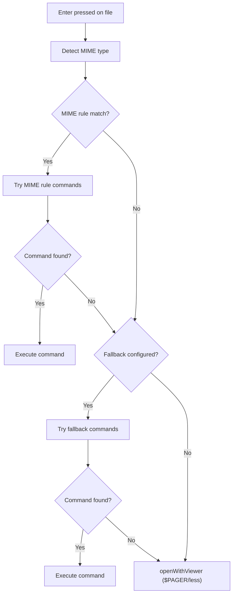

# Feature: MIME Fallback Configuration

## Overview

This feature adds a `fallback` key to the `[enter_behavior_mime]` section, allowing users to configure which command(s) to use when no MIME rule matches a file's type. Currently, unmatched files silently fall back to `$PAGER`/`less`. With this change, the fallback behavior becomes explicit and configurable.

## Domain Rules

- The `fallback` key is identified by its exact name; it is NOT a MIME pattern (does not contain `/`), so it never conflicts with MIME type rules
- Keys containing `/` are treated as MIME type patterns; unknown keys (not `fallback`, not containing `/`) generate a warning
- `fallback` uses the same command array format as MIME rules: `["command", "arg1", ...]`
- When `fallback` commands are exhausted without finding a valid command, the system falls back to `$PAGER`/`less` as a last resort
- The default value for `fallback` is `["xdg-open"]`
- The `[enter_behavior_mime]` section becomes mandatory (auto-created) when `enter_behavior = "mime:"` is set

## Objectives

- Add configurable fallback behavior for MIME-unmatched files
- Provide sensible default (`["xdg-open"]`) merged into config automatically
- Update config merge logic to handle `fallback` key insertion
- Update default config template to include `fallback`

## User Stories

### US1: Open Unmatched Files with Fallback Command
As a user, I want to specify which command opens files that don't match any MIME rule, so that I can control the default file opening behavior.

**Acceptance Criteria:**
- [ ] When no MIME rule matches, the `fallback` commands are tried in order
- [ ] First available command (via `exec.LookPath`) is used
- [ ] If all fallback commands fail, `$PAGER`/`less` is used as last resort

### US2: Auto-merge Fallback into Existing Config
As a user, I want `fallback` to be automatically added to my config if missing, so that my existing configuration continues to work seamlessly.

**Acceptance Criteria:**
- [ ] If `[enter_behavior_mime]` section is missing entirely, the full section with `fallback` is added
- [ ] If `[enter_behavior_mime]` exists but `fallback` is missing, `fallback = ["xdg-open"]` is appended
- [ ] If `fallback` already exists, nothing is changed

## Functional Requirements

- **FR1:** Parse `fallback` key from `[enter_behavior_mime]` section separately from MIME rules
- **FR2:** Store fallback commands in `MIMEBehaviorConfig.Fallback` (new field, type `[]string`)
- **FR3:** In `ParseMIMEBehavior`, identify `fallback` by its exact key name; keys containing `/` are MIME patterns; unknown keys (not `fallback`, not containing `/`) generate a warning and are skipped
- **FR4:** In `openWithMIME`, when no MIME rule matches, try `fallback` commands in order before falling back to `openWithViewer`
- **FR5:** In `openWithMIME`, when all MIME rule commands fail (LookPath), try `fallback` commands before falling back to `openWithViewer`
- **FR6:** Default `fallback` value is `["xdg-open"]`
- **FR7:** Config merger detects missing `fallback` key and appends it to `[enter_behavior_mime]` section
- **FR8:** Config merger adds full `[enter_behavior_mime]` section (with `fallback`) when section is entirely missing
- **FR9:** Default config template (`generator.go`) includes non-commented `[enter_behavior_mime]` section with `fallback = ["xdg-open"]`
- **FR10:** Validate `fallback` value is not an empty array; generate warning if empty

## Non-Functional Requirements

- **NFR1 - Compatibility:** Existing configs without `fallback` continue to work (auto-merged)
- **NFR2 - Consistency:** `fallback` uses the same command array format as MIME rules
- **NFR3 - Performance:** No measurable performance impact (single map lookup for fallback)

## Interface Contract

### Input/Output Specification

**Configuration Input:**
```toml
[enter_behavior_mime]
"text/*" = ["less"]
"image/*" = ["feh", "xdg-open"]
fallback = ["xdg-open"]
```

**ParseMIMEBehavior Output:**
```
MIMEBehaviorConfig {
    Rules: {
        "text/*":  ["less"],
        "image/*": ["feh", "xdg-open"],
    },
    Fallback: ["xdg-open"],
}
```

### Preconditions/Postconditions

**ParseMIMEBehavior:**
- Precondition: Raw map from TOML parsing (may contain `fallback` key)
- Postcondition: `fallback` extracted to `Fallback` field; `Rules` contains only MIME patterns

**openWithMIME:**
- Precondition: File path, working directory, MIMEBehaviorConfig (may have Fallback)
- Postcondition: File opened with matched command, fallback command, or pager

**Config Merge (fallback):**
- Precondition: Config file may or may not have `[enter_behavior_mime]` section and/or `fallback` key
- Postcondition: Config file contains `fallback` key with default value if it was missing

### State Transitions



### Error Conditions

| Condition | Behavior |
|-----------|----------|
| `fallback` is empty array | Warning generated, treated as no fallback |
| All fallback commands not found | Fall back to `$PAGER`/`less` |
| `fallback` key absent in existing config | Auto-merged with default value |
| Unknown key (not `fallback`, not containing `/`) | Warning generated, key skipped |

## Dependencies

- Existing MIME enter behavior feature (`doc/tasks/mime-enter-behavior/`)
- `internal/config/mime.go` - `MIMEBehaviorConfig`, `ParseMIMEBehavior`
- `internal/config/merger.go` - Config merge logic
- `internal/config/generator.go` - Default config template
- `internal/ui/exec.go` - `openWithMIME` function

## Test Scenarios

### Unit Tests

**ParseMIMEBehavior:**
- [ ] `fallback` key is extracted to `Fallback` field
- [ ] `fallback` is not included in `Rules` map
- [ ] MIME rules (keys with `/`) remain in `Rules` map
- [ ] Empty `fallback` array generates warning
- [ ] Missing `fallback` results in nil/empty `Fallback` field
- [ ] Config with only `fallback` (no MIME rules) parses correctly
- [ ] Unknown keys (not `fallback`, not containing `/`) generate warning and are skipped

**FindMatchingRule:**
- [ ] Existing behavior unchanged (exact match, wildcard match, no match)

**openWithMIME:**
- [ ] No MIME match + fallback configured -> tries fallback commands
- [ ] No MIME match + fallback command found -> executes fallback command
- [ ] No MIME match + all fallback commands not found -> falls back to pager
- [ ] No MIME match + no fallback configured -> falls back to pager
- [ ] All MIME rule commands not found + fallback configured -> tries fallback commands
- [ ] MIME match found -> uses MIME rule (fallback not used)

### Integration Tests

- [ ] LoadConfig with `[enter_behavior_mime]` containing `fallback` key
- [ ] LoadConfig with `[enter_behavior_mime]` without `fallback` (merge triggered)

### Config Merge Tests

- [ ] Section missing entirely -> full section with `fallback` added
- [ ] Section exists, `fallback` missing -> `fallback = ["xdg-open"]` appended
- [ ] Section exists, `fallback` present -> no change
- [ ] Commented section placeholder exists, `fallback` missing -> section with `fallback` added

### Edge Cases

- [ ] `fallback` with multiple commands: tries in order
- [ ] `fallback` command with options (e.g., `"vim -R"`): properly parsed
- [ ] Both MIME rules and `fallback` present: MIME rules take priority
- [ ] `fallback` is the only entry in `[enter_behavior_mime]`: works correctly
- [ ] Unknown key in `[enter_behavior_mime]` (e.g., `text = ["less"]`): warning generated, key skipped

## Success Criteria

- [ ] `fallback` key is parsed separately from MIME rules
- [ ] `MIMEBehaviorConfig` has `Fallback` field
- [ ] `openWithMIME` uses fallback commands when no MIME rule matches
- [ ] `openWithMIME` uses fallback commands when all MIME rule commands fail
- [ ] Config merger adds missing `fallback` key
- [ ] Default config template includes `fallback`
- [ ] All existing MIME behavior tests continue to pass
- [ ] Backward compatibility with existing configs maintained

## Constraints

- Must not break existing `[enter_behavior_mime]` configurations
- `fallback` key must not be treated as a MIME pattern
- Default config template format must remain valid TOML

## Open Questions

(None - all questions resolved)

## References

- Parent feature specification: `doc/tasks/mime-enter-behavior/SPEC.md`
- Parent feature requirements: `doc/tasks/mime-enter-behavior/要件定義書.md`
- Parent feature implementation plan: `doc/tasks/mime-enter-behavior/IMPLEMENTATION.md`
- Config implementation: `internal/config/config.go`
- MIME behavior: `internal/config/mime.go`
- Config merger: `internal/config/merger.go`
- Config generator: `internal/config/generator.go`
- Execution helpers: `internal/ui/exec.go`
