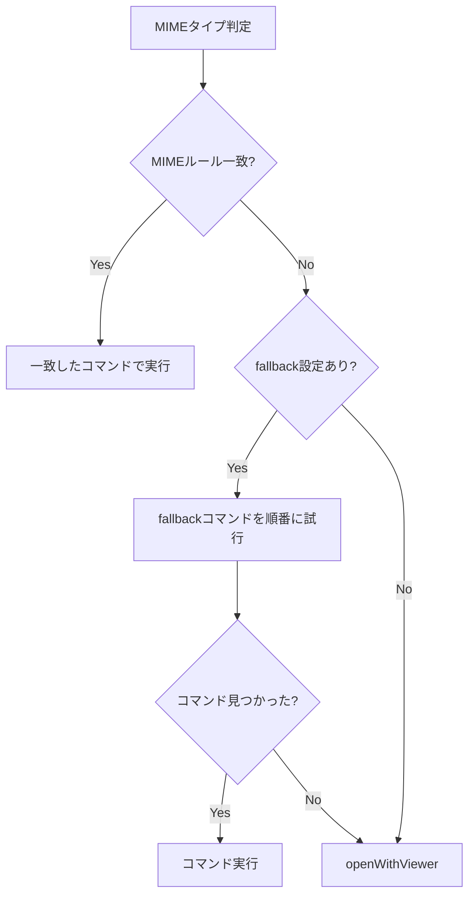

# MIME fallback設定 - 要件定義書

## 1. 概要

### 1.1 背景
現在のMIMEタイプ別Enter動作（`enter_behavior = "mime:"`）では、MIMEルールに一致しないファイルの場合、暗黙的に `$PAGER`/`less` にフォールバックする。ユーザーがフォールバック時のコマンドを設定する手段がない。

### 1.2 目的
`[enter_behavior_mime]` セクションに `fallback` キーを追加し、MIMEルールに一致しない場合のコマンドをユーザーが設定できるようにする。

### 1.3 スコープ
- `[enter_behavior_mime]` セクションへの `fallback` キーの追加
- `fallback` キーのデフォルト値の提供
- 設定ファイルマージ時の `fallback` キーの自動補完
- デフォルト設定テンプレートの更新

## 2. ビジネス要件

### 2.1 ビジネス目標
MIMEルールに一致しないファイルのフォールバック動作をユーザーが制御できるようにする。

### 2.2 対象ユーザー
| ユーザータイプ | 説明 |
|----------------|------|
| 一般ユーザー | MIMEルールに一致しないファイルを `xdg-open` 等で開きたい |
| 開発者 | フォールバック動作をカスタマイズしたい |

### 2.3 期待される効果
- MIMEルール未一致時の動作を明示的に制御可能
- 設定の意図が設定ファイル上で可視化される

## 3. ユースケース

### 3.1 ユースケース一覧
| ID | ユースケース名 | アクター | 優先度 |
|----|----------------|----------|--------|
| UC01 | fallbackコマンドでファイルを開く | ユーザー | 高 |
| UC02 | fallback未設定時のデフォルト動作 | ユーザー | 高 |
| UC03 | 設定マージによるfallback自動補完 | システム | 高 |

### 3.2 ユースケース詳細

#### UC01: fallbackコマンドでファイルを開く

**アクター**: ユーザー

**事前条件**:
- `enter_behavior = "mime:"` が設定されている
- `[enter_behavior_mime]` セクションに `fallback` が定義されている
- ファイルのMIMEタイプに一致するルールがない

**基本フロー**:
1. ユーザーがファイル上でEnterキーを押す
2. システムがファイルのMIMEタイプを判定する
3. 一致するMIMEルールが見つからない
4. `fallback` で指定されたコマンドを順番に試行する
5. 最初に見つかったコマンドでファイルを開く

**代替フロー**:
- `fallback` の全コマンドが見つからない場合: `$PAGER`/`less` で開く

**事後条件**:
- ファイルが `fallback` で指定されたアプリケーションで開かれる

#### UC02: fallback未設定時のデフォルト動作

**アクター**: ユーザー

**事前条件**:
- `enter_behavior = "mime:"` が設定されている
- `[enter_behavior_mime]` セクションに `fallback` がない

**基本フロー**:
1. 設定ファイル読み込み時に設定マージが実行される
2. `fallback = ["xdg-open"]` が自動的に追加される
3. 以降はUC01と同様に動作する

**事後条件**:
- `fallback` のデフォルト値が設定ファイルに追記される

#### UC03: 設定マージによるfallback自動補完

**アクター**: システム

**事前条件**:
- 設定ファイルに `[enter_behavior_mime]` セクションが存在する
- `fallback` キーが定義されていない

**基本フロー**:
1. 設定ファイル読み込み時にマージ処理が実行される
2. `[enter_behavior_mime]` セクション内に `fallback` がないことを検出する
3. セクション末尾に `fallback = ["xdg-open"]` を追記する

**事後条件**:
- 設定ファイルに `fallback` が追記されている

## 4. 機能要件

### 4.1 機能一覧
| ID | 機能名 | 説明 | 優先度 |
|----|--------|------|--------|
| F01 | fallbackキーのパース | `fallback` エントリの読み込みと分離 | 高 |
| F02 | fallbackによるファイル実行 | MIMEルール未一致時にfallbackコマンドを使用 | 高 |
| F03 | fallbackのデフォルト値 | デフォルトは `["xdg-open"]` | 高 |
| F04 | 設定マージでのfallback補完 | `fallback` 未設定時に自動追加 | 高 |
| F05 | デフォルト設定テンプレート更新 | `fallback` を含むテンプレートに変更 | 高 |

### 4.2 機能詳細

#### F01: fallbackキーのパース

**説明**: `[enter_behavior_mime]` セクション内の `fallback` キーをMIMEルールとは別に扱う。

**判定ルール**: キー名が `fallback` であれば特別キーとして抽出する。キーに `/` が含まれていればMIMEパターンとして扱う。それ以外のキーは不明なキーとして警告を生成しスキップする。

**入力**:
- `[enter_behavior_mime]` セクションの全エントリ

**出力**:
- `fallback`: []string - フォールバックコマンド配列
- `Rules`: map[string][]string - MIMEルールのみ（`fallback` を除外）

**バリデーション**:
| 項目 | ルール | エラーメッセージ |
|------|--------|------------------|
| fallback値 | 空配列でない | "empty command list for fallback, skipping" |

#### F02: fallbackによるファイル実行

**説明**: `openWithMIME` 関数で、MIMEルールに一致しない場合に `fallback` コマンドを使用する。

**処理フロー**:


**コマンド形式**: MIMEルールと同じ `["command", "arg1", ...]` 形式。`<filepath>` が自動的に末尾に追加される。

#### F03: fallbackのデフォルト値

**説明**: `fallback` のデフォルト値は `["xdg-open"]`。

#### F04: 設定マージでのfallback補完

**説明**: 設定マージ時に `fallback` キーの有無を確認し、不足時に追加する。

**マージ条件**:
| 状態 | 動作 |
|------|------|
| `[enter_behavior_mime]` セクション自体がない | デフォルトセクション全体を追加（`fallback` を含む） |
| `[enter_behavior_mime]` はあるが `fallback` がない | `fallback = ["xdg-open"]` を追記 |
| `fallback` が既に存在する | 何もしない |

#### F05: デフォルト設定テンプレート更新

**説明**: `generator.go` のデフォルト設定テンプレートを更新し、`fallback` を含むようにする。

**テンプレート**:
```toml
# MIME type based file opener
# Each entry maps a MIME type pattern to a list of commands.
# Commands are tried in order; first available command is used.
# Format: ["command", "arg1", "arg2", ...] -> executes: command arg1 arg2 <filepath>
[enter_behavior_mime]
#"text/*" = ["vim", "-R"]
fallback = ["xdg-open"]
```

## 5. 非機能要件

### 5.1 パフォーマンス要件
- fallbackキー判定: O(1)（キー名の文字列比較および `/` の有無チェック）
- 既存のMIMEタイプ判定性能に影響なし

### 5.2 セキュリティ要件
- コマンドはシェル経由で実行しない（直接exec）
- 既存のセキュリティモデルを踏襲

### 5.3 保守性要件
- 既存のMIMEルール処理との一貫性を維持
- `fallback` はMIMEルールと同じコマンド配列形式

## 6. データ要件

### 6.1 データ構造変更

```go
type MIMEBehaviorConfig struct {
    Rules    map[string][]string // MIMEタイプ -> コマンド配列
    Fallback []string            // フォールバックコマンド配列
}
```

### 6.2 設定ファイル形式

```toml
[enter_behavior_mime]
"text/*" = ["less"]
"image/*" = ["feh", "xdg-open"]
fallback = ["xdg-open"]
```

## 7. 制約条件

### 7.1 技術的制約
- `fallback` キーはキー名で明示的に識別し、MIMEパターン（`/` を含むキー）と区別する
- 既存の `MIMEBehaviorConfig.Rules` マップから `fallback` を分離する必要がある
- 不明なキー（`fallback` でもMIMEパターンでもない）には警告を生成する

### 7.2 ビジネス上の制約
- 既存の `enter_behavior = "mime:"` 設定との後方互換性を維持
- `fallback` 未設定の既存設定ファイルが正常に動作すること

## 8. 成功基準

### 8.1 受け入れ基準
- [ ] `fallback` キーが `[enter_behavior_mime]` セクションからパースされる
- [ ] `fallback` がMIMEルールと分離して保持される
- [ ] MIMEルール未一致時に `fallback` コマンドが使用される
- [ ] `fallback` の全コマンドが見つからない場合、`$PAGER`/`less` にフォールバックする
- [ ] 設定マージで `fallback` が自動補完される
- [ ] デフォルトテンプレートに `fallback` が含まれる
- [ ] 既存の設定ファイルとの後方互換性が維持される

### 8.2 KPI
| 指標 | 目標値 | 測定方法 |
|------|--------|----------|
| fallbackパース正確性 | 100% | ユニットテスト |
| 設定マージ正確性 | 100% | ユニットテスト |

## 9. テストシナリオ

### 9.1 テスト観点
- [ ] 正常系: fallbackコマンドでファイルが開かれる
- [ ] 正常系: fallbackの最初のコマンドが見つかる
- [ ] 正常系: fallbackの2番目以降のコマンドにフォールバック
- [ ] 正常系: MIMEルール一致時はfallbackは使用されない
- [ ] 異常系: fallbackの全コマンドが見つからない場合、$PAGER/lessにフォールバック
- [ ] 異常系: fallback未設定でも設定マージで補完される
- [ ] 境界値: 空のfallback配列
- [ ] マージ: セクションなし -> セクション全体追加（fallback含む）
- [ ] マージ: セクションありfallbackなし -> fallback追記
- [ ] マージ: fallback既存 -> 変更なし

## 10. 用語定義

| 用語 | 定義 |
|------|------|
| fallback | MIMEルールに一致しない場合に使用するコマンド設定 |
| MIMEルール | MIMEタイプパターンとコマンドのマッピング（`/` を含むキー） |

## 11. 確認事項

### 11.1 確認済み事項

- [x] fallbackのデフォルト値: `["xdg-open"]`
- [x] fallbackのコマンド形式: MIMEルールと同じ配列形式
- [x] fallbackキーの判別方法: キー名が正確に `fallback` であること（その他の非MIMEキーは警告してスキップ）
- [x] 設定マージの動作: セクション有無とfallback有無の2段階チェック
- [x] デフォルトテンプレート: `[enter_behavior_mime]` を非コメント化し `fallback` を含む
- [x] `openWithMIME` の変更: fallbackコマンドを `openWithViewer` の代わりに使用

### 11.2 未確認・保留事項

（なし）

## 12. 参考資料

- 既存仕様: `doc/tasks/mime-enter-behavior/SPEC.md`
- 既存要件定義: `doc/tasks/mime-enter-behavior/要件定義書.md`
- 設定マージ実装: `internal/config/merger.go`
- 設定テンプレート: `internal/config/generator.go`
- MIME処理実装: `internal/config/mime.go`
- 実行ヘルパー: `internal/ui/exec.go`
