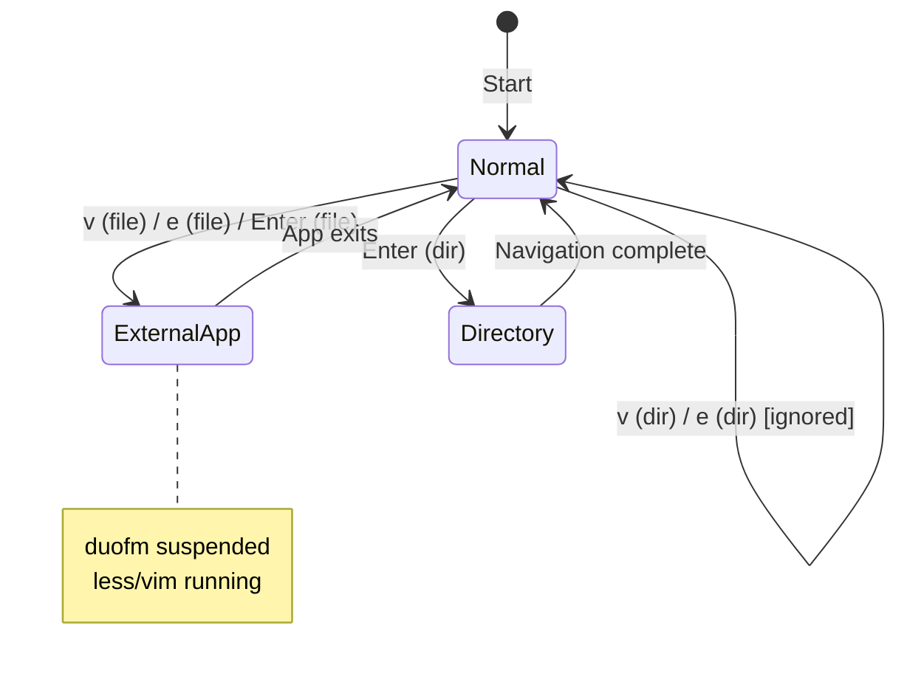
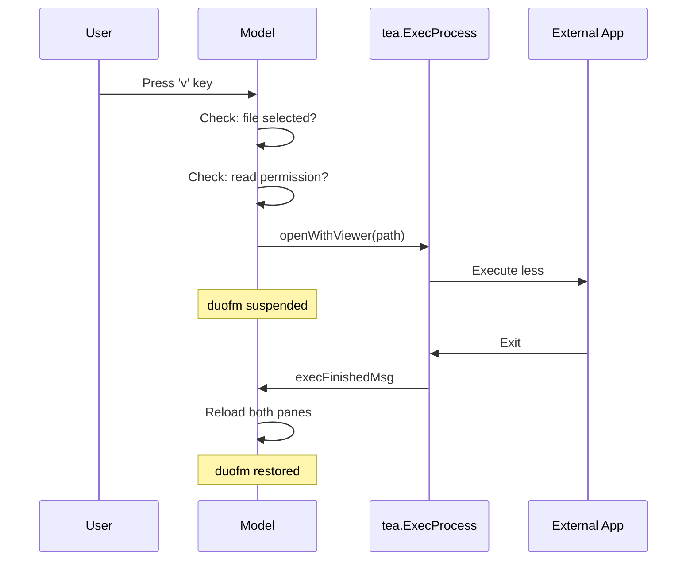

# Feature: Open File with External Application

## Overview

Implement the ability to open files with external applications (viewer/editor) from duofm. Users can view files with `less` using `v` key or `Enter`, and edit files with `vim` using `e` key.

## Objectives

- Enable seamless file viewing and editing from within duofm
- Provide quick keyboard-driven workflow for opening files
- Maintain consistent behavior with existing navigation

## User Stories

- As a user, I want to press `v` to view a file with less, so that I can quickly browse file contents
- As a user, I want to press `e` to edit a file with vim, so that I can make changes without leaving duofm
- As a user, I want to press `Enter` on a file to view it (same as `v`), so that I have a natural way to "open" files

## Technical Requirements

### Key Bindings

| Key | Target | Action |
|-----|--------|--------|
| `v` | File | Open with `less` |
| `v` | Directory | Ignore (no action) |
| `e` | File | Open with `vim` |
| `e` | Directory | Ignore (no action) |
| `Enter` | File | Open with `less` (same as `v`) |
| `Enter` | Directory | Enter directory (existing behavior) |

### External Application Execution

- **Viewer**: `less` command
- **Editor**: `vim` command
- duofm screen temporarily hides during external app execution
- Screen restores after external app exits

### Directory Reload

- Both active and inactive panes reload automatically after external app exits
- This ensures any changes made in vim (new files, edits) are immediately visible

### Error Handling

| Condition | Behavior |
|-----------|----------|
| File not readable | Display error in status bar |
| less/vim not found | Attempt to execute, shell error displayed |
| Parent directory entry (..) selected | Ignore (no action) |

## Implementation Approach

### Architecture

```
internal/ui/
├── keys.go           # Add KeyView, KeyEdit
├── model.go          # Add view/edit key handlers
└── exec.go           # NEW: External command execution
```

### Key Constants

```go
// keys.go
const (
    // ... existing keys
    KeyView = "v"  // View file with less
    KeyEdit = "e"  // Edit file with vim
)
```

### External Command Execution

The implementation uses Bubble Tea's `tea.ExecProcess` to suspend the TUI and run external commands:

```go
// exec.go
package ui

import (
    "os"
    "os/exec"
    "path/filepath"

    tea "github.com/charmbracelet/bubbletea"
)

// execFinishedMsg is sent when external command completes
type execFinishedMsg struct {
    err error
}

// openWithViewer opens the file with less
func openWithViewer(path string) tea.Cmd {
    c := exec.Command("less", path)
    return tea.ExecProcess(c, func(err error) tea.Msg {
        return execFinishedMsg{err: err}
    })
}

// openWithEditor opens the file with vim
func openWithEditor(path string) tea.Cmd {
    c := exec.Command("vim", path)
    return tea.ExecProcess(c, func(err error) tea.Msg {
        return execFinishedMsg{err: err}
    })
}
```

### Model Update Handler

```go
// model.go

func (m Model) Update(msg tea.Msg) (tea.Model, tea.Cmd) {
    // Handle external command completion
    if result, ok := msg.(execFinishedMsg); ok {
        // Reload both panes to reflect any changes
        m.getActivePane().LoadDirectory()
        m.getInactivePane().LoadDirectory()

        if result.err != nil {
            m.statusMessage = fmt.Sprintf("Command failed: %v", result.err)
            m.isStatusError = true
            return m, statusMessageClearCmd(5 * time.Second)
        }
        return m, nil
    }

    // ... existing message handling ...

    switch msg := msg.(type) {
    case tea.KeyMsg:
        // ... existing dialog and search handling ...

        switch msg.String() {
        // ... existing key handlers ...

        case KeyView:
            // View file with less
            entry := m.getActivePane().SelectedEntry()
            if entry != nil && !entry.IsParentDir() && !entry.IsDir {
                // Check read permission
                fullPath := filepath.Join(m.getActivePane().Path(), entry.Name)
                if err := checkReadPermission(fullPath); err != nil {
                    m.statusMessage = fmt.Sprintf("Cannot read file: %v", err)
                    m.isStatusError = true
                    return m, statusMessageClearCmd(5 * time.Second)
                }
                return m, openWithViewer(fullPath)
            }
            return m, nil

        case KeyEdit:
            // Edit file with vim
            entry := m.getActivePane().SelectedEntry()
            if entry != nil && !entry.IsParentDir() && !entry.IsDir {
                fullPath := filepath.Join(m.getActivePane().Path(), entry.Name)
                if err := checkReadPermission(fullPath); err != nil {
                    m.statusMessage = fmt.Sprintf("Cannot read file: %v", err)
                    m.isStatusError = true
                    return m, statusMessageClearCmd(5 * time.Second)
                }
                return m, openWithEditor(fullPath)
            }
            return m, nil

        case KeyEnter:
            entry := m.getActivePane().SelectedEntry()
            if entry != nil && !entry.IsParentDir() && !entry.IsDir {
                // File selected: open with viewer (same as v key)
                fullPath := filepath.Join(m.getActivePane().Path(), entry.Name)
                if err := checkReadPermission(fullPath); err != nil {
                    m.statusMessage = fmt.Sprintf("Cannot read file: %v", err)
                    m.isStatusError = true
                    return m, statusMessageClearCmd(5 * time.Second)
                }
                return m, openWithViewer(fullPath)
            }
            // Directory or parent dir: existing behavior
            cmd := m.getActivePane().EnterDirectoryAsync()
            return m, cmd
        }
    }

    return m, nil
}

// checkReadPermission verifies the file can be read
func checkReadPermission(path string) error {
    f, err := os.Open(path)
    if err != nil {
        return err
    }
    f.Close()
    return nil
}
```

### State Diagram



### Data Flow



## Dependencies

- Go standard library `os/exec`
- Bubble Tea's `tea.ExecProcess` for TUI suspension
- External commands: `less`, `vim`

## Test Scenarios

### Basic Functionality

- [ ] `v` on text file opens less
- [ ] `e` on text file opens vim
- [ ] `Enter` on text file opens less
- [ ] `Enter` on directory enters it (existing behavior preserved)

### Directory Handling

- [ ] `v` on directory: no action
- [ ] `e` on directory: no action

### Parent Directory Entry

- [ ] `v` on `..`: no action
- [ ] `e` on `..`: no action
- [ ] `Enter` on `..`: navigates to parent (existing behavior)

### Error Handling

- [ ] File without read permission: status bar error
- [ ] less not installed: shell error displayed
- [ ] vim not installed: shell error displayed

### Screen Restoration

- [ ] After exiting less: duofm fully restored
- [ ] After exiting vim: duofm fully restored
- [ ] After editing: file list reflects changes

### Pane Reload

- [ ] Active pane reloads after external app exits
- [ ] Inactive pane reloads after external app exits

## Success Criteria

- [ ] `v` key opens file with less
- [ ] `e` key opens file with vim
- [ ] `Enter` key on file opens with less
- [ ] `v`/`e` keys ignored for directories
- [ ] `Enter` on directory maintains existing behavior
- [ ] Both panes reload after external app exits
- [ ] Permission errors show in status bar
- [ ] All existing functionality unaffected
- [ ] Unit tests pass

## Security Considerations

- File paths are constructed using `filepath.Join` to prevent path traversal
- Read permission is checked before executing external command
- Only predetermined commands (`less`, `vim`) are executed

## Performance Optimization

- No performance impact during normal operation
- External command execution is handled by the OS

## Error Handling

| Error | User Feedback |
|-------|---------------|
| `os.Open` fails | Status bar: "Cannot read file: [error]" |
| External command fails | Status bar: "Command failed: [error]" |
| Command not found | Shell displays "command not found" error |

## Open Questions

None - all requirements have been clarified.

## Future Enhancements (Out of Scope)

- Configuration file for viewer/editor selection
- MIME type-based application selection
- File extension-based application selection
- Custom command templates
