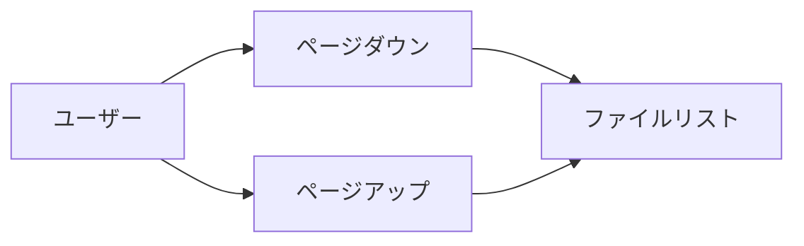
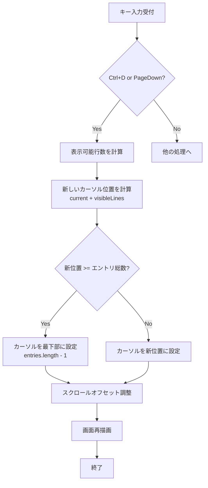
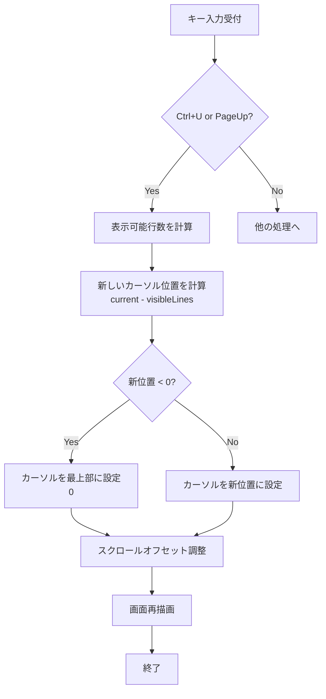
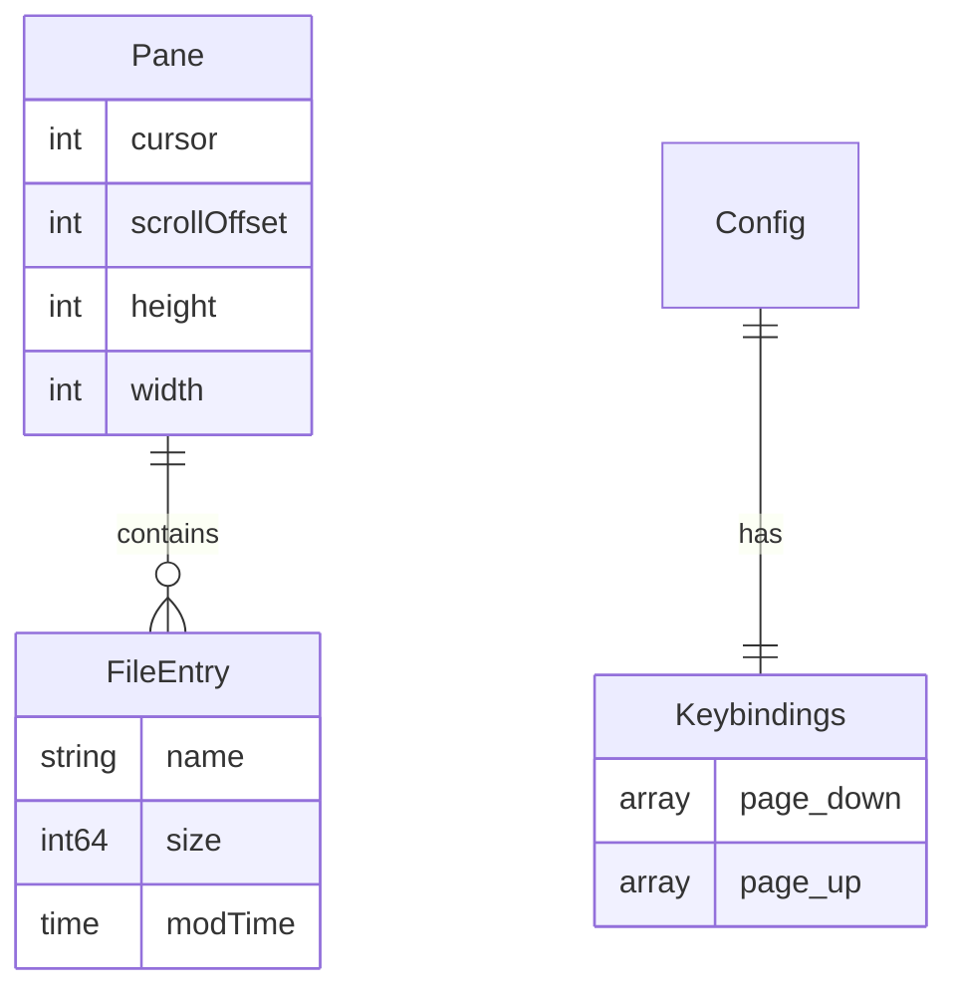

# ページスクロール機能 - 要件定義書

## 1. 概要

### 1.1 背景
duofmのファイル一覧画面では、現在`j`/`k`キーで1行ずつカーソルを移動できるが、多数のファイルが存在するディレクトリでは効率的な移動が困難である。Vimライクなページスクロール機能（Ctrl+U/Ctrl+D）を追加することで、大きなファイルリストでの操作性を向上させる。

### 1.2 目的
- 大量のファイルが存在するディレクトリでの効率的なナビゲーションを実現する
- Vimユーザーに馴染みのある操作感を提供する
- 既存の1行移動（j/k）との組み合わせで、柔軟な移動手段を提供する
- スクロール可能なダイアログにも統一された操作感を提供する

### 1.3 スコープ
このタスクの対象範囲は以下の通り：

**対象：**
- ファイル一覧ペインのページスクロール機能
- スクロール可能なダイアログのページスクロール機能
- 設定ファイルによるキーバインドのカスタマイズ対応

**対象外：**
- 検索結果のページング（別機能として扱う）
- マウスホイールによるスクロール（将来的な拡張）

## 2. ビジネス要件

### 2.1 ビジネス目標
- ファイルマネージャとしての操作効率を向上させる
- Vimユーザーを含むパワーユーザーの満足度を高める
- TUIアプリケーションとしての使い勝手を業界標準に合わせる

### 2.2 対象ユーザー
| ユーザータイプ | 説明 |
|----------------|------|
| 一般ユーザー | 大量のファイルを扱う開発者やシステム管理者 |
| Vimユーザー | Vimのキーバインドに慣れ親しんだユーザー |
| パワーユーザー | キーボード操作のみで効率的に作業したいユーザー |

### 2.3 期待される効果
- 大規模ディレクトリ（100ファイル以上）での移動時間を大幅に短縮
- ユーザーの学習コストを低減（Vimと同じキーバインド）
- 操作の一貫性向上（ダイアログでも同じ操作）

## 3. ユースケース

### 3.1 ユースケース一覧
| ID | ユースケース名 | アクター | 優先度 |
|----|----------------|----------|--------|
| UC01 | ファイルリストのページダウン | ユーザー | 高 |
| UC02 | ファイルリストのページアップ | ユーザー | 高 |
| UC03 | リスト端での境界処理 | ユーザー | 高 |
| UC04 | ダイアログでのページスクロール | ユーザー | 中 |

### 3.2 ユースケース詳細

#### UC01: ファイルリストのページダウン

**アクター**: ユーザー

**事前条件**:
- duofmが起動している
- アクティブペインにファイルが表示されている
- ダイアログが開いていない

**基本フロー**:
1. ユーザーが`Ctrl+D`または`PageDown`を押下
2. システムはカーソルを現在の表示行数分下に移動
3. カーソル位置に合わせてスクロールオフセットを調整
4. 画面を再描画して新しいカーソル位置を表示

**代替フロー**:
- **AF01-1**: カーソルが既にリストの最下部にある場合
  - システムは何もせず、カーソルは最下部に留まる
- **AF01-2**: 移動量が残りのエントリ数より多い場合
  - カーソルはリストの最下部（最後のエントリ）に移動

**事後条件**:
- カーソルが下方向に移動した状態
- 移動後のエントリが表示範囲内に収まっている

**ユースケース図**:


#### UC02: ファイルリストのページアップ

**アクター**: ユーザー

**事前条件**:
- duofmが起動している
- アクティブペインにファイルが表示されている
- ダイアログが開いていない

**基本フロー**:
1. ユーザーが`Ctrl+U`または`PageUp`を押下
2. システムはカーソルを現在の表示行数分上に移動
3. カーソル位置に合わせてスクロールオフセットを調整
4. 画面を再描画して新しいカーソル位置を表示

**代替フロー**:
- **AF02-1**: カーソルが既にリストの最上部にある場合
  - システムは何もせず、カーソルは最上部に留まる
- **AF02-2**: 移動量がカーソルより上のエントリ数より多い場合
  - カーソルはリストの最上部（最初のエントリ）に移動

**事後条件**:
- カーソルが上方向に移動した状態
- 移動後のエントリが表示範囲内に収まっている

#### UC03: リスト端での境界処理

**アクター**: ユーザー

**事前条件**:
- カーソルがリストの端（最上部または最下部）にある

**基本フロー**:
1. ユーザーがさらに同じ方向へのページスクロールを試みる
2. システムはカーソル位置を変更しない
3. 画面は再描画されるが、表示内容は変わらない

**事後条件**:
- カーソルは端の位置に留まる
- エラーメッセージは表示されない

#### UC04: ダイアログでのページスクロール

**アクター**: ユーザー

**事前条件**:
- スクロール可能なダイアログが表示されている（例：エラーレポートダイアログ）
- ダイアログの内容が表示領域を超えている

**基本フロー**:
1. ユーザーが`Ctrl+D`/`Ctrl+U`または`PageDown`/`PageUp`を押下
2. ダイアログはスクロールオフセットを調整
3. ダイアログ内容が上下にスクロール

**代替フロー**:
- **AF04-1**: 内容が1画面内に収まる場合
  - スクロールは発生しない

**事後条件**:
- ダイアログの表示位置が変更された

## 4. 機能要件

### 4.1 機能一覧
| ID | 機能名 | 説明 | 優先度 |
|----|--------|------|--------|
| F01 | ページダウン機能 | Ctrl+D/PageDownでページダウン | 高 |
| F02 | ページアップ機能 | Ctrl+U/PageUpでページアップ | 高 |
| F03 | キーバインド設定 | 設定ファイルでキー変更可能 | 中 |
| F04 | ダイアログ対応 | スクロール可能なダイアログで同じ操作 | 中 |

### 4.2 機能詳細

#### F01: ページダウン機能

**説明**: アクティブペインのカーソルを1ページ分（表示行数分）下に移動する

**入力**:
- キー入力: `Ctrl+D` または `PageDown`

**出力**:
- カーソル位置の更新
- 画面の再描画

**処理フロー**:


**ビジネスルール**:
- 1ページの行数 = ペインの高さ - ヘッダー行数（4行）
- 最小移動量: 1行（ペインが極端に小さい場合）
- カーソルは常にエントリの範囲内（0 ≤ cursor < entries.length）

**バリデーション**:
| 項目 | ルール | エラーメッセージ |
|------|--------|------------------|
| エントリ数 | 1以上 | なし（空の場合は操作無効） |
| カーソル位置 | 0以上、エントリ数未満 | なし（内部で自動調整） |

**エラーケース**:
| エラー | 条件 | 対応 |
|--------|------|------|
| 空ディレクトリ | エントリ数が0 | 操作を無視 |
| 最下部到達 | cursor == entries.length-1 | カーソル位置を維持 |

#### F02: ページアップ機能

**説明**: アクティブペインのカーソルを1ページ分（表示行数分）上に移動する

**入力**:
- キー入力: `Ctrl+U` または `PageUp`

**出力**:
- カーソル位置の更新
- 画面の再描画

**処理フロー**:


**ビジネスルール**:
- 1ページの行数 = ペインの高さ - ヘッダー行数（4行）
- 最小移動量: 1行（ペインが極端に小さい場合）
- カーソルは常にエントリの範囲内（0 ≤ cursor < entries.length）

**バリデーション**:
| 項目 | ルール | エラーメッセージ |
|------|--------|------------------|
| エントリ数 | 1以上 | なし（空の場合は操作無効） |
| カーソル位置 | 0以上、エントリ数未満 | なし（内部で自動調整） |

**エラーケース**:
| エラー | 条件 | 対応 |
|--------|------|------|
| 空ディレクトリ | エントリ数が0 | 操作を無視 |
| 最上部到達 | cursor == 0 | カーソル位置を維持 |

#### F03: キーバインド設定

**説明**: ユーザーが設定ファイルでページスクロールのキーバインドをカスタマイズできる

**入力**:
- 設定ファイル（config.toml）のkeybindingsセクション

**出力**:
- カスタマイズされたキーバインドマップ

**設定例**:
```toml
[keybindings]
page_down = ["Ctrl+D", "PageDown"]
page_up = ["Ctrl+U", "PageUp"]
```

**ビジネスルール**:
- アクション名: `page_down` / `page_up`
- 複数のキーを割り当て可能
- デフォルト値: `page_down = ["Ctrl+D", "PageDown"]`, `page_up = ["Ctrl+U", "PageUp"]`
- 無効なキー指定は無視される

#### F04: ダイアログ対応

**説明**: スクロール可能なダイアログでも同じキーバインドでページスクロール可能

**対象ダイアログ**:
- PermissionErrorReportDialog（既に実装済み）
- HelpDialog
- 将来追加される長いコンテンツを持つダイアログ

**処理**:
- ダイアログが`scrollOffset`フィールドを持つ場合、ページスクロールをサポート
- スクロール量はダイアログの表示高さに基づく

## 5. 非機能要件

### 5.1 パフォーマンス要件
- レスポンスタイム: キー入力から画面更新まで < 50ms（体感的に即座）
- 大規模ディレクトリ: 10,000ファイルでも同等のパフォーマンス
- メモリ使用量: 追加のメモリオーバーヘッドなし（計算のみ）

### 5.2 ユーザビリティ要件
- 学習容易性: Vimユーザーはドキュメント不要で使用可能
- 操作一貫性: すべてのスクロール可能なUIで同じキーバインド
- フィードバック: スクロール動作は視覚的に明確（カーソル位置の変化）

### 5.3 互換性要件
- 既存のキーバインド: 既存の`j`/`k`、矢印キーとの共存
- 端末互換性: すべての一般的な端末エミュレータで動作
- 設定互換性: 既存の設定ファイルとの後方互換性を維持

### 5.4 保守性要件
- コードの再利用: 既存の`MoveCursorUp`/`MoveCursorDown`の実装パターンを踏襲
- テスト容易性: ユニットテストとE2Eテストで動作検証可能
- 拡張性: 将来的な他のスクロール機能の追加を妨げない設計

## 6. データ要件

### 6.1 データモデル概要


### 6.2 データ項目

#### Paneの状態
| 項目名 | 型 | 必須 | 説明 |
|--------|-----|------|------|
| cursor | int | ○ | 現在のカーソル位置（0-based） |
| scrollOffset | int | ○ | スクロールオフセット（表示開始位置） |
| height | int | ○ | ペインの高さ（行数） |
| entries | []FileEntry | ○ | 表示するファイルエントリのリスト |

#### 設定ファイル
| 項目名 | 型 | 必須 | デフォルト値 |
|--------|-----|------|-------------|
| keybindings.page_down | []string | × | ["Ctrl+D", "PageDown"] |
| keybindings.page_up | []string | × | ["Ctrl+U", "PageUp"] |

## 7. 外部連携

なし（すべて内部機能）

## 8. 制約条件

### 8.1 技術的制約
- Bubble Teaフレームワークの制約に従う
- Go言語の標準的なコーディング規約に準拠
- 既存のアーキテクチャパターンを維持

### 8.2 ビジネス上の制約
- 既存ユーザーの操作感を損なわない
- 既存の設定ファイルとの互換性を維持

### 8.3 スケジュール制約
- 単一機能のため、短期間（1-2日）で実装完了が望ましい

## 9. 想定される課題とリスク

### 9.1 技術的課題
| 課題 | 影響度 | 対応策 |
|------|--------|--------|
| 極端に小さいペイン | 低 | 最小移動量を1行に設定 |
| ダイアログごとの実装差異 | 中 | 共通インターフェースの定義 |

### 9.2 ビジネスリスク
| リスク | 発生確率 | 影響度 | 対応策 |
|--------|----------|--------|--------|
| Vimと動作が異なる | 低 | 低 | Vimの動作を参考に設計 |
| 端末でキーが動作しない | 低 | 中 | 代替キー（PageUp/Down）を提供 |

## 10. 成功基準

### 10.1 受け入れ基準
- [x] Ctrl+Dでページダウンが動作する
- [x] Ctrl+Uでページアップが動作する
- [x] PageDown/PageUpキーでも同じ動作をする
- [x] リストの端で適切に停止する
- [x] 設定ファイルでキーバインドを変更できる
- [x] ダイアログでも同じキーで操作できる
- [x] すべてのユニットテストがパスする
- [x] E2Eテストで実際の操作を検証できる

### 10.2 KPI
| 指標 | 目標値 | 測定方法 |
|------|--------|----------|
| 大規模ディレクトリでの移動時間 | 既存の50%以下 | 手動計測（1000行移動） |
| レスポンスタイム | < 50ms | プロファイリング |
| テストカバレッジ | > 80% | go test -cover |

## 11. テストシナリオ

### 11.1 テスト観点
- [x] 正常系: Ctrl+Dでページダウン、Ctrl+Uでページアップ
- [x] 正常系: PageDownキー、PageUpキーでの動作
- [x] 境界値: リストの最上部でページアップ（動作なし）
- [x] 境界値: リストの最下部でページダウン（動作なし）
- [x] 境界値: ファイル数が表示行数より少ない場合
- [x] 境界値: 空ディレクトリ（エントリ0件）
- [x] 異常系: ペインの高さが極端に小さい（最小1行移動）
- [x] 統合: ダイアログでのページスクロール
- [x] 統合: 既存のj/k操作との併用
- [x] 設定: カスタムキーバインドの動作

## 12. 用語定義

| 用語 | 定義 |
|------|------|
| ページスクロール | 画面に表示されている行数分のカーソル移動 |
| アクティブペイン | 現在操作対象となっている左右いずれかのペイン |
| カーソル | ファイルリスト内の現在選択位置を示すインデックス |
| スクロールオフセット | 表示領域の先頭に表示されるエントリのインデックス |
| 表示可能行数 | ペインの高さからヘッダーを除いた行数 |

## 13. 確認事項

### 13.1 確認済み事項
- [x] ページの定義: 現在表示されている行数分の移動
- [x] 境界動作: 最上部/最下部で停止する
- [x] PageUp/PageDownキー: Ctrl+U/Ctrl+Dと同じ動作を割り当てる
- [x] ダイアログ対応: スクロール可能なダイアログでも同じキーバインドを使用
- [x] 設定可能性: config.tomlでキーバインドをカスタマイズ可能
- [x] アクション名: `page_down` / `page_up`

### 13.2 未確認・保留事項
なし（すべての要件が確認済み）

## 14. 参考資料

- Vimドキュメント: `CTRL-D` / `CTRL-U` の動作
- Bubble Teaドキュメント: https://github.com/charmbracelet/bubbletea
- duofm既存実装: `internal/ui/pane.go` の `MoveCursorUp`/`MoveCursorDown`
