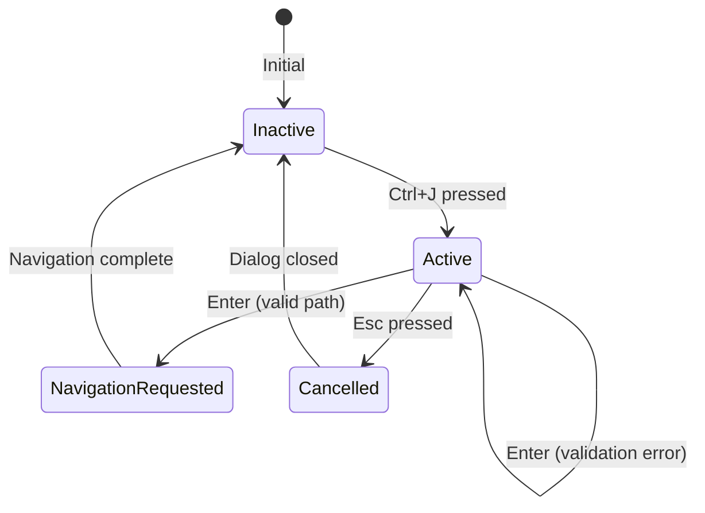

# Feature: Path Jump Dialog

## Overview

The Path Jump Dialog allows users to navigate directly to any directory by typing a full path. It provides bash-style inline autocompletion with real-time suggestions from the filesystem, enabling efficient navigation without requiring bookmarks.

## Domain Rules

- Path must be an absolute path (starting with `/`)
- Only directories are valid jump targets (not files)
- Suggestions must come from actual filesystem subdirectories
- Tab key is the only way to confirm suggestions (not arrow keys)
- Dialog must remain open on validation errors to allow correction

## Objectives

- Enable direct navigation to any directory via full path input
- Provide bash-style inline autocompletion for efficient path entry
- Maintain consistency with existing dialog patterns (InputDialog, BookmarkDialog)
- Support keyboard-driven workflow without mouse interaction

## User Stories

### US1: Jump to Directory by Full Path
As a power user, I want to type a full path and press Enter to navigate directly to that directory, so that I can quickly access deeply nested directories without multiple navigation steps.

**Acceptance Criteria:**
- [ ] Ctrl+J opens the path jump dialog
- [ ] Typing a valid directory path and pressing Enter navigates to that directory
- [ ] Dialog closes after successful navigation

### US2: Use Autocomplete for Path Entry
As a user, I want to see directory suggestions while typing, so that I can complete paths quickly without memorizing full paths.

**Acceptance Criteria:**
- [ ] Typing partial path shows suggestion inline (grayed out)
- [ ] Pressing Tab completes the current suggestion
- [ ] Suggestions update as user types
- [ ] Only directories are suggested (not files)

### US3: Handle Invalid Paths Gracefully
As a user, I want to see clear error messages when I enter an invalid path, so that I can correct my input without losing my progress.

**Acceptance Criteria:**
- [ ] Error message appears for non-existent paths
- [ ] Error message appears when path is a file (not directory)
- [ ] Dialog remains open after error
- [ ] Error clears on next keystroke

### US4: Cancel Navigation
As a user, I want to cancel the dialog without navigating, so that I can abort if I change my mind.

**Acceptance Criteria:**
- [ ] Pressing Esc closes the dialog without navigation
- [ ] Current directory remains unchanged after cancel

## Technical Requirements

### Functional Requirements

- **FR1:** Dialog opens when Ctrl+J is pressed and no other dialog is active
- **FR2:** Input field accepts absolute paths (starting with `/`)
- **FR3:** Real-time filesystem lookup for directory suggestions
- **FR4:** Inline suggestion display (grayed out portion after cursor)
- **FR5:** Tab key confirms current suggestion and updates input
- **FR6:** Enter key validates path and triggers navigation if valid
- **FR7:** Esc key cancels dialog and sends cancellation message
- **FR8:** Error display for invalid paths (non-existent, file, empty)
- **FR9:** Error message clears on subsequent keystrokes

### Non-Functional Requirements

- **NFR1 - Performance:** Suggestion lookup completes within 100ms
- **NFR2 - Performance:** Dialog renders within 50ms
- **NFR3 - Usability:** Follows bash Tab completion mental model
- **NFR4 - Maintainability:** Extends BaseDialog and follows existing patterns
- **NFR5 - Reliability:** Never crashes; handles all filesystem errors gracefully

## Implementation Approach

### Architecture

**Component Structure:**
```
┌─────────────────────────────────────────┐
│            Model (model.go)             │
│  - Handles Ctrl+J keypress              │
│  - Creates PathJumpDialog               │
│  - Processes result/cancel messages     │
├─────────────────────────────────────────┤
│       PathJumpDialog (new file)         │
│  - Extends BaseDialog                   │
│  - Manages input state                  │
│  - Handles Tab/Enter/Esc keys           │
│  - Renders dialog with suggestions      │
├─────────────────────────────────────────┤
│     PathSuggester (helper component)    │
│  - Filesystem lookup                    │
│  - Directory filtering                  │
│  - Prefix matching                      │
└─────────────────────────────────────────┘
```

### State Machine



### Data Flow

```
User Input (Ctrl+J)
    → Model creates PathJumpDialog
    → Dialog renders with empty input

User types characters
    → Dialog.Update() processes input
    → PathSuggester.Suggest() returns completion
    → Dialog.View() renders input + grayed suggestion

User presses Tab
    → Dialog.Update() confirms suggestion
    → Input updated with completed path
    → New suggestion calculated

User presses Enter
    → Dialog.Update() validates path
    → If valid: returns pathJumpResultMsg
    → If invalid: sets error message

Model receives pathJumpResultMsg
    → Model changes pane directory
    → Model clears dialog
```

### Message Types

```go
// pathJumpResultMsg is sent when user confirms a valid path
type pathJumpResultMsg struct {
    path string
}

// pathJumpCancelMsg is sent when user cancels the dialog
type pathJumpCancelMsg struct{}
```

### Key Bindings

Add to `internal/ui/actions.go`:
```go
ActionPathJump // Jump to directory by path
```

Add to `internal/config/defaults.go`:
```go
"path_jump": {"Ctrl+J"}
```

### File Structure

```
internal/ui/
├── path_jump_dialog.go           # Dialog implementation
├── path_jump_dialog_test.go      # Unit tests
├── path_suggester.go             # Filesystem suggestion logic
├── path_suggester_test.go        # Suggestion tests
├── actions.go                    # Add ActionPathJump
├── model_update_keyboard.go      # Add Ctrl+J handling
└── model.go                      # Add message handlers

internal/config/
└── defaults.go                   # Add "path_jump" keybinding
```

### Dialog Implementation Pattern

Following `input_dialog.go` and `bookmark_dialog.go` patterns:

```go
type PathJumpDialog struct {
    BaseDialog
    textInput    *TextInput
    suggester    *PathSuggester
    suggestion   string           // Current suggestion (suffix only)
    errorMsg     string
    styles       DialogStyles
}

func NewPathJumpDialog() *PathJumpDialog {
    base := NewBaseDialog(DialogDisplayPane)
    return &PathJumpDialog{
        BaseDialog: base,
        textInput:  NewTextInput(""),
        suggester:  NewPathSuggester(),
        styles:     DefaultDialogStyles(base.Width()),
    }
}
```

### Suggestion Algorithm

```
Input: "/home/us"

1. Split by last "/": parent="/home", prefix="us"
2. Read directory "/home"
3. Filter: directories only, starting with "us"
4. Sort alphabetically
5. Take first match: "user"
6. Return suggestion suffix: "er"

Display: "/home/us" + "er" (grayed)
```

### Error Handling

| Error Condition | Error Message | Recovery |
|-----------------|---------------|----------|
| Empty input | "Path cannot be empty" | Continue editing |
| Path not found | "Directory does not exist: {path}" | Continue editing |
| Path is file | "Not a directory: {path}" | Continue editing |
| Permission denied | "Permission denied: {path}" | Continue editing |

### Keyboard Handling

| Key | Action |
|-----|--------|
| Characters | Append to input, update suggestion |
| Backspace | Delete character before cursor, update suggestion |
| Delete | Delete character at cursor, update suggestion |
| Left/Right | Move cursor (no suggestion change) |
| Tab | Confirm suggestion if present |
| Enter | Validate and submit if valid |
| Esc | Cancel and close dialog |
| Ctrl+A | Move cursor to start |
| Ctrl+E | Move cursor to end |

## Test Scenarios

### Unit Tests

- [ ] `TestPathJumpDialog_NewDialog` - Dialog initializes correctly
- [ ] `TestPathJumpDialog_TabCompletion` - Tab confirms suggestion
- [ ] `TestPathJumpDialog_TabNoSuggestion` - Tab does nothing without suggestion
- [ ] `TestPathJumpDialog_EnterValidPath` - Enter with valid path sends result message
- [ ] `TestPathJumpDialog_EnterInvalidPath` - Enter with invalid path shows error
- [ ] `TestPathJumpDialog_EnterEmptyPath` - Enter with empty path shows error
- [ ] `TestPathJumpDialog_EscCancel` - Esc sends cancel message
- [ ] `TestPathJumpDialog_ErrorClearsOnInput` - Error message clears on keystroke
- [ ] `TestPathJumpDialog_InactiveIgnoresInput` - Inactive dialog ignores all input

### PathSuggester Tests

- [ ] `TestPathSuggester_BasicCompletion` - Returns correct suffix
- [ ] `TestPathSuggester_NoMatch` - Returns empty when no match
- [ ] `TestPathSuggester_DirectoriesOnly` - Ignores files
- [ ] `TestPathSuggester_HiddenDirs` - Includes hidden directories
- [ ] `TestPathSuggester_RootPath` - Handles "/" correctly
- [ ] `TestPathSuggester_NonExistentParent` - Handles missing parent gracefully
- [ ] `TestPathSuggester_CaseSensitive` - Case-sensitive matching

### Integration Tests

- [ ] `TestModel_CtrlJ_OpensDialog` - Ctrl+J creates dialog
- [ ] `TestModel_PathJumpResult_ChangesDirectory` - Result message changes pane
- [ ] `TestModel_PathJumpCancel_ClearsDialog` - Cancel message clears dialog

### E2E Tests

- [ ] Open dialog with Ctrl+J, type path, press Enter - navigates to directory
- [ ] Open dialog, type partial path, press Tab - completes suggestion
- [ ] Open dialog, press Esc - dialog closes without navigation
- [ ] Open dialog, enter invalid path - error message appears

## Security Considerations

- **Path Traversal:** Paths are used directly with `os.Stat` and `os.ReadDir`, relying on OS-level permission checks
- **Symlink Handling:** `filepath.EvalSymlinks` resolves symlinks to actual paths
- **Permission Errors:** OS permission errors are caught and displayed as user-friendly messages

## Success Criteria

- [ ] Ctrl+J opens the path jump dialog
- [ ] Users can type full paths and navigate with Enter
- [ ] Tab completion works with filesystem suggestions
- [ ] Error messages display for invalid paths
- [ ] Esc cancels without side effects
- [ ] All unit tests pass with >80% coverage
- [ ] E2E tests pass for basic scenarios
- [ ] No regression in existing functionality

## Open Questions

- [ ] None - all questions resolved in requirements gathering

## Dependencies

**Internal Dependencies:**
- `BaseDialog` - Dialog base functionality
- `TextInput` - Text input handling
- `DialogStyles` - Consistent dialog styling
- `Pane.SetPath()` - Directory navigation

**External Dependencies:**
- `os` package - Filesystem operations
- `filepath` package - Path manipulation
- `github.com/charmbracelet/bubbletea` - TUI framework
- `github.com/charmbracelet/lipgloss` - Styling

## References

- Requirements Document: `doc/tasks/path-jump-dialog/要件定義書.md`
- Dialog Best Practices: `doc/development/DIALOG_BEST_PRACTICES.md`
- Reference Implementation: `internal/ui/input_dialog.go`
- Reference Implementation: `internal/ui/bookmark_dialog.go`
