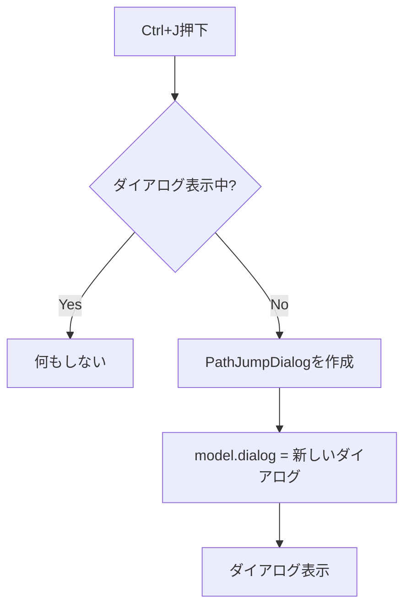
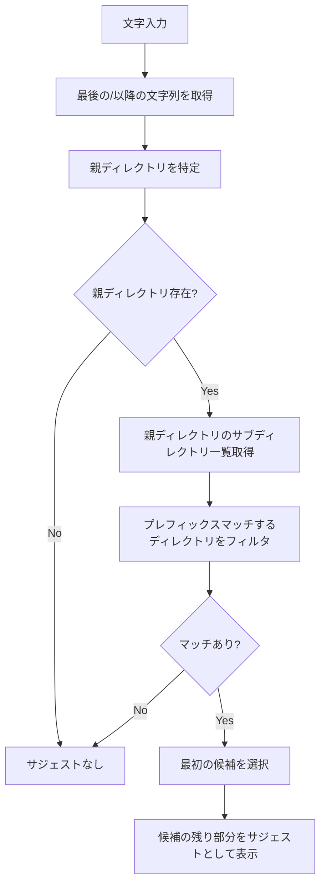
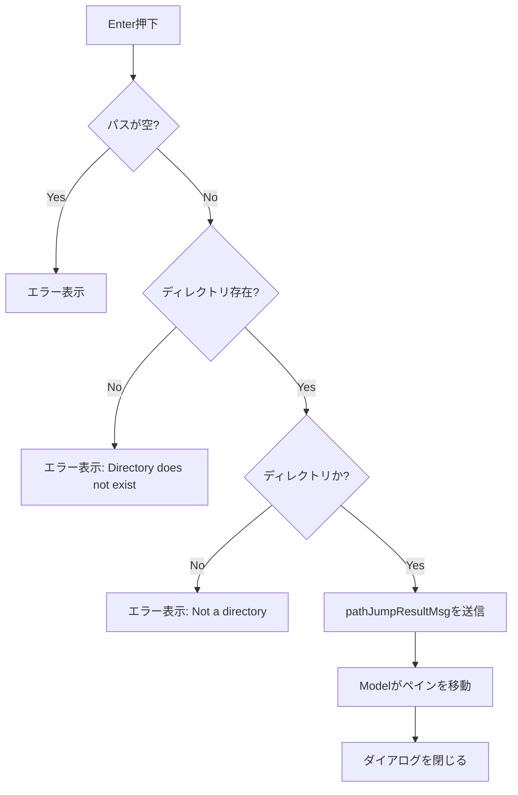

# パスジャンプダイアログ - 要件定義書

## 1. 概要

### 1.1 背景
現在のduofmでは、ディレクトリ移動は以下の方法で行える:
- Enter キーでサブディレクトリに移動
- h キーで親ディレクトリに移動
- ~ キーでホームディレクトリに移動
- - キーで直前のディレクトリに移動
- b キーでブックマークからジャンプ

しかし、深いディレクトリ階層への直接移動や、ブックマーク未登録のディレクトリへの素早い移動手段がない。ユーザーはフルパスを直接入力してディレクトリにジャンプしたいという要望がある。

### 1.2 目的
Ctrl+J キーでパス入力ダイアログを表示し、フルパスを入力してディレクトリに直接移動できる機能を実装する。bashのTab補完のようなインクリメンタルサーチとサジェスト機能により、効率的なパス入力を実現する。

### 1.3 スコープ
- パスジャンプダイアログの実装
- インクリメンタルサーチによるサジェスト機能
- TABキーによるサジェスト確定
- 存在しないパスへのエラーハンドリング

## 2. ビジネス要件

### 2.1 ビジネス目標
- ディレクトリ移動の効率化
- ブックマーク登録なしでの素早いナビゲーション
- bashに慣れたユーザーへの直感的なインターフェース

### 2.2 対象ユーザー
| ユーザータイプ | 説明 |
|----------------|------|
| 開発者 | プロジェクト間を頻繁に移動するユーザー |
| システム管理者 | 深いディレクトリ階層を操作するユーザー |
| パワーユーザー | キーボード操作に慣れたユーザー |

### 2.3 期待される効果
- 深いディレクトリへの移動時間を短縮
- ブックマーク管理の負担軽減
- 操作の直感性向上

## 3. ユースケース

### 3.1 ユースケース一覧
| ID | ユースケース名 | アクター | 優先度 |
|----|----------------|----------|--------|
| UC01 | フルパスでディレクトリ移動 | ユーザー | 高 |
| UC02 | サジェストを使った移動 | ユーザー | 高 |
| UC03 | ダイアログのキャンセル | ユーザー | 高 |
| UC04 | 存在しないパスへの移動試行 | ユーザー | 高 |

### 3.2 ユースケース詳細

#### UC01: フルパスでディレクトリ移動

**アクター**: ユーザー

**事前条件**:
- duofmが起動している
- ダイアログが表示されていない

**基本フロー**:
1. ユーザーがCtrl+Jを押す
2. パス入力ダイアログが表示される
3. ユーザーがフルパス（例: `/home/user/projects`）を入力する
4. ユーザーがEnterを押す
5. アクティブペインが指定されたディレクトリに移動する
6. ダイアログが閉じる

**代替フロー**:
- 3a. ユーザーがEscを押した場合、ダイアログが閉じて移動しない

**事後条件**:
- アクティブペインのカレントディレクトリが入力したパスになっている

#### UC02: サジェストを使った移動

**アクター**: ユーザー

**事前条件**:
- パスジャンプダイアログが表示されている

**基本フロー**:
1. ユーザーが部分パス（例: `/home/us`）を入力する
2. システムがマッチするサブディレクトリをサジェストとして表示する（例: `er`がグレーで表示）
3. ユーザーがTABを押す
4. サジェストが確定され、入力フィールドが `/home/user` になる
5. ユーザーが続けて `/pro` と入力する
6. システムが `jects` をサジェストとして表示する
7. ユーザーがTABを押す
8. 入力フィールドが `/home/user/projects` になる
9. ユーザーがEnterを押す
10. 指定されたディレクトリに移動する

**代替フロー**:
- 2a. マッチするディレクトリがない場合、サジェストは表示されない
- 3a. TABを押さずに続けて入力した場合、サジェストは更新される

**事後条件**:
- アクティブペインのカレントディレクトリが入力したパスになっている

#### UC03: ダイアログのキャンセル

**アクター**: ユーザー

**事前条件**:
- パスジャンプダイアログが表示されている

**基本フロー**:
1. ユーザーがEscを押す
2. ダイアログが閉じる
3. ペインは移動せず、元の状態を維持する

**事後条件**:
- ダイアログが閉じている
- カレントディレクトリは変更されていない

#### UC04: 存在しないパスへの移動試行

**アクター**: ユーザー

**事前条件**:
- パスジャンプダイアログが表示されている

**基本フロー**:
1. ユーザーが存在しないパス（例: `/nonexistent/path`）を入力する
2. ユーザーがEnterを押す
3. システムがエラーメッセージを表示する
4. ダイアログは閉じず、ユーザーは入力を修正できる

**代替フロー**:
- 4a. ユーザーがEscを押してダイアログを閉じる

**事後条件**:
- エラーメッセージが表示されている
- ダイアログは開いたまま

## 4. 機能要件

### 4.1 機能一覧
| ID | 機能名 | 説明 | 優先度 |
|----|--------|------|--------|
| F01 | ダイアログ表示 | Ctrl+Jでパス入力ダイアログを表示 | 高 |
| F02 | パス入力 | フルパスを入力できるテキストフィールド | 高 |
| F03 | インクリメンタルサジェスト | 入力に応じてサブディレクトリをサジェスト | 高 |
| F04 | サジェスト確定 | TABキーでサジェストを確定 | 高 |
| F05 | ディレクトリ移動 | Enterキーで入力したパスに移動 | 高 |
| F06 | エラー表示 | 存在しないパスの場合エラー表示 | 高 |
| F07 | ダイアログキャンセル | Escキーでダイアログを閉じる | 高 |

### 4.2 機能詳細

#### F01: ダイアログ表示

**説明**: Ctrl+Jキーを押すとパスジャンプダイアログが表示される。

**入力**:
- キー: Ctrl+J

**出力**:
- パスジャンプダイアログがアクティブペイン内に表示される

**処理フロー**:


**ビジネスルール**:
- 他のダイアログが表示中の場合は無視する
- ダイアログはペイン内表示（DialogDisplayPane）

#### F02: パス入力

**説明**: ユーザーがフルパスを入力できるテキストフィールド。

**入力**:
- キーボード入力（任意の文字）

**出力**:
- 入力フィールドにテキストが表示される

**ビジネスルール**:
- 入力は / で始まる必要がある（絶対パス）
- 日本語パスもサポート
- カーソル位置での編集をサポート（左右矢印、Backspace、Delete）

**バリデーション**:
| 項目 | ルール | エラーメッセージ |
|------|--------|------------------|
| パス形式 | 空でないこと | "Path cannot be empty" |
| パス存在 | ディレクトリが存在すること | "Directory does not exist: {path}" |
| 種別 | ディレクトリであること | "Not a directory: {path}" |

#### F03: インクリメンタルサジェスト

**説明**: 入力に応じてファイルシステムからマッチするサブディレクトリをリアルタイムで検索し、最初の候補をインライン表示する。

**入力**:
- 現在の入力テキスト

**出力**:
- サジェストテキスト（入力フィールド内にグレー表示）

**処理フロー**:


**ビジネスルール**:
- サジェストはディレクトリのみ（ファイルは除外）
- 隠しディレクトリ（.で始まる）も対象
- 大文字小文字を区別する
- サジェストは最初の候補のみ表示
- サジェスト部分はグレー色で表示

**例**:
```
入力: /home/us
表示: /home/us[er]  ← [er]がグレー表示

入力: /home/user/Do
表示: /home/user/Do[cuments]  ← [cuments]がグレー表示
```

#### F04: サジェスト確定

**説明**: TABキーでサジェストを確定し、入力フィールドに反映する。

**入力**:
- キー: TAB

**出力**:
- サジェストが入力フィールドに反映される

**ビジネスルール**:
- サジェストがない場合、TABは何もしない
- 確定後、カーソルは末尾に移動
- 確定後、新しいサジェストが計算される

#### F05: ディレクトリ移動

**説明**: Enterキーで入力したパスのディレクトリに移動する。

**入力**:
- キー: Enter
- 入力テキスト: パス文字列

**出力**:
- アクティブペインが指定ディレクトリに移動
- ダイアログが閉じる

**処理フロー**:


**エラーケース**:
| エラー | 条件 | 対応 |
|--------|------|------|
| 空パス | 入力が空 | エラーメッセージ表示、ダイアログ継続 |
| 存在しない | パスが存在しない | エラーメッセージ表示、ダイアログ継続 |
| ファイル | パスがファイル | エラーメッセージ表示、ダイアログ継続 |

#### F06: エラー表示

**説明**: バリデーションエラーをダイアログ内に表示する。

**入力**:
- エラー条件

**出力**:
- エラーメッセージ（赤色）がダイアログ内に表示される

**ビジネスルール**:
- エラーメッセージは入力フィールドの下に表示
- 次のキー入力でエラーメッセージはクリアされる
- エラー時もダイアログは閉じない

#### F07: ダイアログキャンセル

**説明**: Escキーでダイアログを閉じ、移動をキャンセルする。

**入力**:
- キー: Esc

**出力**:
- ダイアログが閉じる
- pathJumpCancelMsgが送信される

**ビジネスルール**:
- いかなる状態でもEscでキャンセル可能
- キャンセル時はペインの状態は変更しない

## 5. 非機能要件

### 5.1 パフォーマンス要件
- サジェスト更新: 100ms以内
- ダイアログ表示: 50ms以内
- ディレクトリ移動: 既存の移動処理と同等

### 5.2 セキュリティ要件
- パーミッションのないディレクトリへの移動はOSのエラーとして処理
- シンボリックリンクは解決して実パスに移動

### 5.3 可用性要件
- エラー時もアプリケーションがクラッシュしない
- ダイアログはいつでもEscでキャンセル可能

### 5.4 保守性要件
- 既存のInputDialogパターンに準拠
- BaseDialogを継承
- 適切なユニットテストを作成

### 5.5 互換性要件
- 既存のキーバインドと競合しない
- Ctrl+Jは現在未使用であることを確認済み

## 6. UI/UX要件

### 6.1 画面設計要件

**ダイアログレイアウト**:
```
┌──────────────────────────────────────────┐
│  Jump to Directory                       │
│                                          │
│  ┌────────────────────────────────────┐  │
│  │ /home/user/pro[jects]              │  │
│  └────────────────────────────────────┘  │
│                                          │
│  Tab: Complete  Enter: Jump  Esc: Cancel │
└──────────────────────────────────────────┘
```

- タイトル: "Jump to Directory"
- 入力フィールド: パス入力（サジェストはインライン表示）
- フッター: キーバインドヒント

### 6.2 カラースキーム
- 入力テキスト: 白（通常の入力色）
- サジェスト部分: グレー（ColorMuted: 240）
- エラーメッセージ: 赤（ColorDanger: 196）
- ダイアログボーダー: シアン（ColorPrimary: 39）

### 6.3 レスポンシブ対応
- ダイアログ幅は固定（50文字）
- 長いパスは入力フィールド内でスクロール

## 7. データ要件

### 7.1 データモデル概要
この機能は永続化データを持たない。入力はセッション中のみ有効。

### 7.2 メッセージ定義
| メッセージ | 用途 |
|------------|------|
| pathJumpResultMsg | ジャンプ成功時に送信、パスを含む |
| pathJumpCancelMsg | キャンセル時に送信 |

## 8. 外部連携

### 8.1 連携システム
| システム名 | 連携方法 | データ |
|------------|----------|--------|
| ファイルシステム | os.ReadDir | サブディレクトリ一覧 |
| ファイルシステム | os.Stat | パス存在確認 |

## 9. 制約条件

### 9.1 技術的制約
- Bubble Tea フレームワークのメッセージパッシングパターンに従う
- ダイアログはBaseDialogを継承する
- 既存のキーバインド（keys.go）との整合性を保つ

### 9.2 ビジネス上の制約
- bashのTab補完に似た挙動を期待される
- 学習コストを最小化する

## 10. 想定される課題とリスク

### 10.1 技術的課題
| 課題 | 影響度 | 対応策 |
|------|--------|--------|
| 大量のサブディレクトリ | 低 | 最初の候補のみ表示で影響軽減 |
| シンボリックリンクループ | 低 | os.Statで解決済みパスを使用 |

### 10.2 ビジネスリスク
| リスク | 発生確率 | 影響度 | 対応策 |
|--------|----------|--------|--------|
| UXの期待値とのズレ | 中 | 中 | bashのTab補完に忠実に実装 |

## 11. 成功基準

### 11.1 受け入れ基準
- [ ] Ctrl+Jでダイアログが表示される
- [ ] フルパスを入力してEnterでディレクトリに移動できる
- [ ] サブディレクトリのサジェストがインラインで表示される
- [ ] TABキーでサジェストを確定できる
- [ ] 存在しないパスの場合エラーが表示される
- [ ] Escでダイアログをキャンセルできる
- [ ] 既存の機能に影響がない

### 11.2 KPI
| 指標 | 目標値 | 測定方法 |
|------|--------|----------|
| ユニットテストカバレッジ | 80%以上 | go test -cover |
| E2Eテスト | 基本シナリオ全てパス | make test-e2e |

## 12. テストシナリオ

### 12.1 テスト観点
- [ ] 正常系: Ctrl+Jでダイアログ表示
- [ ] 正常系: フルパス入力でディレクトリ移動
- [ ] 正常系: サジェスト表示とTAB確定
- [ ] 正常系: Escでキャンセル
- [ ] 異常系: 空パスでEnter
- [ ] 異常系: 存在しないパスでEnter
- [ ] 異常系: ファイルパスでEnter
- [ ] 境界値: 非常に長いパス
- [ ] 境界値: ルートディレクトリ（/）
- [ ] セキュリティ: パーミッションのないディレクトリ

## 13. 用語定義

| 用語 | 定義 |
|------|------|
| インラインサジェスト | 入力フィールド内にグレー色で表示される補完候補 |
| サジェスト確定 | TABキーを押してサジェスト内容を入力に反映すること |
| パスジャンプ | 指定したパスのディレクトリに直接移動すること |

## 14. 確認事項

### 14.1 確認済み事項

- [x] サジェスト元: ファイルシステム（実際のサブディレクトリをリアルタイム検索）
- [x] 表示方法: インライン補完（bashのTab補完のように、入力フィールド内で候補を強調表示）
- [x] ダイアログの表示位置: ペイン内表示（既存のInputDialogと同様）
- [x] 複数サジェスト候補: 最初の候補のみ表示、TABで確定
- [x] 右矢印キー確定: いいえ（TABキーのみで確定）
- [x] 存在しないパスの入力: エラーメッセージを表示して入力継続

### 14.2 未確認・保留事項
- [ ] なし

## 15. 参考資料

- 既存実装: `internal/ui/input_dialog.go`
- 既存実装: `internal/ui/bookmark_dialog.go`
- ダイアログベストプラクティス: `doc/development/DIALOG_BEST_PRACTICES.md`
