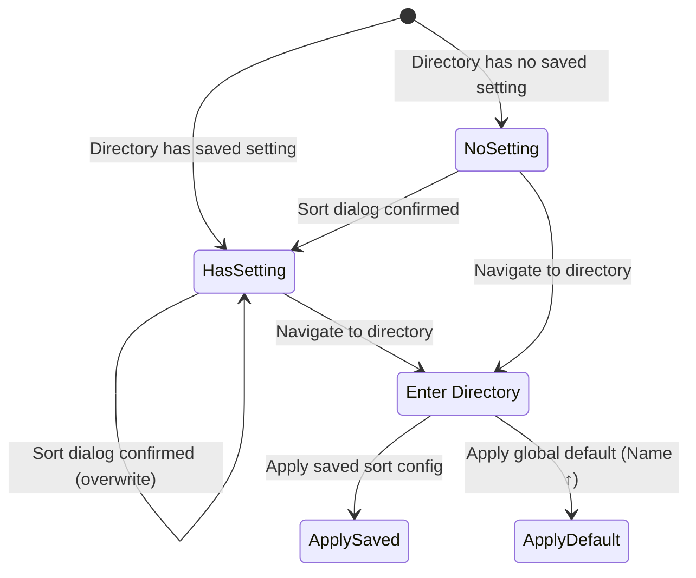

# Feature: Per-Directory Sort Settings

## Overview

Persist sort settings on a per-directory basis, automatically applying them when navigating to a directory. Display the current sort state in the header Line2 at all times to provide continuous feedback to the user.

## Domain Rules

- Each directory can have at most one sort setting (field + order).
- Sort settings are keyed by absolute directory path.
- When a saved sort setting exists for a directory, it overrides the pane's current sort configuration upon entering that directory.
- When no saved sort setting exists, the global default (Name ascending) is applied.
- Saving occurs only on sort dialog confirmation (OK), not on cancel.
- Storage is limited to 1000 entries using LRU eviction based on last access time.

## Objectives

- Persist per-directory sort preferences across application sessions
- Automatically apply saved sort settings when entering a directory
- Display current sort state in the pane header at all times
- Manage storage size with LRU eviction

## User Stories

### US1: Save Sort Settings Per Directory
As a user, I want my sort preference for a directory to be remembered, so that I don't have to reconfigure sorting every time I visit it.

**Acceptance Criteria:**
- [ ] When I confirm a sort change via the sort dialog, the setting is saved for the current directory
- [ ] The setting persists across application restarts
- [ ] The saved setting is stored in `~/.config/duofm/dir_sort.toml`

### US2: Auto-Apply Saved Sort Settings
As a user, I want my saved sort preference to be automatically applied when I enter a directory, so that files are always shown in my preferred order.

**Acceptance Criteria:**
- [ ] Navigating into a directory with a saved sort setting automatically applies that setting
- [ ] Navigating into a directory without a saved setting applies the global default (Name ascending)
- [ ] Auto-apply works for all navigation methods (enter, history back/forward, cd -)

### US3: See Current Sort State
As a user, I want to see the current sort configuration in the header, so that I always know how files are sorted.

**Acceptance Criteria:**
- [ ] Header Line2 displays the current sort field and direction (e.g., "Name ↑", "Size ↓")
- [ ] The display is always visible, regardless of whether a saved setting exists
- [ ] Layout: `Marked 0/15 0 B  Name ↑  50 GB Free`

## Technical Requirements

### Functional Requirements

- **FR1:** On sort dialog confirmation, persist the sort setting (field, order) for the current directory's absolute path to `dir_sort.toml`.
- **FR2:** On directory navigation, look up the target directory in the stored settings. If found, apply the saved sort config to the pane. If not found, apply the global default (Name ascending). Applicable navigation methods: EnterDirectoryAsync, MoveToParentAsync, NavigateHistoryBackAsync, NavigateHistoryForwardAsync, NavigateToPreviousAsync, NavigateToHomeAsync, ChangeDirectoryAsync, SyncTo.
- **FR3:** Display the current pane sort configuration in header Line2 between the mark info and free space info. Use the format from `SortConfig.String()` (e.g., "Name ↑").
- **FR4:** On application startup, load `dir_sort.toml` into an in-memory map. If the file does not exist, initialize with an empty map. If parsing fails, log a warning and initialize with an empty map.
- **FR5:** When adding a new entry would exceed 1000 stored entries, evict the entry with the oldest `last_access` timestamp before adding the new one.
- **FR6:** Update `last_access` timestamp when a directory's sort setting is accessed (read) during navigation.
- **FR7:** File I/O errors during save must not block the UI or crash the application. Errors are silently ignored.

### Non-Functional Requirements

- **NFR1 - Performance:** Sort setting lookup must be O(1) using an in-memory map.
- **NFR2 - Reliability:** File corruption or absence must not prevent application startup. Graceful degradation to empty settings.
- **NFR3 - Usability:** The sort indicator in the header must always be visible, providing constant feedback about the current sort state.

## Interface Contract

### Storage File Format

**File path:** `~/.config/duofm/dir_sort.toml` (respects `$XDG_CONFIG_HOME`)

```toml
[dirs]

[dirs."/home/user/Downloads"]
field = "size"
order = "desc"
last_access = 2026-02-09T10:30:00+09:00

[dirs."/home/user/Documents"]
field = "name"
order = "asc"
last_access = 2026-02-08T15:00:00+09:00
```

**Field values:**
- `field`: `"name"` | `"size"` | `"date"`
- `order`: `"asc"` | `"desc"`
- `last_access`: RFC 3339 datetime

### Header Line2 Layout

```
Marked {marked}/{total} {size}  {SortField} {Arrow}  {Free} Free
```

Example: `Marked 0/15 0 B  Name ↑  50 GB Free`

### State Transitions



### Error Conditions

- File does not exist on startup: Initialize with empty map, no error shown.
- File is corrupted/unparseable: Log warning, initialize with empty map.
- File write fails (permissions, disk full): Silently ignore, do not disrupt user workflow.
- Invalid field/order values in file: Skip the invalid entry, load remaining entries.

## Dependencies

**Internal Dependencies:**
- `internal/ui/sort.go`: SortConfig, SortField, SortOrder types and SortConfig.String()
- `internal/ui/pane.go`: Pane.SetSortConfig(), Pane.GetSortConfig()
- `internal/ui/pane_navigation.go`: Directory navigation methods
- `internal/ui/pane_render.go`: Header rendering (renderHeaderLine2)
- `internal/ui/sort_dialog.go`: Sort dialog confirmation flow
- `internal/config/config.go`: Config directory path resolution

**External Dependencies:**
- `github.com/BurntSushi/toml`: TOML parsing (already in use by the project)

## Test Scenarios

### Unit Tests
- [ ] Save sort setting for a directory and verify it's stored in the map
- [ ] Load sort settings from a valid TOML file
- [ ] Load with missing file returns empty map
- [ ] Load with corrupted file returns empty map
- [ ] Lookup existing directory returns correct sort config
- [ ] Lookup non-existing directory returns nil/false
- [ ] LRU eviction removes oldest entry when at 1000 entries
- [ ] LRU eviction preserves the 999 most recently accessed entries
- [ ] Last access time is updated on read
- [ ] Header Line2 includes sort info display
- [ ] Sort info display shows correct format for all field/order combinations

### Integration Tests
- [ ] Sort dialog confirmation triggers save to file
- [ ] Directory navigation applies saved sort setting
- [ ] Directory navigation applies default when no setting exists
- [ ] Application restart preserves saved settings
- [ ] File write error does not crash application

### Edge Cases
- [ ] Directory path contains special characters (spaces, unicode)
- [ ] Directory path is the root directory "/"
- [ ] Directory no longer exists on disk but has a saved setting
- [ ] Simultaneous navigation in left and right panes
- [ ] Sort dialog cancelled does not save

## Success Criteria

- [ ] All functional requirements (FR1-FR7) are implemented and tested
- [ ] All test scenarios pass
- [ ] Header always shows current sort state
- [ ] Settings survive application restart
- [ ] LRU eviction works correctly at 1000 entry boundary
- [ ] No user-visible errors on file I/O failures
- [ ] Existing sort functionality (dialog, live preview, cancel restore) continues to work unchanged

## Constraints

- Use only existing dependencies (no new external libraries)
- Storage file is separate from `config.toml`
- Do not modify the existing SortConfig type interface
- Hot-reload of `dir_sort.toml` is not required

## Open Questions

- None (all questions resolved during requirements gathering)
