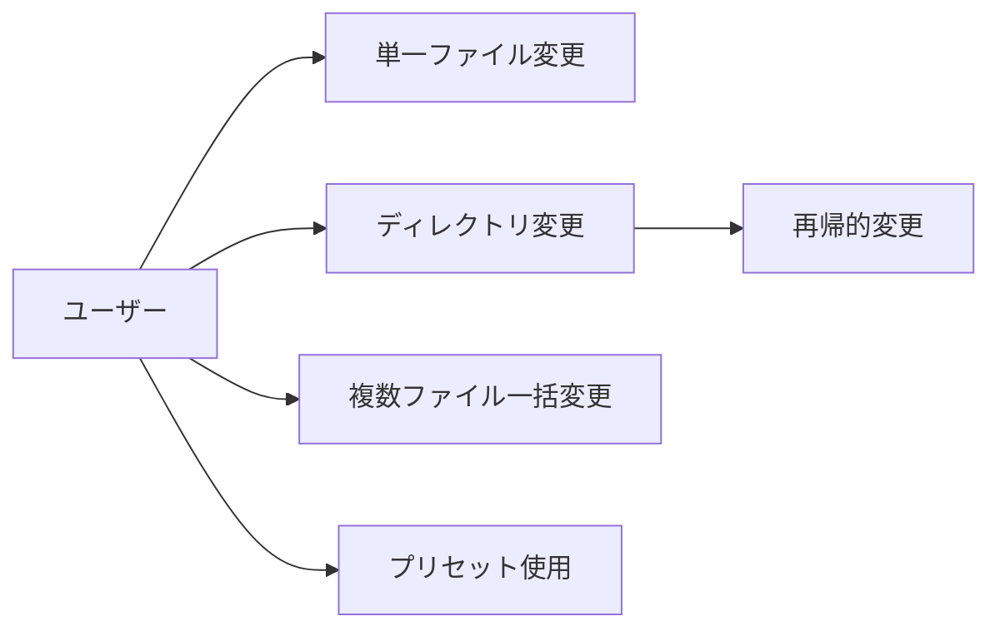
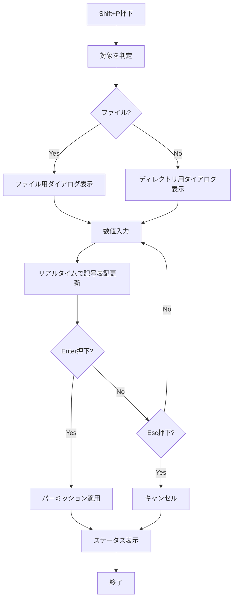
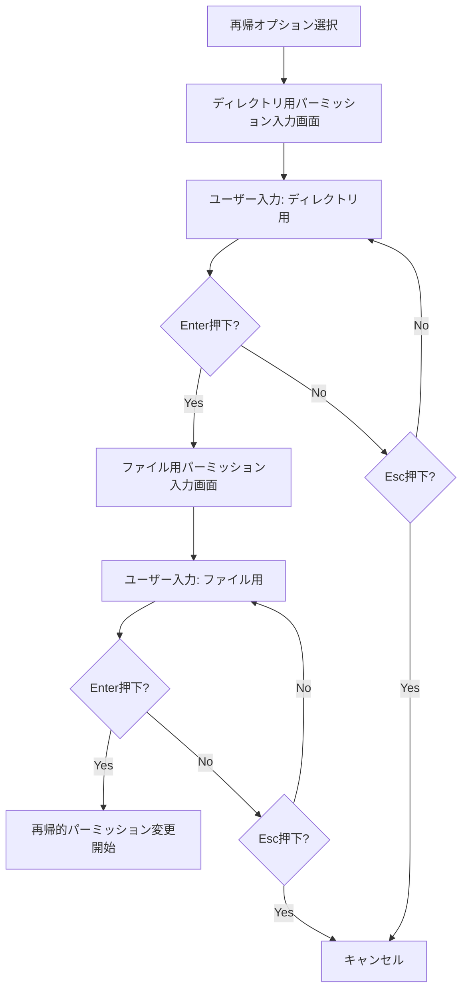
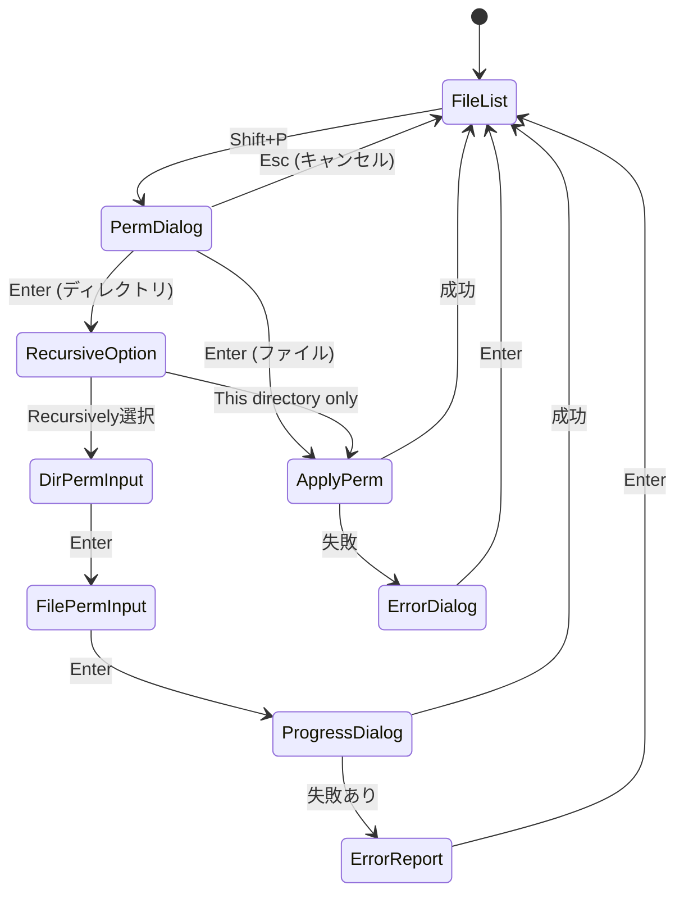

# パーミッション変更機能 - 要件定義書

## 1. 概要

### 1.1 背景
duofmはファイル管理機能を提供するTUIアプリケーションであり、ファイルのコピー、移動、削除などの基本操作をサポートしている。しかし、Unix/Linuxシステムにおいて重要なパーミッション変更機能が未実装であり、ユーザーは外部のchmodコマンドを使用する必要がある。この機能を統合することで、ファイル管理操作をduofm内で完結できるようにする。

### 1.2 目的
ファイルおよびディレクトリのパーミッション（アクセス権限）をduofm内で変更できるようにし、ユーザーの作業効率を向上させる。特に、ディレクトリに対する再帰的なパーミッション変更を可能にすることで、プロジェクトディレクトリ全体の権限管理を容易にする。

### 1.3 スコープ
このタスクの対象範囲は以下の通り:

- **対象内**:
  - 数値モード（3桁の8進数）によるパーミッション変更
  - クイックプリセット機能（よく使うパーミッション値のショートカット）
  - ディレクトリの再帰的パーミッション変更
  - 再帰実行時のディレクトリとファイルの別々のパーミッション設定
  - 複数ファイル/ディレクトリへの一括適用
  - 進捗表示（再帰実行時）
  - エラーレポート機能

- **対象外**:
  - 記号モード（u+x, go-wなど）の入力（将来的な拡張候補）
  - 特殊パーミッション（setuid, setgid, sticky bit）の個別設定UI（数値入力では対応可能）
  - シンボリックリンク自体のパーミッション変更
  - ACL（Access Control List）の設定
  - 所有者（owner/group）の変更（chown/chgrp相当）

## 2. ビジネス要件

### 2.1 ビジネス目標
- duofm内でファイル管理操作を完結させることで、ユーザーの作業効率を向上させる
- 外部コマンドへの依存を減らし、一貫したユーザー体験を提供する
- ディレクトリ構造全体の権限管理を効率化する

### 2.2 対象ユーザー
| ユーザータイプ | 説明 |
|----------------|------|
| 開発者 | プロジェクトディレクトリのパーミッション管理を行う |
| システム管理者 | サーバー上のファイル権限を一括変更する |
| 一般ユーザー | 個人ファイルのアクセス権限を調整する |

### 2.3 期待される効果
- 外部コマンドを呼び出す手間が削減される
- ディレクトリ全体のパーミッション設定が短時間で完了する
- 視覚的なフィードバック（記号表記のリアルタイム更新）により、設定ミスが減る

## 3. ユースケース

### 3.1 ユースケース一覧
| ID | ユースケース名 | アクター | 優先度 |
|----|----------------|----------|--------|
| UC01 | 単一ファイルのパーミッション変更 | ユーザー | 高 |
| UC02 | 単一ディレクトリのパーミッション変更 | ユーザー | 高 |
| UC03 | ディレクトリの再帰的パーミッション変更 | ユーザー | 高 |
| UC04 | 複数ファイルへの一括パーミッション適用 | ユーザー | 中 |
| UC05 | クイックプリセットを使った変更 | ユーザー | 中 |

### 3.2 ユースケース詳細

#### UC01: 単一ファイルのパーミッション変更

**アクター**: ユーザー

**事前条件**:
- duofmが起動している
- ファイルがカーソル位置で選択されている
- ユーザーがそのファイルのパーミッション変更権限を持っている

**基本フロー**:
1. ユーザーがShift+Pを押す
2. パーミッション変更ダイアログが表示される
3. 現在のパーミッションが数値（例: 644）と記号（-rw-r--r--）で表示される
4. ユーザーが新しいパーミッション値を3桁の数値で入力する（例: 755）
5. 入力に応じて記号表記がリアルタイムで更新される（-rwxr-xr-x）
6. ユーザーがEnterキーを押す
7. パーミッションが変更される
8. ダイアログが閉じる
9. ステータスメッセージが表示される

**代替フロー**:
- 3a. ユーザーがプリセット番号（1-4）を押した場合、対応するパーミッション値が自動入力される
- 6a. ユーザーがEscキーを押した場合、変更をキャンセルしてダイアログを閉じる
- 7a. パーミッション変更に失敗した場合、エラーダイアログを表示する

**事後条件**:
- ファイルのパーミッションが指定された値に変更される
- ペイン表示が更新され、新しいパーミッションが反映される

#### UC02: 単一ディレクトリのパーミッション変更

**アクター**: ユーザー

**事前条件**:
- duofmが起動している
- ディレクトリがカーソル位置で選択されている
- ユーザーがそのディレクトリのパーミッション変更権限を持っている

**基本フロー**:
1. ユーザーがShift+Pを押す
2. パーミッション変更ダイアログが表示される
3. 現在のパーミッションが数値（例: 755）と記号（drwxr-xr-x）で表示される
4. "Apply to:" セクションに再帰オプションが表示される（デフォルト: This directory only）
5. ユーザーが新しいパーミッション値を入力する
6. ユーザーがEnterキーを押す
7. ディレクトリ自体のパーミッションが変更される
8. ダイアログが閉じる

**代替フロー**:
- 5a. ユーザーがTabキーで再帰オプションを選択できる
- 5b. "Recursively"を選択した場合、UC03に進む

**事後条件**:
- ディレクトリのパーミッションが指定された値に変更される

#### UC03: ディレクトリの再帰的パーミッション変更

**アクター**: ユーザー

**事前条件**:
- UC02の状態で"Recursively"オプションが選択されている

**基本フロー**:
1. ユーザーがEnterキーを押す
2. 再帰実行用の2段階入力ダイアログが表示される
3. 「ディレクトリ用のパーミッション」入力画面が表示される
4. ユーザーがディレクトリ用のパーミッション（例: 755）を入力する
5. Enterキーで確定すると、「ファイル用のパーミッション」入力画面に遷移する
6. ユーザーがファイル用のパーミッション（例: 644）を入力する
7. Enterキーで確定すると、再帰的なパーミッション変更が開始される
8. プログレスバー付きダイアログが表示される
9. ディレクトリツリー内のすべてのディレクトリとファイルに対してパーミッションが適用される
10. 完了後、成功/失敗のサマリーが表示される

**代替フロー**:
- 9a. シンボリックリンクは無視（スキップ）される
- 9b. パーミッション変更に失敗したファイルがあっても処理を続行する
- 10a. 失敗したファイルがある場合、エラーレポートを表示する

**事後条件**:
- ディレクトリツリー内のすべてのディレクトリが指定されたディレクトリ用パーミッションになる
- ディレクトリツリー内のすべてのファイルが指定されたファイル用パーミッションになる
- シンボリックリンクは変更されない

**ユースケース図**:


#### UC04: 複数ファイルへの一括パーミッション適用

**アクター**: ユーザー

**事前条件**:
- duofmが起動している
- スペースキーで複数のファイル/ディレクトリがマークされている

**基本フロー**:
1. ユーザーがShift+Pを押す
2. パーミッション変更ダイアログが表示される
3. タイトルに対象数が表示される（例: "Permissions: 5 items"）
4. 現在のパーミッション表示は省略される（複数あるため）
5. ユーザーが新しいパーミッション値を入力する
6. Enterキーで確定すると、マークされたすべてのアイテムに同じパーミッションが適用される
7. プログレスバーが表示される（アイテム数が多い場合）
8. 完了後、マークがクリアされる

**代替フロー**:
- 6a. ディレクトリが含まれる場合、それぞれは"This directory only"モードで変更される（再帰なし）
- 6b. 失敗したアイテムがあっても処理を続行し、最後にエラーレポートを表示する

**事後条件**:
- マークされたすべてのファイル/ディレクトリのパーミッションが変更される
- マークがクリアされる

#### UC05: クイックプリセットを使った変更

**アクター**: ユーザー

**事前条件**:
- パーミッション変更ダイアログが表示されている

**基本フロー**:
1. ユーザーがプリセット番号（1-4）のキーを押す
2. 対応するパーミッション値が入力フィールドに自動入力される
3. 記号表記が即座に更新される
4. ユーザーがEnterキーで確定するか、さらに編集できる

**事後条件**:
- 選択されたプリセット値が適用される

## 4. 機能要件

### 4.1 機能一覧
| ID | 機能名 | 説明 | 優先度 |
|----|--------|------|--------|
| F01 | パーミッション変更ダイアログ | 数値入力とリアルタイムプレビュー | 高 |
| F02 | クイックプリセット | よく使うパーミッション値のショートカット | 中 |
| F03 | 再帰オプション選択 | ディレクトリのみ/再帰的変更の選択 | 高 |
| F04 | 2段階入力（再帰実行時） | ディレクトリ用とファイル用の別々入力 | 高 |
| F05 | 進捗表示 | プログレスバー表示 | 中 |
| F06 | エラーレポート | 失敗したファイルのリスト表示 | 中 |
| F07 | 複数選択対応 | マークされたアイテムへの一括適用 | 中 |

### 4.2 機能詳細

#### F01: パーミッション変更ダイアログ

**説明**: ファイルまたはディレクトリのパーミッションを変更するためのダイアログを表示する。

**入力**:
- 対象ファイル/ディレクトリ: FileEntry
- 現在のパーミッション: fs.FileMode

**出力**:
- 新しいパーミッション: 3桁の8進数（例: 644, 755）

**処理フロー**:


**ビジネスルール**:
- パーミッション値は000-777の範囲の3桁の8進数
- 入力値が範囲外の場合はエラー表示
- 親ディレクトリ（..）が選択されている場合は機能を無効化

**バリデーション**:
| 項目 | ルール | エラーメッセージ |
|------|--------|------------------|
| パーミッション値 | 0-7の数字3桁 | "Invalid permission: must be 3 digits (0-7)" |
| 入力長 | 3桁固定 | "Permission must be exactly 3 digits" |
| 対象ファイル存在 | ファイルが存在すること | "File not found" |

**エラーケース**:
| エラー | 条件 | 対応 |
|--------|------|------|
| 権限不足 | chmodがEPERMを返す | エラーダイアログ表示、処理中断なし |
| ファイル不存在 | ENOENTエラー | エラーダイアログ表示、処理中断なし |
| 無効な入力 | 数値範囲外 | 入力フィールドで即座にエラー表示 |

#### F02: クイックプリセット

**説明**: よく使うパーミッション値を番号キーで素早く入力できる機能。

**プリセット一覧**:

ファイル用:
| 番号 | パーミッション | 記号表記 | 説明 |
|------|----------------|----------|------|
| 1 | 644 | -rw-r--r-- | デフォルトファイル |
| 2 | 755 | -rwxr-xr-x | 実行可能ファイル |
| 3 | 600 | -rw------- | プライベートファイル |
| 4 | 777 | -rwxrwxrwx | フルアクセス |

ディレクトリ用:
| 番号 | パーミッション | 記号表記 | 説明 |
|------|----------------|----------|------|
| 1 | 755 | drwxr-xr-x | デフォルトディレクトリ |
| 2 | 700 | drwx------ | プライベートディレクトリ |
| 3 | 775 | drwxrwxr-x | グループ書き込み可 |
| 4 | 777 | drwxrwxrwx | フルアクセス |

**入力**:
- プリセット番号: 1-4

**出力**:
- 対応するパーミッション値が入力フィールドに設定される

#### F03: 再帰オプション選択

**説明**: ディレクトリに対するパーミッション変更の際、再帰的に適用するか選択できる。

**入力**:
- 再帰フラグ: true/false

**出力**:
- 選択された適用モード

**UI要素**:
```
Apply to:
  (●) This directory only
  ( ) Recursively (all contents)
```

**操作**:
- Tabキーで選択切り替え
- jキーで下へ移動
- kキーで上へ移動
- スペースキーで選択

#### F04: 2段階入力（再帰実行時）

**説明**: 再帰実行時にディレクトリとファイルで異なるパーミッションを設定できる。

**処理フロー**:


**入力**:
- ディレクトリ用パーミッション: 3桁の8進数
- ファイル用パーミッション: 3桁の8進数

**出力**:
- 両方のパーミッション値

#### F05: 進捗表示

**説明**: 再帰実行や複数ファイル処理時に進捗状況を表示する。

**表示内容**:
- 処理済みファイル数 / 総ファイル数
- プログレスバー
- 現在処理中のファイル名（パス）
- 経過時間

**UI例**:
```
┌─ Changing Permissions ─────────────────────────┐
│                                                │
│   Progress: 127 / 543 files                    │
│   ▓▓▓▓▓▓▓▓░░░░░░░░░░░░░░░░  23%               │
│                                                │
│   Current: /home/user/project/src/main.go      │
│                                                │
│   Elapsed: 00:02                               │
│                                                │
└────────────────────────────────────────────────┘
```

**エラーケース**:
| エラー | 条件 | 対応 |
|--------|------|------|
| 処理中断 | ユーザーがCtrl+C | 処理を中断し、途中までの結果を表示 |

#### F06: エラーレポート

**説明**: パーミッション変更に失敗したファイルをリスト表示する。

**表示内容**:
- 失敗したファイルのパス
- エラー理由（権限不足、ファイル不存在など）
- 成功/失敗の統計

**UI例**:
```
┌─ Permission Change Report ─────────────────────┐
│                                                │
│   Success: 520 files                           │
│   Failed:  23 files                            │
│                                                │
│   Failed files:                                │
│   - /path/to/file1.txt (Permission denied)     │
│   - /path/to/file2.txt (Permission denied)     │
│   - /path/to/dir/file3.sh (No such file)       │
│   ... (20 more)                                │
│                                                │
│   [Enter] Close                                │
└────────────────────────────────────────────────┘
```

**エラーケース**:
| エラー | 条件 | 対応 |
|--------|------|------|
| 全件失敗 | すべてのファイルで失敗 | エラーダイアログで通知 |

#### F07: 複数選択対応

**説明**: スペースキーでマークされた複数のファイル/ディレクトリに一括でパーミッションを適用する。

**入力**:
- マークされたファイルリスト: []string
- パーミッション値: 3桁の8進数

**出力**:
- 成功/失敗の統計

**ビジネスルール**:
- マークされたアイテムがある場合、そのすべてに同じパーミッションを適用
- ディレクトリは"This directory only"モード（非再帰）で処理
- シンボリックリンクはスキップ

## 5. 非機能要件

### 5.1 パフォーマンス要件
- ダイアログ表示: 100ms以内
- 単一ファイルのパーミッション変更: 50ms以内
- 再帰実行: 1000ファイルあたり2秒以内（HDDの場合）
- プログレスバー更新: 0.1秒間隔

### 5.2 セキュリティ要件
- パーミッション変更はOSの権限チェックに従う
- 入力値の範囲検証を必ず行う（000-777）
- シンボリックリンクの辿り先を変更しない（リンク自体をスキップ）
- 親ディレクトリ（..）のパーミッション変更を禁止

### 5.3 可用性要件
- パーミッション変更失敗時もアプリケーションは継続動作する
- エラーが発生しても途中まで処理したファイルは変更済みとする

### 5.4 保守性要件
- ログ出力: パーミッション変更の成功/失敗をログに記録
- エラーメッセージ: ユーザーが理解できる明確なメッセージ
- テスト: 各機能に対する単体テストとE2Eテストを用意

### 5.5 互換性要件
- Go標準ライブラリの`os.Chmod`を使用
- Unix/Linux環境でのみ動作（Windowsは対象外）
- 最小対応Go版: 1.21以上

## 6. UI/UX要件

### 6.1 画面設計要件

**ダイアログデザイン**:
- 既存のダイアログ（ConfirmDialog, InputDialog等）と一貫したスタイル
- 角丸ボーダー
- アクティブペインの中央に表示
- 背景オーバーレイ（半透明または暗い背景）

**入力フィールド**:
- 3桁固定長の数値入力
- カーソル位置を表示
- リアルタイムバリデーション

**記号表記**:
- 入力値に応じて即座に更新
- ファイル: `-rw-r--r--` 形式
- ディレクトリ: `drwxr-xr-x` 形式

### 6.2 画面遷移


### 6.3 レスポンシブ対応
- 最小ターミナル幅: 80カラム（ペインあたり40カラム）
- ダイアログ幅: 50カラム（固定）
- 長いファイルパスは省略表示（...）

## 7. データ要件

### 7.1 データモデル概要
```mermaid
erDiagram
    FILE_ENTRY ||--o{ PERMISSION_CHANGE : has
    FILE_ENTRY {
        string Name
        bool IsDir
        fs.FileMode Permissions
        bool IsSymlink
    }
    PERMISSION_CHANGE {
        string Path
        fs.FileMode OldPermission
        fs.FileMode NewPermission
        bool Success
        string Error
    }
```

### 7.2 データ項目
| エンティティ | 項目名 | 型 | 必須 | 説明 |
|--------------|--------|-----|------|------|
| PermissionChangeRequest | TargetPath | string | ○ | 対象ファイル/ディレクトリのパス |
| PermissionChangeRequest | NewMode | fs.FileMode | ○ | 新しいパーミッション |
| PermissionChangeRequest | Recursive | bool | ○ | 再帰フラグ |
| PermissionChangeRequest | DirMode | fs.FileMode | × | ディレクトリ用パーミッション（再帰時） |
| PermissionChangeRequest | FileMode | fs.FileMode | × | ファイル用パーミッション（再帰時） |
| PermissionChangeResult | Path | string | ○ | 処理したファイルパス |
| PermissionChangeResult | Success | bool | ○ | 成功/失敗 |
| PermissionChangeResult | Error | error | × | エラー内容 |

### 7.3 データ保持期間
| データ種別 | 保持期間 |
|------------|----------|
| パーミッション変更履歴 | メモリ上のみ（アプリ終了で破棄） |
| エラーレポート | ダイアログ表示中のみ |

## 8. 外部連携

### 8.1 連携システム
| システム名 | 連携方法 | データ |
|------------|----------|--------|
| OSファイルシステム | os.Chmod() | パーミッション値 |

### 8.2 API仕様要件
- Go標準ライブラリの`os.Chmod(name string, mode FileMode) error`を使用
- エラーハンドリングはOSのerrnoに従う

## 9. 制約条件

### 9.1 技術的制約
- Unix/Linuxシステムのみ対応（WindowsのACLは非対応）
- シンボリックリンク自体のパーミッション変更は非対応（lchmodは移植性が低い）
- 特殊パーミッション（setuid/setgid/sticky bit）は数値入力でのみ対応

### 9.2 ビジネス上の制約
- 既存のキーバインドとの衝突を避ける必要がある
- 既存のダイアログデザインパターンに従う

### 9.3 スケジュール制約
- なし（機能追加の優先度は中程度）

## 10. 想定される課題とリスク

### 10.1 技術的課題
| 課題 | 影響度 | 対応策 |
|------|--------|--------|
| 大量ファイルの再帰処理の性能 | 中 | ゴルーチンによる並列処理、プログレスバー表示 |
| シンボリックリンクの扱い | 低 | スキップする仕様で対応 |
| 入力バリデーションの複雑さ | 低 | リアルタイムバリデーションで早期フィードバック |

### 10.2 ビジネスリスク
| リスク | 発生確率 | 影響度 | 対応策 |
|--------|----------|--------|--------|
| 誤ったパーミッション設定 | 中 | 中 | リアルタイムプレビュー、元に戻す機能は提供しない（OSレベルの責任） |
| 権限エラーによる部分的な失敗 | 高 | 低 | エラーレポート表示、処理継続 |

## 11. 成功基準

### 11.1 受け入れ基準
- [ ] Shift+Pでパーミッション変更ダイアログが表示される
- [ ] 数値入力でパーミッションを変更できる
- [ ] リアルタイムで記号表記が更新される
- [ ] クイックプリセット（1-4）が機能する
- [ ] ディレクトリの再帰オプションが機能する
- [ ] 再帰実行時にディレクトリとファイルで別々のパーミッションを設定できる
- [ ] プログレスバーが表示される（再帰実行時）
- [ ] 失敗したファイルのエラーレポートが表示される
- [ ] 複数選択（マーク）されたファイルに一括適用できる
- [ ] シンボリックリンクがスキップされる
- [ ] 親ディレクトリ（..）では機能が無効化される

### 11.2 KPI
| 指標 | 目標値 | 測定方法 |
|------|--------|----------|
| ダイアログ表示速度 | 100ms以内 | 単体テストでの計測 |
| パーミッション変更成功率 | 95%以上 | E2Eテストでの検証 |
| 再帰実行性能 | 1000ファイル/2秒 | パフォーマンステスト |

## 12. テストシナリオ

### 12.1 テスト観点
- [ ] 正常系: 単一ファイルのパーミッション変更（644 → 755）
- [ ] 正常系: ディレクトリのパーミッション変更（755 → 700）
- [ ] 正常系: 再帰的パーミッション変更（ディレクトリ755/ファイル644）
- [ ] 正常系: 複数ファイルの一括変更
- [ ] 正常系: クイックプリセット使用
- [ ] 異常系: 無効なパーミッション値入力（999, abc）
- [ ] 異常系: 権限不足（他人のファイル）
- [ ] 異常系: ファイル不存在
- [ ] 境界値: パーミッション000
- [ ] 境界値: パーミッション777
- [ ] 特殊ケース: シンボリックリンクのスキップ
- [ ] 特殊ケース: 親ディレクトリ（..）での無効化
- [ ] パフォーマンス: 10000ファイルの再帰処理

## 13. 用語定義

| 用語 | 定義 |
|------|------|
| パーミッション | Unix/Linuxのファイルアクセス権限（rwx） |
| 8進数モード | 000-777の3桁数値で表現するパーミッション表記 |
| 記号モード | -rwxr-xr-x のような記号で表現するパーミッション表記 |
| 再帰的変更 | ディレクトリ内のすべてのファイル/サブディレクトリに対する変更 |
| クイックプリセット | よく使うパーミッション値（644, 755等）のショートカット |
| マーク | スペースキーで選択した複数ファイル |

## 14. 確認事項

### 14.1 確認済み事項

- [x] **Q1: UI形式** - 数値入力 + クイックプリセット方式。リアルタイムで記号表記を更新する。
- [x] **Q2: 再帰実行時の設定** - 2段階入力方式。ディレクトリ用とファイル用を別々に入力する。
- [x] **Q3: 再帰実行のスコープ** - マーク選択時は選択されたアイテムのみ。エラー時は処理を続行し、失敗したファイルを後でレポートする。
- [x] **Q4: 確認ダイアログ** - 実行前の確認ダイアログは表示しない。
- [x] **Q5: プレビュー機能** - 入力フィールドのリアルタイム記号表記更新で対応。
- [x] **Q6: シンボリックリンク** - 無視する（スキップする）。
- [x] **Q7: 複数選択時** - すべてに同じパーミッションを一括適用する。
- [x] **Q8: 進捗表示** - プログレスバーを表示する。
- [x] **キーバインド** - Shift+P は未使用で利用可能。

### 14.2 未確認・保留事項
- [ ] 特殊パーミッション（setuid/setgid/sticky bit）のUI表示（数値入力では設定可能）
- [ ] 将来的な記号モード（u+x等）対応の詳細仕様

## 15. 参考資料

- Go標準ライブラリ: https://pkg.go.dev/os#Chmod
- Unix/Linuxパーミッション: `man chmod`
- 既存のダイアログ実装: `internal/ui/confirm_dialog.go`, `internal/ui/input_dialog.go`
- Bubble Teaフレームワーク: https://github.com/charmbracelet/bubbletea
