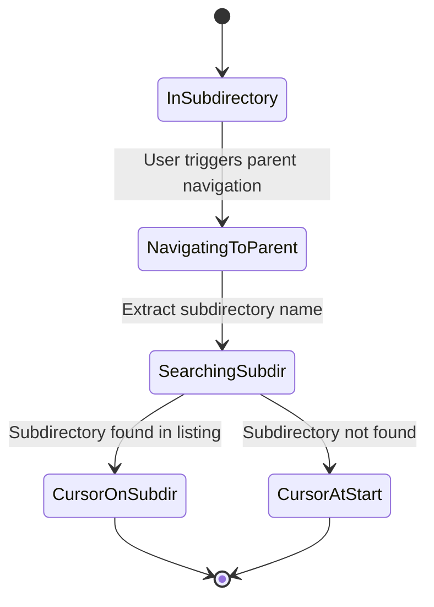

# Feature: Remember Cursor Position on Parent Directory Navigation

## Overview

When navigating to a parent directory, automatically position the cursor on the subdirectory the user just came from. This is a common UX pattern in file managers like Ranger and Midnight Commander.

## Domain Rules

- The cursor position is determined by the subdirectory name, not by index
- If the subdirectory no longer exists, cursor defaults to the first entry (index 0)
- Each pane maintains independent cursor memory
- Hidden directory visibility affects cursor positioning

## Objectives

- Improve navigation efficiency when moving up/down directory hierarchies
- Provide visual continuity by showing "where the user came from"
- Align with common file manager UX patterns

## User Stories

- As a user, I want the cursor to be on the subdirectory I just came from when navigating to the parent directory, so that I can easily see my previous location and continue navigating efficiently.

## Functional Requirements

### FR1: Cursor Positioning on Parent Navigation

- FR1.1: When navigating to parent directory, cursor shall be positioned on the subdirectory the user just left
- FR1.2: Subdirectory lookup shall be performed by name (not by index)
- FR1.3: If subdirectory is not found in the listing, cursor shall be positioned at index 0

### FR2: Applicable Operations

- FR2.1: Applies when selecting `..` (parent directory entry) and pressing Enter
- FR2.2: Applies when pressing `h` or `Left Arrow` in the left pane (parent navigation)
- FR2.3: Applies when pressing `l` or `Right Arrow` in the right pane (parent navigation)

### FR3: Independent Pane Operation

- FR3.1: Left and right panes shall maintain independent cursor memory
- FR3.2: Navigation in one pane shall not affect cursor memory of the other pane

### FR4: Edge Cases

- FR4.1: If subdirectory was deleted, cursor shall be at index 0
- FR4.2: If subdirectory is hidden and hidden files are not shown, cursor shall be at index 0
- FR4.3: Sort order changes shall not affect cursor positioning (name-based lookup)

## Non-Functional Requirements

- NFR1.1: Cursor positioning shall complete within the same time as directory loading
- NFR1.2: Memory overhead shall be minimal (only store subdirectory name)

## Interface Contract

### Input/Output Specification

**Input:**
- Current directory path (before navigation)
- Target parent directory path

**Output:**
- Cursor position (index) in the parent directory listing

### Preconditions

- User is in a subdirectory (not at root `/`)
- Parent directory is accessible

### Postconditions

- Directory listing is loaded for parent directory
- Cursor is positioned on the previous subdirectory (if found) or at index 0

### State Transitions

### Error Conditions

- If parent directory cannot be read: Existing error handling applies (no change)
- If subdirectory name extraction fails: Cursor defaults to index 0

## Dependencies

- Existing `Pane` struct and navigation methods in `internal/ui/pane.go`
- Existing directory loading mechanism (`LoadDirectory`, `LoadDirectoryAsync`)

## Test Scenarios

- [ ] Navigate to parent via `..` entry: cursor on previous subdirectory
- [ ] Navigate to parent via `h` key (left pane): cursor on previous subdirectory
- [ ] Navigate to parent via `l` key (right pane): cursor on previous subdirectory
- [ ] Navigate to parent when subdirectory was deleted: cursor at index 0
- [ ] Navigate to parent from hidden subdirectory with hidden files OFF: cursor at index 0
- [ ] Left pane and right pane maintain independent cursor memory
- [ ] Multiple up/down navigations maintain correct cursor positions
- [ ] Cursor positioning works regardless of sort order

## Success Criteria

- [ ] All parent directory navigation operations position cursor on previous subdirectory
- [ ] Cursor defaults to index 0 when subdirectory is not found
- [ ] Left and right panes operate independently
- [ ] Existing functionality remains unaffected
- [ ] All unit and integration tests pass

## Constraints

- Only applies to parent directory navigation (not arbitrary directory changes)
- Only remembers one level (no stack-based history)
- No persistence across sessions
