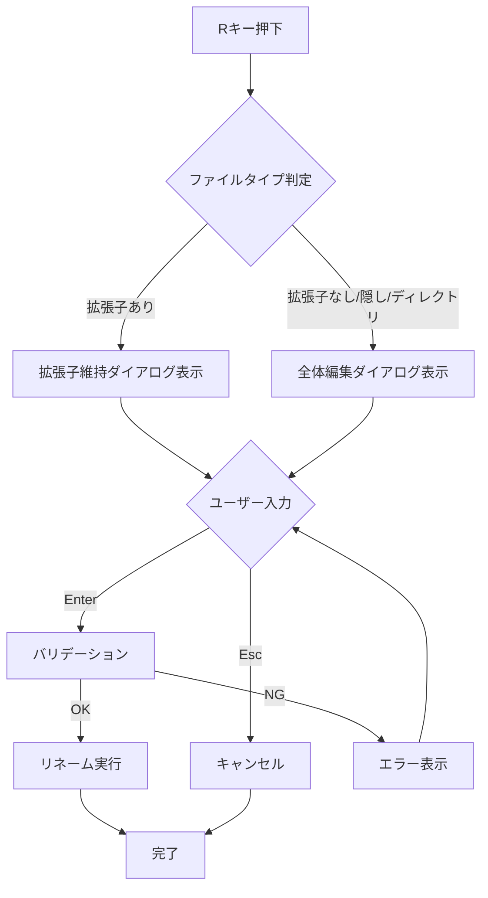
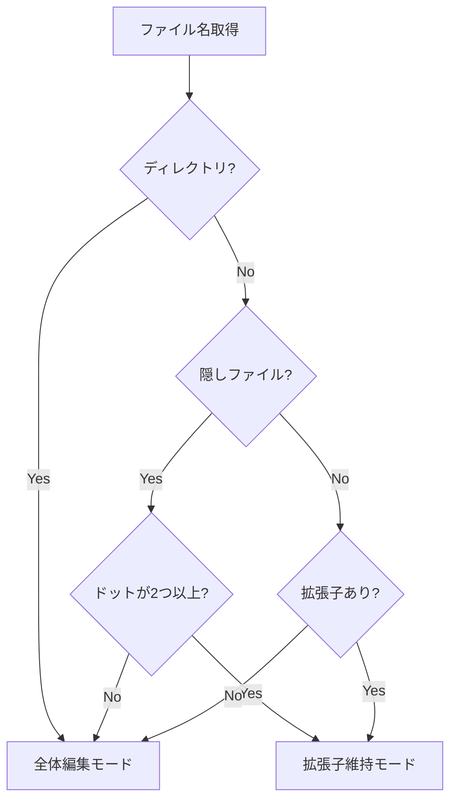
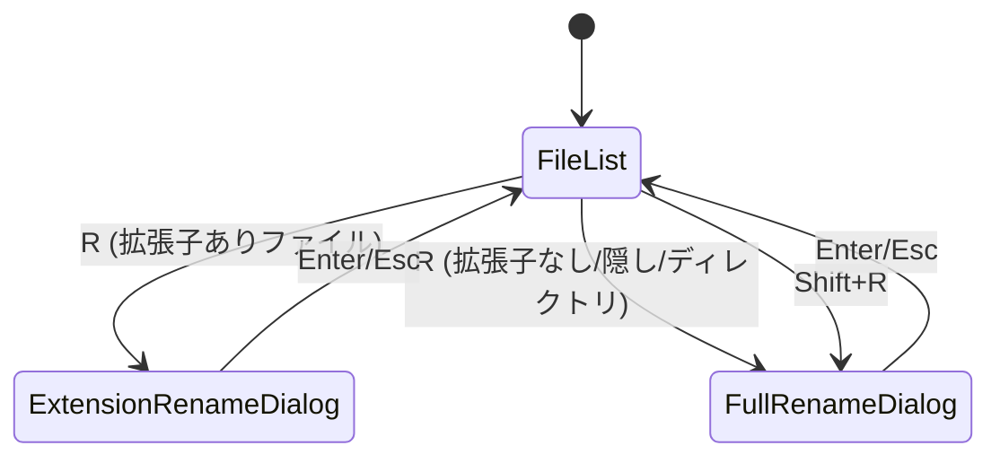

# ファイルリネーム拡張子維持機能 - 要件定義書

## 1. 概要

### 1.1 背景
現在のduofmでは、ファイル名をリネームする際に `R` キーを押すとファイル名全体が編集対象となる。多くの場合、ユーザーはファイルの拡張子を維持したまま基本名のみを変更したいため、毎回拡張子を再入力する必要があり、操作効率が低下している。

### 1.2 目的
- ファイルリネーム時に拡張子を維持する新しいUIを提供し、ユーザーの操作効率を向上させる
- 従来のファイル名全体編集機能も維持し、ユーザーが状況に応じて使い分けられるようにする

### 1.3 スコープ
- `R` キーの挙動を「拡張子維持リネーム」に変更
- `Shift+R` キーで「ファイル名全体リネーム」（従来のRの挙動）を提供
- 拡張子なしファイル、隠しファイル、ディレクトリに対する適切なフォールバック動作

## 2. ビジネス要件

### 2.1 ビジネス目標
- ユーザーの日常的なファイルリネーム操作を効率化
- 誤って拡張子を変更・削除するミスを削減
- duofmの使いやすさを向上させユーザー満足度を高める

### 2.2 対象ユーザー
| ユーザータイプ | 説明 |
|----------------|------|
| 一般ユーザー | ファイル管理を行う全てのduofmユーザー |
| 開発者 | 多数のソースファイルを扱う開発者 |

### 2.3 期待される効果
- ファイルリネーム時のキーストローク削減
- 拡張子誤変更によるファイル破損リスクの低減
- ユーザー操作の一貫性向上

## 3. ユースケース

### 3.1 ユースケース一覧
| ID | ユースケース名 | アクター | 優先度 |
|----|----------------|----------|--------|
| UC01 | 拡張子維持リネーム | ユーザー | 高 |
| UC02 | ファイル名全体リネーム | ユーザー | 高 |
| UC03 | 拡張子なしファイルのリネーム | ユーザー | 中 |
| UC04 | 隠しファイルのリネーム | ユーザー | 中 |
| UC05 | ディレクトリのリネーム | ユーザー | 中 |

### 3.2 ユースケース詳細

#### UC01: 拡張子維持リネーム

**アクター**: ユーザー

**事前条件**:
- ファイル（拡張子あり）が選択されている

**基本フロー**:
1. ユーザーが `R` キーを押す
2. システムがリネームダイアログを表示
3. ダイアログは `[入力フィールド] .拡張子` の形式で表示
4. ユーザーが新しいファイル名（拡張子なし）を入力
5. ユーザーが `Enter` を押す
6. システムがファイル名を変更（入力値 + 固定拡張子）

**代替フロー**:
- ユーザーが `Esc` を押した場合: リネームをキャンセル

**事後条件**:
- ファイル名が変更され、拡張子は維持されている

**UI例**:
```
Rename (extension: .txt):

[document     ]

Enter: Confirm  Esc: Cancel
```

#### UC02: ファイル名全体リネーム

**アクター**: ユーザー

**事前条件**:
- ファイルまたはディレクトリが選択されている

**基本フロー**:
1. ユーザーが `Shift+R` キーを押す
2. システムがリネームダイアログを表示
3. ダイアログは従来の入力フィールドを表示（ファイル名全体が編集対象）
4. ユーザーが新しい名前を入力
5. ユーザーが `Enter` を押す
6. システムがファイル名を変更

**代替フロー**:
- ユーザーが `Esc` を押した場合: リネームをキャンセル

**事後条件**:
- ファイル/ディレクトリ名が入力値に変更されている

#### UC03: 拡張子なしファイルのリネーム

**アクター**: ユーザー

**事前条件**:
- 拡張子のないファイル（例: `Makefile`, `LICENSE`）が選択されている

**基本フロー**:
1. ユーザーが `R` キーを押す
2. システムは拡張子がないことを検出
3. `Shift+R` と同じ挙動（ファイル名全体編集）でダイアログを表示
4. ユーザーが新しい名前を入力
5. ユーザーが `Enter` を押す
6. システムがファイル名を変更

**事後条件**:
- ファイル名が入力値に変更されている

#### UC04: 隠しファイルのリネーム

**アクター**: ユーザー

**事前条件**:
- 隠しファイル（例: `.bashrc`, `.config.json`, `.foo.bar`）が選択されている

**基本フロー**:
1. ユーザーが `R` キーを押す
2. システムは先頭のドットを除いた部分に対して拡張子判定を実施
3. 拡張子がある場合: 拡張子維持リネームダイアログを表示（先頭ドットは保持）
4. 拡張子がない場合: `Shift+R` と同じ挙動（ファイル名全体編集）でダイアログを表示
5. ユーザーが新しい名前を入力
6. ユーザーが `Enter` を押す
7. システムがファイル名を変更

**事後条件**:
- ファイル名が変更されている（先頭ドットは常に保持）

**備考**:
- `.bashrc` → 先頭ドット除くと `bashrc`（ドットなし）→ 拡張子なし → 全体編集
- `.config.json` → 先頭ドット除くと `config.json` → 拡張子 `.json` → 編集対象 `.config`、拡張子維持
- `.foo.bar` → 先頭ドット除くと `foo.bar` → 拡張子 `.bar` → 編集対象 `.foo`、拡張子維持

#### UC05: ディレクトリのリネーム

**アクター**: ユーザー

**事前条件**:
- ディレクトリが選択されている

**基本フロー**:
1. ユーザーが `R` キーを押す
2. システムはディレクトリであることを検出
3. `Shift+R` と同じ挙動（名前全体編集）でダイアログを表示
4. ユーザーが新しい名前を入力
5. ユーザーが `Enter` を押す
6. システムがディレクトリ名を変更

**事後条件**:
- ディレクトリ名が入力値に変更されている

## 4. 機能要件

### 4.1 機能一覧
| ID | 機能名 | 説明 | 優先度 |
|----|--------|------|--------|
| F01 | 拡張子維持リネームダイアログ | 拡張子を固定表示し、基本名のみ編集可能なダイアログ | 高 |
| F02 | Shift+Rキーバインド追加 | ファイル名全体リネーム用のキーバインド | 高 |
| F03 | ファイルタイプ判定 | 拡張子あり/なし/隠しファイル/ディレクトリの判定 | 高 |
| F04 | 複数ドット対応 | `archive.tar.gz` のような複数ドットファイル名の適切な処理 | 高 |

### 4.2 機能詳細

#### F01: 拡張子維持リネームダイアログ

**説明**: 拡張子を入力フィールドの右側に固定表示し、ユーザーは基本名のみを編集できる新しいダイアログ

**入力**:
- 現在のファイル名（拡張子あり）

**出力**:
- 新しいファイル名（入力値 + 固定拡張子）

**処理フロー**:


**UI仕様**:
- タイトル: `Rename (extension: .拡張子):`
- 入力フィールド: 基本名のみを表示・編集
- 拡張子は入力フィールドの右側に固定表示（編集不可）
- 初期値: 現在のファイル名から拡張子を除いた部分

**バリデーション**:
| 項目 | ルール | エラーメッセージ |
|------|--------|------------------|
| 空入力 | 入力必須 | "File name cannot be empty" |
| 重複チェック | 同名ファイル存在確認 | "File already exists" |
| 不正文字 | `/`, `\0` を含まない | "Invalid filename" |

**エラーケース**:
| エラー | 条件 | 対応 |
|--------|------|------|
| 空ファイル名 | 入力が空 | エラーメッセージを表示しEnter無効化 |
| ファイル重複 | 同名ファイルが存在 | エラーメッセージを表示しEnter無効化 |
| 権限エラー | リネーム権限なし | エラーダイアログ表示 |

#### F02: Shift+Rキーバインド追加

**説明**: 従来のRキーの挙動を `Shift+R` に移行

**実装要件**:
- `internal/config/defaults.go` にアクション追加
- `internal/ui/actions.go` に `ActionRenameFullName` 追加
- 既存の `ActionRename` は拡張子維持リネームに変更
- ヘルプダイアログの更新

#### F03: ファイルタイプ判定

**説明**: ファイルの種類に応じて適切なリネームモードを選択

**判定ロジック**:


**隠しファイルの定義**:
- ファイル名が `.` で始まる

**隠しファイルの処理**:
- 先頭のドットを除いた部分に対して拡張子判定を適用
- 先頭ドットは常に保持される
- `.bashrc` → 先頭ドット除くと `bashrc`（ドットなし） → 拡張子なし → 全体編集
- `.config.json` → 先頭ドット除くと `config.json` → 拡張子 `.json`、編集対象 `.config` → 拡張子維持
- `.foo.bar` → 先頭ドット除くと `foo.bar` → 拡張子 `.bar`、編集対象 `.foo` → 拡張子維持

#### F04: 複数ドット対応

**説明**: 複数のドットを含むファイル名を適切に処理

**処理ルール**:
- 最後のドット以降を拡張子とする
- 例: `archive.tar.gz` → 基本名: `archive.tar`, 拡張子: `.gz`
- 例: `file.backup.txt` → 基本名: `file.backup`, 拡張子: `.txt`

## 5. 非機能要件

### 5.1 パフォーマンス要件
- ダイアログ表示: 即時（50ms以下）
- リネーム操作: ファイルシステム依存（通常10ms以下）

### 5.2 セキュリティ要件
- 入力検証: 不正なファイル名文字の排除
- 権限チェック: リネーム権限の確認

### 5.3 可用性要件
- N/A（ローカルTUIアプリケーション）

### 5.4 保守性要件
- 既存のダイアログフレームワーク（`BaseDialog`）を活用
- 新規ダイアログは `extension_rename_dialog.go` として独立したファイルに実装

### 5.5 互換性要件
- 既存のキーバインド設定ファイルとの後方互換性を維持
- `R` キーに別のアクションを割り当てている場合はその設定を尊重

## 6. UI/UX要件

### 6.1 画面設計要件

**拡張子維持リネームダイアログ**:
```
┌─────────────────────────────────────────────┐
│ Rename (extension: .txt):                   │
│                                             │
│ ┌─────────────────────────────┐ .txt       │
│ │document                     │             │
│ └─────────────────────────────┘             │
│                                             │
│ Enter: Confirm  Esc: Cancel                 │
└─────────────────────────────────────────────┘
```

**全体編集リネームダイアログ（従来）**:
```
┌─────────────────────────────────────────────┐
│ Rename to:                                  │
│                                             │
│ ┌─────────────────────────────────────────┐│
│ │document.txt                             ││
│ └─────────────────────────────────────────┘│
│                                             │
│ Enter: Confirm  Esc: Cancel                 │
└─────────────────────────────────────────────┘
```

### 6.2 画面遷移


### 6.3 キーバインド変更

| キー | 変更前 | 変更後 |
|------|--------|--------|
| `R` | ファイル名全体リネーム | 拡張子維持リネーム（条件付き） |
| `Shift+R` | 未割り当て | ファイル名全体リネーム |

## 7. データ要件

### 7.1 データモデル概要
- ファイルシステム上のファイル名を直接操作
- 追加のデータ永続化は不要

### 7.2 設定データ

**キーバインド設定（~/.config/duofm/config.yaml）**:
```yaml
keybindings:
  rename: ["R"]              # 拡張子維持リネーム
  rename_full_name: ["Shift+R"]  # ファイル名全体リネーム
```

## 8. 外部連携

### 8.1 連携システム
| システム名 | 連携方法 | データ |
|------------|----------|--------|
| ファイルシステム | os.Rename | ファイルパス |

## 9. 制約条件

### 9.1 技術的制約
- Bubble Teaフレームワークの制約に従う
- ターミナルの表示幅に応じたUI調整が必要

### 9.2 ビジネス上の制約
- 既存ユーザーへの影響を最小化（キーバインド変更による混乱を避ける）

### 9.3 スケジュール制約
- なし

## 10. 想定される課題とリスク

### 10.1 技術的課題
| 課題 | 影響度 | 対応策 |
|------|--------|--------|
| 拡張子判定の複雑さ | 中 | 明確なルールを定義し、テストケースを充実させる |
| 既存コードとの整合性 | 低 | 既存ダイアログを継承して実装 |

### 10.2 ビジネスリスク
| リスク | 発生確率 | 影響度 | 対応策 |
|--------|----------|--------|--------|
| ユーザーの混乱（R/Shift+R変更） | 中 | 低 | ヘルプダイアログの更新、ステータスバーでのヒント表示 |

## 11. 成功基準

### 11.1 受け入れ基準
- [ ] `R` キーで拡張子維持リネームダイアログが表示される（拡張子ありファイル）
- [ ] `R` キーで全体編集ダイアログが表示される（拡張子なし/隠し/ディレクトリ）
- [ ] `Shift+R` キーで全体編集ダイアログが表示される（全ファイルタイプ）
- [ ] 複数ドットファイル名で最後のドット以降が拡張子として扱われる
- [ ] 隠しファイルは先頭ドットを除いた部分で拡張子判定が行われる
- [ ] 隠しファイル（`.bashrc`等、先頭ドット除いて拡張子なし）は全体編集モードになる
- [ ] 隠しファイルかつ拡張子あり（`.config.json`, `.foo.bar`等）は拡張子維持モードになる
- [ ] 隠しファイルの先頭ドットは常に保持される
- [ ] ディレクトリは常に全体編集モードになる
- [ ] 既存のバリデーション（空入力、重複チェック）が動作する
- [ ] ヘルプダイアログに新しいキーバインドが表示される

### 11.2 KPI
| 指標 | 目標値 | 測定方法 |
|------|--------|----------|
| 機能完成度 | 全受け入れ基準クリア | 受け入れテスト |
| テストカバレッジ | 80%以上 | `go test -cover` |

## 12. テストシナリオ

### 12.1 テスト観点
- [x] 正常系: 拡張子ありファイルで `R` → 拡張子維持ダイアログ表示
- [x] 正常系: 拡張子なしファイルで `R` → 全体編集ダイアログ表示
- [x] 正常系: 隠しファイル（`.bashrc`）で `R` → 全体編集ダイアログ表示（拡張子なしとして扱う）
- [x] 正常系: 隠しファイル（`.config.json`）で `R` → 拡張子維持ダイアログ表示（拡張子 `.json`）
- [x] 正常系: 隠しファイル（`.foo.bar`）で `R` → 拡張子維持ダイアログ表示（拡張子 `.bar`）
- [x] 正常系: ディレクトリで `R` → 全体編集ダイアログ表示
- [x] 正常系: `Shift+R` → 全体編集ダイアログ表示（全ファイルタイプ）
- [x] 正常系: 複数ドット（`archive.tar.gz`）→ `.gz` が拡張子
- [x] 異常系: 空入力 → エラーメッセージ
- [x] 異常系: 重複ファイル名 → エラーメッセージ
- [x] 境界値: 拡張子のみ（`.txt`）→ 全体編集モード

## 13. 用語定義

| 用語 | 定義 |
|------|------|
| 拡張子 | ファイル名の最後のドット以降の部分（例: `.txt`, `.gz`） |
| 基本名 | ファイル名から拡張子を除いた部分（例: `document`, `archive.tar`） |
| 隠しファイル | ファイル名がドット（`.`）で始まるファイル |
| 拡張子維持リネーム | 基本名のみを編集し、拡張子を変更しないリネーム方式 |
| 全体編集リネーム | ファイル名全体を編集対象とするリネーム方式 |

## 14. 確認事項

### 14.1 確認済み事項
- [x] UI形式: 入力フィールドの右側に拡張子を固定表示（例: `[document     ] .txt`）
- [x] 拡張子なしファイル（Makefile等）: 通常のリネーム（ファイル名全体を編集、Shift+Rと同じ動作）
- [x] 隠しファイル: 先頭のドットを除いて考えた場合のR/Shift+Rの挙動と一致
  - `.bashrc` → 先頭ドット除くと `bashrc`（ドットなし）→ 拡張子なし → 全体編集
  - `.config.json` → 先頭ドット除くと `config.json` → 拡張子 `.json`、編集対象 `.config` → 拡張子維持
  - `.foo.bar` → 先頭ドット除くと `foo.bar` → 拡張子 `.bar`、編集対象 `.foo` → 拡張子維持
  - 先頭ドットは常に保持される
- [x] 複数ドットのファイル: 最後のドット以降を拡張子とする（archive.tar.gz → 拡張子は .gz、編集対象は archive.tar）
- [x] ディレクトリ: 常に全体編集（ディレクトリには拡張子の概念がないため）

### 14.2 未確認・保留事項
- なし

## 15. 参考資料

- doc/specification/SPEC.md - プロジェクト仕様書
- internal/ui/input_dialog.go - 既存の入力ダイアログ実装
- internal/ui/rename_input_dialog.go - コピー/移動時のリネームダイアログ実装
