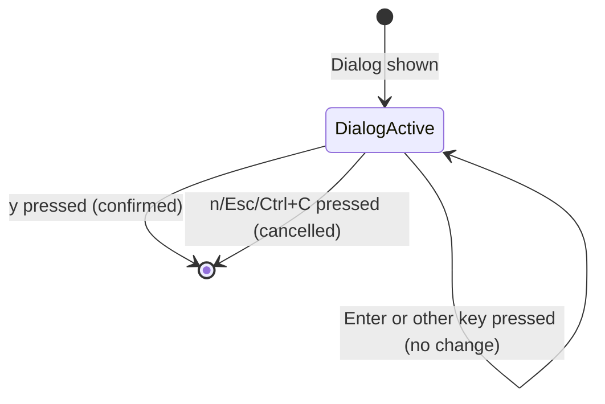

# Feature: Require Y Key for Delete Confirmation

## Overview

This bugfix modifies the delete confirmation dialog to accept only the `y` key for confirmation, removing the `Enter` key as a confirmation option. This change prevents accidental file deletion caused by pressing Enter out of habit.

## Objectives

- Prevent accidental file deletion by removing Enter key confirmation
- Improve safety for destructive operations (delete)
- Maintain consistency with careful confirmation patterns for irreversible actions

## Domain Rules

- Destructive operations (delete) require explicit confirmation with `y` key
- `Enter` key should NOT trigger destructive operations in confirmation dialogs
- Cancel operations (`n`, `Esc`, `Ctrl+C`) remain unchanged

## User Stories

- As a user, I want the delete confirmation to require pressing `y` specifically, so that I don't accidentally delete files by pressing Enter

## Functional Requirements

### FR1: Delete Confirmation Keys

- FR1.1: Pressing `y` key confirms the deletion and executes the delete operation
- FR1.2: Pressing `Enter` key does nothing (input is ignored)
- FR1.3: Pressing `n` key cancels the deletion
- FR1.4: Pressing `Esc` key cancels the deletion
- FR1.5: Pressing `Ctrl+C` key cancels the deletion
- FR1.6: All other keys are ignored (no action taken)

### FR2: Dialog Display

- FR2.1: Dialog button hints display only `[y] Yes  [n] No` without Enter reference

## Non-Functional Requirements

### NFR1: Consistency

- NFR1.1: Behavior applies to all delete confirmation dialogs in the application
- NFR1.2: Context menu delete operation uses the same confirmation behavior

### NFR2: Backward Compatibility

- NFR2.1: Cancel key behavior (`n`, `Esc`, `Ctrl+C`) remains unchanged

## Interface Contract

### Input Specification

| Key | Action |
|-----|--------|
| `y` | Confirm deletion, return `DialogResult{Confirmed: true}` |
| `n` | Cancel deletion, return `DialogResult{Cancelled: true}` |
| `Esc` | Cancel deletion, return `DialogResult{Cancelled: true}` |
| `Ctrl+C` | Cancel deletion, return `DialogResult{Cancelled: true}` |
| `Enter` | No action (ignored) |
| Other keys | No action (ignored) |

### State Transitions

## Test Scenarios

### Unit Tests

- [ ] Test: Pressing `y` returns DialogResult with Confirmed=true
- [ ] Test: Pressing `n` returns DialogResult with Cancelled=true
- [ ] Test: Pressing `Esc` returns DialogResult with Cancelled=true
- [ ] Test: Pressing `Ctrl+C` returns DialogResult with Cancelled=true
- [ ] Test: Pressing `Enter` does not change dialog state and returns nil cmd
- [ ] Test: Pressing other keys does not change dialog state

### Integration Tests

- [ ] Test: Delete file via `d` key, press Enter, file should NOT be deleted
- [ ] Test: Delete file via `d` key, press `y`, file should be deleted
- [ ] Test: Delete file via context menu, press Enter, file should NOT be deleted
- [ ] Test: Delete file via context menu, press `y`, file should be deleted

## Success Criteria

- [ ] `Enter` key no longer triggers deletion in confirmation dialog
- [ ] `y` key correctly confirms deletion
- [ ] `n`, `Esc`, `Ctrl+C` keys correctly cancel deletion
- [ ] Dialog display shows `[y] Yes  [n] No` without Enter reference
- [ ] All existing tests pass after modification
- [ ] New tests cover the Enter key behavior

## Dependencies

- `internal/ui/confirm_dialog.go` - Main modification target
- `internal/ui/dialog.go` - Dialog interface (no changes expected)

## Constraints

- This change only affects `ConfirmDialog` used for delete operations
- Other dialogs (e.g., OverwriteDialog) are out of scope for this bugfix

## References

- Related file: `internal/ui/confirm_dialog.go`
- Original specification: `doc/tasks/ui-design/SPEC.md` (Delete Operation section)
