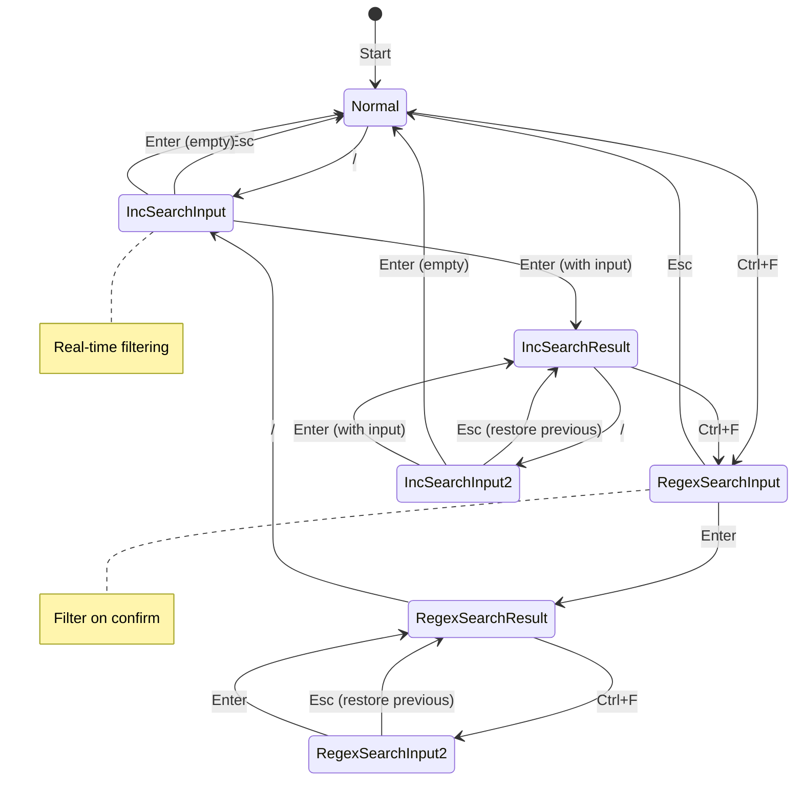

# Feature: Search and Filter

## Overview

Implement search and filter functionality for the active pane's file list. Users can quickly find files using incremental search or regex pattern matching.

## Objectives

- Enable quick file discovery in directories with many files
- Provide real-time filtering with incremental search
- Support advanced pattern matching with regular expressions
- Maintain intuitive keyboard-driven workflow

## User Stories

- As a user, I want to press `/` and type to filter files in real-time, so that I can quickly find what I need
- As a user, I want to use regular expressions with `Ctrl+F`, so that I can find files matching complex patterns
- As a user, I want to cancel or clear search easily, so that I can return to the full file list

## Terminology

| Term | Definition |
|------|------------|
| Minibuffer | A single-line text input area displayed at the bottom of the active pane. Inspired by Emacs, it provides a lightweight input method without modal dialogs. Appears only when search is active and disappears after confirmation or cancellation. |
| Incremental Search | Search that filters results in real-time as the user types each character |
| Filter | The action of hiding non-matching items from the file list |
| Smart Case | Case-sensitivity rule: case-insensitive when pattern is all lowercase, case-sensitive when pattern contains uppercase |

## Technical Requirements

### Key Bindings

| Key | Action | Mode |
|-----|--------|------|
| `/` | Open incremental search | Minibuffer |
| `Ctrl+F` | Open regex search | Minibuffer |
| `Enter` | Confirm search / Clear if empty | Minibuffer |
| `Esc` | Cancel search | Minibuffer |

### Search Modes

#### Incremental Search (`/`)

- Minibuffer prompt: `/: `
- Real-time filtering as user types
- Simple substring matching
- Smart case sensitivity

#### Regex Search (`Ctrl+F`)

- Minibuffer prompt: `(search): `
- Filter applied on `Enter`
- Full Go regex syntax support
- Smart case sensitivity

### Smart Case Logic

```go
func isSmartCaseSensitive(pattern string) bool {
    return pattern != strings.ToLower(pattern)
}
```

- Pattern all lowercase: case-insensitive matching
- Pattern contains uppercase: case-sensitive matching

## State Machine



### State Transitions

| Current State | Event | Next State | Action |
|---------------|-------|------------|--------|
| Normal | `/` | IncSearchInput | Open minibuffer, start filtering |
| Normal | `Ctrl+F` | RegexSearchInput | Open minibuffer |
| IncSearchInput | `Esc` | Normal | Close minibuffer, restore full list |
| IncSearchInput | `Enter` (empty) | Normal | Close minibuffer, restore full list |
| IncSearchInput | `Enter` (input) | IncSearchResult | Close minibuffer, keep filtered list |
| RegexSearchInput | `Esc` | Normal | Close minibuffer, restore full list |
| RegexSearchInput | `Enter` | RegexSearchResult | Apply regex filter, close minibuffer |
| IncSearchResult | `/` | IncSearchInput2 | Open minibuffer (empty), filter from full list |
| IncSearchResult | `Ctrl+F` | RegexSearchInput | Open minibuffer, filter from full list |
| IncSearchInput2 | `Esc` | IncSearchResult | Restore previous search result |
| IncSearchInput2 | `Enter` (empty) | Normal | Clear filter, show full list |
| IncSearchInput2 | `Enter` (input) | IncSearchResult | Apply new filter |
| RegexSearchResult | `Ctrl+F` | RegexSearchInput2 | Open minibuffer (empty) |
| RegexSearchResult | `/` | IncSearchInput | Open minibuffer, filter from full list |
| RegexSearchInput2 | `Esc` | RegexSearchResult | Restore previous search result |
| RegexSearchInput2 | `Enter` | RegexSearchResult | Apply new regex filter |

## Implementation Approach

### Architecture

```
internal/ui/
├── keys.go           # Add KeySearch, KeyRegexSearch
├── search.go         # NEW: Search state and logic
├── search_test.go    # NEW: Search unit tests
├── minibuffer.go     # NEW: Minibuffer component
├── minibuffer_test.go
├── pane.go           # Add filter integration
└── model.go          # Add search key handlers
```

### Data Structures

```go
// SearchMode represents the type of search
type SearchMode int

const (
    SearchModeNone SearchMode = iota
    SearchModeIncremental
    SearchModeRegex
)

// SearchState holds the current search context
type SearchState struct {
    Mode           SearchMode
    Pattern        string
    PreviousResult *SearchResult  // For restoring on Esc
    IsActive       bool           // Minibuffer is open
}

// SearchResult stores a confirmed search
type SearchResult struct {
    Mode    SearchMode
    Pattern string
}
```

### Minibuffer Component

```go
type Minibuffer struct {
    prompt    string  // "/: " or "(search): "
    input     string
    cursorPos int
    visible   bool
}

func (m *Minibuffer) View() string
func (m *Minibuffer) HandleKey(key tea.KeyMsg) (string, bool)  // returns input, confirmed
func (m *Minibuffer) SetPrompt(prompt string)
func (m *Minibuffer) Clear()
func (m *Minibuffer) Show()
func (m *Minibuffer) Hide()
```

### Pane Filter Integration

```go
type Pane struct {
    // ... existing fields
    allEntries      []fs.Entry    // Unfiltered entries
    filteredEntries []fs.Entry    // Currently displayed entries
    searchState     SearchState
}

func (p *Pane) ApplyFilter(pattern string, mode SearchMode)
func (p *Pane) ClearFilter()
func (p *Pane) FilteredEntries() []fs.Entry
```

### Filter Functions

```go
// Incremental search filter (substring match)
func filterIncremental(entries []fs.Entry, pattern string) []fs.Entry {
    if pattern == "" {
        return entries
    }

    caseSensitive := isSmartCaseSensitive(pattern)
    if !caseSensitive {
        pattern = strings.ToLower(pattern)
    }

    result := make([]fs.Entry, 0)
    for _, e := range entries {
        name := e.Name
        if !caseSensitive {
            name = strings.ToLower(name)
        }
        if strings.Contains(name, pattern) {
            result = append(result, e)
        }
    }
    return result
}

// Regex search filter
func filterRegex(entries []fs.Entry, pattern string) ([]fs.Entry, error) {
    if pattern == "" {
        return entries, nil
    }

    // Apply smart case
    if !isSmartCaseSensitive(pattern) {
        pattern = "(?i)" + pattern
    }

    re, err := regexp.Compile(pattern)
    if err != nil {
        return nil, err
    }

    result := make([]fs.Entry, 0)
    for _, e := range entries {
        if re.MatchString(e.Name) {
            result = append(result, e)
        }
    }
    return result, nil
}
```

### Model Integration

```go
func (m *Model) Update(msg tea.Msg) (tea.Model, tea.Cmd) {
    // Handle minibuffer input when active
    if m.minibuffer.visible {
        switch msg := msg.(type) {
        case tea.KeyMsg:
            switch msg.String() {
            case "enter":
                input := m.minibuffer.input
                m.minibuffer.Hide()
                if input == "" && m.searchState.PreviousResult == nil {
                    m.getActivePane().ClearFilter()
                } else if input == "" {
                    // Empty input clears filter
                    m.getActivePane().ClearFilter()
                    m.searchState = SearchState{}
                } else {
                    m.getActivePane().ApplyFilter(input, m.searchState.Mode)
                    m.searchState.PreviousResult = &SearchResult{
                        Mode:    m.searchState.Mode,
                        Pattern: input,
                    }
                }
                m.searchState.IsActive = false
                return m, nil

            case "esc":
                m.minibuffer.Hide()
                if m.searchState.PreviousResult != nil {
                    // Restore previous search result
                    m.getActivePane().ApplyFilter(
                        m.searchState.PreviousResult.Pattern,
                        m.searchState.PreviousResult.Mode,
                    )
                } else {
                    m.getActivePane().ClearFilter()
                }
                m.searchState.IsActive = false
                return m, nil

            default:
                // Forward to minibuffer
                m.minibuffer.HandleKey(msg)
                // For incremental search, apply filter on each keystroke
                if m.searchState.Mode == SearchModeIncremental {
                    m.getActivePane().ApplyFilter(m.minibuffer.input, SearchModeIncremental)
                }
                return m, nil
            }
        }
    }

    // Normal key handling
    switch msg := msg.(type) {
    case tea.KeyMsg:
        switch msg.String() {
        case "/":
            m.startSearch(SearchModeIncremental)
            return m, nil
        case "ctrl+f":
            m.startSearch(SearchModeRegex)
            return m, nil
        }
    }
    // ... existing handling
}

func (m *Model) startSearch(mode SearchMode) {
    // Save current result if exists
    if m.searchState.PreviousResult != nil {
        // Keep it for Esc restoration
    } else {
        m.searchState.PreviousResult = nil
    }

    m.searchState.Mode = mode
    m.searchState.IsActive = true

    if mode == SearchModeIncremental {
        m.minibuffer.SetPrompt("/: ")
    } else {
        m.minibuffer.SetPrompt("(search): ")
    }
    m.minibuffer.Clear()
    m.minibuffer.Show()

    // Start filtering from full list
    m.getActivePane().ResetToFullList()
}
```

### UI Layout

```
duofm v0.1.0
 ~/src/my_projects/go/duofm                               ~
 Marked 0/10 0 B                           922.5 GiB Free Marked 0/61 0 B                           922.5 GiB Free
 ─────────────────────────────────────────────────────────────────────────────────────────────────────────────────
 ..                                        -  2025-12-17  ..                                        -  2021-02-02
 cmd/                                      -  2025-12-18  AI/                                       -  2025-09-28
 doc/                                      -  2025-12-21  Documents/                                -  2025-12-01
 internal/                                 -  2025-12-21  Downloads/                                -  2025-12-20
 /: cmd                                                   ← Minibuffer (active pane bottom)
```

- Minibuffer appears at bottom of active pane (left in this example)
- `/: ` prompt for incremental search
- `(search): ` prompt for regex search

## Test Scenarios

### Incremental Search Tests

- [ ] `/` opens minibuffer with prompt `/: `
- [ ] Typing filters list in real-time
- [ ] `Enter` confirms and closes minibuffer, keeps filtered list
- [ ] `Enter` with empty input restores full list
- [ ] `Esc` cancels and restores previous state
- [ ] Smart case: "abc" matches "ABC", "Abc" does not match "ABC"

### Regex Search Tests

- [ ] `Ctrl+F` opens minibuffer with prompt `(search): `
- [ ] Filter applied only on `Enter`
- [ ] Valid regex filters correctly (e.g., `.*\.go$`)
- [ ] Invalid regex shows error, does not crash
- [ ] Smart case works with regex
- [ ] `Esc` cancels and restores previous state

### State Transition Tests

- [ ] Normal → `/` → IncSearchInput: works correctly
- [ ] Normal → `Ctrl+F` → RegexSearchInput: works correctly
- [ ] IncSearchResult → `Ctrl+F`: starts fresh regex search
- [ ] RegexSearchResult → `/`: starts fresh incremental search
- [ ] Nested search (`/` after confirmed `/`): previous result restorable on `Esc`
- [ ] Empty `Enter` from any search result: returns to Normal (full list)

### Edge Cases

- [ ] Filter with no matches: empty list displayed, UI remains responsive
- [ ] Very long pattern: handled gracefully
- [ ] Special characters in pattern: escaped properly for substring match
- [ ] Unicode file names: filtered correctly
- [ ] Hidden file toggle during search: maintains filter

### Performance Tests

- [ ] 1000 files: filter response < 10ms
- [ ] Key-to-display latency < 50ms

## Success Criteria

- [ ] Both search modes (`/` and `Ctrl+F`) work correctly
- [ ] State transitions follow specification exactly
- [ ] Smart case sensitivity works for both modes
- [ ] Minibuffer displays correctly at bottom of pane
- [ ] Filter results persist until explicitly cleared
- [ ] `Esc` restores previous search state
- [ ] Empty `Enter` clears all filters
- [ ] No performance degradation with typical directory sizes
- [ ] All existing functionality remains unaffected
- [ ] All unit tests pass

## Dependencies

- Go standard library `regexp` package
- Existing Bubble Tea framework
- No new external libraries required

## Open Questions

None - all requirements have been clarified.

## Out of Scope

- Recursive directory search
- File content search (grep-like functionality)
- Search history persistence
- Multiple search pattern combination (AND/OR)
