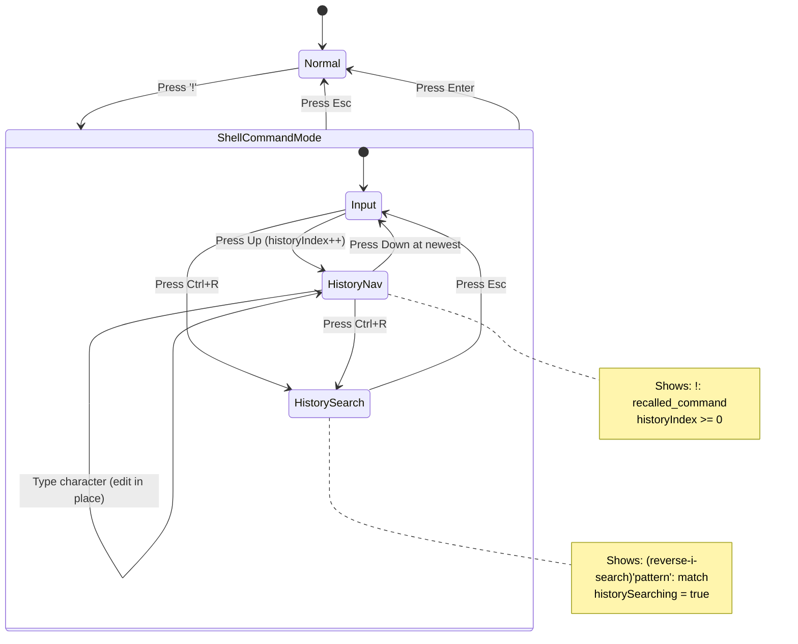

# Feature: Shell Command History Enhancement

## Overview

This feature enhances the existing shell command history functionality with two key improvements:
1. Bash-style up/down arrow key navigation through command history
2. Visual feedback of search pattern during Ctrl+R incremental search

This specification extends the existing functionality defined in `doc/tasks/shell-command-history/SPEC.md`.

## Objectives

- Implement bash-style up/down arrow key history navigation in shell command mode
- Display search pattern inline during Ctrl+R incremental search (bash-style format)
- Maintain backward compatibility with existing functionality

## User Stories

### US1: Navigate History with Arrow Keys

As a power user, I want to press Up/Down arrow keys in shell command mode to navigate through my command history, so that I can quickly recall and re-execute previous commands without using Ctrl+R.

**Acceptance Criteria:**
- [ ] Pressing Up in shell command mode shows the previous command
- [ ] Pressing Up repeatedly cycles through older commands
- [ ] Pressing Down after Up shows newer commands
- [ ] Pressing Down at the most recent command restores original input (edit buffer)
- [ ] Up on empty history does nothing

### US2: See Search Pattern During Ctrl+R

As a user, I want to see what I've typed during Ctrl+R search, so that I can understand which pattern is being matched and correct mistakes.

**Acceptance Criteria:**
- [ ] Prompt shows search pattern: `(reverse-i-search)'pattern': matched command`
- [ ] Pattern updates as each character is typed
- [ ] Backspace removes characters from pattern
- [ ] Empty pattern shows: `(reverse-i-search)'': `

## Technical Requirements

### Functional Requirements

#### History Navigation (Up/Down Keys)

- **FR1:** Up arrow key in shell command mode shall display the previous command from history
- **FR2:** Down arrow key shall navigate to newer commands in history
- **FR3:** Navigation shall wrap (reaching oldest command, Up does nothing; at newest, Down restores empty input)
- **FR4:** Current input before navigation shall be preserved as "edit buffer" position 0
- **FR5:** Editing a recalled command is allowed; subsequent Up/Down continues from current position
- **FR6:** Entering shell command mode shall reset history navigation index to -1 (before history)

#### Search Pattern Display

- **FR7:** Ctrl+R search mode prompt shall display: `(reverse-i-search)'pattern': command`
- **FR8:** Search pattern shall update in real-time as characters are typed
- **FR9:** Backspace shall remove the last character from the search pattern
- **FR10:** Matched command shall display after the pattern section
- **FR11:** If no match, command section shall be empty (no error message)

### Non-Functional Requirements

- **NFR1 - Performance:** Up/Down navigation shall respond within 50ms
- **NFR2 - Performance:** Search pattern update shall reflect within 100ms
- **NFR3 - Compatibility:** All existing Ctrl+R functionality shall remain intact
- **NFR4 - Compatibility:** All existing Enter/Esc behavior shall remain intact

## Implementation Approach

### Architecture Changes

**Model Extensions:**

```go
type Model struct {
    // ... existing fields ...

    // History navigation state
    historyIndex     int    // -1 = at input, 0 = most recent command, n = nth oldest
    historyEditBuf   string // Original input before navigation started
}
```

**HistorySearcher Extensions:**

```go
type HistorySearcher struct {
    // ... existing fields ...

    pattern string // Make accessible for display
}

// Pattern returns the current search pattern for display
func (s *HistorySearcher) Pattern() string
```

### State Machine



### Key Handling Updates

#### Up Arrow Key

```go
case tea.KeyUp:
    if m.historySearching {
        // Not handled during search mode
        return m, nil
    }
    if m.shellHistory.IsEnabled() {
        commands := m.shellHistory.Commands()
        if len(commands) == 0 {
            return m, nil
        }
        if m.historyIndex == -1 {
            // Save current input as edit buffer
            m.historyEditBuf = m.minibuffer.Input()
        }
        if m.historyIndex < len(commands)-1 {
            m.historyIndex++
            m.minibuffer.SetInput(commands[m.historyIndex])
        }
    }
    return m, nil
```

#### Down Arrow Key

```go
case tea.KeyDown:
    if m.historySearching {
        // Not handled during search mode
        return m, nil
    }
    if m.historyIndex > -1 {
        m.historyIndex--
        if m.historyIndex == -1 {
            // Restore edit buffer
            m.minibuffer.SetInput(m.historyEditBuf)
        } else {
            m.minibuffer.SetInput(m.shellHistory.Commands()[m.historyIndex])
        }
    }
    return m, nil
```

#### Ctrl+R Prompt Format

```go
func (m *Model) searchPrompt() string {
    if m.historySearcher == nil {
        return "(reverse-i-search)'': "
    }
    return fmt.Sprintf("(reverse-i-search)'%s': ", m.historySearcher.Pattern())
}
```

### Display Format

#### Shell Command Mode (Normal)

```
!: █
```

#### Shell Command Mode (History Navigation)

```
!: git push origin main█
```

#### Ctrl+R Search Mode

```
(reverse-i-search)'git': git push origin main
```

#### Ctrl+R Search Mode (No Match)

```
(reverse-i-search)'xyz':
```

### File Changes

| File | Changes |
|------|---------|
| `internal/ui/model.go` | Add `historyIndex`, `historyEditBuf` fields |
| `internal/ui/model_update_keyboard.go` | Handle Up/Down keys, update search prompt |
| `internal/ui/history_searcher.go` | Add `Pattern()` getter method |
| `internal/ui/minibuffer.go` | (No changes expected) |

## Test Scenarios

### Unit Tests

#### History Navigation

- [ ] Up on empty history returns without change
- [ ] Up on first press shows most recent command (index 0)
- [ ] Up on subsequent press shows older commands
- [ ] Up at oldest command does not advance further
- [ ] Down after Up shows newer command
- [ ] Down at most recent restores original input
- [ ] Down without prior Up does nothing
- [ ] Entering shell mode resets historyIndex to -1
- [ ] Edit buffer is saved when first pressing Up
- [ ] Edit buffer is restored when pressing Down to index -1

#### Search Pattern Display

- [ ] Initial Ctrl+R shows `(reverse-i-search)'': `
- [ ] Typing 'g' shows `(reverse-i-search)'g': `
- [ ] Typing 'gi' shows `(reverse-i-search)'gi': `
- [ ] Backspace removes last char from pattern
- [ ] Pattern persists across Ctrl+R (next match)
- [ ] Esc clears pattern and returns to shell mode
- [ ] Enter executes and clears pattern

### Integration Tests

- [ ] Up key in shell mode shows last executed command
- [ ] Navigate up 3 commands, then down 2, correct command shown
- [ ] Ctrl+R shows pattern as typed
- [ ] Full workflow: type, Ctrl+R, search, Ctrl+R (next), Enter

### Edge Cases

- [ ] Unicode characters in search pattern display correctly
- [ ] Very long search pattern (>50 chars) displays reasonably
- [ ] Empty history with Up key press
- [ ] Single entry history navigation
- [ ] Rapid Up/Down key presses

## Success Criteria

- [ ] All acceptance criteria from user stories are met
- [ ] All unit tests pass with 80%+ coverage
- [ ] All integration tests pass
- [ ] Existing functionality remains intact (regression tests pass)
- [ ] Performance requirements met (50ms navigation, 100ms search update)
- [ ] Code review completed

## Implementation Phases

### Phase 1: Up/Down History Navigation

**Deliverables:**
- Model extension with historyIndex and historyEditBuf
- Up/Down key handling in shell command mode
- Unit tests for navigation logic

### Phase 2: Search Pattern Display

**Deliverables:**
- HistorySearcher Pattern() method
- Updated prompt format during search
- Unit tests for pattern display

### Phase 3: Polish and Testing

**Deliverables:**
- Integration tests
- Edge case handling
- Documentation updates

## References

- Base specification: `doc/tasks/shell-command-history/SPEC.md`
- bash readline: https://www.gnu.org/software/bash/manual/html_node/Commands-For-History.html
- Existing implementation: `internal/ui/model_update_keyboard.go`, `internal/ui/shell_history.go`
