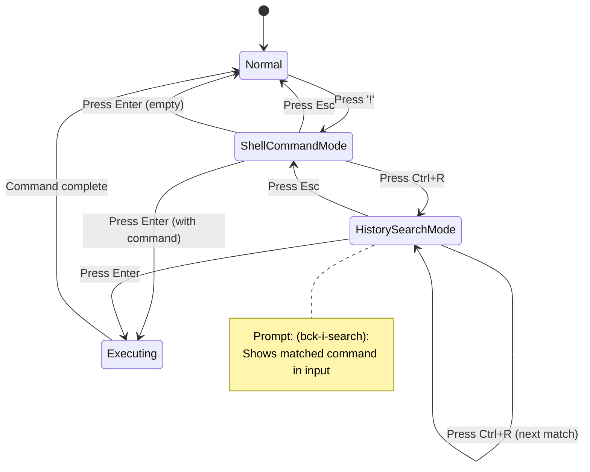

# Feature: Shell Command History

## Overview

This feature adds persistent shell command history and bash-like Ctrl+R incremental search functionality to duofm's shell command mode. Users can recall previously executed commands, search through history interactively, and have their command history preserved across sessions.

## Objectives

- Persist shell command history to a file for cross-session availability
- Implement Ctrl+R incremental history search similar to bash
- Allow configuration of history size with sensible defaults
- Automatically remove duplicate commands (keep only the most recent)
- Maintain backward compatibility with existing shell command functionality

## User Stories

### US1: Recall Previous Commands via Incremental Search
As a power user, I want to search through my command history using Ctrl+R, so that I can quickly find and re-execute previously used commands.

**Acceptance Criteria:**
- [ ] Pressing Ctrl+R in shell command mode starts incremental search
- [ ] Typing characters filters history to matching commands
- [ ] Pressing Ctrl+R again moves to the next matching command (older)
- [ ] Pressing Enter executes the selected command
- [ ] Pressing Esc cancels search and returns to shell command mode

### US2: Persistent Command History
As a user, I want my command history to be saved between sessions, so that I can access previously executed commands after restarting duofm.

**Acceptance Criteria:**
- [ ] Commands are saved to ~/.config/duofm/history
- [ ] History is loaded on application startup
- [ ] History survives application restart
- [ ] Missing history file is handled gracefully (start with empty history)

### US3: Configure History Limit
As a user, I want to configure the maximum number of history entries, so that I can control disk usage and search performance.

**Acceptance Criteria:**
- [ ] history_limit can be set in config.toml
- [ ] Default limit is 20000 entries
- [ ] Setting limit to 0 disables history completely
- [ ] Old entries are removed when limit is exceeded

### US4: Duplicate Command Handling
As a user, I want duplicate commands to be consolidated, so that my history stays clean and the same command doesn't appear multiple times.

**Acceptance Criteria:**
- [ ] When a command is executed, any previous identical entry is removed
- [ ] The new command is added to the top of history
- [ ] Comparison is case-sensitive and exact match

## Technical Requirements

### Functional Requirements
- **FR1:** Shell command history shall be stored in `~/.config/duofm/history`
- **FR2:** History file format shall be plain text with one command per line (newest first)
- **FR3:** History shall be loaded on application startup (if entries exceed limit, oldest entries shall be trimmed)
- **FR4:** History shall be saved asynchronously using atomic write (tmp file + rename) with debounce
- **FR5:** Ctrl+R in shell command mode shall activate incremental search
- **FR6:** Incremental search shall be case-insensitive substring matching
- **FR7:** Ctrl+R during search shall move to the next older match
- **FR8:** Enter during search shall confirm selection and execute command
- **FR9:** Esc during search shall cancel and return to shell command mode
- **FR10:** Duplicate commands shall be deduplicated (keep newest only)
- **FR11:** History limit shall be configurable via `history_limit` in config.toml
- **FR12:** Setting `history_limit = 0` shall disable history functionality entirely

### Non-Functional Requirements
- **NFR1 - Performance:** History search shall complete in under 100ms for 20000 entries
- **NFR2 - Security:** History file shall have 0600 permissions (owner read/write only)
- **NFR3 - Reliability:** Application shall start normally even if history file is corrupted
- **NFR4 - Compatibility:** Feature shall not break existing shell command functionality

## Implementation Approach

### Architecture

**Component Diagram:**
```
┌──────────────────────────────────────────────────────────────┐
│                         Model                                 │
│  ┌─────────────────────────────────────────────────────────┐ │
│  │                  ShellHistory                            │ │
│  │  - commands []string  (in-memory table, max 20000)       │ │
│  │  - limit int                                             │ │
│  │  - saveQueue chan struct{}  (debounced save trigger)     │ │
│  │  + Add(cmd string)                                       │ │
│  │  + Commands() []string                                   │ │
│  │  + Load() error                                          │ │
│  │  + Close() error  (flush pending saves)                  │ │
│  └─────────────────────────────────────────────────────────┘ │
│                              │                                │
│  ┌─────────────────────────────────────────────────────────┐ │
│  │                HistorySearcher                           │ │
│  │  - history *ShellHistory  (reference)                    │ │
│  │  - pattern string                                        │ │
│  │  - index int                                             │ │
│  │  + SetPattern(pattern string)                            │ │
│  │  + Current() string                                      │ │
│  │  + Next() string                                         │ │
│  │  + Reset()                                               │ │
│  └─────────────────────────────────────────────────────────┘ │
│                              │                                │
│  ┌───────────────┐   ┌──────┴───────┐   ┌────────────────┐  │
│  │  Minibuffer   │───│   Model      │───│    Config      │  │
│  │  (input UI)   │   │ (state mgmt) │   │ (history_limit)│  │
│  └───────────────┘   └──────────────┘   └────────────────┘  │
└──────────────────────────────────────────────────────────────┘
                              │
                              ▼ (async, debounced)
                    ┌─────────────────┐
                    │ Atomic Write    │
                    │ (tmp + rename)  │
                    └────────┬────────┘
                              ▼
                    ┌─────────────────┐
                    │ ~/.config/duofm │
                    │   /history      │
                    └─────────────────┘
```

**Write Flow:**
```
Add(cmd) → Update in-memory table → Trigger saveQueue → Debounce (500ms)
                                                              ↓
                                         Atomic Write (write to .tmp, rename)
```

### State Machine



### Data Flow

```
User Input (Ctrl+R) → Model.handleShellCommandInput()
                           │
                           ▼
                    Enter History Search Mode
                           │
                           ▼
                    Update Minibuffer Prompt
                           │
User Types Characters ──────────────┐
                                    ▼
                    ShellHistory.Search(pattern)
                           │
                           ▼
                    Update Minibuffer Input
                           │
User Presses Ctrl+R ───────────────┐
                                   ▼
                    ShellHistory.SearchNext()
                           │
                           ▼
                    Update Minibuffer Input
                           │
User Presses Enter ────────────────┐
                                   ▼
                    executeShellCommand()
                           │
                           ▼
                    ShellHistory.Add(command)
                           │
                           ▼
                    Trigger saveQueue (async)
                           │
                           ▼ (background goroutine, debounced)
                    Atomic Write to file
```

**Application Lifecycle:**
```
Startup → NewShellHistory() → Load() → [Normal Operation] → Close() → Flush & Shutdown
```

### File Structure

```
internal/
├── ui/
│   ├── shell_history.go           # ShellHistory struct and methods
│   ├── shell_history_test.go      # Unit tests for ShellHistory
│   ├── history_searcher.go        # HistorySearcher struct and methods
│   ├── history_searcher_test.go   # Unit tests for HistorySearcher
│   ├── model.go                   # Add shellHistory, historySearcher fields
│   ├── model_update_keyboard.go   # Handle Ctrl+R in shell mode
│   └── minibuffer.go              # (existing, may need minor updates)
├── config/
│   └── config.go                  # Add HistoryLimit field
```

### New Types and Methods

#### ShellHistory (internal/ui/shell_history.go)

```go
// ShellHistory manages shell command history with persistence
type ShellHistory struct {
    commands  []string       // Command history (newest first), max 20000 entries
    limit     int            // Maximum number of entries (0 = disabled)
    filePath  string         // Path to history file
    saveQueue chan struct{}  // Triggers debounced save
    done      chan struct{}  // Signals shutdown
    mu        sync.RWMutex   // Protects commands slice
}

// NewShellHistory creates a new ShellHistory with the given limit and starts background saver
func NewShellHistory(limit int, filePath string) *ShellHistory

// Load reads history from file (trims to limit if exceeded)
func (h *ShellHistory) Load() error

// Add adds a command to history (deduplicates) and triggers async save
func (h *ShellHistory) Add(command string)

// Close flushes pending saves and stops background goroutine
func (h *ShellHistory) Close() error

// IsEnabled returns true if history is enabled (limit > 0)
func (h *ShellHistory) IsEnabled() bool

// Commands returns a copy of the command history (for searching)
func (h *ShellHistory) Commands() []string

// HistorySearcher handles incremental search state (separate from ShellHistory)
type HistorySearcher struct {
    history   *ShellHistory  // Reference to history
    pattern   string         // Current search pattern
    index     int            // Current match index (-1 = not started)
    matches   []int          // Indices of matching commands
}

// NewHistorySearcher creates a new searcher for the given history
func NewHistorySearcher(h *ShellHistory) *HistorySearcher

// SetPattern updates search pattern and finds matches
func (s *HistorySearcher) SetPattern(pattern string)

// Current returns the currently matched command (or empty string)
func (s *HistorySearcher) Current() string

// Next moves to next match and returns it (or empty string if no more)
func (s *HistorySearcher) Next() string

// Reset clears search state
func (s *HistorySearcher) Reset()
```

#### Config Extension (internal/config/config.go)

```go
type Config struct {
    Keybindings  map[string][]string `toml:"keybindings"`
    Colors       *ColorConfig
    HistoryLimit int                 `toml:"history_limit"` // Default: 20000, 0 = disabled
}
```

### Model Changes

Add to Model struct in `internal/ui/model.go`:

```go
type Model struct {
    // ... existing fields ...

    // Shell command history
    shellHistory     *ShellHistory
    historySearcher  *HistorySearcher  // Created on demand when searching
    historySearching bool              // True when in Ctrl+R search mode
}
```

### Keyboard Handling Updates

Update `handleShellCommandInput` in `internal/ui/model_update_keyboard.go`:

```go
func (m *Model) handleShellCommandInput(msg tea.KeyMsg) (tea.Model, tea.Cmd) {
    switch msg.Type {
    case tea.KeyCtrlR:
        if m.shellHistory.IsEnabled() {
            if m.historySearching {
                // Find next match
                if match := m.historySearcher.Next(); match != "" {
                    m.minibuffer.SetInput(match)
                }
            } else {
                // Start history search
                m.historySearching = true
                m.historySearcher = NewHistorySearcher(m.shellHistory)
                m.minibuffer.SetPrompt("(bck-i-search): ")
            }
        }
        return m, nil

    // ... existing key handling ...

    case tea.KeyRunes:
        if m.historySearching {
            // Update search pattern and find match
            m.minibuffer.HandleKey(msg)
            pattern := m.minibuffer.Input()
            m.historySearcher.SetPattern(pattern)
            if match := m.historySearcher.Current(); match != "" {
                m.minibuffer.SetInput(match)
            }
            return m, nil
        }
        // ... existing rune handling ...

    case tea.KeyEsc:
        if m.historySearching {
            m.historySearching = false
            m.historySearcher.Reset()
            m.historySearcher = nil
            // Return to shell command mode
        }
        // ...
    }
}
```

### History File Format

```
# ~/.config/duofm/history
# Plain text, one command per line, newest first
git push origin main
docker-compose up -d
ls -la
cd /home/user/projects
```

### Configuration

Add to config.toml:

```toml
# Shell command history limit (0 = disabled)
# Default: 20000
history_limit = 20000
```

## Test Scenarios

### Unit Tests

#### ShellHistory Tests
- [ ] NewShellHistory creates empty history with correct limit
- [ ] Add appends command to front of history
- [ ] Add removes duplicate commands (keeps newest)
- [ ] Add respects limit, removes oldest when exceeded
- [ ] Add does nothing when limit is 0
- [ ] Load reads commands from file correctly
- [ ] Load handles missing file gracefully
- [ ] Load handles corrupted file gracefully
- [ ] Atomic write writes commands to file correctly (tmp + rename)
- [ ] Atomic write creates parent directories if needed
- [ ] Atomic write sets correct file permissions (0600)
- [ ] Close flushes pending saves before returning
- [ ] Debounce coalesces multiple rapid Add calls into single write
- [ ] Search finds matching command (case-insensitive)
- [ ] Search returns empty string when no match
- [ ] SearchNext moves to next matching command
- [ ] SearchNext returns empty when no more matches
- [ ] IsEnabled returns false when limit is 0

#### Integration Tests
- [ ] Pressing ! then Ctrl+R enters history search mode
- [ ] Typing in search mode filters history
- [ ] Ctrl+R in search mode shows next match
- [ ] Enter in search mode executes matched command
- [ ] Esc in search mode returns to shell command mode
- [ ] Executed command is added to history
- [ ] Duplicate command moves to top of history

### E2E Tests
- [ ] Start duofm, execute command, restart, verify history persists
- [ ] Execute same command twice, verify only one entry in history
- [ ] Configure history_limit=10, add 15 commands, verify only 10 persist
- [ ] Configure history_limit=0, verify Ctrl+R does nothing

### Edge Cases
- [ ] Empty search pattern matches all history
- [ ] Very long command (>1000 chars) is handled correctly
- [ ] Unicode characters in commands are preserved
- [ ] Command with leading/trailing whitespace is trimmed
- [ ] History file with trailing newline is parsed correctly
- [ ] Concurrent access to history file (unlikely but possible)

### Performance Tests
- [ ] Search 20000 history entries in under 100ms
- [ ] Load 20000 history entries in under 500ms
- [ ] Atomic write 20000 history entries in under 100ms

## Security Considerations

- **File Permissions:** History file must be created with 0600 permissions to prevent other users from reading command history
- **Sensitive Data:** Users are responsible for avoiding sensitive data (passwords, tokens) in commands. Document this limitation.
- **Path Traversal:** History file path is fixed to `~/.config/duofm/history`, not configurable to prevent path traversal attacks
- **Input Sanitization:** Commands are stored as-is without sanitization (they were already executed)

## Error Handling

### Error Codes

| Code | Description | HTTP Status | User Message |
|------|-------------|-------------|--------------|
| HIST_LOAD_FAIL | Failed to load history file | N/A | Warning in status bar |
| HIST_SAVE_FAIL | Failed to save history file | N/A | Error logged, silent |
| HIST_PERM_FAIL | Failed to set file permissions | N/A | Error logged, silent |

### Error Flow

```
Error Occurs → Log Error → Determine Error Type → Continue Operation
                                │
                                ├── Load Error → Use empty history, show warning
                                ├── Save Error → Log only, don't interrupt user
                                └── Permission Error → Log only, continue
```

## Success Criteria

- [ ] All functional requirements are implemented and tested
- [ ] All unit tests pass with 80%+ coverage
- [ ] All integration tests pass
- [ ] Performance meets specified goals (100ms search for 20000 entries, 500ms load)
- [ ] History file has correct permissions (0600)
- [ ] Existing shell command functionality is not broken
- [ ] Code review is completed
- [ ] Documentation is updated (README, help dialog)

## Implementation Phases

### Phase 1: Core History Infrastructure
**Goals:** Implement ShellHistory struct with persistence
**Deliverables:**
- ShellHistory struct with Add, Load, Save methods
- Unit tests for all ShellHistory methods
- Config extension for history_limit

### Phase 2: Search Functionality
**Goals:** Implement incremental search
**Deliverables:**
- Search and SearchNext methods
- Ctrl+R key handling in shell command mode
- Minibuffer integration for search display

### Phase 3: Integration and Polish
**Goals:** Full integration with duofm
**Deliverables:**
- History loaded on startup
- History saved after command execution
- Help dialog updated
- Edge case handling

## References

- Existing implementation: `internal/ui/exec.go`, `internal/ui/minibuffer.go`
- Config handling: `internal/ui/config/config.go`
- bash Ctrl+R: https://www.gnu.org/software/bash/manual/html_node/Commands-For-History.html
- XDG Base Directory: https://specifications.freedesktop.org/basedir-spec/basedir-spec-latest.html
