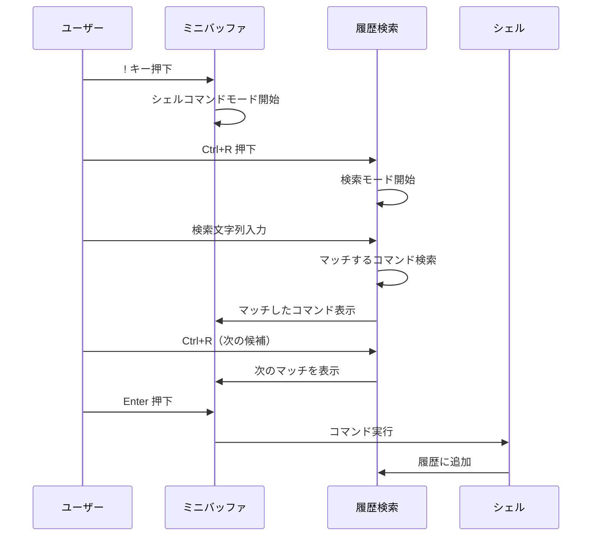
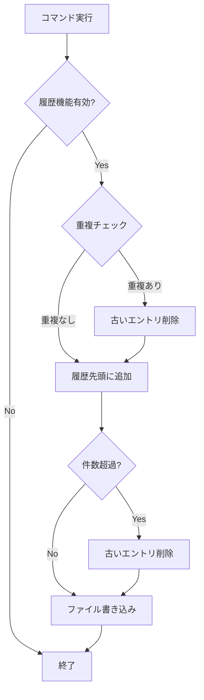
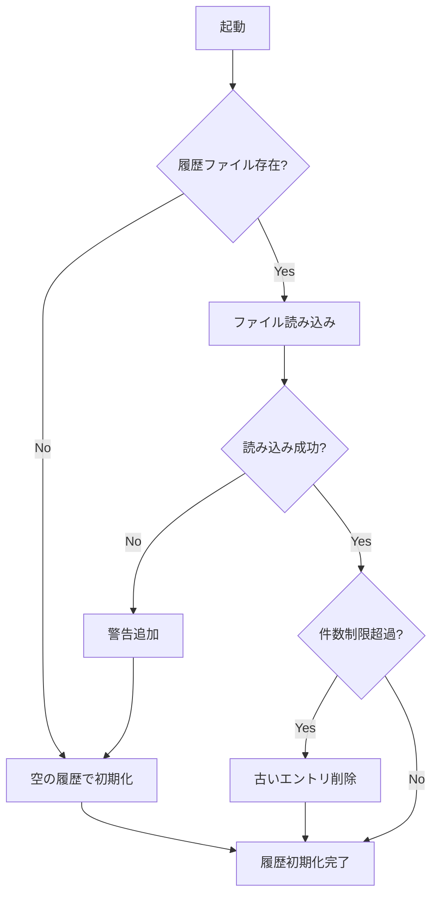
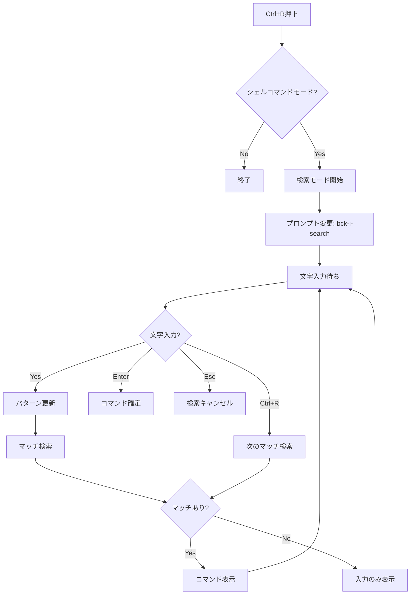
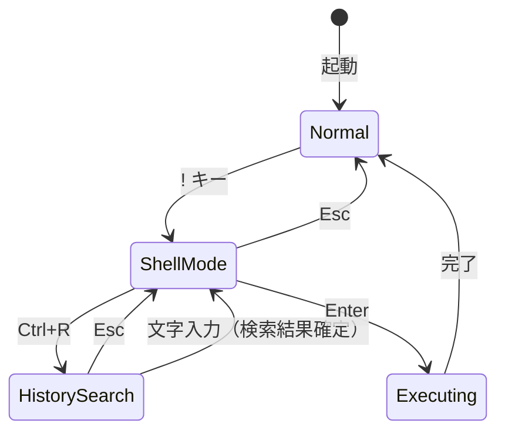
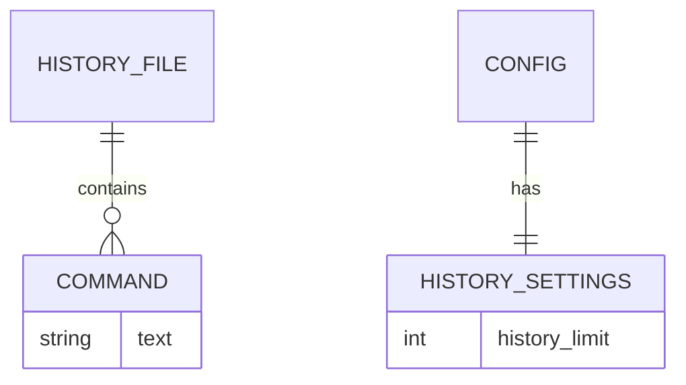

# シェルコマンド履歴機能 - 要件定義書

## 1. 概要

### 1.1 背景
duofmはキーボードドリブンのTUIファイルマネージャーであり、`!`キーでシェルコマンドを実行する機能を備えている。しかし、現状では実行したコマンドの履歴が保存されておらず、以前実行したコマンドを再利用するには手動で再入力する必要がある。これはユーザーの作業効率を低下させる要因となっている。

### 1.2 目的
- シェルコマンドの実行履歴を永続的に保存し、次回起動時も利用可能にする
- bashのCtrl+Rと同様のインクリメンタル検索機能を提供し、過去のコマンドを素早く呼び出せるようにする
- ユーザーの作業効率を向上させ、繰り返し使用するコマンドの入力負担を軽減する

### 1.3 スコープ
- シェルコマンド履歴の保存・読み込み機能
- Ctrl+Rによるインクリメンタル履歴検索機能
- 履歴件数の設定オプション
- 重複コマンドの排除機能

## 2. ビジネス要件

### 2.1 ビジネス目標
- ユーザーの作業効率向上
- 他のファイルマネージャーやシェルと同等の履歴機能の提供
- duofmの使いやすさ向上による継続利用の促進

### 2.2 対象ユーザー
| ユーザータイプ | 説明 |
|----------------|------|
| パワーユーザー | シェルコマンドを頻繁に使用するターミナル上級者 |
| 開発者 | ファイル操作とシェルコマンドを組み合わせて作業するユーザー |
| システム管理者 | 同じコマンドを繰り返し実行することが多いユーザー |

### 2.3 期待される効果
- コマンド入力時間の短縮（特に長いコマンドや複雑なコマンド）
- 入力ミスの削減（履歴から選択することで正確なコマンドを実行）
- 作業の再現性向上（過去に実行したコマンドを簡単に再実行）

## 3. ユースケース

### 3.1 ユースケース一覧
| ID | ユースケース名 | アクター | 優先度 |
|----|----------------|----------|--------|
| UC01 | 履歴からコマンドを検索・実行 | ユーザー | 高 |
| UC02 | 履歴の永続保存・読み込み | システム | 高 |
| UC03 | 履歴件数の設定 | ユーザー | 中 |
| UC04 | 重複コマンドの自動排除 | システム | 高 |

### 3.2 ユースケース詳細

#### UC01: 履歴からコマンドを検索・実行

**アクター**: ユーザー

**事前条件**:
- duofmが起動している
- 履歴にコマンドが保存されている

**基本フロー**:
1. ユーザーが`!`キーを押してシェルコマンドモードに入る
2. ユーザーがCtrl+Rを押す
3. システムがインクリメンタル検索モードに切り替わる（プロンプト表示変更）
4. ユーザーが検索文字列を入力する
5. システムが入力に一致する最新のコマンドを表示する
6. ユーザーがCtrl+Rを押して次の候補に移動する（必要に応じて繰り返し）
7. ユーザーがEnterを押してコマンドを確定・実行する

**代替フロー**:
- 4a: 一致するコマンドがない場合、入力フィールドはそのまま維持される
- 6a: ユーザーがEscを押した場合、検索モードを終了しシェルコマンドモードに戻る
- 6b: ユーザーが文字を入力した場合、検索を再開する

**事後条件**:
- 選択したコマンドが実行される
- 実行したコマンドが履歴の先頭に移動する

**ユースケース図**:


#### UC02: 履歴の永続保存・読み込み

**アクター**: システム

**事前条件**:
- なし

**基本フロー**:
1. duofm起動時、システムが履歴ファイルを読み込む
2. シェルコマンド実行時、システムが履歴に追加する
3. 履歴更新時、システムが履歴ファイルに書き込む

**代替フロー**:
- 1a: 履歴ファイルが存在しない場合、空の履歴で開始する
- 1b: 履歴ファイルの読み込みに失敗した場合、警告を表示し空の履歴で開始する
- 3a: 書き込みに失敗した場合、エラーをログに記録（ユーザーへの通知は任意）

**事後条件**:
- 履歴が永続化され、次回起動時に利用可能になる

#### UC03: 履歴件数の設定

**アクター**: ユーザー

**事前条件**:
- 設定ファイル（config.toml）が存在する

**基本フロー**:
1. ユーザーが設定ファイルを編集する
2. ユーザーが`history_limit`パラメータを設定する
3. 次回起動時、システムが設定を読み込む
4. システムが設定された件数に従って履歴を管理する

**代替フロー**:
- 2a: 設定が0の場合、履歴機能を無効化する（セッション内でも履歴なし）
- 2b: 設定が未指定の場合、デフォルト値（2000件）を使用する

**事後条件**:
- 指定された件数に従って履歴が管理される

#### UC04: 重複コマンドの自動排除

**アクター**: システム

**事前条件**:
- 履歴にコマンドが存在する

**基本フロー**:
1. ユーザーがコマンドを実行する
2. システムが履歴内に同一コマンドが存在するかチェックする
3. 同一コマンドが存在する場合、古いエントリを削除する
4. 新しいコマンドを履歴の先頭に追加する

**事後条件**:
- 履歴内に同一コマンドは1つのみ存在する
- 最新の実行が履歴の先頭に配置される

## 4. 機能要件

### 4.1 機能一覧
| ID | 機能名 | 説明 | 優先度 |
|----|--------|------|--------|
| F01 | 履歴保存 | コマンド実行時に履歴ファイルに保存 | 高 |
| F02 | 履歴読み込み | 起動時に履歴ファイルを読み込み | 高 |
| F03 | インクリメンタル検索 | Ctrl+Rで履歴を検索 | 高 |
| F04 | 検索候補移動 | Ctrl+R連打で次のマッチに移動 | 高 |
| F05 | 重複排除 | 同一コマンドを最新1件のみ保持 | 高 |
| F06 | 件数制限 | 設定された件数で履歴を制限 | 中 |
| F07 | 履歴無効化 | 件数0で履歴機能を無効化 | 中 |

### 4.2 機能詳細

#### F01: 履歴保存

**説明**: シェルコマンド実行時に履歴をファイルに保存する

**入力**:
- command: string - 実行されたシェルコマンド

**出力**:
- なし（エラー時はログ出力）

**処理フロー**:


**ビジネスルール**:
- 空のコマンドは履歴に保存しない
- 重複コマンドは古い方を削除し、新しい方を先頭に追加する

**バリデーション**:
| 項目 | ルール | エラーメッセージ |
|------|--------|------------------|
| command | 空文字列でないこと | （保存しない、エラー表示なし） |

**エラーケース**:
| エラー | 条件 | 対応 |
|--------|------|------|
| 書き込み失敗 | ディスク容量不足、パーミッションエラー | ログに記録、処理続行 |

#### F02: 履歴読み込み

**説明**: アプリケーション起動時に履歴ファイルを読み込む

**入力**:
- なし

**出力**:
- history: []string - 履歴コマンドのリスト
- warnings: []string - 読み込み時の警告

**処理フロー**:


**エラーケース**:
| エラー | 条件 | 対応 |
|--------|------|------|
| ファイル不存在 | 初回起動時など | 空の履歴で開始 |
| パースエラー | 不正なファイル形式 | 警告表示、空の履歴で開始 |
| パーミッションエラー | 読み取り権限なし | 警告表示、空の履歴で開始 |

#### F03: インクリメンタル検索

**説明**: Ctrl+Rでbashと同様のインクリメンタル履歴検索を開始する

**入力**:
- searchPattern: string - 検索パターン（ユーザー入力）

**出力**:
- matchedCommand: string - マッチしたコマンド
- matchIndex: int - マッチした履歴のインデックス

**処理フロー**:


**ビジネスルール**:
- 検索は部分一致で行う
- 大文字小文字を区別しない（case-insensitive）
- 最新のコマンドから順に検索する

#### F04: 検索候補移動

**説明**: Ctrl+R連打で次のマッチに移動する

**入力**:
- currentIndex: int - 現在のマッチインデックス
- searchPattern: string - 検索パターン

**出力**:
- nextIndex: int - 次のマッチインデックス
- nextCommand: string - 次のマッチコマンド

**ビジネスルール**:
- 現在のインデックスより古い履歴から検索
- 最後まで到達した場合、そのまま維持（ループしない）

#### F05: 重複排除

**説明**: 同一コマンドは最新の1件のみ保持する

**入力**:
- command: string - 新しく実行されたコマンド
- history: []string - 現在の履歴

**出力**:
- history: []string - 更新された履歴

**ビジネスルール**:
- 完全一致のみを重複とみなす（前後の空白は除去して比較）
- 古い重複エントリを削除し、新しいエントリを先頭に追加

#### F06: 件数制限

**説明**: 設定された件数で履歴を制限する

**入力**:
- limit: int - 最大履歴件数
- history: []string - 現在の履歴

**出力**:
- history: []string - 制限後の履歴

**ビジネスルール**:
- デフォルト値: 20000件
- 件数超過時は古いエントリから削除

**バリデーション**:
| 項目 | ルール | エラーメッセージ |
|------|--------|------------------|
| limit | 0以上の整数 | 不正な値の場合デフォルト値を使用 |

#### F07: 履歴無効化

**説明**: 件数0で履歴機能を無効化する

**入力**:
- limit: int - 履歴件数設定（0の場合）

**出力**:
- なし

**ビジネスルール**:
- 件数0の場合、履歴を保存しない
- セッション内でも履歴を保持しない
- Ctrl+Rを押しても何も起こらない

## 5. 非機能要件

### 5.1 パフォーマンス要件
- 履歴検索のレスポンス: 100ms以下（20000件の履歴に対して）
- 履歴ファイル読み込み: 500ms以下
- 履歴ファイル書き込み: 100ms以下（Atomic Write: 一時ファイル + リネーム）

### 5.2 セキュリティ要件
- 履歴ファイルのパーミッション: 0600（所有者のみ読み書き可能）
- 履歴ファイルはユーザーのホームディレクトリ配下に保存
- センシティブな情報（パスワード等）のマスキングは行わない（ユーザー責任）

### 5.3 可用性要件
- 履歴ファイルの破損時、アプリケーション自体は正常起動すること
- 履歴機能のエラーが他の機能に影響しないこと

### 5.4 保守性要件
- 履歴ファイルは人間が読めるテキスト形式（1行1コマンド）
- 設定項目は既存の設定ファイル（config.toml）に統合

### 5.5 互換性要件
- 既存のシェルコマンド機能（!キー）との完全な後方互換性
- 履歴ファイルが存在しない場合も正常動作

## 6. UI/UX要件

### 6.1 画面設計要件

#### 通常のシェルコマンドモード
```
!: ls -la
```

#### 履歴検索モード
```
(bck-i-search): git
→ 入力欄に最新のマッチしたコマンドが表示される
```

### 6.2 画面遷移


### 6.3 キーバインド
| キー | 状態 | 動作 |
|------|------|------|
| ! | 通常モード | シェルコマンドモード開始 |
| Ctrl+R | シェルコマンドモード | 履歴検索開始 |
| Ctrl+R | 履歴検索中 | 次のマッチに移動 |
| Enter | 履歴検索中 | コマンド確定 |
| Esc | 履歴検索中 | 検索キャンセル |
| 文字入力 | 履歴検索中 | 検索パターン更新 |
| Backspace | 履歴検索中 | 検索パターンから1文字削除 |

## 7. データ要件

### 7.1 データモデル概要


### 7.2 データ項目

#### 履歴ファイル
| 項目名 | 型 | 必須 | 説明 |
|--------|-----|------|------|
| commands | []string | - | コマンド履歴（1行1コマンド） |

#### 設定（config.toml）
| 項目名 | 型 | 必須 | デフォルト | 説明 |
|--------|-----|------|------------|------|
| history_limit | int | No | 2000 | 保持する履歴の最大件数 |

### 7.3 ファイルパス
| ファイル | パス | 形式 |
|----------|------|------|
| 履歴ファイル | ~/.config/duofm/history | テキスト（1行1コマンド） |
| 設定ファイル | ~/.config/duofm/config.toml | TOML |

### 7.4 履歴ファイル形式

```
git push origin main
ls -la
cd /home/user/projects
docker ps
```

- 1行に1コマンド
- 最新のコマンドがファイル先頭
- 改行コードはLF
- 文字コードはUTF-8

## 8. 外部連携

### 8.1 連携システム
| システム名 | 連携方法 | データ |
|------------|----------|--------|
| ファイルシステム | ファイルI/O | 履歴ファイル、設定ファイル |
| シェル（/bin/sh） | exec.Command | コマンド実行 |

## 9. 制約条件

### 9.1 技術的制約
- Go言語で実装
- Bubble Teaフレームワークの制約に従う
- 既存のミニバッファ（Minibuffer）構造を拡張して実装

### 9.2 ビジネス上の制約
- 既存のシェルコマンド機能との後方互換性を維持
- 既存のキーバインド設定機能との整合性

### 9.3 スケジュール制約
- なし

## 10. 想定される課題とリスク

### 10.1 技術的課題
| 課題 | 影響度 | 対応策 |
|------|--------|--------|
| Ctrl+Rがミニバッファのキーバインドと競合する可能性 | 中 | シェルコマンドモード専用のハンドリングを実装 |
| 大量の履歴での検索パフォーマンス | 低 | 2000件程度なら問題なし、必要に応じてインデックス化 |

### 10.2 ビジネスリスク
| リスク | 発生確率 | 影響度 | 対応策 |
|--------|----------|--------|--------|
| 履歴ファイル破損 | 低 | 低 | 空の履歴で再開、ユーザーへ警告表示 |
| センシティブ情報の履歴保存 | 中 | 中 | ドキュメントで注意喚起 |

## 11. 成功基準

### 11.1 受け入れ基準
- [ ] シェルコマンド実行後、履歴ファイルにコマンドが保存される
- [ ] アプリケーション再起動後も履歴が保持されている
- [ ] Ctrl+Rで履歴検索モードに入れる
- [ ] 検索文字列を入力するとマッチするコマンドが表示される
- [ ] Ctrl+R連打で次のマッチに移動できる
- [ ] Enterで検索結果を確定してコマンドを実行できる
- [ ] Escで検索をキャンセルできる
- [ ] 同一コマンドを実行すると古い履歴が削除され最新位置に移動する
- [ ] 設定ファイルでhistory_limitを変更できる
- [ ] history_limit=0で履歴機能が無効化される
- [ ] 履歴ファイルが存在しない場合も正常起動する

### 11.2 KPI
| 指標 | 目標値 | 測定方法 |
|------|--------|----------|
| 履歴検索レスポンス | 100ms以下 | ベンチマークテスト |
| テストカバレッジ | 80%以上 | go test -cover |

## 12. テストシナリオ

### 12.1 テスト観点
- [ ] 正常系: コマンド実行→履歴保存→再起動→履歴読み込み
- [ ] 正常系: Ctrl+R→検索文字入力→マッチ表示→Enter確定
- [ ] 正常系: Ctrl+R連打で複数のマッチを順次表示
- [ ] 正常系: 重複コマンド実行→古い履歴削除
- [ ] 異常系: 履歴ファイルが存在しない状態での起動
- [ ] 異常系: 履歴ファイルが破損している状態での起動
- [ ] 異常系: 履歴ファイルへの書き込み権限がない場合
- [ ] 境界値: history_limit=0での動作
- [ ] 境界値: history_limit件数ちょうどの履歴
- [ ] 境界値: history_limit件数超過時の古い履歴削除
- [ ] セキュリティ: 履歴ファイルのパーミッション確認
- [ ] パフォーマンス: 2000件の履歴での検索レスポンス

## 13. 用語定義

| 用語 | 定義 |
|------|------|
| シェルコマンドモード | `!`キー押下後、コマンド入力を受け付けるモード |
| 履歴検索モード | Ctrl+R押下後、履歴をインクリメンタル検索するモード |
| インクリメンタル検索 | 文字入力のたびにリアルタイムで検索結果を更新する検索方式 |
| ミニバッファ | ペイン下部に表示される1行の入力エリア |
| 履歴ファイル | コマンド履歴を永続化するファイル（~/.config/duofm/history） |

## 14. 確認事項

### 14.1 確認済み事項

- [x] 履歴の保存方式: 永続保存（設定ファイルに保存し、次回起動時も履歴を利用可能）
- [x] 履歴件数: デフォルト2000件、設定ファイルで変更可能
- [x] 件数0の動作: セッション内でも履歴なし、履歴を遡れない
- [x] 履歴ファイルの保存場所: ~/.config/duofm/history（XDG Base Directory仕様準拠）
- [x] Ctrl+Rの動作: bashと同様のインクリメンタル検索
- [x] 次の候補への移動: Ctrl+R連打で古い履歴へ移動
- [x] 重複コマンドの扱い: 重複を排除（同じコマンドは最新の1件のみ保持、古い方を削除）

### 14.2 未確認・保留事項
- なし

## 15. 参考資料

- bashのCtrl+R履歴検索機能: https://www.gnu.org/software/bash/manual/html_node/Commands-For-History.html
- XDG Base Directory Specification: https://specifications.freedesktop.org/basedir-spec/basedir-spec-latest.html
- 既存実装: internal/ui/exec.go, internal/ui/minibuffer.go
