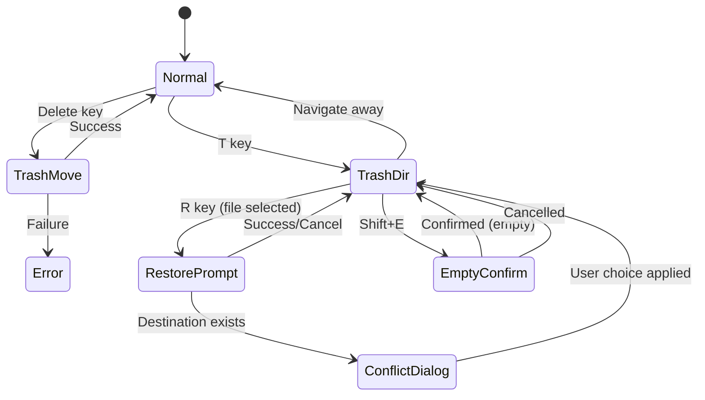

# Feature: Trash (Recycle Bin)

## Overview

Implement a trash/recycle bin feature compliant with the freedesktop.org Trash Specification. Users can safely move files to trash instead of permanent deletion, and restore them when needed.

## Objectives

- Protect files from accidental deletion
- Enable recovery of deleted files
- Maintain compatibility with desktop environments (GNOME, KDE, etc.)
- Provide intuitive keyboard-driven trash operations

## User Stories

### US1: Move File to Trash
As a user, I want to move files to trash using the Delete key, so that I can recover them if needed.

**Acceptance Criteria:**
- [ ] Delete key moves selected file(s) to trash
- [ ] File appears in `~/.local/share/Trash/files/`
- [ ] Corresponding `.trashinfo` file is created
- [ ] File list updates immediately

### US2: Navigate to Trash
As a user, I want to quickly open the trash directory, so that I can see what I've deleted.

**Acceptance Criteria:**
- [ ] `T` key navigates active pane to trash directory
- [ ] Trash contents are displayed like any other directory

### US3: Restore File from Trash
As a user, I want to restore files from trash to their original location, so that I can recover deleted files.

**Acceptance Criteria:**
- [ ] `R` key restores selected file to original path
- [ ] Conflict resolution dialog appears if file exists at destination
- [ ] `.trashinfo` file is removed after successful restore

### US4: Empty Trash
As a user, I want to empty the trash to reclaim disk space, so that deleted files don't consume storage indefinitely.

**Acceptance Criteria:**
- [ ] `Shift+E` prompts for confirmation
- [ ] Confirmation dialog prevents accidental data loss
- [ ] All files and `.trashinfo` files are permanently deleted

### US5: View Trash Metadata
As a user, I want to see the original path and deletion date of trashed files, so that I can identify which file to restore.

**Acceptance Criteria:**
- [ ] Original path is displayed as a column in file list
- [ ] Deletion date is displayed as a column in file list
- [ ] Columns are only visible when inside trash directory

## Domain Rules

- **Trash Location**: `~/.local/share/Trash/` with `files/` and `info/` subdirectories
- **Trashinfo Format**: INI-style file with `[Trash Info]` section, `Path` and `DeletionDate` keys
- **Name Collision**: When moving to trash, if same name exists, append counter (file.txt -> file.2.txt)
- **Restore Collision**: User must choose: overwrite, rename, or skip
- **Trash-only Operations**: `R` (restore) and `Shift+E` (empty) only work inside trash directory
- **Context-Dependent R Key**: Inside trash directory, `R` performs restore (rename is disabled); outside trash, `R` performs rename

## Technical Requirements

### Functional Requirements

#### Phase 1 (MVP)

- **FR1.1**: `Delete` key moves selected file(s) to `~/.local/share/Trash/files/`
- **FR1.2**: Generate `.trashinfo` file in `~/.local/share/Trash/info/` with original path and deletion timestamp
- **FR1.3**: Handle name collisions by appending counter (file.txt -> file.2.txt, file.3.txt, ...)
- **FR1.4**: `T` key navigates active pane to trash directory
- **FR1.5**: Same-filesystem moves use `os.Rename` for efficiency
- **FR1.6**: Cross-filesystem moves use copy+delete (leverage existing TaskManager)

#### Phase 2 (Restore and Management)

- **FR2.1**: `R` key restores file to original path (read from `.trashinfo`)
- **FR2.2**: Display conflict resolution dialog when restore destination exists (overwrite/rename/skip)
- **FR2.3**: `Shift+E` empties trash with confirmation dialog
- **FR2.4**: Display original path and deletion date as columns when inside trash directory

#### Phase 3 (Extended)

- **FR3.1**: Support `.Trash-$UID` directory on external devices

### Non-Functional Requirements

- **NFR1.1 - Performance**: Same-filesystem trash operation < 100ms
- **NFR1.2 - Performance**: Trash directory listing with 1000 files < 100ms
- **NFR1.3 - Compatibility**: Full compliance with freedesktop.org Trash Specification
- **NFR1.4 - Security**: Validate paths to prevent directory traversal attacks

## Key Bindings

| Key | Action | Context |
|-----|--------|---------|
| `Delete` | Move to trash | Always |
| `d` | Direct delete (existing) | Always |
| `T` (Shift+t) | Open trash directory | Always |
| `R` | Restore from trash | Trash directory only (rename disabled) |
| `R` | Rename file | Outside trash only |
| `Shift+E` | Empty trash | Trash directory only |

## Trash Directory Structure

```
~/.local/share/Trash/
├── files/           # Actual file contents
│   ├── document.txt
│   └── photo.jpg
└── info/            # Metadata files
    ├── document.txt.trashinfo
    └── photo.jpg.trashinfo
```

## Trashinfo File Format

```ini
[Trash Info]
Path=/home/user/Documents/important.txt
DeletionDate=2026-01-25T10:30:00
```

| Field | Description | Format |
|-------|-------------|--------|
| Path | Original absolute path | URL-encoded for special characters |
| DeletionDate | Deletion timestamp | ISO 8601 (YYYY-MM-DDTHH:MM:SS), local time without timezone suffix |

## State Machine



## Interface Contract

### Trash Operations

#### MoveToTrash

**Input:**
- `paths`: []string - Absolute paths of files to trash

**Output:**
- `error`: Error if operation fails

**Preconditions:**
- Files exist at specified paths
- User has read permission on source files
- User has write permission on trash directory

**Postconditions:**
- Files moved to `~/.local/share/Trash/files/`
- `.trashinfo` files created in `~/.local/share/Trash/info/`
- Original files removed from source location

#### RestoreFromTrash

**Input:**
- `trashPath`: string - Path within trash/files/

**Output:**
- `error`: Error if operation fails

**Preconditions:**
- File exists in trash
- Corresponding `.trashinfo` exists
- User has write permission on original directory

**Postconditions:**
- File restored to original location
- `.trashinfo` file removed

### Trashinfo Parser

**Input:**
- `trashinfoPath`: string - Path to `.trashinfo` file

**Output:**
- `originalPath`: string - URL-decoded original path
- `deletionDate`: time.Time - Parsed deletion timestamp
- `error`: Error if parsing fails

## Error Handling

| Error Condition | Behavior | User Message |
|-----------------|----------|--------------|
| Trash directory not writable | Show error, abort operation (no fallback to direct delete) | "Cannot access trash: permission denied" |
| Trash directory unavailable | Show error, abort operation (no fallback to direct delete) | "Trash is not available" |
| Source file not found | Skip file, continue with others | "File not found: {filename}" |
| Cross-filesystem move failure | Fallback to copy+delete | (transparent to user) |
| Invalid .trashinfo format | Show error on restore | "Cannot restore: invalid trash metadata" |
| Restore destination not writable | Show error | "Cannot restore: permission denied on destination" |

**Important:** When trash operations fail (permission denied, trash unavailable, etc.), the operation is aborted with an error message. The system does NOT silently fall back to direct deletion. Users who want to permanently delete files must explicitly use the `d` key (direct delete) command.

## UI Layout

### Trash Directory View

When inside trash directory, display additional columns:

```
 ~/.local/share/Trash/files
 Marked 0/5  12.3 MiB                                          922.5 GiB Free
 ───────────────────────────────────────────────────────────────────────────────
 Name                    Size   Deleted              Original Path
 ───────────────────────────────────────────────────────────────────────────────
 ..                         -
 document.txt           2.1K   2026-01-25 10:30    /home/user/Documents/
 photo.jpg              1.2M   2026-01-24 15:45    /home/user/Pictures/
 project/                  -   2026-01-23 09:00    /home/user/src/
```

### Conflict Resolution Dialog

```
┌─────────────────────────────────────────┐
│ File already exists                     │
│                                         │
│ /home/user/Documents/document.txt       │
│                                         │
│ [O]verwrite  [R]ename  [S]kip           │
└─────────────────────────────────────────┘
```

### Empty Trash Confirmation

```
┌─────────────────────────────────────────┐
│ Empty Trash                             │
│                                         │
│ Permanently delete all files in trash?  │
│ This cannot be undone.                  │
│                                         │
│        [Y]es         [N]o               │
└─────────────────────────────────────────┘
```

## Implementation Phases

### Phase 1: MVP
**Goals:** Basic trash functionality
**Deliverables:**
- `Delete` key moves files to trash
- `.trashinfo` file generation
- Name collision handling
- `T` key navigation to trash

### Phase 2: Restore and Management
**Goals:** Full trash management
**Deliverables:**
- `R` key restore with conflict handling
- `Shift+E` empty trash with confirmation
- Trash metadata display (original path, deletion date)

### Phase 3: Extended
**Goals:** External device support
**Deliverables:**
- `.Trash-$UID` directory support on external devices

## Test Scenarios

### Unit Tests

#### Trashinfo Generation
- [ ] Generate valid .trashinfo with correct format
- [ ] URL-encode special characters in path
- [ ] ISO 8601 timestamp format

#### Trashinfo Parsing
- [ ] Parse valid .trashinfo file
- [ ] Handle URL-encoded paths
- [ ] Parse ISO 8601 timestamps
- [ ] Error on malformed file

#### Name Collision
- [ ] No collision: use original name
- [ ] First collision: append ".2"
- [ ] Multiple collisions: increment counter
- [ ] Handle files with extensions correctly

### Integration Tests

#### Move to Trash
- [ ] Single file moves correctly
- [ ] Directory moves recursively
- [ ] Multiple selected files move
- [ ] Cross-filesystem move works
- [ ] Permission denied handled gracefully

#### Restore from Trash
- [ ] Restore to original location
- [ ] Handle missing destination directory
- [ ] Conflict dialog appears when needed
- [ ] Overwrite option works
- [ ] Rename option works
- [ ] Skip option works

#### Empty Trash
- [ ] Confirmation prevents accidental deletion
- [ ] All files and trashinfo removed
- [ ] Empty trash on empty directory is no-op

### E2E Tests

- [ ] Delete key moves file to trash
- [ ] T key opens trash directory
- [ ] R key restores file (inside trash)
- [ ] R key does nothing (outside trash)
- [ ] Shift+E empties trash with confirmation
- [ ] Original path column displayed in trash
- [ ] Deletion date column displayed in trash

### Edge Cases

- [ ] Unicode file names
- [ ] Very long path names
- [ ] Files with special characters (spaces, quotes)
- [ ] Symlinks (move link, not target)
- [ ] Empty trash when already empty
- [ ] Restore when original parent directory deleted

## Security Considerations

- **Path Validation**: Validate all paths to prevent directory traversal
- **Permission Checks**: Verify write permissions before operations
- **Symlink Handling**: Move symlink itself, not follow to target
- **URL Encoding**: Properly encode/decode special characters in paths

## Dependencies

- Go standard library `os`, `path/filepath`, `net/url`
- Existing TaskManager for cross-filesystem operations
- Existing dialog infrastructure

## Success Criteria

- [ ] All Phase 1 functional requirements implemented
- [ ] All Phase 2 functional requirements implemented
- [ ] freedesktop.org Trash Specification compliance
- [ ] All unit tests pass
- [ ] All integration tests pass
- [ ] All E2E tests pass
- [ ] Performance targets met
- [ ] Code review completed

## Open Questions

None - all requirements have been clarified.

## Out of Scope

- Automatic trash cleanup (time-based expiration)
- Trash size limits
- Network drive support
- Undo functionality (quick restore of last deletion)
