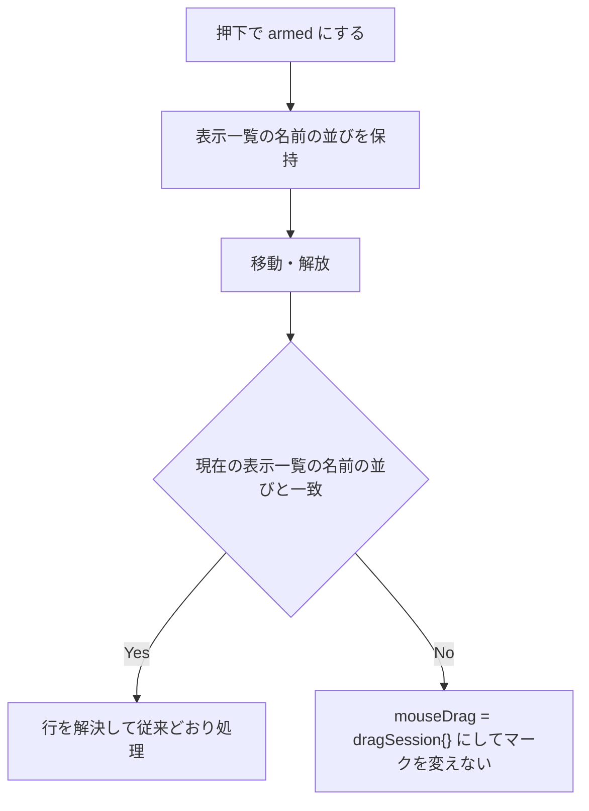

# drag-refresh-stale-anchor - 要件定義書

## 1. 概要

### 1.1 背景
ドラッグ中のペインの表示一覧が再読み込みで変わった後、移動・解放で、古い一覧のアンカーとベースラインによってマークが付く。

### 1.2 目的
- ドラッグ中のペインの表示一覧が再読み込みで変わった後に、古い一覧のアンカーとベースラインでマークが付かない。
- ドラッグ中のペインの表示一覧が変わらない再読み込み（定期更新を含む）では、ドラッグが途切れない。

### 1.3 スコープ
- 対象: ドラッグセッションの状態の判定ロジックと、その単体テスト。
- 対象外:
    - 画面の構成や見た目の変更。
    - ディレクトリ変更時やフィルタ変更時のマークの既存の扱い。
    - E2E テストの追加。

## 2. ビジネス要件

### 2.1 ビジネス目標
1.2 のとおり。

### 2.2 対象ユーザー
該当なし。

### 2.3 期待される効果
1.2 のとおり。

## 3. ユースケース

該当なし。操作の流れは 11.1 の受け入れ基準と 12 のテストシナリオに記載する。

## 4. 機能要件

### 4.1 機能一覧
| ID | 機能名 | 状態 |
|----|--------|------|
| FR1 | 表示一覧の変化でドラッグを取り消す | resolved |
| FR2 | 経路を問わない | resolved |
| FR3 | 表示一覧が変わらなければドラッグを続ける | resolved |
| FR4 | 判定対象はドラッグ中のペインだけ | resolved |
| FR5 | 取り消し時のマークの維持 | resolved |
| FR6 | 消えたファイルのマークを復活させない | resolved |
| FR7 | 回帰テスト | resolved |

### 4.2 機能詳細

#### FR1: 表示一覧の変化でドラッグを取り消す

押下でドラッグセッションを armed にするとき、ドラッグ中のペインの表示一覧（フィルタ適用後の entries）の名前の並びを、ペインの一覧とは独立に保持する。移動・解放では、行を解決する前に、ペインの現在の表示一覧の名前の並びと比較する。違っていればセッションを初期値に戻し（`mouseDrag = dragSession{}`）、その移動・解放ではマークを変えない。

**処理フロー**:

#### FR2: 経路を問わない

FR1 の判定は、表示一覧を変えた経路に関係なく働く。次を含む。
- 自動更新（`autoRefreshMsg`）
- exec・シェルコマンド・一括操作の後の再読み込み
- ダイアログの結果やファイル操作の完了の後の再読み込み
- F5/Ctrl+R
- 削除後の再読み込み
- バックグラウンドコマンドの完了による再読み込み

#### FR3: 表示一覧が変わらなければドラッグを続ける

ドラッグ中のペインの表示一覧の名前と順序が押下時と同じなら、セッションは変えない。その後の移動で、元のアンカーからの範囲がマークされる。次の場合もこれに当たる。
- サイズや更新時刻だけが変わった場合
- フィルタに一致しないファイルだけが増減した場合
- 読み込みに失敗して一覧が置き換わらなかった場合

#### FR4: 判定対象はドラッグ中のペインだけ

もう一方のペインの表示一覧が変わっても、ドラッグ中のペインのセッションは変えない。

#### FR5: 取り消し時のマークの維持

FR1 でセッションを取り消すとき、その時点で残っているマークはそのまま残し、押下時の baseline には戻さない。次の押下までは、移動・解放でマークを変えない。

#### FR6: 消えたファイルのマークを復活させない

表示一覧が変わらずドラッグが続く場合でも、再読み込みで消えたファイルの名前のマークを、押下時の baseline から付け直さない。例: フィルタで表示されていないマーク済みのファイルが削除された場合。

#### FR7: 回帰テスト

一時ディレクトリを使うモデルと `autoRefreshMsg` で、次の順の操作を再現する単体テストを追加する。
1. 押下（と移動）
2. ドラッグ中のペインのディレクトリでファイルを追加・削除
3. 再読み込み
4. 別の行で移動・解放

テストは修正前のコードでは失敗し、修正後は通る。表示一覧が変わらない定期更新でドラッグが続くことを確かめるテストも追加する。E2E テストは追加しない。既存の E2E は回帰確認にだけ使う。

## 5. 非機能要件

### 5.1 非機能要件一覧
| ID | 要件名 | 内容 | 状態 |
|----|--------|------|------|
| NFR1 | 再読み込みを挟まない操作の維持 | 操作中に表示一覧が変わらない場合のクリック、ドラッグ、ダブルクリックの動作は変えない。 | resolved |
| NFR2 | 再読み込み処理の維持 | `RefreshDirectoryPreserveCursor` のカーソル・フィルタ・スクロール・マークの扱いは変えない。 | resolved |
| NFR3 | drag-dir-load-stale-marks の維持 | `handleDirectoryLoadComplete` でのドラッグの取り消しの挙動と、その単体テスト（`model_update_mouse_test.go` の TS-1..TS-5）を維持する。 | resolved |
| NFR4 | 既存テストとツールの通過 | `go test ./...` と E2E テスト（`make test-e2e-build && make test-e2e`。`mouse_tests.sh` と `mark_tests.sh` を含む）が通る。`gofmt -w .` で差分がなく、`go vet ./...` で指摘がない。 | resolved |

### 5.2 その他の非機能要件
パフォーマンス・セキュリティ・可用性・互換性の要件は該当なし。

## 6. UI/UX要件

該当なし。画面の構成や見た目の変更はない。

## 7. データ要件

該当なし。

## 8. 外部連携

該当なし。

## 9. 制約条件

### 9.1 技術的制約
- E2E テストは追加しない（FR7）。

### 9.2 ビジネス上の制約
該当なし。

### 9.3 スケジュール制約
該当なし。

### 9.4 宣言された変更集合

このフィーチャー固有のパスは手動で列挙せず、create-plan で `workflow.yaml` の各タスクの `files` から導出する（`references/phases/create-plan-phase.md`）。

**デフォルトメンバー**（SPEC作成者が明示的に除外しない限り、常に宣言に含まれる）:
- `feature-docs/drag-refresh-stale-anchor/**`
- `test-docs/drag-refresh-stale-anchor/**`

`feature-docs/drag-refresh-stale-anchor/**` に含まれるもの: `REQUIREMENTS.md`、`SPEC.md`、`IMPLEMENTATION.md`、`workflow.yaml`、`phase-state/`、`tasks/`、`reviews/roundN.yaml`、`VERIFICATION.md`、`retrospect.yaml`、およびデザインステップが生成するデザイン成果物。生成主体は各フェーズドキュメントおよび `references/phase-state.md` を参照（引用のみ、ルールは再掲しない）。

`test-docs/drag-refresh-stale-anchor/**` に含まれるもの: `{T}.tests.yaml`（パス形式: `test-docs/drag-refresh-stale-anchor/{T}.tests.yaml`）。生成主体は `implement-phase.md` を参照（引用のみ、ルールは再掲しない）。

**意味論**:
- デフォルトのメンバーは、SPEC作成者が明示的に除外しない限り宣言に含まれる。除外は意図的な絞り込みであり、記載漏れによる省略ではない。
- この宣言はスーパーセット（superset）の主張であり、実際の変更集合は宣言に含まれる（CONTAINED IN）必要がある。実際には生成されないパスが宣言されていても違反にはならない。implementタスクを1つも生成しないフィーチャーは `test-docs/drag-refresh-stale-anchor/` ディレクトリを生成しないが、宣言された `test-docs/drag-refresh-stale-anchor/**` は依然として正しい。

## 10. 想定される課題とリスク

該当なし。

## 11. 成功基準

### 11.1 受け入れ基準
- [ ] AC1: 左ペインで押下して armed になった後、左ペインのディレクトリにファイルを追加して表示一覧を変え、`autoRefreshMsg` を処理する。その後、別の行で移動・解放すると、左ペインのマーク集合は再読み込み直後の集合と等しく、セッションは armed ではない。
- [ ] AC2: 左ペインで押下と移動によって範囲をマークした active のセッションで、左ペインのディレクトリのファイルを削除して表示一覧を変え、`autoRefreshMsg` を処理する。その後、別の行で移動・解放すると、マーク集合は再読み込み直後の集合と等しい（再読み込み後に残っているマークはそのまま残る）。
- [ ] AC3: ファイルを変えずに `autoRefreshMsg` を処理した後、左ペインで移動すると、元のアンカーから移動先までの範囲がマークされる。
- [ ] AC4: 右ペインのディレクトリだけにファイルを追加して `autoRefreshMsg` を処理しても、左ペインのセッションは変わらず、その後の移動で元のアンカーからの範囲がマークされる。
- [ ] AC5: 自動更新以外の経路（例: `execFinishedMsg`、`shellCommandFinishedMsg`）でドラッグ中のペインの表示一覧が変わった後も、移動・解放でマークは変わらない。
- [ ] AC6: 名前と順序を変えずにファイルの内容（サイズ）だけを変えた再読み込みの後、およびフィルタに一致しないファイルだけを増減させた再読み込みの後は、移動で元のアンカーからの範囲がマークされる。
- [ ] AC7: 表示一覧が変わらずドラッグが続く場合、再読み込みで消えたファイルの名前はマーク集合に含まれない。
- [ ] AC8: AC1・AC2 のテストは修正前のコードでは失敗し、修正後は通る。
- [ ] AC9: 既存の単体テストと E2E テストが通る。gofmt で差分がなく、go vet で指摘がない。

### 11.2 KPI
該当なし。

## 12. テストシナリオ

### 12.1 単体テスト
- [ ] TS-1（FR1, FR7 / AC1, AC8）: 一時ディレクトリを使うモデルで左ペインの項目を押下し、左ペインのディレクトリにファイルを追加して `autoRefreshMsg` を送る。別の行で移動・解放する - セッションが初期値に戻り、左ペインのマーク集合が再読み込み直後の集合と等しい
- [ ] TS-2（FR1, FR5, FR7 / AC2, AC8）: 左ペインで押下と移動を行って範囲をマークし、マークしていないファイルを削除して `autoRefreshMsg` を送る - 再読み込み直後のマークが残る。別の行で移動・解放する - マークがそれ以上変わらない
- [ ] TS-3（FR3 / AC3）: 左ペインで押下し、ファイルを変えずに `autoRefreshMsg` を送る - セッションは armed のまま。移動する - 元のアンカーからの範囲がマークされる
- [ ] TS-4（FR4 / AC4）: 左ペインで押下し、右ペインのディレクトリだけにファイルを追加して `autoRefreshMsg` を送る - 左のセッションは変わらない。移動する - 元のアンカーからの範囲がマークされる
- [ ] TS-5（FR2 / AC5）: 左ペインで押下し、左ペインのディレクトリにファイルを追加して `execFinishedMsg`（および `shellCommandFinishedMsg`）を送る。移動・解放する - マーク集合が再読み込み直後の集合と等しい
- [ ] TS-6（FR3 / AC6）: 左ペインで押下し、名前と順序を変えずに既存ファイルの内容だけを変えて `autoRefreshMsg` を送る。移動する - 元のアンカーからの範囲がマークされる
- [ ] TS-7（FR3 / AC6）: 左ペインにフィルタを適用した状態で押下し、フィルタに一致しないファイルを追加して `autoRefreshMsg` を送る。移動する - 元のアンカーからの範囲がマークされる
- [ ] TS-8（FR6 / AC7）: 左ペインで、フィルタで表示されていないファイルをマークしておく。フィルタ適用中に押下し、そのファイルを削除して `autoRefreshMsg` を送る（表示一覧は変わらない）。移動・解放する - 削除したファイルの名前がマーク集合に含まれない

### 12.2 結合テスト
該当なし。

### 12.3 E2E テスト
- [ ] 既存の E2E テスト（`mouse_tests.sh`, `mark_tests.sh` を含む）が回帰なく通る。実行は `make test-e2e-build && make test-e2e`

### 12.4 静的チェック
- [ ] TS-9（NFR4 / AC9）: `go test ./...` がすべて通る。`gofmt -w .` で差分がない。`go vet ./...` で指摘がない

### 12.5 エッジケース
- [ ] セッションが armed（移動なし）の場合（TS-1）
- [ ] セッションが active で、再読み込み前にマークが付いている場合（TS-2）
- [ ] もう一方のペインだけ一覧が変わる場合（TS-4）
- [ ] 自動更新以外の経路（TS-5）
- [ ] 内容だけが変わる場合（TS-6）
- [ ] フィルタに一致しないファイルだけが増減する場合（TS-7）
- [ ] 表示されていないマーク済みファイルが削除される場合（TS-8）

## 13. 用語定義

| 用語 | 定義 |
|------|------|
| 表示一覧 | ペインのフィルタ適用後の entries |
| ドラッグセッション | `mouseDrag`（`dragSession`）。初期値は `dragSession{}` |

## 14. 確認事項

### 14.1 確認済み事項
記録なし。

### 14.2 未確認・保留事項
なし（`status: tbd` の要件はない）。

### 14.3 前提
- A1: drag-dir-load-stale-marks の挙動（`handleDirectoryLoadComplete` の成功経路での取り消し、エラーの完了や古い完了ではセッションを変えない）と、その TS-1..TS-5 のテストは維持する。
- A2: `RefreshDirectoryPreserveCursor` のカーソル・フィルタ・スクロール・マークの扱いは変えない。
- A3: ディレクトリ変更時やフィルタ変更時のマークの既存の扱いは、この修正で変えない。

## 15. 参考資料

- `feature-docs/drag-refresh-stale-anchor/SPEC.md`
