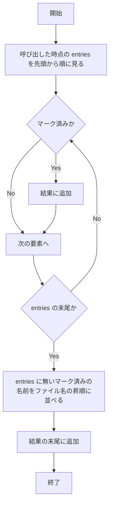

# fix-batch-cancel-cursor-flake - 要件定義書

## 1. 概要

### 1.1 背景
E2E の `test_batch_cancel_cursor`（`test/e2e/scripts/tests/cursor_preserve_tests.sh`）が「First file was moved before cancel」で断続的に失敗する。
マークしたファイルの処理順が 02_bbb から始まったときに失敗する。
`internal/ui/pane_marks.go` の `GetMarkedFiles` は map を列挙するため、返す順序が保証されない。

### 1.2 目的
- E2E の `test_batch_cancel_cursor` が毎回成功する
- マーク済みファイルの処理順に依存する不具合の再発を検出するテストがある

### 1.3 スコープ
- `Pane.GetMarkedFiles` と `Pane.GetMarkedFilePaths` が返す順序を、ペインの表示順にする（FR1〜FR3）
- `internal/ui/pane_mark_test.go` へのユニットテストの追加（FR4）
- E2E `test_batch_cancel_cursor` の強化（FR5）

対象外:
- `GetMarkedFiles` と `GetMarkedFilePaths` のシグネチャの変更（NFR1）
- 返す要素の集合と件数の変更（NFR2）

## 2. ビジネス要件

### 2.1 ビジネス目標
- E2E の `test_batch_cancel_cursor` が毎回成功する
- マーク済みファイルの処理順に依存する不具合の再発を検出するテストがある

### 2.2 対象ユーザー
該当なし

### 2.3 期待される効果
- 2.1 のとおり

## 3. ユースケース

該当なし（UI の見た目や操作の変更は無い）

## 4. 機能要件

### 4.1 機能一覧
| ID | 機能名 | 説明 |
|----|--------|------|
| FR1 | マーク済みファイルを表示順で返す | `Pane.GetMarkedFiles` がマーク済みファイル名をペインの表示順で返す |
| FR2 | 表示一覧に無いマーク済みファイルの扱い | entries に無いマーク済みファイルを FR1 の並びの後ろにファイル名の昇順で追加する |
| FR3 | 完全パス版も同じ順序にする | `Pane.GetMarkedFilePaths` が `GetMarkedFiles` と同じ順序で完全パスを返す |
| FR4 | 再発を検出するユニットテスト | `internal/ui/pane_mark_test.go` に順序を検証するテストを追加する |
| FR5 | E2E test_batch_cancel_cursor の強化 | 上書きダイアログを上限付きで待ってからキャンセルし、キャンセル後の状態を検証する |

### 4.2 機能詳細

#### FR1: マーク済みファイルを表示順で返す

**説明**: `Pane.GetMarkedFiles` は、マーク済みファイル名をペインの表示順（呼び出した時点の entries の並び。ディレクトリ優先と現在のソートを反映したもの）で返す。マークを付けた順序や map の反復順には依存しない。

**出力**:
- マーク済みファイル名の並び - 呼び出した時点の entries の表示順

#### FR2: 表示一覧に無いマーク済みファイルの扱い

**説明**: マーク済みで、呼び出した時点の entries に無い名前（フィルタで非表示になったものなど）は、FR1 の並びの後ろに、ファイル名の昇順で追加する。`GetMarkedFiles` が返す件数は `MarkCount()` と一致する。

**処理フロー**（FR1 と FR2 を合わせた並び）:

**ビジネスルール**:
- 返す件数は `MarkCount()` と一致する
- 返す要素の集合は変更前と同じ（NFR2）

#### FR3: 完全パス版も同じ順序にする

**説明**: `Pane.GetMarkedFilePaths` は、`GetMarkedFiles` と同じ順序で、各名前をペインのパスと結合した完全パスを返す。

**出力**:
- 完全パスの並び - i 番目が `filepath.Join(ペインのパス, GetMarkedFiles の i 番目)` と一致する

#### FR4: 再発を検出するユニットテスト

**説明**: `internal/ui/pane_mark_test.go` に、マークを付ける順を表示順と変えた状態で `GetMarkedFiles` と `GetMarkedFilePaths` の順序を検証するテストを追加する。map の反復順が毎回変わることを踏まえ、同じ検証を複数回繰り返す。

#### FR5: E2E test_batch_cancel_cursor の強化

**説明**: `test_batch_cancel_cursor` で、固定時間の sleep の代わりに、上書きダイアログ（"already exists"）が表示されるまで上限付きで待ってからキー 2（Cancel）を送る。キャンセル後に次を検証する。
- `dst/01_aaa.txt` があること
- `src/02_bbb.txt` が残っていること
- `dst/02_bbb.txt` の中身が existing のままであること

## 5. 非機能要件

### 5.1 パフォーマンス要件
該当なし

### 5.2 セキュリティ要件
該当なし

### 5.3 可用性要件
該当なし

### 5.4 保守性要件
- NFR3: `go test ./...` と `make test-e2e` がすべて成功する
- NFR4: gofmt と go vet で指摘が出ない

### 5.5 互換性要件
- NFR1: `GetMarkedFiles` と `GetMarkedFilePaths` のシグネチャは変えない
- NFR2: 変えるのは返す順序だけ。返す要素の集合と件数は変更前と同じ

## 6. UI/UX要件

該当なし（UI の見た目や操作の変更は無い）

## 7. データ要件

該当なし

## 8. 外部連携

該当なし

## 9. 制約条件

### 9.1 技術的制約
- `GetMarkedFiles` と `GetMarkedFilePaths` のシグネチャは変えない（NFR1）
- 変えるのは返す順序だけ。返す要素の集合と件数は変更前と同じ（NFR2）

### 9.2 ビジネス上の制約
なし

### 9.3 スケジュール制約
なし

### 9.4 宣言された変更集合

このフィーチャー固有のパスは手動で列挙せず、create-plan で `workflow.yaml` の各タスクの `files` から導出する（`references/phases/create-plan-phase.md`）。

**デフォルトメンバー**（SPEC作成者が明示的に除外しない限り、常に宣言に含まれる）:
- `feature-docs/fix-batch-cancel-cursor-flake/**`
- `test-docs/fix-batch-cancel-cursor-flake/**`

`feature-docs/fix-batch-cancel-cursor-flake/**` に含まれるもの: `REQUIREMENTS.md`、`SPEC.md`、`IMPLEMENTATION.md`、`workflow.yaml`、`phase-state/`、`tasks/`、`reviews/roundN.yaml`、`VERIFICATION.md`、`retrospect.yaml`、およびデザインステップが生成するデザイン成果物。生成主体は各フェーズドキュメントおよび `references/phase-state.md` を参照（引用のみ、ルールは再掲しない）。

`test-docs/fix-batch-cancel-cursor-flake/**` に含まれるもの: `{T}.tests.yaml`（パス形式: `test-docs/fix-batch-cancel-cursor-flake/{T}.tests.yaml`）。生成主体は `implement-phase.md` を参照（引用のみ、ルールは再掲しない）。

**意味論**:
- デフォルトのメンバーは、SPEC作成者が明示的に除外しない限り宣言に含まれる。除外は意図的な絞り込みであり、記載漏れによる省略ではない。
- この宣言はスーパーセット（superset）の主張であり、実際の変更集合は宣言に含まれる（CONTAINED IN）必要がある。実際には生成されないパスが宣言されていても違反にはならない。implementタスクを1つも生成しないフィーチャーは `test-docs/fix-batch-cancel-cursor-flake/` ディレクトリを生成しないが、宣言された `test-docs/fix-batch-cancel-cursor-flake/**` は依然として正しい。

## 10. 想定される課題とリスク

### 10.1 技術的課題
なし

### 10.2 ビジネスリスク
なし

## 11. 成功基準

### 11.1 受け入れ基準
- [ ] AC1: マークを付けた順に関係なく、`GetMarkedFiles` が entries の表示順で返す。ユニットテストで検証を複数回繰り返し、すべて一致する（FR1, FR4）
- [ ] AC2: entries に無いマーク済みファイルは、表示中のマーク済みファイルの後ろに名前の昇順で並ぶ。返す件数は `MarkCount()` と一致する（FR2, NFR2）
- [ ] AC3: `GetMarkedFilePaths` の i 番目が `filepath.Join(ペインのパス, GetMarkedFiles の i 番目)` と一致する（FR3）
- [ ] AC4: 強化した `test_batch_cancel_cursor` で、上書きダイアログの表示確認、`dst/01_aaa.txt` があること、`src/02_bbb.txt` が残っていること、`dst/02_bbb.txt` の中身が existing のままであることが、すべて成功する（FR5）
- [ ] AC5: `make test-e2e` を複数回実行して、`test_batch_cancel_cursor` がすべて成功する。既存のユニットテストと E2E テストもすべて成功する（NFR3）

### 11.2 KPI
なし

## 12. テストシナリオ

### 12.1 テスト観点

| ID | 種別 | ファイル | シナリオ | 対応する受け入れ基準 |
|----|------|----------|----------|----------------------|
| T1 | unit | `internal/ui/pane_mark_test.go` | 表示順と逆の順でマークし、`GetMarkedFiles` が entries の表示順で返すことを複数回繰り返して検証する | AC1 |
| T2 | unit | `internal/ui/pane_mark_test.go` | ディレクトリとファイルを混ぜてマークし、`GetMarkedFiles` の並びが entries の並び（ディレクトリ優先）と一致することを検証する | AC1 |
| T3 | unit | `internal/ui/pane_mark_test.go` | マーク済みファイルの一部を entries に無い状態（フィルタで非表示）にし、表示中のものは表示順、非表示のものはその後ろに名前の昇順で並ぶこと、件数が `MarkCount()` と一致することを検証する | AC2 |
| T4 | unit | `internal/ui/pane_mark_test.go` | マークした後に entries の並びが変わった場合、呼び出した時点の entries の順に従うことを検証する | AC1 |
| T5 | unit | `internal/ui/pane_mark_test.go` | `GetMarkedFilePaths` の順序と内容が、`GetMarkedFiles` の各要素をペインのパスと結合したものと一致することを検証する | AC3 |
| T6 | unit | `internal/ui/pane_mark_test.go` | マークが 0 件と 1 件の場合に、今までどおりの結果になることを検証する | AC1, AC2 |
| T7 | e2e | `test/e2e/scripts/tests/cursor_preserve_tests.sh` | `test_batch_cancel_cursor`: 01_aaa と 02_bbb をマークして m を押し、"already exists" が表示されるまで上限付きで待ってから 2 を送る。`dst/01_aaa.txt` があること、`src/02_bbb.txt` が残っていること、`dst/02_bbb.txt` の中身が existing であることを検証する | AC4 |
| T8 | e2e | `test/e2e/scripts/run_all_tests.sh` | `make test-e2e` を複数回実行して、`test_batch_cancel_cursor` を含む全テストが毎回成功することを確認する | AC5 |

- [ ] 正常系: T1, T2, T5, T7, T8
- [ ] 異常系: なし
- [ ] 境界値: T3（entries に無いマーク済みファイル）、T4（マーク後に entries の並びが変わる）、T6（マーク 0 件・1 件）
- [ ] セキュリティ: 該当なし
- [ ] パフォーマンス: 該当なし

## 13. 用語定義

| 用語 | 定義 |
|------|------|
| entries | 呼び出した時点のペインの表示一覧。ディレクトリ優先と現在のソートを反映したもの |
| 表示順 | entries の並び |
| 上書きダイアログ | 移動先に同名ファイルがあるときに表示されるダイアログ（"already exists"）。キー 2 が Cancel |

## 14. 確認事項

### 14.1 確認済み事項

- [x] A-fix-scope: 修正方針は display_order を採用する。`GetMarkedFiles`/`GetMarkedFilePaths` がペインの表示順で返す（name_order と test_only は採用しない）
- [x] A-unlisted-marks: entries に無いマーク済みファイルは、末尾に名前の昇順で追加し、件数を保つ（visible_only は採用しない）
- [x] A-e2e-hardening: E2E の `test_batch_cancel_cursor` を強化する。上書きダイアログを上限付きで待ってからキャンセルし、02_bbb が移動元に残っていることと、移動先の中身が変わっていないことを検証する
- [x] A-filter-keeps-marks: `ApplyFilter` は allEntries から entries を作り直すが、マークは解除しない。このため entries に無いマーク済みファイルが実際に起こりうる（`internal/ui/pane_filter.go` はこの分析では再確認していない）
- [x] A-load-clears-marks: `LoadDirectory` はマークを解除する（既存のテスト `TestMarksClearedOnDirectoryChange` で固定されている）
- [x] A-dirs-first: ディレクトリ優先は固定の挙動で、表示順（entries）に反映されている
- [x] A-signature: `GetMarkedFiles`/`GetMarkedFilePaths` のシグネチャは変えない
- [x] A-repeat-e2e: 「再現手順で現象が起きない」は、`make test-e2e` を複数回実行してすべて成功することで確認する。回数は verify で決める

### 14.2 未確認・保留事項
- [ ] `make test-e2e` を繰り返す回数（verify で決める。A-repeat-e2e）

## 15. 参考資料

- `test/e2e/scripts/tests/cursor_preserve_tests.sh` の `test_batch_cancel_cursor`
- `internal/ui/pane_marks.go` の `GetMarkedFiles`
- `internal/ui/pane_mark_test.go`
